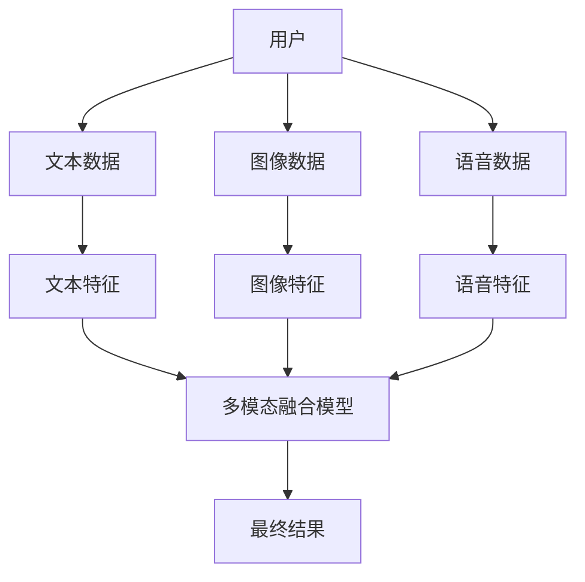

                 

# 《企业AI Agent的多模态学习：整合文本、图像与语音数据》

## 关键词：
- 企业AI Agent
- 多模态学习
- 文本数据
- 图像数据
- 语音数据
- 模态融合
- 深度学习

## 摘要：
本文将详细探讨企业AI Agent在多模态学习中的应用，整合文本、图像和语音数据，构建高效的AI系统。通过背景分析、核心概念、算法原理、系统架构设计以及项目实战，深入剖析多模态数据整合的关键技术，为企业AI Agent的开发提供理论和实践指导。

---

# 第一部分: 企业AI Agent的多模态学习背景与概述

## 第1章: 企业AI Agent与多模态学习概述

### 1.1 企业AI Agent的定义与特点
#### 1.1.1 什么是企业AI Agent
- **定义**: 企业AI Agent是一种智能体，能够感知环境、执行任务、优化决策，辅助企业实现自动化和智能化。
- **特点**: 智能性、自主性、反应性、社会性、学习性。

#### 1.1.2 AI Agent的核心特点
- **智能性**: 通过机器学习和深度学习技术处理复杂数据。
- **自主性**: 可以独立执行任务，无需人工干预。
- **反应性**: 能够实时感知环境变化并做出响应。
- **社会性**: 可与其他系统、设备或人员进行交互协作。
- **学习性**: 具备从数据中学习和优化的能力。

#### 1.1.3 企业AI Agent的应用场景
- **客户服务**: 自动处理客户咨询、订单管理。
- **流程自动化**: 优化企业内部流程，提高效率。
- **数据处理**: 处理和分析多模态数据，提取有价值的信息。
- **决策支持**: 基于数据分析提供决策支持。

### 1.2 多模态学习的背景与意义
#### 1.2.1 多模态数据的定义
- **多模态数据**: 包括文本、图像、语音等多种类型的数据，能够提供更全面的信息。
- **单模态数据**: 仅包含一种类型的数据。

#### 1.2.2 多模态学习的优势
- **信息丰富性**: 结合多种数据类型，提供更全面的信息。
- **鲁棒性**: 单一模态数据的局限性可以通过其他模态数据进行补充。
- **任务增强**: 提高模型在复杂任务中的表现。

#### 1.2.3 企业中多模态学习的应用价值
- **提高效率**: 通过多模态数据整合，优化企业流程。
- **增强决策**: 提供更全面的数据支持，提高决策的准确性。
- **提升用户体验**: 通过多模态交互，提升用户的使用体验。

### 1.3 问题背景与问题描述
#### 1.3.1 传统AI的局限性
- **单模态处理**: 传统AI模型通常只能处理单一类型的数据，难以应对复杂场景。
- **信息不完整**: 单一模态数据无法提供全面的信息，影响模型的准确性。
- **应用场景受限**: 无法在需要多模态数据的场景中有效应用。

#### 1.3.2 多模态学习的必要性
- **解决信息孤岛**: 通过整合多种数据类型，打破信息孤岛。
- **提升模型能力**: 增强模型对复杂场景的处理能力。
- **适应多样化需求**: 满足企业中多样化的数据处理需求。

#### 1.3.3 企业AI Agent的多模态学习目标
- **整合多模态数据**: 将文本、图像、语音等多种数据类型整合到一个统一的模型中。
- **提升模型性能**: 通过多模态数据的融合，提高模型的准确性和鲁棒性。
- **实现智能化交互**: 通过多模态数据的处理，实现更自然、更高效的交互方式。

### 1.4 问题解决与边界
#### 1.4.1 多模态学习如何解决企业AI Agent的问题
- **信息整合**: 通过多模态数据的整合，提供更全面的信息支持。
- **任务优化**: 提高模型在复杂任务中的表现，优化企业流程。
- **用户体验提升**: 通过多模态交互，提升用户的使用体验。

#### 1.4.2 问题的边界与外延
- **边界**: 专注于多模态数据的整合与处理，不涉及具体的企业业务逻辑。
- **外延**: 可应用于多种企业场景，如客户服务、流程自动化、数据处理等。

#### 1.4.3 核心概念结构与要素组成
- **核心概念**: 多模态数据、模态融合、多模态学习。
- **要素组成**: 文本数据、图像数据、语音数据、模态融合模型、多模态学习算法。

## 第2章: 多模态数据整合的核心概念

### 2.1 多模态数据的整合原理
#### 2.1.1 数据预处理
- **数据清洗**: 去除噪声数据，确保数据质量。
- **数据标准化**: 将不同模态的数据转换为统一的格式。
- **数据增强**: 通过数据增强技术，提高数据的多样性和丰富性。

#### 2.1.2 特征提取
- **文本特征提取**: 通过词袋模型、TF-IDF、词嵌入（如Word2Vec、BERT）等方法提取文本特征。
- **图像特征提取**: 使用CNN、ResNet等深度学习模型提取图像特征。
- **语音特征提取**: 通过MFCC、Mel频谱等方法提取语音特征。

#### 2.1.3 模态融合
- **早期融合**: 在特征提取之前进行模态融合，适用于任务需求明确的场景。
- **晚期融合**: 在特征提取之后进行模态融合，适用于需要更精细信息处理的场景。

### 2.2 核心概念的属性对比
#### 2.2.1 文本、图像、语音的属性对比
| 数据类型 | 文本 | 图像 | 语音 |
|----------|------|------|------|
| 特性      | 结构化、语义丰富 | 非结构化、视觉特征丰富 | 非结构化、音频特征丰富 |
| 处理方式  | 文本分类、情感分析 | 图像分类、目标检测 | 语音识别、语音合成 |

#### 2.2.2 模态融合的策略对比
| 策略类型 | 早期融合 | 晚期融合 |
|----------|----------|----------|
| 优缺点    | 适用于任务需求明确，处理速度快；但可能忽略部分模态信息 | 适用于任务需求复杂，处理更精细；但处理速度较慢 |
| 适用场景  | 特定任务，如情感分析 | 复杂任务，如多模态识别 |

#### 2.2.3 模态权重的动态调整
- **动态权重调整**: 根据任务需求和数据特点，动态调整各模态的权重，以优化模型性能。

### 2.3 ER实体关系图

---

接下来，我会按照用户的要求，继续撰写算法原理、系统架构设计、项目实战等内容。

