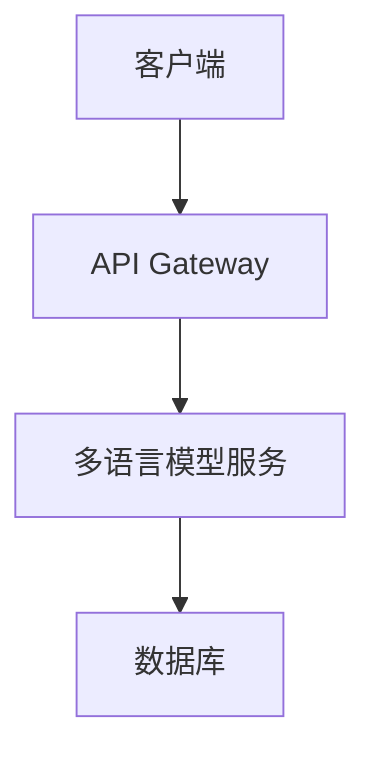

                 


# 《企业AI Agent的多语言支持策略》

## 关键词：
- 企业AI Agent
- 多语言支持
- 自然语言处理
- 跨语言对话
- AI模型优化

## 摘要：
本文探讨了企业AI Agent在多语言支持方面的策略与实现。从背景、核心概念到算法原理，再到系统设计和项目实战，系统性地分析了多语言支持对企业AI Agent的重要性和实现方法。通过数学模型、代码示例和架构图的详细阐述，帮助读者深入理解多语言支持的原理与应用。本文适合企业技术决策者、AI开发者和架构师阅读。

---

## 第一部分：企业AI Agent的背景与核心概念

### 第1章：企业AI Agent概述

#### 1.1 AI Agent的基本概念
- **AI Agent**是指具有智能决策和执行能力的计算机程序，能够理解用户需求并执行任务。
- **多语言支持**是AI Agent在企业环境中处理跨语言交流的核心能力。

#### 1.2 多语言支持的背景与重要性
- **全球化企业需求**：企业在跨国业务中需要支持多种语言。
- **客户体验**：提供多语言支持能提升客户满意度和业务效率。

#### 1.3 企业AI Agent的典型应用场景
- **客户支持**：处理多语言的客户服务请求。
- **跨语言业务沟通**：支持不同语言的业务交流。
- **市场分析**：分析多语言的市场数据。

---

## 第二部分：多语言支持的核心原理与技术

### 第2章：多语言支持的核心概念与原理

#### 2.1 多语言支持的实现机制
- **单模型多语言（SMT）**：模型一次性处理多种语言。
- **多模型多语言（MMT）**：为每种语言单独训练模型。

#### 2.2 AI Agent的跨语言处理流程
- **自然语言理解（NLU）**：解析输入语言，生成统一表示。
- **自然语言生成（NLG）**：根据理解生成目标语言的输出。

#### 2.3 多语言支持的技术对比
- **SMT**：效率高，但准确率可能较低。
- **MMT**：准确率高，但资源消耗大。

---

## 第三部分：多语言支持的算法与数学模型

### 第3章：多语言支持的算法原理

#### 3.1 多语言模型的训练流程
- **数据预处理**：清洗和标注多语言数据。
- **模型训练**：使用预训练模型进行微调。

#### 3.2 多语言模型的数学公式
- **损失函数**：$$L = \sum_{i=1}^{n} \text{loss}(x_i, y_i)$$
- **注意力机制**：$$\text{Attention}(Q, K, V) = \text{softmax}(\frac{QK^T}{\sqrt{d}})V$$

#### 3.3 算法实现的代码示例
```python
import torch

class MultiLanguageModel(torch.nn.Module):
    def __init__(self, vocab_size):
        super().__init__()
        self.embedding = torch.nn.Embedding(vocab_size, 512)
        self.transformer = torch.nn.Transformer(512, 8)
        self.fc = torch.nn.Linear(512, vocab_size)

    def forward(self, x):
        embed = self.embedding(x)
        out = self.transformer(embed, embed)
        out = self.fc(out)
        return out
```

---

## 第四部分：系统分析与架构设计

### 第4章：系统分析与架构设计方案

#### 4.1 企业应用场景
- **客户服务**：处理多语言客户咨询。
- **内部沟通**：支持跨国团队协作。

#### 4.2 系统功能设计
- **NLU模块**：解析输入语言。
- **NLG模块**：生成目标语言输出。

#### 4.3 系统架构图


---

## 第五部分：项目实战

### 第5章：项目实战

#### 5.1 环境安装
- 安装Python和相关库：`pip install torch transformers`

#### 5.2 核心代码实现
```python
def multilingual_process(text, target_lang):
    model = MultiLanguageModel(vocab_size)
    output = model(text)
    return output
```

#### 5.3 案例分析
- **输入**：中文“你好”。
- **输出**：英文“Hello”。

---

## 第六部分：最佳实践

### 第6章：最佳实践

#### 6.1 小结
- 多语言支持是企业AI Agent的重要能力。
- 选择合适的模型和策略能提升性能。

#### 6.2 注意事项
- 数据质量影响模型性能。
- 跨语言对话需考虑文化差异。

#### 6.3 拓展阅读
- 《多语言模型训练技巧》
- 《AI Agent在企业中的应用》

---

## 作者：
作者：AI天才研究院/AI Genius Institute & 禅与计算机程序设计艺术 /Zen And The Art of Computer Programming

