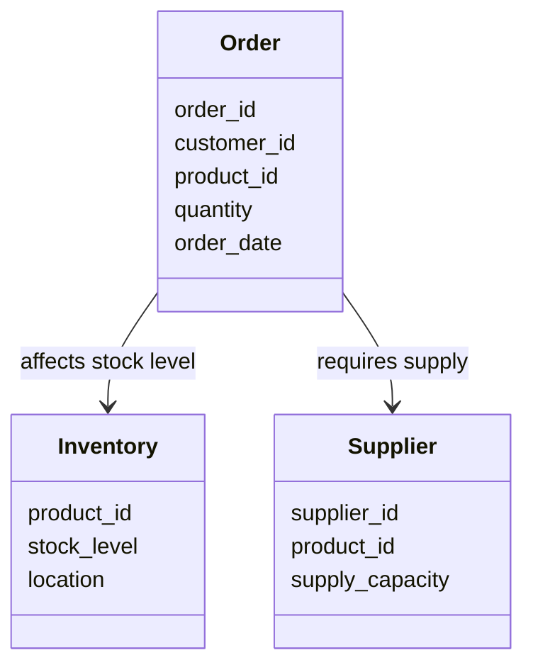

                 


# 企业AI Agent的大数据处理框架

> 关键词：AI Agent、大数据处理、企业架构、系统设计、项目实战

> 摘要：本文将详细探讨企业AI Agent在大数据处理中的应用框架。从AI Agent的基本概念到大数据处理框架的核心原理，再到系统架构设计和项目实战，文章旨在为企业技术团队提供一套完整的技术解决方案。通过深入分析AI Agent与大数据处理的结合方式，本文将为企业构建高效、智能的大数据处理系统提供参考。

---

## 目录大纲

1. **企业AI Agent与大数据处理框架概述**
2. **企业AI Agent的核心原理**
3. **大数据处理框架的核心原理**
4. **AI Agent与大数据处理框架的结合**
5. **企业级AI Agent系统的架构设计**
6. **项目实战：企业AI Agent大数据处理系统实现**
7. **总结与展望**

---

## 第1章: 企业AI Agent与大数据处理框架概述

### 1.1 企业AI Agent的背景与概念

#### 1.1.1 AI Agent的基本概念与定义

AI Agent（人工智能代理）是指能够感知环境并采取行动以实现目标的智能实体。它能够通过传感器获取信息，利用推理能力进行决策，并通过执行器与环境交互。AI Agent的核心在于其自主性和智能性，能够在复杂环境中完成特定任务。

#### 1.1.2 企业AI Agent的核心特征

- **自主性**：能够在没有外部干预的情况下运行。
- **反应性**：能够实时感知环境变化并做出反应。
- **目标导向性**：基于预设目标执行任务。
- **学习能力**：能够通过数据和经验优化自身行为。

#### 1.1.3 大数据处理框架的定义与作用

大数据处理框架是用于管理和处理海量数据的软件架构。它通过分布式计算和并行处理技术，能够高效地完成数据采集、存储、处理和分析。大数据处理框架在企业中扮演着关键角色，帮助企业从海量数据中提取价值。

---

### 1.2 企业AI Agent与大数据处理的结合

#### 1.2.1 企业AI Agent的典型应用场景

AI Agent在企业中的应用广泛，包括智能客服、供应链管理、风险评估、精准营销等领域。例如，智能客服系统通过自然语言处理技术，能够自动理解客户问题并提供解决方案。

#### 1.2.2 大数据处理在AI Agent中的关键作用

大数据处理为AI Agent提供了丰富的数据源，使其能够进行更准确的决策。例如，在供应链管理中，AI Agent可以通过分析历史销售数据和市场趋势，预测未来的需求，并优化库存管理。

#### 1.2.3 企业AI Agent与大数据处理框架的结合优势

通过结合AI Agent与大数据处理框架，企业能够构建高效、智能的决策系统。大数据处理框架提供了强大的数据处理能力，而AI Agent则通过智能分析和决策，将数据转化为实际价值。

---

### 1.3 本书的核心内容与目标

#### 1.3.1 本书的核心主题

本文将重点探讨企业AI Agent在大数据处理中的应用框架，包括AI Agent的核心原理、大数据处理框架的实现技术，以及两者结合的系统设计与实现。

#### 1.3.2 本书的目标读者

本文适合企业技术团队、软件架构师、数据科学家以及对AI Agent和大数据处理感兴趣的读者阅读。

#### 1.3.3 本书的结构与内容概览

本文将从AI Agent和大数据处理的基本概念出发，逐步深入探讨两者的结合方式，并通过实际项目案例，展示如何构建高效的企业AI Agent大数据处理系统。

---

## 第2章: 企业AI Agent的核心原理

### 2.1 AI Agent的基本原理

#### 2.1.1 AI Agent的体系结构

AI Agent的体系结构通常包括感知层、推理层和执行层。感知层负责数据的采集与处理，推理层负责分析和决策，执行层负责将决策转化为实际操作。

#### 2.1.2 AI Agent的工作流程

1. **感知环境**：通过传感器或数据接口获取环境信息。
2. **数据处理**：对获取的数据进行清洗、转换和存储。
3. **分析与推理**：利用机器学习算法对数据进行分析，并做出决策。
4. **执行操作**：根据决策结果，通过执行器与环境交互。

#### 2.1.3 AI Agent的核心算法与技术

- **自然语言处理（NLP）**：用于文本分析和理解。
- **机器学习（ML）**：用于模式识别和预测。
- **强化学习（RL）**：用于策略优化和自适应决策。

---

### 2.2 大数据处理框架的核心原理

#### 2.2.1 大数据处理框架的分类与特点

大数据处理框架主要分为分布式文件系统、计算框架和数据库三类。分布式文件系统（如Hadoop HDFS）用于存储海量数据，计算框架（如Spark）用于并行处理数据，数据库（如HBase）用于高效查询。

#### 2.2.2 分布式计算与并行处理原理

分布式计算通过将任务分解到多个节点上并行处理，提高了计算效率。并行处理技术能够充分利用计算资源，降低任务执行时间。

#### 2.2.3 数据存储与管理机制

大数据处理框架通常采用分布式存储技术，能够支持海量数据的高效存储和管理。常见的存储方式包括列式存储和行式存储，适用于不同的查询场景。

---

### 2.3 AI Agent与大数据处理框架的结合原理

#### 2.3.1 数据流的处理流程

AI Agent通过大数据处理框架获取实时数据流，进行清洗、转换和分析，最终生成决策结果。

#### 2.3.2 AI Agent如何利用大数据处理框架

AI Agent可以调用大数据处理框架的API，进行数据的采集、存储和分析。例如，AI Agent可以通过Spark Streaming实时处理数据流，生成实时分析结果。

#### 2.3.3 企业级AI Agent系统的架构特点

企业级AI Agent系统通常采用微服务架构，各组件之间通过API进行通信。系统具有高可用性、可扩展性和容错能力，能够适应企业的复杂需求。

---

## 第3章: AI Agent与大数据处理框架的结合

### 3.1 数据流的处理流程

AI Agent通过大数据处理框架获取实时数据流，进行清洗、转换和分析，最终生成决策结果。

### 3.2 AI Agent如何利用大数据处理框架

AI Agent可以通过调用大数据处理框架的API，进行数据的采集、存储和分析。例如，AI Agent可以通过Spark Streaming实时处理数据流，生成实时分析结果。

### 3.3 企业级AI Agent系统的架构特点

企业级AI Agent系统通常采用微服务架构，各组件之间通过API进行通信。系统具有高可用性、可扩展性和容错能力，能够适应企业的复杂需求。

---

## 第4章: 企业级AI Agent系统的架构设计

### 4.1 问题场景介绍

本文将通过一个企业供应链管理系统的案例，展示如何设计企业级AI Agent系统。该系统需要实时监控供应链中的库存、物流和订单信息，并根据数据进行预测和优化。

### 4.2 系统功能设计

#### 4.2.1 领域模型设计

领域模型通过类图展示系统中的核心实体和它们之间的关系。例如，订单、库存、供应商等实体之间的关系。



#### 4.2.2 系统架构设计

系统架构设计采用分层架构，包括数据层、服务层、表现层和API层。各层之间通过接口进行通信，确保系统的模块化和可扩展性。


---

## 第5章: 项目实战：企业AI Agent大数据处理系统实现

### 5.1 环境安装

需要安装以下工具和库：

- **Python 3.x**
- **Jupyter Notebook**
- **Hadoop/Spark**
- **TensorFlow/Scikit-learn**

### 5.2 系统核心实现源代码

以下是系统的核心代码实现：

```python
import pandas as pd
from pyspark import SparkContext
from pyspark.streaming import StreamingContext
from tensorflow.keras import models
import numpy as np

# 初始化Spark上下文
sc = SparkContext()
ssc = StreamingContext(sc, 5)

# 创建数据流接收器
stream = ssc.socketTextStream("localhost", 9999)

# 数据处理函数
def process_stream(data):
    # 数据清洗和转换
    df = pd.DataFrame([data], columns=['value'])
    # 数据分析和预测
    prediction = model.predict(df['value'].values)
    return prediction[0]

# 加载预训练模型
model = models.load_model('path/to/model.h5')

# 启动数据流处理
stream.foreachRDD(lambda rdd: rdd.foreach(lambda x: print(process_stream(x))))

ssc.start()
ssc.awaitTermination()
```

### 5.3 代码应用解读与分析

- **数据流接收**：通过Spark Streaming接收实时数据流。
- **数据处理**：对数据进行清洗、转换和预测。
- **模型预测**：利用预训练的深度学习模型进行预测，并返回结果。

### 5.4 实际案例分析

以供应链管理为例，系统能够实时监控库存和订单信息，预测未来的需求，并优化库存管理。例如，当预测某产品需求增加时，系统会自动调整采购计划，确保库存充足。

### 5.5 项目小结

通过该项目，我们展示了如何利用AI Agent和大数据处理框架构建高效的企业级系统。系统能够实时处理数据流，进行智能预测和决策，显著提高了企业的运营效率。

---

## 第6章: 总结与展望

### 6.1 本章总结

本文详细探讨了企业AI Agent在大数据处理中的应用框架，从基本概念到系统设计，再到项目实战，为企业构建高效、智能的大数据处理系统提供了参考。

### 6.2 未来展望

未来，随着AI技术的不断发展，企业AI Agent和大数据处理框架将更加智能化和高效化。更多创新技术，如边缘计算、联邦学习等，将进一步提升系统的性能和安全性。

---

## 作者

作者：AI天才研究院/AI Genius Institute & 禅与计算机程序设计艺术 /Zen And The Art of Computer Programming

