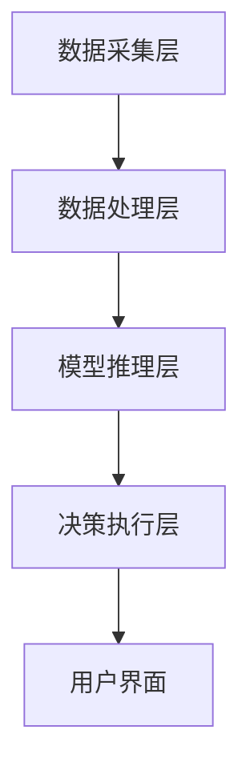

                 


# 企业AI Agent的实时决策支持系统

## 关键词：
- 企业AI Agent
- 实时决策支持系统
- 机器学习
- 系统架构
- 数学模型

## 摘要：
企业AI Agent的实时决策支持系统通过集成先进的机器学习算法和系统架构设计，为企业提供高效、智能的决策支持。本文详细探讨了AI Agent的核心概念、算法原理、系统架构，并通过实际案例分析展示了如何在企业中实现实时决策支持系统，为技术从业者提供了实用的参考和启发。

---

# 第一部分: 企业AI Agent的背景与概念

## 第1章: 企业AI Agent的背景与概念

### 1.1 问题背景与挑战
#### 1.1.1 传统企业决策的痛点
企业在传统决策过程中面临以下痛点：
- 数据孤岛：各部门数据分散，难以整合。
- 决策延迟：依赖人工分析，无法实时响应。
- 知识匮乏：缺乏对市场趋势和客户需求的深度洞察。
- 复杂性：决策涉及多部门协作，难以高效执行。

#### 1.1.2 AI技术对企业决策的支持作用
AI技术通过以下方式提升企业决策能力：
- 实时数据分析：快速处理大量数据，提供实时洞察。
- 智能预测：基于历史数据预测未来趋势。
- 自动化决策：AI Agent可以根据预设规则自动执行决策。

#### 1.1.3 实时决策支持的必要性
在当今快速变化的商业环境中，实时决策支持能够帮助企业：
- 抓住市场机遇：快速响应市场变化。
- 提高效率：减少人为错误，加快决策速度。
- 优化资源分配：动态调整资源以应对需求变化。

### 1.2 问题描述与解决方案
#### 1.2.1 企业实时决策支持的核心问题
- 如何整合多源异构数据？
- 如何构建高效的实时分析模型？
- 如何确保决策的准确性和可解释性？

#### 1.2.2 AI Agent在实时决策中的角色
AI Agent作为企业实时决策支持的核心组件，负责：
- 数据采集与预处理：从多源数据中提取有用信息。
- 模型推理：基于实时数据生成决策建议。
- 执行决策：根据决策结果触发相应操作。

#### 1.2.3 解决方案的框架与目标
解决方案框架包括：
- 数据层：整合企业内外部数据。
- 计算层：部署实时机器学习模型。
- 应用层：提供用户友好的决策界面。
目标是实现高效、智能、可扩展的企业决策支持系统。

### 1.3 核心概念与边界
#### 1.3.1 AI Agent的定义与特征
AI Agent的定义：
- AI Agent是一种智能体，能够感知环境并采取行动以实现目标。
- 具备自主性、反应性、目标导向性和社会能力。

#### 1.3.2 实时决策支持系统的边界
实时决策支持系统的边界包括：
- 数据输入边界：实时数据源的接入。
- 数据输出边界：决策结果的输出和执行。
- 用户交互边界：与用户的交互界面。

#### 1.3.3 相关概念对比与区分
以下是相关概念的对比表：

| 概念         | 描述                                   |
|--------------|--------------------------------------|
| AI Agent     | 具备智能的实体，能够自主决策           |
| 实时系统     | 系统响应时间在规定范围内               |
| 决策支持系统 | 辅助决策者的系统，提供数据和建议       |

### 1.4 核心要素与概念结构
#### 1.4.1 AI Agent的组成要素
AI Agent的核心要素包括：
- 感知模块：感知环境状态。
- 决策模块：基于感知结果做出决策。
- 执行模块：执行决策动作。
- 学习模块：通过反馈优化模型。

#### 1.4.2 实时决策支持系统的架构
实时决策支持系统的架构可以分为：
- 数据采集层：实时采集数据。
- 数据处理层：对数据进行清洗和转换。
- 模型推理层：部署机器学习模型进行预测。
- 决策执行层：根据推理结果执行决策。

#### 1.4.3 核心概念的ER实体关系图
以下是核心概念的ER实体关系图：

```mermaid
er
    actor: 用户
    system: AI Agent决策支持系统
    decision_rule: 决策规则
    data_source: 数据源
    action: 执行动作
    outcome: 决策结果
    actor --> system: 提交决策请求
    system --> decision_rule: 应用决策规则
    system --> data_source: 获取实时数据
    system --> action: 输出执行动作
    system --> outcome: 生成决策结果
```

### 1.5 本章小结
本章介绍了企业AI Agent的背景、核心概念以及实时决策支持系统的架构和边界。通过对比相关概念，明确了AI Agent在企业决策中的独特作用。

---

# 第二部分: AI Agent的核心算法与数学模型

## 第2章: AI Agent的核心算法与数学模型

### 2.1 算法原理概述
#### 2.1.1 监督学习与无监督学习
- 监督学习：基于标记数据进行模型训练。
- 无监督学习：从无标记数据中发现模式。

#### 2.1.2 强化学习在AI Agent中的应用
强化学习通过奖励机制训练AI Agent，使其在与环境交互中学习最优策略。

#### 2.1.3 时间序列预测算法
时间序列预测用于处理实时数据中的趋势和周期性变化。

### 2.2 算法实现流程
#### 2.2.1 数据预处理与特征提取
- 数据清洗：处理缺失值和异常值。
- 特征提取：从数据中提取有用的特征。

#### 2.2.2 模型训练与优化
- 模型选择：选择合适的算法。
- 模型优化：通过交叉验证调优参数。

#### 2.2.3 模型部署与实时推理
- 模型部署：将模型部署到生产环境。
- 实时推理：基于实时数据进行预测。

### 2.3 数学模型与公式
#### 2.3.1 线性回归模型
线性回归用于预测连续型变量：
$$y = \beta_0 + \beta_1x + \epsilon$$

#### 2.3.2 马尔可夫决策过程
马尔可夫决策过程用于描述强化学习问题：
$$V(s) = \max_{a} [r + V(s') ]$$

#### 2.3.3 神经网络模型
神经网络模型用于复杂模式识别：
$$f(x) = \sigma(Wx + b)$$

### 2.4 代码实现与案例分析
#### 2.4.1 算法实现代码
以下是线性回归模型的实现代码：

```python
import numpy as np
from sklearn.linear_model import LinearRegression

# 生成数据
X = np.array([[1], [2], [3], [4], [5]])
y = np.array([2, 4, 5, 4, 6])

# 训练模型
model = LinearRegression()
model.fit(X, y)

# 预测
print(model.predict([[6]]))
```

#### 2.4.2 案例分析与结果解读
以销售预测为例，通过线性回归模型预测未来销售情况。

### 2.5 本章小结
本章介绍了AI Agent中常用的算法和数学模型，通过代码实现和案例分析，展示了如何将理论应用于实际场景。

---

# 第三部分: 系统架构与设计

## 第3章: 系统架构与设计

### 3.1 系统架构概述
#### 3.1.1 分层架构设计
分层架构将系统划分为数据层、逻辑层和应用层。

#### 3.1.2 微服务架构的应用
微服务架构通过模块化设计提高系统的可扩展性和可维护性。

#### 3.1.3 可扩展性与高可用性设计
通过负载均衡和容错设计确保系统的高可用性。

### 3.2 系统功能设计
#### 3.2.1 数据采集模块
负责实时采集企业内外部数据。

#### 3.2.2 模型推理模块
部署机器学习模型，进行实时推理。

#### 3.2.3 决策执行模块
根据推理结果执行决策动作。

### 3.3 系统架构图
以下是系统架构图：



### 3.4 系统接口设计
系统接口设计包括：
- 数据接口：与数据源对接。
- API接口：供其他系统调用决策结果。

### 3.5 系统交互序列图
以下是系统交互序列图：

```mermaid
sequenceDiagram
    actor 用户
    system 系统
    用户 -> 系统: 提交决策请求
    系统 -> 数据源: 获取实时数据
    系统 -> 决策规则: 应用决策规则
    系统 -> 用户: 返回决策结果
```

### 3.6 本章小结
本章详细介绍了企业AI Agent实时决策支持系统的架构设计，包括分层架构、微服务架构以及系统接口设计。

---

# 第四部分: 项目实战

## 第4章: 项目实战

### 4.1 环境安装与配置
#### 4.1.1 安装Python和相关库
- Python 3.8+
- 安装`scikit-learn`、`pandas`、`numpy`等库。

### 4.2 系统核心实现
#### 4.2.1 数据预处理代码
```python
import pandas as pd
import numpy as np

# 加载数据
data = pd.read_csv('data.csv')

# 数据清洗
data.dropna(inplace=True)

# 特征提取
X = data[['feature1', 'feature2']]
y = data['target']
```

#### 4.2.2 模型训练代码
```python
from sklearn.model_selection import train_test_split
from sklearn.linear_model import LinearRegression

# 数据分割
X_train, X_test, y_train, y_test = train_test_split(X, y, test_size=0.2)

# 训练模型
model = LinearRegression()
model.fit(X_train, y_train)

# 评估模型
print(model.score(X_test, y_test))
```

### 4.3 案例分析与结果解读
以某企业销售预测为例，展示如何通过AI Agent实时决策支持系统进行预测和决策。

### 4.4 本章小结
本章通过实际项目案例，展示了如何在企业中实现AI Agent的实时决策支持系统。

---

# 第五部分: 最佳实践与注意事项

## 第5章: 最佳实践与注意事项

### 5.1 最佳实践
#### 5.1.1 数据质量管理
- 确保数据的完整性和准确性。
- 定期更新数据源。

#### 5.1.2 模型优化
- 定期重新训练模型。
- 使用交叉验证优化模型性能。

#### 5.1.3 系统维护
- 定期检查系统日志。
- 及时修复系统漏洞。

### 5.2 注意事项
- 数据隐私与安全：确保数据的安全性。
- 模型可解释性：确保决策过程可追溯。
- 系统稳定性：确保系统在高负载下的稳定性。

### 5.3 小结
本章总结了在实际应用中需要注意的事项和最佳实践。

---

# 作者

作者：AI天才研究院/AI Genius Institute & 禅与计算机程序设计艺术 /Zen And The Art of Computer Programming

---

本文详细探讨了企业AI Agent的实时决策支持系统的背景、核心算法、系统架构以及项目实战，为企业技术从业者提供了深入的技术指导和实践参考。

