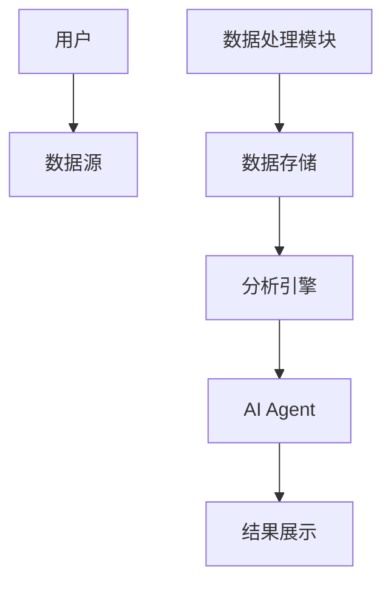
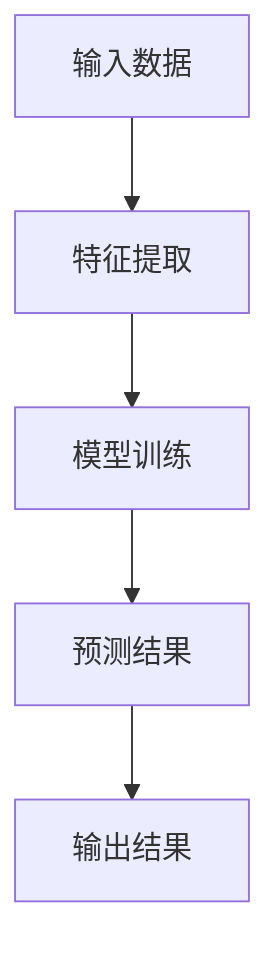
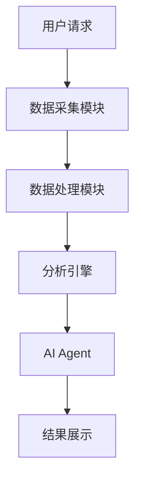

                 


# 企业AI Agent的实时大数据分析平台

**关键词**：企业AI Agent，实时大数据分析，系统架构设计，算法实现，项目实战

**摘要**：本文详细探讨了企业AI Agent在实时大数据分析中的应用，涵盖技术背景、系统架构、算法原理及项目实战。通过分析数据处理、AI算法、系统设计和实际案例，提供全面的技术指导。

---

## 第一部分: 企业AI Agent的实时大数据分析平台概述

### 第1章: 引言

#### 1.1 企业AI Agent与实时大数据分析平台的背景

##### 1.1.1 问题背景与问题描述
企业面临数据爆炸性增长，如何高效处理和分析实时数据成为挑战。传统方法难以满足实时性和准确性要求，亟需AI Agent赋能。

##### 1.1.2 问题解决思路与方法
引入AI Agent，结合大数据技术，实现数据实时采集、处理、分析和决策支持。

##### 1.1.3 边界与外延
- **边界**：聚焦于实时数据处理，不涉及数据源的生成和存储。
- **外延**：涵盖数据预处理、分析、决策建议。

##### 1.1.4 核心概念与组成要素
核心概念包括数据源、数据处理模块、分析引擎和AI Agent。组成要素包括数据采集、存储、处理、分析和应用模块。

#### 1.2 企业AI Agent的核心概念与联系

##### 1.2.1 核心概念原理
AI Agent通过感知环境、分析数据、执行任务，提供智能化决策支持。

##### 1.2.2 核心概念属性特征对比表
| 属性 | AI Agent | 实时大数据分析 |
|------|----------|----------------|
| 目标 | 智能决策 | 数据处理与分析 |
| 输入 | 结构化数据 | 多类型数据 |
| 输出 | 决策建议 | 分析结果 |

##### 1.2.3 ER实体关系图


---

## 第二部分: 实时大数据分析技术基础

### 第2章: 数据采集与处理

#### 2.1 数据采集方法
- **实时采集**：如Kafka、Flume。
- **批量采集**：如Hadoop、Spark。

#### 2.2 数据预处理
- 清洗：去除无效数据。
- 标准化：统一数据格式。

### 第3章: 数据存储与管理

#### 3.1 数据库选型
- 关系型：MySQL。
- 非关系型：MongoDB。

#### 3.2 数据仓库设计
- 星型、雪花模型。

### 第4章: 数据分析与挖掘

#### 4.1 数据分析方法
- 描述性分析：统计方法。
- 预测性分析：机器学习模型。

#### 4.2 数据可视化技术
- 图表展示：柱状图、折线图。

---

## 第三部分: AI Agent的算法原理与实现

### 第5章: AI Agent的核心算法

#### 5.1 算法原理
- 以线性回归为例，模型为$$y = wx + b$$，目标是最小化损失函数。

#### 5.2 算法实现步骤
1. 数据准备。
2. 模型训练。
3. 模型预测。

#### 5.3 算法优化
- 正则化：L1、L2。

### 第6章: 算法实现的数学模型

#### 6.1 数学模型与公式
$$f(x) = w \cdot x + b$$

#### 6.2 算法流程图


---

## 第四部分: 系统架构与设计

### 第7章: 系统架构设计

#### 7.1 系统架构图


#### 7.2 系统功能设计
- 用户请求：触发数据处理。
- 数据采集：实时收集数据。
- 数据处理：清洗、转换。
- 分析引擎：运行算法。
- AI Agent：生成决策。

---

## 第五部分: 项目实战

### 第8章: 项目实现

#### 8.1 环境安装
- 安装Python、Jupyter、TensorFlow。

#### 8.2 核心代码实现
```python
import numpy as np
import pandas as pd

# 数据准备
data = pd.DataFrame({'x': [1, 2, 3, 4, 5], 'y': [2, 4, 5, 4, 5]})

# 模型训练
X = data[['x']]
y = data['y']

from sklearn.linear_model import LinearRegression
model = LinearRegression()
model.fit(X, y)

# 预测
predicted = model.predict(X)
print(predicted)
```

#### 8.3 项目总结
- 成功实现AI Agent，具备实时分析能力。
- 需优化算法和系统性能。

---

## 第六部分: 总结与展望

### 第9章: 总结

#### 9.1 核心内容回顾
- AI Agent在实时大数据分析中的应用。
- 关键技术：数据处理、算法实现、系统架构。

#### 9.2 改进建议
- 提升算法效率。
- 优化系统架构。

---

## 作者：AI天才研究院/AI Genius Institute & 禅与计算机程序设计艺术 /Zen And The Art of Computer Programming

