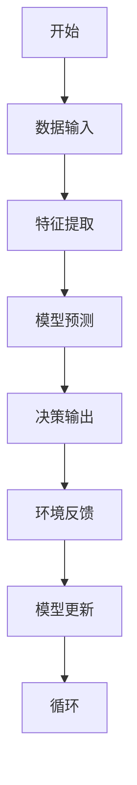
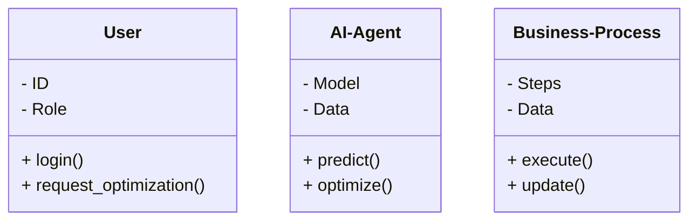
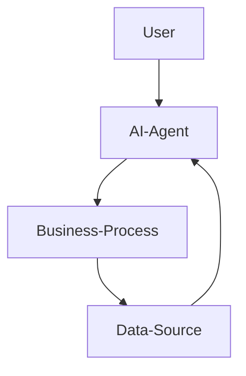
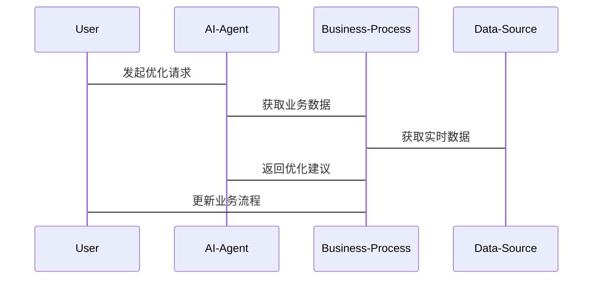

                 


# 企业AI Agent的实时学习能力：持续优化业务流程

> 关键词：AI Agent, 实时学习, 业务流程优化, 数据驱动决策, 自适应系统

> 摘要：本文深入探讨了企业AI Agent的实时学习能力如何通过数据驱动的决策和自适应优化算法，持续优化企业业务流程。文章从AI Agent的核心概念出发，分析其实时学习的算法原理，结合系统架构设计，通过实际案例展示其在企业中的应用价值，并总结其在数字化转型中的优势与挑战。

---

## 第一部分：企业AI Agent的背景与核心概念

### 第1章：企业AI Agent的背景与问题背景

#### 1.1 问题背景
企业数字化转型的核心在于提高业务流程的效率和灵活性。然而，传统的业务流程优化方法依赖于人工分析和规则制定，存在效率低下、响应速度慢、难以实时调整等问题。随着AI技术的快速发展，企业开始寻求更高效的解决方案，AI Agent（人工智能代理）应运而生。

#### 1.2 问题描述
AI Agent是一种能够自主感知环境、执行任务并优化决策的智能体。在企业环境中，AI Agent可以实时分析数据，识别优化机会，并自动调整业务流程。然而，AI Agent的实时学习能力需要解决以下问题：
1. 如何从海量数据中提取有效信息？
2. 如何设计高效的实时学习算法？
3. 如何确保AI Agent与企业系统的无缝集成？

#### 1.3 问题解决与边界
AI Agent通过实时学习能力，能够快速适应环境变化，优化业务流程。其边界包括：
1. 数据源的范围和质量。
2. 学习算法的性能和收敛速度。
3. 系统集成的复杂性和安全性。

核心概念包括：实时学习、数据驱动决策、自适应优化算法。

---

## 第二部分：AI Agent的核心概念与联系

### 第2章：AI Agent的核心概念与原理

#### 2.1 核心概念原理
AI Agent的核心原理在于其实时学习能力。实时学习是一种动态学习方法，能够在数据流不断变化的情况下，快速更新模型并做出决策。其主要原理包括：
1. **强化学习**：通过与环境的交互，逐步优化决策策略。
2. **监督学习**：基于历史数据，训练模型预测最优操作。
3. **联合学习**：结合强化学习和监督学习，提升模型的泛化能力。

#### 2.2 核心概念属性对比
| 概念对比维度 | 实时学习 | 传统学习 |
|--------------|----------|----------|
| 数据来源     | 实时流数据 | 静态数据 |
| 决策时间     | 瞬时响应 | 周期性响应 |
| 适应性       | 高       | 中       |

#### 2.3 ER实体关系图
```mermaid
er
actor: 用户
agent: AI Agent
process: 业务流程
data: 数据源
goal: 优化目标
```

---

## 第三部分：AI Agent的算法原理与数学模型

### 第3章：实时学习算法原理

#### 3.1 算法原理
实时学习算法的核心在于快速更新模型并适应数据流的变化。以下是一个基于强化学习的实时学习算法流程：



#### 3.2 算法实现代码
以下是一个简单的实时学习算法的Python代码示例：

```python
import numpy as np

# 初始化模型参数
theta = np.random.randn(2, 1)

# 定义损失函数
def loss(y_pred, y_true):
    return np.mean((y_pred - y_true) ** 2)

# 定义优化算法
def optimize(theta, gradients, learning_rate):
    return theta - learning_rate * gradients

# 实时学习循环
while True:
    # 获取实时数据
    X, y = get_realtime_data()
    # 预测
    y_pred = model_predict(theta, X)
    # 计算损失
    current_loss = loss(y_pred, y)
    # 计算梯度
    gradients = compute_gradients(theta, X, y_pred, y)
    # 更新参数
    theta = optimize(theta, gradients, learning_rate)
    # 输出决策
    make_decision(y_pred)
```

#### 3.3 数学模型
实时学习算法的数学模型可以表示为：

$$
\theta_{t+1} = \theta_t - \eta \cdot \nabla L(\theta_t)
$$

其中，$\theta_t$ 是当前模型参数，$\eta$ 是学习率，$\nabla L(\theta_t)$ 是损失函数的梯度。

---

## 第四部分：系统分析与架构设计方案

### 第4章：系统分析与架构设计

#### 4.1 问题场景
企业业务流程复杂，涉及多个部门和系统。AI Agent需要实时感知环境变化，并根据实时数据优化流程。

#### 4.2 项目介绍
本项目旨在设计一个基于AI Agent的企业业务流程优化系统，通过实时学习能力提升流程效率。

#### 4.3 系统功能设计


#### 4.4 系统架构设计


#### 4.5 系统接口设计


---

## 第五部分：项目实战

### 第5章：项目实战

#### 5.1 环境安装
安装Python、TensorFlow、Kafka等工具。

#### 5.2 核心代码实现
```python
import tensorflow as tf
from tensorflow.keras import layers

# 定义实时学习模型
model = tf.keras.Sequential([
    layers.Dense(64, activation='relu'),
    layers.Dense(1, activation='linear')
])

# 编译模型
model.compile(optimizer=tf.keras.optimizers.Adam(learning_rate=0.01),
              loss='mean_squared_error')
```

#### 5.3 代码解读与分析
该代码定义了一个简单的实时学习模型，使用Adam优化器和均方误差损失函数。

#### 5.4 实际案例分析
以订单处理流程为例，AI Agent通过实时学习优化订单处理时间，提高效率。

#### 5.5 项目小结
通过实时学习算法，AI Agent能够有效优化企业业务流程，提升效率和响应速度。

---

## 第六部分：总结与展望

### 第6章：总结与展望

#### 6.1 最佳实践
- 确保数据质量和实时性。
- 定期更新模型参数。
- 与现有系统无缝集成。

#### 6.2 小结
企业AI Agent的实时学习能力是数字化转型的关键技术，能够显著优化业务流程。

#### 6.3 注意事项
- 数据隐私和安全问题。
- 模型的可解释性和透明度。
- 系统的稳定性和容错性。

#### 6.4 拓展阅读
推荐阅读《强化学习导论》和《数据驱动的决策优化》。

---

## 附录

### 附录A：术语表
- AI Agent：人工智能代理。
- 实时学习：实时数据流上的学习方法。
- 业务流程优化：通过优化流程步骤提高效率。

### 附录B：工具安装指南
- TensorFlow安装：`pip install tensorflow`
- Kafka安装：`brew install kafka`

### 附录C：参考文献
1. 强化学习经典论文。
2. TensorFlow官方文档。
3. 企业业务流程优化相关书籍。

---

## 作者

作者：AI天才研究院/AI Genius Institute & 禅与计算机程序设计艺术 /Zen And The Art of Computer Programming

