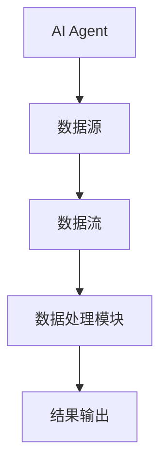
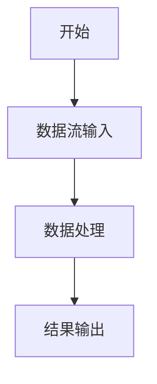
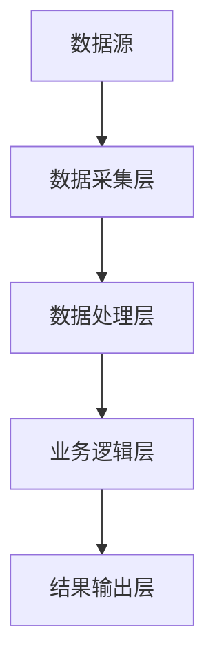

                 


# 企业AI Agent的实时数据流处理架构

## 关键词：企业AI Agent，实时数据流，数据流处理，系统架构，算法原理

## 摘要

本文详细探讨了企业AI Agent在实时数据流处理中的架构设计。从基本概念到核心算法，从系统架构到项目实战，全面解析了AI Agent如何高效处理实时数据流。通过理论与实践结合，本文为读者提供了从理解到实现的完整指南。

---

## 第一部分: 企业AI Agent的实时数据流处理架构概述

### 第1章: 企业AI Agent与实时数据流处理概述

#### 1.1 企业AI Agent的基本概念

- **1.1.1 AI Agent的定义与特点**
  - AI Agent是一种智能代理系统，能够感知环境、自主决策并执行任务。
  - 其特点包括自主性、反应性、目标导向和学习能力。

- **1.1.2 企业AI Agent的应用场景**
  - 企业AI Agent广泛应用于客服、供应链管理、智能推荐等领域。
  - 例如，在客服系统中，AI Agent可以实时响应客户需求，提高服务效率。

- **1.1.3 实时数据流处理的重要性**
  - 实时数据流处理能够快速响应业务需求，提升企业竞争力。
  - 例如，在金融领域，实时数据流处理可以及时捕捉市场变化，做出快速决策。

#### 1.2 数据流处理的背景与挑战

- **1.2.1 数据流处理的基本概念**
  - 数据流是指连续流动的数据，通常来自传感器、日志文件或用户行为。
  - 数据流处理需要高效处理和分析这些实时数据，以提取有价值的信息。

- **1.2.2 实时数据流处理的挑战**
  - 高速数据流要求处理系统具备低延迟和高吞吐量。
  - 数据流的不完整性和异质性增加了处理的复杂性。

- **1.2.3 企业级数据流处理的复杂性**
  - 企业级数据流处理需要考虑多源数据的整合、数据一致性和系统容错性。

#### 1.3 本章小结

- 本章介绍了企业AI Agent的基本概念及其在实时数据流处理中的重要性，分析了数据流处理的挑战和复杂性。

---

## 第二部分: 企业AI Agent的核心概念与联系

### 第2章: 企业AI Agent的核心概念

#### 2.1 AI Agent的组成与功能

- **2.1.1 AI Agent的组成要素**
  - 传感器：负责采集实时数据。
  - 处理器：对数据进行分析和处理。
  - 决策器：根据分析结果做出决策。
  - 执行器：执行决策操作。

- **2.1.2 各组件的功能与关系**
  - 传感器将数据传递给处理器，处理器分析数据后传递给决策器，决策器做出决策后通过执行器执行。

#### 2.2 数据流处理的核心机制

- **2.2.1 数据流的采集与预处理**
  - 数据采集：从多种数据源获取数据。
  - 数据预处理：清洗、转换和标准化数据，确保数据质量。

- **2.2.2 数据流的实时处理与分析**
  - 数据流的实时处理需要高效的数据处理算法和快速的响应机制。
  - 数据分析：利用机器学习和大数据技术，从数据中提取价值。

- **2.2.3 数据流的存储与可视化**
  - 数据存储：将处理后的数据存储在数据库中，便于后续分析和查询。
  - 数据可视化：通过图表和仪表盘直观展示数据，帮助用户理解数据。

#### 2.3 企业AI Agent与实时数据流处理的联系

- **2.3.1 AI Agent在实时数据流处理中的角色**
  - AI Agent作为数据处理的核心，负责协调各组件的工作，确保数据流的高效处理。

- **2.3.2 数据流处理对AI Agent性能的影响**
  - 数据流的复杂性和规模直接影响AI Agent的处理能力和响应速度。

#### 2.4 核心概念对比表

| 比较维度         | AI Agent               | 实时数据流处理         |
|------------------|------------------------|-----------------------|
| 定义             | 智能代理系统           | 实时数据处理技术       |
| 核心功能         | 感知、决策、执行       | 数据采集、处理、分析   |
| 应用场景         | 企业自动化、智能服务   | 实时监控、快速响应     |

#### 2.5 ER实体关系图



---

## 第三部分: 企业AI Agent的算法原理与数学模型

### 第3章: 实时数据流处理的算法原理

#### 3.1 流处理算法

- **3.1.1 流处理的基本原理**
  - 流处理是一种实时处理数据的技术，数据以流的形式不断输入，系统需要对每条数据进行处理并输出结果。

- **3.1.2 流处理的数学模型**
  - 数据流可以表示为一个无限的序列，系统需要对这个序列进行实时处理。
  - 处理过程可以用状态机模型表示，每条数据的处理依赖于当前状态。

- **3.1.3 流处理的实现步骤**
  1. 数据采集：从数据源获取数据。
  2. 数据预处理：清洗和转换数据。
  3. 数据处理：对数据进行分析和计算。
  4. 数据输出：将结果输出到目标系统。

#### 3.2 事件时间处理算法

- **3.2.1 事件时间的基本概念**
  - 事件时间是指数据流中每条数据的时间戳，表示该数据的发生时间。

- **3.2.2 事件时间的处理流程**
  1. 数据采集：获取带有时间戳的数据。
  2. 数据排序：根据时间戳对数据进行排序。
  3. 数据处理：按照时间顺序处理数据，确保处理的时序性。

- **3.2.3 事件时间的数学模型**
  - 数据流中的每条数据可以表示为$(t_i, v_i)$，其中$t_i$是时间戳，$v_i$是数据值。
  - 处理系统需要维护一个当前时间指针$t_{current}$，并按顺序处理$t_{current} \leq t_i$的数据。

#### 3.3 算法流程图



---

## 第四部分: 企业AI Agent的系统架构与设计

### 第4章: 企业AI Agent的系统架构设计

#### 4.1 系统功能设计

- **4.1.1 领域模型设计**
  - 领域模型通过类图描述系统的功能模块和交互关系。
  - 例如，AI Agent需要与数据源、数据处理模块、结果输出模块进行交互。

#### 4.2 系统架构设计

- **4.2.1 系统架构图**
  - 系统架构采用分层设计，包括数据采集层、数据处理层、业务逻辑层和结果输出层。

#### 4.3 系统接口设计

- **4.3.1 接口描述**
  - 数据采集接口：接收数据源传入的数据流。
  - 数据处理接口：对数据进行预处理和分析。
  - 结果输出接口：将处理结果输出到目标系统。

#### 4.4 系统交互设计

- **4.4.1 交互流程**
  1. 数据源发送数据流到AI Agent。
  2. AI Agent接收数据并进行预处理。
  3. 预处理后的数据传递给数据处理模块。
  4. 数据处理模块分析数据并生成结果。
  5. 结果输出模块将结果输出到目标系统。

#### 4.5 系统架构图



---

## 第五部分: 企业AI Agent的项目实战

### 第5章: 项目实战

#### 5.1 环境安装

- **5.1.1 安装步骤**
  1. 安装Python和相关库（如pandas、numpy、flask）。
  2. 安装数据处理工具（如Kafka、Flink）。

#### 5.2 核心代码实现

- **5.2.1 数据采集代码**
  ```python
  import kafka
  from kafka import KafkaConsumer

  consumer = KafkaConsumer('data_stream', bootstrap_servers='localhost:9092')
  for message in consumer:
      print(message.value)
  ```

- **5.2.2 数据处理代码**
  ```python
  import pandas as pd
  data = pd.read_csv('data.csv')
  processed_data = data.dropna()
  ```

#### 5.3 案例分析

- **5.3.1 案例背景**
  - 某企业需要实时监控生产线上的传感器数据，及时发现异常情况。

- **5.3.2 数据分析与处理**
  - 使用Flink对数据流进行实时处理，检测传感器数据中的异常值。

#### 5.4 代码解读与分析

- **5.4.1 代码解读**
  - 数据采集代码从Kafka中获取数据流，数据处理代码对数据进行清洗和转换。

- **5.4.2 代码分析**
  - 使用Kafka作为数据源，Flink进行实时数据处理，结果输出到数据库或可视化界面。

---

## 第六部分: 企业AI Agent的最佳实践与注意事项

### 第6章: 最佳实践与注意事项

#### 6.1 实时数据流处理的最佳实践

- **6.1.1 数据源的可靠性**
  - 确保数据源的稳定性和可靠性，避免数据丢失或中断。

- **6.1.2 数据处理的可扩展性**
  - 设计灵活的处理架构，支持横向扩展，应对数据量的增加。

#### 6.2 系统设计的注意事项

- **6.2.1 系统的实时性**
  - 确保系统能够实时处理数据，减少延迟。

- **6.2.2 系统的容错性**
  - 设计容错机制，确保系统在出现故障时能够快速恢复。

#### 6.3 项目实施中的常见问题

- **6.3.1 数据一致性问题**
  - 数据流处理中可能会出现数据不一致的情况，需要设计适当的补偿机制。

- **6.3.2 性能优化问题**
  - 需要不断优化算法和架构，提高处理效率和系统吞吐量。

#### 6.4 未来发展趋势

- **6.4.1 AI Agent的智能化**
  - 随着AI技术的发展，AI Agent将更加智能化，能够自主学习和优化。

- **6.4.2 数据流处理的实时化**
  - 数据流处理技术将更加实时化，支持毫秒级的响应。

---

## 第七部分: 结语与展望

### 7.1 小结

- 本文详细探讨了企业AI Agent在实时数据流处理中的架构设计，从核心概念到算法原理，从系统架构到项目实战，为读者提供了全面的指导。

### 7.2 注意事项

- 在实际应用中，需要根据具体需求选择合适的技术和工具，确保系统的高效性和稳定性。

### 7.3 未来展望

- 随着技术的进步，企业AI Agent的实时数据流处理架构将更加智能化和高效化，为企业创造更大的价值。

---

## 作者：AI天才研究院/AI Genius Institute & 禅与计算机程序设计艺术 /Zen And The Art of Computer Programming

