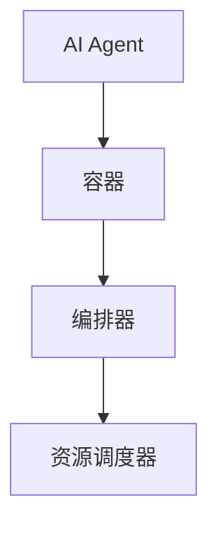
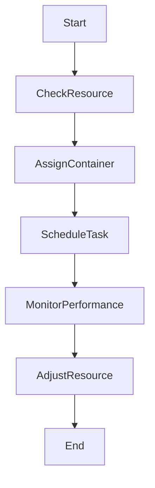
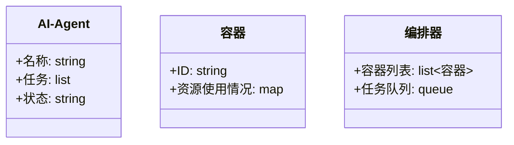
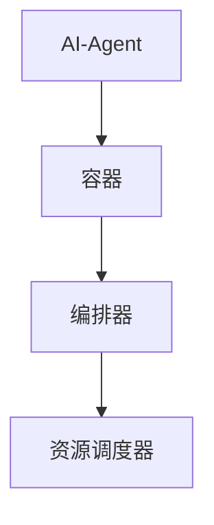

                 


# 企业AI Agent的容器化应用编排策略

> 关键词：企业AI Agent，容器化应用，编排策略，Kubernetes，Docker Swarm，资源调度

> 摘要：本文详细探讨了企业AI Agent在容器化环境中的编排策略，分析了容器化技术的核心原理，介绍了常见的容器编排工具及其优缺点，并通过实际案例展示了如何在企业环境中高效地部署和管理AI Agent。文章还提供了系统架构设计和数学模型，帮助读者更好地理解和实施企业AI Agent的容器化编排策略。

---

## 第1章: 企业AI Agent与容器化技术基础

### 1.1 企业AI Agent的定义与背景

#### 1.1.1 AI Agent的基本概念
- **定义**：AI Agent（人工智能代理）是一种能够感知环境、自主决策并执行任务的智能实体。
- **功能**：AI Agent通常负责数据收集、分析、推理、决策和执行操作。
- **应用场景**：广泛应用于企业资源管理、自动化流程、客户服务等领域。

#### 1.1.2 企业AI Agent的应用场景
- **数据分析**：实时处理和分析企业数据。
- **自动化流程**：自动执行企业中的重复性任务。
- **智能决策支持**：辅助企业做出数据驱动的决策。

#### 1.1.3 容器化技术在AI Agent中的作用
- **资源隔离**：确保每个AI Agent独立运行，避免资源争抢。
- **快速部署**：通过容器化技术，可以快速部署和扩展AI Agent。
- **一致性环境**：保证AI Agent在不同环境中运行一致。

### 1.2 容器化技术的核心原理

#### 1.2.1 容器与虚拟机的区别
| 特性       | 容器          | 虚拟机        |
|------------|---------------|---------------|
| 资源消耗   | 低            | 高            |
| 启动速度   | 快            | 较慢          |
| 环境一致性 | 高            | 中            |

#### 1.2.2 容器化技术的优缺点
- **优点**：
  - 资源利用率高。
  - 部署快速，易于扩展。
- **缺点**：
  - 容器之间的隔离性较弱。
  - 容器编排和管理的复杂性较高。

#### 1.2.3 容器编排工具
- **Kubernetes**：功能强大，支持复杂的集群管理。
- **Docker Swarm**：简单易用，适合小规模部署。

---

## 第2章: 企业AI Agent容器化编排的核心概念

### 2.1 企业AI Agent容器化编排的背景

#### 2.1.1 企业AI Agent的复杂性
- **多任务并行处理**：企业中的AI Agent需要处理多种任务，可能导致资源竞争。
- **动态扩展**：根据负载需求动态调整资源分配。

#### 2.1.2 容器化编排的必要性
- **资源优化**：通过编排工具合理分配资源，避免资源浪费。
- **高可用性**：确保AI Agent在故障时能够自动恢复。

### 2.2 核心概念与联系

#### 2.2.1 AI Agent的容器化模型
- **容器化模型**：AI Agent运行在容器中，通过编排工具进行管理。

#### 2.2.2 容器编排工具的实体关系图


### 2.3 算法原理讲解

#### 2.3.1 容器编排算法的流程图


#### 2.3.2 算法实现代码示例
```python
def container_scheduler(tasks, resources):
    for task in tasks:
        if resources >= task.request:
            assign_container(task)
        else:
            scale_up_resources()
```

---

## 第3章: 企业AI Agent容器化编排的数学模型与公式

### 3.1 容器编排的数学模型

#### 3.1.1 资源分配模型
- **目标**：最大化资源利用率，最小化资源浪费。
- **模型**：$$ \text{资源分配} = \sum_{i=1}^{n} \frac{r_i}{t_i} $$，其中 \( r_i \) 是资源量，\( t_i \) 是任务需求。

### 3.2 核心公式与推导

#### 3.2.1 资源分配公式
$$ \text{资源分配} $$

---

## 第4章: 系统架构设计

### 4.1 问题场景介绍

#### 4.1.1 问题背景
- **多任务处理**：企业中的AI Agent需要处理多个任务，可能导致资源争抢。
- **动态扩展**：根据负载需求动态调整资源分配。

### 4.2 项目介绍

#### 4.2.1 项目目标
- 实现企业AI Agent的容器化编排。
- 提供高可用性和动态扩展能力。

### 4.3 系统功能设计

#### 4.3.1 领域模型


### 4.4 系统架构设计

#### 4.4.1 系统架构图


---

## 第5章: 项目实战

### 5.1 环境安装

#### 5.1.1 安装步骤
1. 安装Docker：```bash
   curl -fsSL https://get.docker.com | bash -s docker
```
2. 安装Kubernetes：```bash
   kubectl apply -f https://raw.githubusercontent.com/kubernetes/.../kubernetes.min.yaml
```

### 5.2 系统核心实现源代码

#### 5.2.1 核心代码
```python
def deploy_agent(agent_name, resources):
    kubectl apply -f {
        apiVersion: v1
        kind: Deployment
        metadata:
            name: ${agent_name}
        spec:
            replicas: 1
            selector:
                matchLabels:
                    app: ${agent_name}
            template:
                metadata:
                    labels:
                        app: ${agent_name}
                spec:
                    containers:
                    - name: ${agent_name}
                      resources:
                          limits:
                              cpu: ${resources}
```

### 5.3 实际案例分析

#### 5.3.1 案例分析
- **场景**：企业需要处理大量数据分析任务。
- **解决方案**：使用Kubernetes编排AI Agent，动态调整资源分配。

---

## 第6章: 总结与展望

### 6.1 最佳实践

#### 6.1.1 工具选择
- 根据需求选择合适的编排工具，Kubernetes适合复杂场景，Docker Swarm适合简单场景。

#### 6.1.2 资源优化
- 使用资源配额和限制，避免资源浪费。

### 6.2 小结
- 企业AI Agent的容器化编排能够提高资源利用率和系统可用性。
- 选择合适的编排工具和优化资源分配是关键。

### 6.3 注意事项
- 容器编排需要考虑容错性和自愈能力。
- 定期监控和维护系统，确保其稳定运行。

### 6.4 拓展阅读
- 深入学习Kubernetes的资源调度机制。
- 探索AI Agent在其他领域的应用。

---

# 作者：AI天才研究院 & 禅与计算机程序设计艺术

---

这篇博客文章详细介绍了企业AI Agent的容器化应用编排策略，从背景到实现，再到系统架构设计和实际案例，为读者提供了全面的知识和实践指导。希望对您有所帮助！

