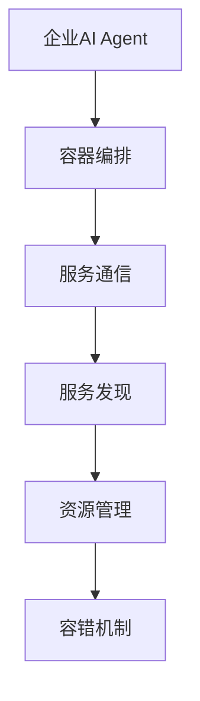
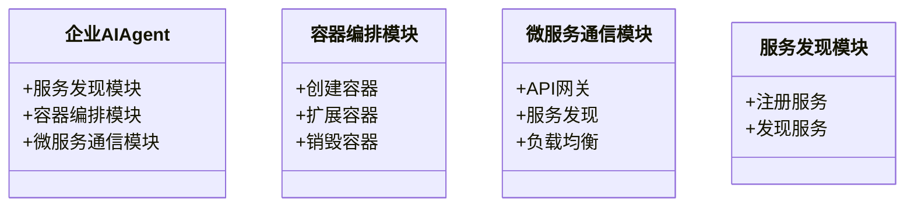
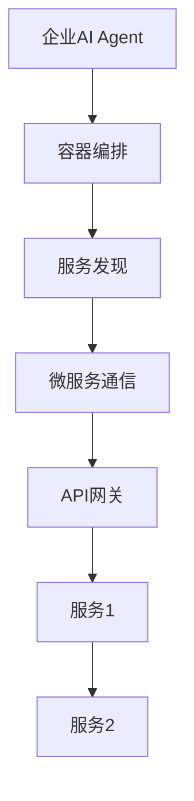
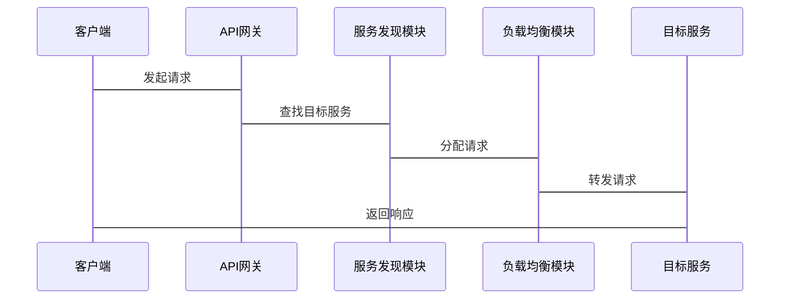

                 

# 企业AI Agent的容器化微服务部署策略

> 关键词：企业AI Agent，容器化，微服务，部署策略，容器编排，微服务通信

> 摘要：本文探讨了如何通过容器化和微服务架构实现企业AI Agent的高效部署。从背景介绍到核心概念，再到算法原理、系统设计、项目实战和总结，详细分析了企业AI Agent容器化微服务部署的策略和方法，为企业AI Agent的部署提供了理论和实践指导。

---

# 第一部分: 企业AI Agent的容器化微服务部署背景

## 第1章: 企业AI Agent的发展背景

### 1.1 从传统AI到企业AI Agent的演进

- **传统AI**：传统AI主要集中在学术研究和特定领域的应用，例如图像识别、自然语言处理等。这些系统通常基于规则或特定算法，难以适应企业复杂多变的需求。
- **企业AI Agent**：随着技术的进步，企业AI Agent应运而生。它是一种能够感知环境、自主决策并执行任务的智能体，广泛应用于企业内部的自动化流程、客户支持、数据分析等领域。
- **演进驱动力**：企业对自动化、智能化的需求增加，推动了AI技术向实际应用场景的深入发展，企业AI Agent成为连接AI技术和企业需求的桥梁。

### 1.2 容器化技术对企业AI Agent的影响

- **容器化技术**：容器化技术（如Docker）通过轻量级虚拟化实现了应用程序的独立运行环境，具有快速部署、资源利用率高等特点。
- **影响**：容器化技术使得企业AI Agent可以快速部署、弹性扩展，并且能够适应不同的运行环境，提升了企业的灵活性和响应速度。

### 1.3 微服务架构在企业AI Agent中的作用

- **微服务架构**：将系统分解为多个小型、独立的服务，每个服务负责特定的功能模块。微服务架构强调服务的松耦合和高内聚，便于开发、测试和部署。
- **作用**：在企业AI Agent中，微服务架构能够分解复杂的业务逻辑，提高系统的可维护性和扩展性，同时支持不同的功能模块独立更新和优化。

### 1.4 企业AI Agent容器化微服务部署的必要性

- **挑战**：企业AI Agent的部署需要面对复杂的应用场景、高可用性和扩展性要求，传统的单体架构难以满足这些需求。
- **优势**：容器化和微服务架构的结合，能够提供高效的资源利用率、快速的部署速度和灵活的扩展能力，满足企业AI Agent的复杂部署需求。
- **前景**：随着企业对智能化和自动化需求的增加，容器化和微服务架构在企业AI Agent中的应用前景广阔。

---

## 第2章: 企业AI Agent的容器化微服务部署核心概念

### 2.1 容器化技术的核心原理

- **容器运行时与容器编排工具**：容器运行时（如Docker Engine）负责创建和管理容器，而容器编排工具（如Kubernetes）负责协调多个容器的运行，实现自动化部署、扩展和故障恢复。
- **优缺点对比**：容器化技术的优点包括轻量级、快速部署和资源利用率高，缺点则包括容器隔离性较差和对运维人员的要求较高。

### 2.2 微服务架构的核心原理

- **实现机制**：微服务架构通过将系统分解为多个小型服务，每个服务独立开发、部署和扩展。服务间通过API进行通信，实现系统的高内聚和松耦合。
- **与传统单体架构的对比**：微服务架构在灵活性、可扩展性和可维护性方面具有明显优势，但需要处理服务发现、通信和协调等问题。

### 2.3 企业AI Agent容器化微服务部署的核心要素

- **容器化与微服务的结合点**：通过容器化实现服务的独立运行环境，通过微服务架构实现功能模块的分解和协作。
- **核心要素**：包括容器编排、服务通信、资源管理、服务发现和容错机制等。
- **边界与外延**：企业AI Agent的容器化微服务部署不仅包括技术实现，还需要考虑组织架构、开发流程和运维策略等外部因素。

### 2.4 核心概念与联系

- **核心概念原理**：容器化和微服务架构的结合，使得企业AI Agent能够快速部署、弹性扩展，并且支持复杂的应用场景。
- **对比表格**：下表对比了容器化和微服务架构的特点。

| 特性          | 容器化                 | 微服务架构             |
|---------------|-----------------------|-----------------------|
| 实现方式       | 容器化技术             | 多个独立服务           |
| 部署方式       | 单一容器或容器组       | 多个服务协同工作       |
| 可扩展性       | 容器数量可扩展         | 服务数量可扩展         |
| 资源利用率       | 高                   | 中等                 |
| 部署速度       | 快                   | 较快                 |

- **ER实体关系图架构的 Mermaid 流程图**：使用Mermaid绘制企业AI Agent的架构图，展示各模块之间的关系。

---

## 第3章: 企业AI Agent容器化微服务部署的算法原理

### 3.1 容器编排算法原理

- **调度算法**：容器编排工具（如Kubernetes）使用调度算法（如Round-Robin、Least-Responsive等）来决定任务的运行位置，以优化资源利用率。
- **资源分配算法**：基于节点的资源使用情况，动态分配容器资源，确保任务的高效执行。
- **负载均衡算法**：通过负载均衡算法（如加权轮询、随机算法等）分配流量，确保服务的高可用性。

### 3.2 微服务通信算法原理

- **协议选择**：使用HTTP/2、gRPC等协议实现服务间的高效通信。
- **路由算法**：通过API网关实现请求的路由转发，确保请求能够准确到达目标服务。
- **鉴权与授权算法**：通过JWT（JSON Web Token）等机制实现服务间的鉴权与授权，保障通信的安全性。

### 3.3 企业AI Agent容器化微服务部署的算法

- **算法原理**：通过容器编排和微服务通信的结合，实现企业AI Agent的高效部署和运行。
- **数学模型**：以下是一个简单的资源分配模型：

$$ \text{资源利用率} = \sum_{i=1}^{n} \frac{\text{任务i的资源需求}}{\text{节点i的总资源}} $$

- **实现步骤**：
  1. 通过容器编排工具创建服务实例。
  2. 使用服务发现机制确定服务的可用实例。
  3. 通过负载均衡算法分配请求到目标服务。
  4. 服务间通过API进行通信，实现功能协作。

---

## 第4章: 企业AI Agent容器化微服务部署的系统分析与架构设计

### 4.1 问题场景介绍

- **应用场景**：企业内部的自动化流程、客户支持、数据分析等领域。
- **系统介绍**：企业AI Agent通过容器化和微服务架构实现高效部署和运行。

### 4.2 系统功能设计

- **领域模型**：使用Mermaid绘制领域模型类图，展示系统的功能模块。

### 4.3 系统架构设计

- **架构图**：使用Mermaid绘制系统架构图，展示各模块之间的关系。

### 4.4 系统接口设计

- **API接口**：定义服务间的接口规范，例如RESTful API。

### 4.5 系统交互设计

- **序列图**：使用Mermaid绘制系统交互的序列图，展示服务间的调用流程。

---

## 第5章: 企业AI Agent容器化微服务部署的项目实战

### 5.1 环境搭建

- **安装Docker**：在服务器上安装Docker，确保能够运行容器化服务。
- **安装Kubernetes**：安装Kubernetes集群，用于容器编排和管理。

### 5.2 系统核心实现

- **代码实现**：实现企业AI Agent的各个功能模块，例如服务发现、容器编排等。
- **代码解读**：详细解读代码结构和功能，展示如何实现容器化和微服务架构。

### 5.3 实际案例分析

- **案例分析**：通过具体案例分析企业AI Agent的容器化微服务部署过程，展示实际应用中的问题和解决方案。

### 5.4 项目优化与测试

- **优化建议**：根据实际运行情况，优化系统的性能和稳定性。
- **系统测试**：进行压力测试、功能测试和安全测试，确保系统的稳定运行。

---

## 第6章: 总结与展望

### 6.1 总结

- **核心内容回顾**：总结企业AI Agent容器化微服务部署的核心内容和实现方法。
- **关键点总结**：强调容器化和微服务架构在企业AI Agent部署中的重要性。

### 6.2 展望

- **未来趋势**：随着技术的发展，容器化和微服务架构在企业AI Agent中的应用将更加广泛和深入。
- **研究方向**：未来的研究方向可能包括更高效的容器编排算法、更智能的服务发现机制等。

### 6.3 最佳实践 Tips

- **注意事项**：在实际部署中，需要注意容器资源分配、服务间通信的安全性等问题。
- **小结**：企业AI Agent的容器化微服务部署是一个复杂但重要的任务，需要综合考虑技术实现和运维管理。

### 6.4 作者信息

- **作者**：AI天才研究院/AI Genius Institute & 禅与计算机程序设计艺术 /Zen And The Art of Computer Programming

---

# 结语

通过本文的详细分析，我们探讨了企业AI Agent容器化微服务部署的策略和方法，为企业AI Agent的高效部署提供了理论和实践指导。未来，随着技术的不断发展，企业AI Agent的容器化微服务部署将更加智能化和高效化。

