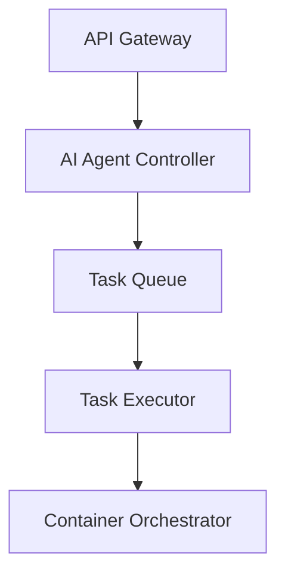

                 


# 《企业AI Agent的容器编排与管理策略》

> 关键词：企业AI Agent、容器编排、任务调度、资源管理、智能优化、系统架构

> 摘要：本文深入探讨了企业AI Agent在容器编排与管理中的应用策略，分析了容器编排的核心技术、AI Agent的智能决策机制，以及两者结合的优化方法。通过系统架构设计、算法原理和实际案例分析，为读者提供了从理论到实践的全面指导。

---

## 第1章: 企业AI Agent的背景与核心概念

### 1.1 企业AI Agent的背景与现状

#### 1.1.1 人工智能与自动化技术的快速发展
人工智能（AI）和自动化技术的快速发展为企业提供了前所未有的效率提升机会。企业AI Agent作为一类智能代理系统，能够自动执行任务、优化资源分配并提高运营效率。随着容器化技术的普及，企业对AI Agent的需求日益增加。

#### 1.1.2 企业数字化转型中的AI Agent需求
企业数字化转型要求更高的自动化水平，AI Agent在这一过程中扮演着关键角色。通过AI Agent，企业能够实现智能化的资源管理、任务调度和服务优化，从而提高整体效率和竞争力。

#### 1.1.3 当前企业AI Agent的应用痛点与挑战
尽管AI Agent在企业中的应用前景广阔，但其实际应用仍面临诸多挑战，如复杂环境下的决策优化、多目标平衡的资源分配、动态环境下的实时响应等。

---

### 1.2 容器编排与AI Agent的关系

#### 1.2.1 容器编排技术原理
容器编排是通过自动化工具（如Kubernetes）对容器化应用进行部署、扩缩容和自愈。其核心流程包括资源分配、服务发现、负载均衡和任务调度。

#### 1.2.2 AI Agent在容器编排中的作用
AI Agent能够通过智能算法优化容器编排的决策过程。例如，AI Agent可以根据实时负载数据动态调整容器资源分配，优化任务调度策略。

#### 1.2.3 企业AI Agent与容器编排的结合
企业AI Agent通过与容器编排平台的协同工作，实现智能化的资源管理和任务调度，从而提高企业的运营效率和资源利用率。

---

### 1.3 企业AI Agent的核心概念与应用场景

#### 1.3.1 AI Agent的定义与核心特征
AI Agent是一种能够感知环境、自主决策并执行任务的智能系统。其核心特征包括自主性、反应性、目标导向和学习能力。

#### 1.3.2 企业AI Agent的主要应用场景
企业AI Agent的应用场景包括资源优化、任务调度、服务发现、故障自愈和动态扩展等。

#### 1.3.3 企业AI Agent的边界与外延
企业AI Agent的边界在于其智能决策和执行能力，外延则涉及与企业现有系统的集成和扩展。

---

## 第2章: 容器编排与AI Agent的核心技术原理

### 2.1 容器编排技术原理

#### 2.1.1 容器编排的关键技术
容器编排的关键技术包括调度算法、资源分配和任务队列管理。

#### 2.1.2 调度算法的分类与对比
调度算法分为静态调度和动态调度，常见的静态调度算法包括轮询和随机，动态调度算法包括负载均衡和贪婪算法。

#### 2.1.3 容器编排的主流工具
主流容器编排工具包括Kubernetes、Docker Swarm和Apache Mesos。

---

### 2.2 AI Agent的核心技术原理

#### 2.2.1 AI Agent的智能决策机制
AI Agent通过机器学习算法（如强化学习）优化决策过程。

#### 2.2.2 基于容器编排的AI Agent任务调度流程
AI Agent的任务调度流程包括任务接收、决策优化和执行反馈。

#### 2.2.3 容器编排与AI Agent的协同工作模式
容器编排平台为AI Agent提供资源和任务信息，AI Agent通过智能决策优化容器编排的效率。

---

## 第3章: 企业AI Agent的容器编排策略

### 3.1 容器编排策略的核心要素

#### 3.1.1 容器编排的目标与原则
容器编排的目标是最大化资源利用率和任务执行效率，原则包括简洁性、可扩展性和可维护性。

#### 3.1.2 容器编排策略的关键指标
关键指标包括资源利用率、任务响应时间和服务可用性。

#### 3.1.3 容器编排策略的实现步骤
实现步骤包括需求分析、算法设计、系统集成和性能优化。

---

## 第4章: 企业AI Agent的系统架构设计

### 4.1 系统架构设计概述

#### 4.1.1 系统功能设计
系统功能包括任务接收、资源分配、决策优化和执行反馈。

#### 4.1.2 系统架构图
以下是系统的架构图：



#### 4.1.3 系统交互流程
系统交互流程如下：

1. API Gateway接收外部任务请求。
2. AI Agent Controller解析任务并生成决策。
3. Task Queue将任务分配给Task Executor。
4. Task Executor执行任务并反馈结果。

---

## 第5章: 企业AI Agent的项目实战

### 5.1 项目实战环境配置

#### 5.1.1 环境配置
- 操作系统：Ubuntu 20.04
- 容器编排工具：Kubernetes
- AI Agent实现工具：Python + TensorFlow

#### 5.1.2 核心代码实现
以下是AI Agent的核心代码：

```python
class AI-Agent:
    def __init__(self, resources):
        self.resources = resources

    def decide_task_placement(self, task):
        # 使用强化学习算法进行决策
        pass
```

---

## 第6章: 企业AI Agent的最佳实践

### 6.1 最佳实践

#### 6.1.1 性能优化技巧
- 优化资源分配算法
- 提升任务调度效率
- 减少系统延迟

#### 6.1.2 安全性考虑
- 加强身份验证
- 保护数据隐私
- 防御拒绝服务攻击

#### 6.1.3 可扩展性设计
- 分布式架构
- 弹性扩展能力
- 高可用性设计

---

## 结语

企业AI Agent的容器编排与管理策略是一个复杂的系统工程。通过结合容器编排技术和AI Agent的智能决策能力，企业可以实现更高效的资源管理和任务调度。未来，随着AI技术的不断进步和容器编排工具的优化，企业AI Agent将在更多场景中发挥重要作用。

---

## 作者：AI天才研究院/AI Genius Institute & 禅与计算机程序设计艺术 /Zen And The Art of Computer Programming

