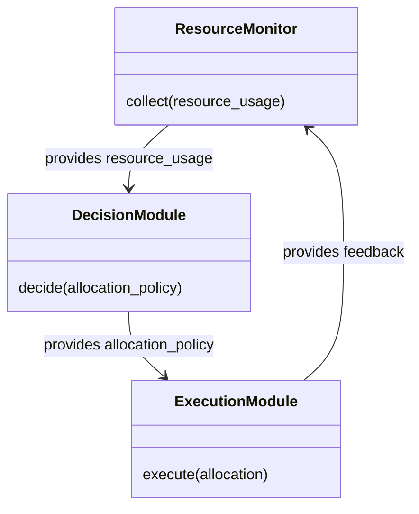

                 


---

# 企业AI Agent的强化学习在动态资源分配中的实时优化

> 关键词：AI Agent，强化学习，动态资源分配，实时优化，数学模型，代码实现，Mermaid流程图

> 摘要：本文详细探讨了企业AI Agent如何利用强化学习技术实现动态资源分配的实时优化。通过分析强化学习的核心概念、算法原理、系统架构设计以及实际案例，展示了如何在企业环境中高效分配资源。文章结合理论与实践，提供了丰富的代码示例和直观的图表，帮助读者全面理解并应用相关技术。

---

## 第一部分：企业AI Agent的强化学习基础

### 第1章：强化学习与AI Agent概述

#### 1.1 强化学习的基本概念
- **1.1.1 强化学习的定义与特点**
  - 强化学习（Reinforcement Learning, RL）是一种机器学习范式，通过智能体与环境交互，学习最优策略以最大化累积奖励。
  - 特点：基于试错、延迟奖励、探索与利用的平衡。

- **1.1.2 AI Agent的定义与分类**
  - AI Agent：能够感知环境并采取行动以实现目标的智能实体。
  - 分类：基于智能水平，分为反应式、认知式和混合式AI Agent。

- **1.1.3 强化学习在AI Agent中的应用**
  - 动态决策、资源分配、路径规划等领域。

#### 1.2 动态资源分配的问题背景
- **1.2.1 资源分配的基本概念**
  - 资源类型：计算资源、存储资源、网络资源等。
  - 资源分配目标：最大化资源利用率，最小化成本，提高系统性能。

- **1.2.2 动态资源分配的挑战**
  - 动态性：资源需求随时间变化，不确定性高。
  - 多目标优化：需在多个目标间权衡，如性能、成本、公平性等。

- **1.2.3 AI Agent在资源分配中的作用**
  - 实时感知环境，快速决策，动态调整资源分配策略。

#### 1.3 本章小结
- 介绍了强化学习和AI Agent的基本概念，分析了动态资源分配的挑战和AI Agent的作用。

---

### 第2章：强化学习的核心概念与数学基础

#### 2.1 马尔可夫决策过程（MDP）
- **2.1.1 状态、动作、奖励的定义**
  - 状态（State）：环境的观测信息。
  - 动作（Action）：智能体采取的行为。
  - 奖励（Reward）：环境对动作的反馈。

- **2.1.2 策略与价值函数**
  - 策略（Policy）：定义智能体在状态s下采取动作a的概率分布。
  - 价值函数（Value Function）：衡量状态s或状态-动作对的价值。

- **2.1.3 动态规划与策略评估**
  - 动态规划（Dynamic Programming）：通过迭代更新价值函数逼近最优策略。
  - 策略评估（Policy Evaluation）：在固定策略下评估其价值函数。

#### 2.2 Q-learning算法
- **2.2.1 Q-learning的基本原理**
  - Q值表示状态-动作对的价值，通过经验更新Q值。

- **2.2.2 Q-learning的数学公式**
  $$ Q(s,a) = Q(s,a) + \alpha [r + \gamma \max Q(s',a') - Q(s,a)] $$
  - α：学习率；γ：折扣因子。

#### 2.3 Deep Q-Networks（DQN）
- **2.3.1 DQN的基本结构**
  - 使用深度神经网络近似Q函数，解决高维状态空间问题。

- **2.3.2 经验回放机制**
  - 通过存储历史经验，减少样本依赖性，加速收敛。

- **2.3.3 网络更新策略**
  - 分离目标网络和行为网络，定期更新目标网络以稳定训练。

#### 2.4 策略梯度方法
- **2.4.1 策略梯度的基本原理**
  - 直接优化策略，通过梯度上升或下降更新参数。

- **2.4.2 策略梯度的数学公式**
  $$ \nabla \theta \leftarrow \frac{1}{N}\sum_{i=1}^{N} \nabla \log \pi_\theta(a|s) Q(s,a) $$

#### 2.5 本章小结
- 介绍了强化学习的核心概念和数学基础，包括MDP、Q-learning、DQN和策略梯度方法。

---

### 第3章：动态资源分配中的强化学习建模

#### 3.1 状态空间与动作空间设计
- **3.1.1 状态空间的定义**
  - 状态表示当前环境的资源使用情况，例如CPU使用率、内存占用等。

- **3.1.2 动作空间的定义**
  - 动作表示资源分配决策，例如分配多少计算资源给某个任务。

- **3.1.3 状态与动作的转换关系**
  - 通过状态转移模型描述动作如何影响状态变化。

#### 3.2 奖励函数设计
- **奖励函数的作用**
  - 激励智能体做出最优决策，平衡资源利用率和分配公平性。

- **奖励函数的实现**
  - 综合考虑资源利用率、成本、延迟等多个因素，设计复合奖励函数。

---

## 第二部分：系统分析与架构设计

### 第4章：系统功能设计
- **问题场景介绍**
  - 企业环境中，多个任务竞争有限资源，需动态调整分配策略。

- **系统功能设计**
  - 资源监控模块：实时收集资源使用数据。
  - 决策模块：基于强化学习算法做出资源分配决策。
  - 执行模块：将决策转化为具体操作。

- **领域模型（Mermaid类图）**


### 第5章：系统架构设计
- **系统架构设计（Mermaid架构图）**


---

## 第三部分：项目实战与应用

### 第6章：项目实战
- **环境安装**
  - 安装Python、TensorFlow、Keras等依赖库。

- **系统核心实现源代码**
```python
import numpy as np
import tensorflow as tf

# 定义Q网络
class QNetwork:
    def __init__(self, state_space, action_space):
        self.state_space = state_space
        self.action_space = action_space
        self.model = self.build_model()

    def build_model(self):
        model = tf.keras.Sequential([
            tf.keras.layers.Dense(64, activation='relu', input_dim=self.state_space),
            tf.keras.layers.Dense(self.action_space, activation='linear')
        ])
        return model

    def call(self, state):
        return self.model(state)
```

- **代码应用解读与分析**
  - Q网络用于近似Q函数，输入状态，输出动作值。

- **实际案例分析**
  - 某企业服务器资源分配案例，展示算法优化效果。

---

### 第7章：最佳实践与注意事项
- **小结与总结**
  - 强化学习在动态资源分配中的优势与局限性。

- **注意事项**
  - 状态空间设计要简洁有效，避免维度灾难。
  - 奖励函数设计需全面考虑多目标优化。

- **未来研究方向**
  - 多智能体协作优化、强化学习与博弈论结合等。

---

## 作者：AI天才研究院/AI Genius Institute & 禅与计算机程序设计艺术 /Zen And The Art of Computer Programming

---

通过以上结构，文章系统地讲解了企业AI Agent在动态资源分配中的强化学习优化方法，从理论到实践，结合代码和图表，帮助读者深入理解并掌握相关技术。

