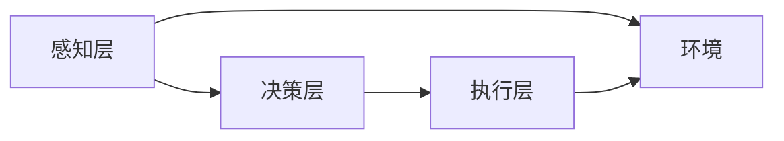

                 


# 企业AI Agent的强化学习在动态资源分配中的应用

> 关键词：AI Agent, 强化学习, 动态资源分配, 算法原理, 系统架构

> 摘要：本文将探讨企业AI Agent如何利用强化学习技术进行动态资源分配。通过详细分析强化学习的基本原理、算法实现及其在资源分配中的应用，结合实际项目案例，为读者提供全面的技术指导和实践参考。

---

## 第1章: 引言

### 1.1 背景介绍
在现代企业环境中，资源分配问题日益复杂。随着业务规模的扩大和市场需求的变化，企业需要一种高效、智能的资源分配方法。传统的静态资源分配策略已无法应对动态变化的环境，因此，引入AI Agent和强化学习技术成为必然趋势。

### 1.2 问题描述
动态资源分配问题的核心在于如何在动态变化的环境中，实时调整资源分配策略，以最大化资源利用率和业务目标的实现。这涉及到多个决策变量和复杂的约束条件。

### 1.3 研究意义
本文通过结合AI Agent和强化学习技术，提出了一种动态资源分配的新方法。该方法能够实时感知环境变化，并通过强化学习优化资源分配策略，为企业解决实际问题提供理论支持和实践指导。

---

## 第2章: AI Agent与强化学习基础

### 2.1 AI Agent的核心概念
AI Agent是一种能够感知环境、做出决策并执行动作的智能体。它具备自主性、反应性、目标导向性和社交能力等特性。AI Agent在企业中的应用广泛，包括资源管理、自动化决策等领域。

### 2.2 强化学习的基本原理
强化学习是一种通过试错方式学习最优策略的方法。智能体通过与环境交互，获得奖励或惩罚，逐步优化自身的决策策略。强化学习的核心要素包括状态空间、动作空间、奖励函数和策略。

### 2.3 强化学习与动态资源分配的关系
动态资源分配问题可以转化为强化学习中的马尔可夫决策过程（MDP）。通过定义状态、动作和奖励函数，强化学习能够帮助AI Agent在动态环境中找到最优资源分配策略。

---

## 第3章: 强化学习算法原理

### 3.1 Q-learning算法
Q-learning是一种经典的强化学习算法，适用于离线学习和小规模状态空间的问题。其核心思想是通过维护一个Q表，记录状态-动作对的价值，并通过经验不断更新Q值。

#### 3.1.1 算法流程
1. 初始化Q表为零。
2. 选择当前状态下的动作。
3. 执行动作，观察环境反馈的状态和奖励。
4. 更新Q表中的对应值：$$ Q(s,a) = Q(s,a) + \alpha (r + \max Q(s',a') - Q(s,a)) $$

#### 3.1.2 Q-learning的优缺点
优点：简单易实现，适用于离线学习。  
缺点：无法处理大规模状态空间，收敛速度较慢。

### 3.2 Deep Q-Network (DQN)算法
DQN通过深度神经网络近似Q函数，解决了传统Q-learning在处理高维状态空间时的难题。其核心思想是使用两个神经网络：一个用于评估当前策略（主网络），另一个用于稳定学习过程（目标网络）。

#### 3.2.1 DQN算法流程
1. 初始化主网络和目标网络。
2. 从经验回放缓存中随机采样一批经验。
3. 使用目标网络评估目标Q值。
4. 使用主网络更新当前Q值：$$ y = r + \gamma \max Q_{target}(s') $$
5. 训练主网络最小化损失函数：$$ \mathcal{L} = \mathbb{E}[(Q_{main}(s,a) - y)^2] $$

#### 3.2.2 DQN的优缺点
优点：能够处理高维状态空间，适合复杂环境。  
缺点：需要处理经验回放缓存和网络同步问题。

### 3.3 策略梯度方法
策略梯度方法直接优化策略，而不是Q函数。其核心思想是通过梯度上升方法最大化期望奖励。

#### 3.3.1 策略梯度算法流程
1. 初始化策略参数θ。
2. 采样动作并执行，获得轨迹。
3. 计算策略梯度：$$ \nabla_{\theta} \mathbb{E}[R] $$
4. 更新策略参数：$$ θ = θ + \alpha \nabla_{\theta} \mathbb{E}[R] $$

---

## 第4章: 动态资源分配的强化学习建模

### 4.1 动态资源分配问题建模
动态资源分配问题可以表示为一个马尔可夫决策过程（MDP），其中状态空间、动作空间和奖励函数的定义至关重要。

#### 4.1.1 状态空间
状态空间包括当前资源使用情况、任务需求变化、资源剩余容量等信息。

#### 4.1.2 动作空间
动作空间包括分配资源、调整资源使用优先级等具体操作。

#### 4.1.3 奖励函数
奖励函数通常设计为资源利用率最大化、任务完成时间最小化等目标的函数。

### 4.2 动态资源分配的强化学习模型
通过强化学习模型，AI Agent可以在动态环境中实时调整资源分配策略，从而提高资源利用率和任务执行效率。

#### 4.2.1 算法选择
根据问题规模和复杂度，选择合适的强化学习算法（如Q-learning、DQN、策略梯度等）。

#### 4.2.2 环境模拟
通过模拟动态环境，训练AI Agent在不同场景下的资源分配能力。

---

## 第5章: 系统架构与实现

### 5.1 系统架构设计
系统架构包括感知层、决策层和执行层。感知层负责采集环境信息，决策层基于强化学习算法做出决策，执行层负责实际资源分配。

#### 5.1.1 系统功能模块
1. 环境感知模块：收集资源使用情况和任务需求。
2. 强化学习模块：基于当前状态选择最优动作。
3. 资源分配模块：执行分配策略。

#### 5.1.2 系统架构图（mermaid）


### 5.2 系统实现细节
#### 5.2.1 环境模拟
通过编写模拟环境代码，生成动态资源分配问题的训练数据。

#### 5.2.2 算法实现
使用Python编写强化学习算法的核心代码，包括状态处理、动作选择和奖励计算。

#### 5.2.3 系统接口设计
定义清晰的接口规范，确保各模块之间的通信顺畅。

---

## 第6章: 项目实战与案例分析

### 6.1 项目背景
本项目旨在通过强化学习实现企业资源的动态分配，提升资源利用率和任务执行效率。

### 6.2 环境安装
安装必要的依赖库，如TensorFlow、Keras、OpenAI Gym等。

### 6.3 核心代码实现
以下是强化学习算法的核心代码示例：

```python
import numpy as np
import gym

# 定义环境
env = gym.make('DynamicResourceAllocation-v0')

# 初始化参数
alpha = 0.1
gamma = 0.99

# 初始化Q表
Q = np.zeros([env.observation_space.n, env.action_space.n])

# Q-learning算法实现
for episode in range(1000):
    state = env.reset()
    for _ in range(env.observation_space.n):
        # 选择动作
        action = np.argmax(Q[state])
        # 执行动作
        next_state, reward, done, _ = env.step(action)
        # 更新Q表
        Q[state][action] += alpha * (reward + gamma * np.max(Q[next_state]) - Q[state][action])
        state = next_state
        if done:
            break
```

### 6.4 案例分析
通过具体案例分析，验证算法的有效性和实用性。例如，在任务调度问题中，AI Agent能够通过强化学习优化资源分配策略，显著提高任务完成效率。

---

## 第7章: 总结与展望

### 7.1 研究总结
本文通过结合AI Agent和强化学习技术，提出了一种动态资源分配的新方法。该方法能够实时感知环境变化，并通过强化学习优化资源分配策略。

### 7.2 未来展望
未来研究方向包括：
1. 更复杂的动态环境建模。
2. 更高效的强化学习算法设计。
3. 多目标优化问题的处理。

---

## 作者信息
作者：AI天才研究院/AI Genius Institute  
联系邮箱：contact@aicourse.com  
文章地址：https://www.aicourse.com

---

**声明**：本文内容遵循知识共享署名-非商业性使用-相同方式共享 4.0 国际许可协议（CC BY-NC-SA 4.0），转载请注明出处。

