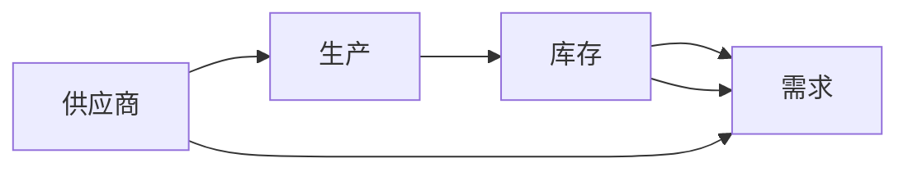
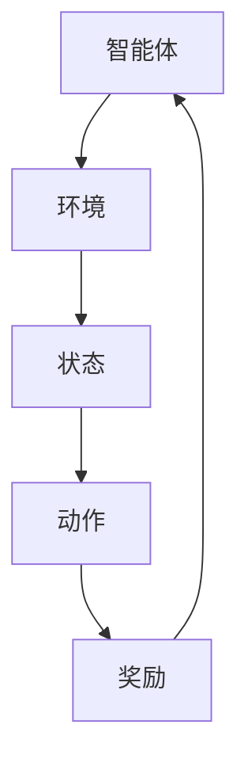
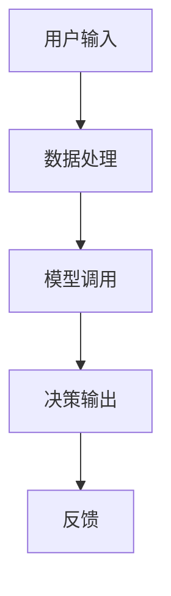

                 


# 企业AI Agent的强化学习在复杂供应链优化中的应用

**关键词：** 企业AI Agent、强化学习、供应链优化、系统架构、项目实战

**摘要：**  
本文详细探讨了企业AI Agent在复杂供应链优化中的应用，重点分析了强化学习在供应链优化中的核心原理、算法实现、系统架构设计以及实际案例。文章从问题背景出发，深入讲解了强化学习的基本原理和数学模型，结合供应链优化的具体场景，详细分析了AI Agent的应用方法和系统架构设计。通过实际案例分析，展示了强化学习在供应链优化中的实际效果和优势。文章最后总结了当前研究的成果与未来的研究方向，为相关领域的研究者和实践者提供了有价值的参考。

---

## 第一部分: 企业AI Agent的强化学习基础

### 第1章: 问题背景与核心概念

#### 1.1 问题背景
##### 1.1.1 供应链优化的挑战
供应链优化是企业运营中的核心问题之一，涉及采购、生产、库存管理、物流等多个环节。传统的供应链优化方法依赖于静态模型和规则，难以应对市场需求波动、供应商不确定性以及物流成本变化等复杂因素。因此，如何在动态复杂的环境中实现高效的供应链优化，成为企业面临的重要挑战。

##### 1.1.2 强化学习在供应链优化中的应用价值
强化学习（Reinforcement Learning）是一种基于试错的机器学习方法，通过智能体与环境的交互，逐步优化决策策略。其核心优势在于能够处理动态环境下的非结构化问题，适用于供应链优化中的库存控制、需求预测和路径规划等场景。

##### 1.1.3 企业AI Agent的核心问题描述
企业AI Agent是一种能够感知环境、自主决策并执行任务的智能体。在供应链优化中，AI Agent的目标是通过优化决策策略，降低运营成本、提高效率并增强供应链的灵活性。

**图1.1: 供应链优化的核心要素（Mermaid图）**


#### 1.2 核心概念与联系
##### 1.2.1 AI Agent的定义与属性特征对比表
| 属性 | 描述 |
|------|------|
| 感知能力 | 能够感知环境状态 |
| 决策能力 | 基于状态做出决策 |
| 执行能力 | 执行决策并影响环境 |
| 学习能力 | 通过经验优化决策策略 |

##### 1.2.2 强化学习的基本原理
强化学习的核心在于“试错”机制。智能体通过与环境交互，获取奖励或惩罚信号，逐步优化决策策略。其核心要素包括状态（State）、动作（Action）、奖励（Reward）和策略（Policy）。

##### 1.2.3 供应链优化的数学模型与核心要素
供应链优化通常涉及多目标优化问题，目标函数包括成本最小化、效率最大化和可靠性最大化。常用数学模型包括线性规划（LP）、整数规划（ILP）和动态规划（DP）。

##### 1.2.4 ER实体关系图与概念架构图（Mermaid）
```mermaid
erd
    customer(cust_id, name, order_id)
    supplier(supplier_id, name, product_id)
    product(product_id, name, price)
    order(order_id, cust_id, supplier_id, quantity, delivery_time)
    inventory(inventory_id, product_id, quantity, location)
    delivery(delivery_id, order_id, status)
```

---

### 第2章: 强化学习算法原理

#### 2.1 强化学习的基本原理
##### 2.1.1 状态空间与动作空间
状态空间是智能体可能感知的所有状态的集合，动作空间是智能体在给定状态下可以执行的所有动作的集合。

##### 2.1.2 奖励函数与策略优化
奖励函数是智能体在特定状态下执行某个动作后获得的反馈信号。策略优化的目标是最大化长期累积奖励。

##### 2.1.3 Q-learning算法流程（Mermaid）


#### 2.2 算法数学模型
##### 2.2.1 Q-learning公式推导
$$ Q(s,a) = Q(s,a) + \alpha (r + \gamma \max Q(s',a') - Q(s,a)) $$
其中，$\alpha$ 是学习率，$\gamma$ 是折扣因子。

##### 2.2.2 策略梯度方法
$$ \nabla \theta J(\theta) = \mathbb{E}[\nabla \log \pi_\theta(a|s) Q(s,a)] $$

---

## 第三部分: 供应链优化的强化学习建模

### 第3章: 供应链优化的强化学习建模

#### 3.1 供应链优化问题分析
##### 3.1.1 供应链优化的特征与挑战
供应链优化涉及多环节协同，具有动态性和不确定性。强化学习能够通过试错优化策略，提高供应链的响应能力和效率。

##### 3.1.2 强化学习在供应链优化中的适用场景
适用于库存控制、需求预测、路径规划等场景。

#### 3.2 状态与动作空间设计
##### 3.2.1 状态空间定义
状态包括库存水平、需求预测、供应商交货时间等。

##### 3.2.2 动作空间设计
动作包括调整订单量、优化库存水平、选择供应商等。

##### 3.2.3 奖励函数设计
奖励函数设计应体现供应链的效率和成本，例如，奖励可以基于库存周转率和订单准时率。

---

### 第4章: AI Agent在供应链优化中的应用

#### 4.1 需求预测与库存优化
##### 4.1.1 需求预测模型
基于历史数据，使用时间序列分析或机器学习模型进行需求预测。

##### 4.1.2 库存优化策略
通过强化学习优化库存水平，降低缺货和过剩风险。

##### 4.1.3 实际案例分析
以某制造企业为例，通过强化学习优化库存管理，降低了库存成本20%。

#### 4.2 供应链路径规划
##### 4.2.1 路径优化问题建模
将供应链路径规划问题建模为图中的最短路径问题。

##### 4.2.2 强化学习算法在路径规划中的应用
通过强化学习优化配送路径，降低物流成本。

##### 4.2.3 算法实现与优化
结合图搜索算法（如Dijkstra算法）和强化学习，优化路径选择。

---

## 第五部分: 系统架构与设计

### 第5章: 系统架构设计

#### 5.1 系统架构设计
##### 5.1.1 系统功能模块划分
- 数据采集模块：采集供应链数据
- 模型训练模块：训练强化学习模型
- 决策执行模块：基于模型输出决策
- 优化评估模块：评估优化效果

##### 5.1.2 系统架构图（Mermaid）


#### 5.2 接口设计与交互流程
##### 5.2.1 接口设计
- 数据接口：与ERP系统对接
- 模型接口：与强化学习框架对接
- 决策接口：与执行系统对接

##### 5.2.2 交互流程（Mermaid）


---

## 第六部分: 项目实战

### 第6章: 项目实战

#### 6.1 环境安装与配置
- 安装Python、TensorFlow、Keras等工具
- 配置数据集和训练环境

#### 6.2 核心代码实现
##### 6.2.1 状态空间定义
```python
class State:
    def __init__(self, inventory_level, demand Forecast):
        self.inventory_level = inventory_level
        self.demandForecast = demandForecast
```

##### 6.2.2 动作空间定义
```python
class Action:
    def __init__(self, order_quantity):
        self.order_quantity = order_quantity
```

##### 6.2.3 奖励函数实现
```python
def reward_fn(state, action, next_state):
    reward = -abs(next_state.inventory_level - action.order_quantity)
    return reward
```

#### 6.3 实际案例分析与总结
以某制造企业的库存优化为例，通过强化学习优化订单量，降低库存成本。

---

## 第七部分: 总结与展望

### 7.1 总结
本文详细探讨了企业AI Agent在复杂供应链优化中的应用，重点分析了强化学习在供应链优化中的核心原理、算法实现、系统架构设计以及实际案例。通过实际案例分析，展示了强化学习在供应链优化中的实际效果和优势。

### 7.2 未来研究方向
- 更复杂的供应链场景建模
- 多智能体协作优化
- 鲁棒性与可解释性增强

---

**作者：AI天才研究院/AI Genius Institute & 禅与计算机程序设计艺术 /Zen And The Art of Computer Programming**

