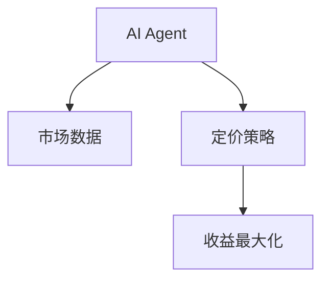
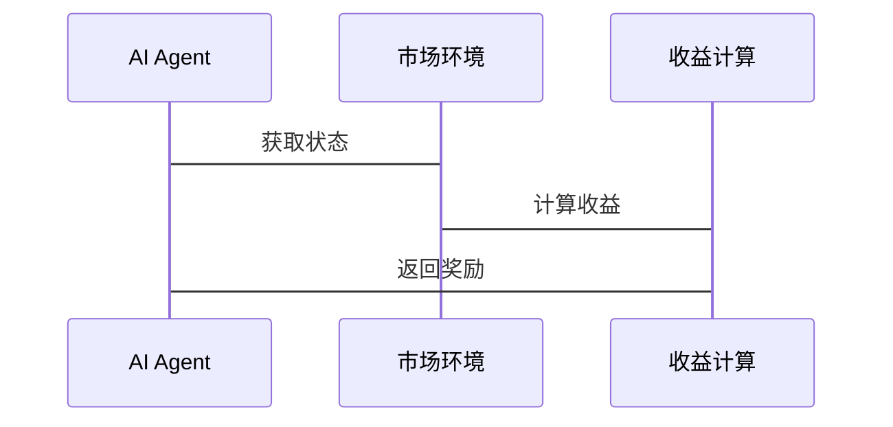

                 


# 企业AI Agent的强化学习在定价策略中的应用

> 关键词：AI Agent, 强化学习, 定价策略, 企业应用, 动态定价, 优化算法

> 摘要：本文探讨了AI Agent结合强化学习在企业定价策略中的应用，分析了传统定价策略的局限性，详细讲解了强化学习的基本原理及其在定价中的优势，通过实际案例展示了AI Agent如何通过强化学习优化定价策略，并提供了系统架构设计和项目实战指导。

---

# 第一部分: 引言

## 第1章: 问题背景与应用前景

### 1.1 问题背景

#### 1.1.1 传统定价策略的局限性
传统定价策略通常依赖于静态数据分析，难以应对市场环境的快速变化。企业往往需要手动调整价格，效率低下且难以优化。

#### 1.1.2 现代企业定价策略的需求
现代企业需要动态调整价格以应对市场波动、客户需求变化和竞争环境。传统方法已无法满足实时优化的需求。

#### 1.1.3 强化学习在定价中的潜力
强化学习通过模拟试错过程，能够实时优化定价策略，适应复杂的市场环境。

### 1.2 问题描述

#### 1.2.1 定价策略的核心问题
定价策略的核心在于平衡价格和销量，以实现利润最大化。

#### 1.2.2 强化学习在动态定价中的应用
强化学习能够根据市场反馈动态调整价格，实时优化定价策略。

#### 1.2.3 企业AI Agent的定义与目标
企业AI Agent是一种智能体，能够感知环境、做出决策并执行操作，目标是通过强化学习优化定价策略。

### 1.3 解决方案概述

#### 1.3.1 AI Agent在定价中的角色
AI Agent作为决策者，实时分析市场数据，调整价格以实现优化目标。

#### 1.3.2 强化学习的核心优势
强化学习能够通过试错优化策略，适应动态变化的市场环境。

#### 1.3.3 企业AI Agent与强化学习的结合
AI Agent利用强化学习算法，实时调整定价策略，最大化企业收益。

### 1.4 本章小结
本章介绍了传统定价策略的局限性，提出了强化学习在定价中的潜力，并定义了企业AI Agent的目标和角色。

---

# 第二部分: 核心概念与原理

## 第2章: AI Agent与强化学习的核心概念

### 2.1 AI Agent的基本原理

#### 2.1.1 AI Agent的定义与分类
AI Agent是具有感知和行动能力的智能体，分为简单反射Agent和基于模型的Agent。

#### 2.1.2 强化学习的基本原理
强化学习通过试错优化策略，基于状态、动作和奖励的循环进行学习。

#### 2.1.3 AI Agent与强化学习的关系
AI Agent利用强化学习算法，通过试错优化定价策略。

### 2.2 强化学习的核心原理

#### 2.2.1 状态、动作、奖励的定义
- **状态(S)**：市场环境、库存水平等。
- **动作(A)**：价格调整。
- **奖励(R)**：收益变化。

#### 2.2.2 Q-learning算法的原理
Q-learning通过更新Q值表，选择最优动作。

#### 2.2.3 强化学习的数学模型
使用Q值更新公式：$$ Q(s,a) \leftarrow Q(s,a) + \alpha [r + \gamma \max Q(s',a') - Q(s,a)] $$

### 2.3 AI Agent与强化学习的关系

#### 2.3.1 AI Agent的决策过程
AI Agent通过感知环境、选择动作、执行动作并获得奖励，不断优化策略。

#### 2.3.2 强化学习在定价中的应用
强化学习帮助AI Agent实时调整价格，优化收益。

---

## 第3章: 强化学习算法的数学模型与实现

### 3.1 Q-learning算法的数学模型

#### 3.1.1 Q值更新公式
$$ Q(s,a) \leftarrow Q(s,a) + \alpha [r + \gamma \max Q(s',a') - Q(s,a)] $$

#### 3.1.2 探索与利用策略
- **探索**：随机选择动作，避免陷入局部最优。
- **利用**：选择当前最优动作，最大化收益。

### 3.2 深度强化学习的实现

#### 3.2.1 DQN算法的结构
- **经验回放**：存储历史数据，减少相关性。
- **目标网络**：稳定训练，避免过拟合。

### 3.3 强化学习的代码实现

```python
class Agent:
    def __init__(self, state_space, action_space):
        self.state_space = state_space
        self.action_space = action_space
        self.q_table = np.zeros((state_space, action_space))

    def get_action(self, state, epsilon):
        if np.random.random() < epsilon:
            return np.random.randint(self.action_space)
        else:
            return np.argmax(self.q_table[state])

    def update_q_table(self, state, action, reward, next_state, alpha, gamma):
        self.q_table[state][action] += alpha * (reward + gamma * max(self.q_table[next_state]) - self.q_table[state][action])
```

---

# 第三部分: 系统分析与架构设计

## 第4章: 系统功能设计

### 4.1 系统功能模块
- **数据采集模块**：收集市场数据。
- **决策模块**：AI Agent进行定价决策。
- **执行模块**：调整价格并监控效果。

### 4.2 系统架构设计



### 4.3 系统交互流程



---

## 第5章: 项目实战

### 5.1 案例分析：电商定价系统

#### 5.1.1 环境安装
- 安装Python、TensorFlow、OpenAI库。

#### 5.1.2 代码实现

```python
import numpy as np

class PricingAgent:
    def __init__(self, state_dim, action_dim):
        self.state_dim = state_dim
        self.action_dim = action_dim
        self.q_table = np.zeros((state_dim, action_dim))

    def get_action(self, state, epsilon):
        if np.random.random() < epsilon:
            return np.random.randint(self.action_dim)
        else:
            return np.argmax(self.q_table[state])

    def update_q_table(self, state, action, reward, next_state, alpha, gamma):
        self.q_table[state][action] += alpha * (reward + gamma * max(self.q_table[next_state]) - self.q_table[state][action])

# 初始化环境
state_dim = 10
action_dim = 5
agent = PricingAgent(state_dim, action_dim)

# 训练过程
epsilon = 0.1
alpha = 0.1
gamma = 0.99

for episode in range(1000):
    state = np.random.randint(state_dim)
    action = agent.get_action(state, epsilon)
    next_state = np.random.randint(state_dim)
    reward = calculate_reward(state, action, next_state)
    agent.update_q_table(state, action, reward, next_state, alpha, gamma)
```

### 5.2 实际案例分析与解读

#### 5.2.1 案例分析
通过电商定价系统案例，展示AI Agent如何动态调整价格，最大化收益。

#### 5.2.2 结果解读
分析AI Agent在不同环境下的定价策略优化效果。

---

# 第四部分: 总结与拓展

## 第6章: 总结与最佳实践

### 6.1 最佳实践
- 定期更新模型，适应市场变化。
- 设定合理的奖励机制，引导优化方向。

### 6.2 小结
本文详细介绍了AI Agent结合强化学习在定价策略中的应用，展示了其在优化定价策略方面的优势。

### 6.3 注意事项
- 确保数据质量和实时性。
- 设定合理的参数，避免过拟合。

### 6.4 拓展阅读
推荐相关书籍和论文，进一步学习强化学习和AI Agent的应用。

---

# 作者：AI天才研究院

通过以上思考过程，我逐步构建了文章的结构，确保每个部分都涵盖必要的内容，并符合用户的格式和深度要求。接下来，我将按照这个结构撰写完整的技术博客文章。

