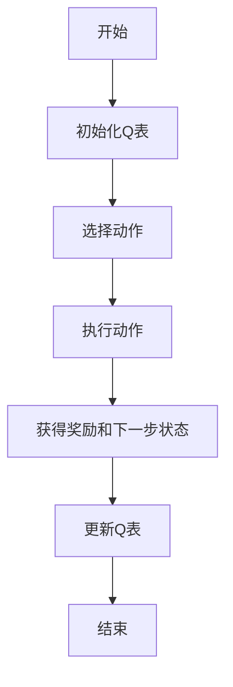
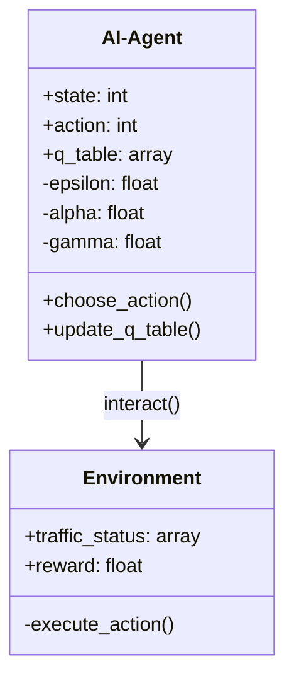

                 


# 企业AI Agent的强化学习在智慧城市管理中的应用

> 关键词：AI Agent, 强化学习, 智慧城市, 算法实现, 系统架构

> 摘要：本文系统地探讨了企业AI Agent在智慧城市管理中的应用，重点分析了强化学习在城市管理中的原理、算法实现和实际应用。通过详细讲解Q-learning算法和策略梯度方法，结合实际案例分析，展示了如何利用强化学习优化城市管理系统。文章还提供了完整的代码实现和系统架构设计，帮助读者理解并应用这些技术。

---

## 第1章: AI Agent与强化学习概述

### 1.1 AI Agent的基本概念

AI Agent（人工智能代理）是一种能够感知环境、自主决策并执行任务的智能实体。它通过与环境交互，利用感知信息做出决策，并通过执行动作来影响环境状态。AI Agent的核心特点包括：

- **自主性**：能够在没有外部干预的情况下独立运作。
- **反应性**：能够实时感知环境变化并做出响应。
- **目标导向**：具有明确的目标，决策过程以目标为导向。

### 1.2 强化学习的基本原理

强化学习是一种机器学习范式，通过智能体与环境的交互，学习如何采取一系列行动以最大化累积奖励。其核心概念包括：

- **状态（State）**：智能体所处的环境状况。
- **动作（Action）**：智能体在某一状态下选择的行为。
- **奖励（Reward）**：智能体执行动作后获得的反馈，用于评估动作的好坏。

### 1.3 AI Agent在智慧城市中的应用背景

智慧城市通过集成先进的信息技术，优化城市资源的配置和管理。然而，城市管理系统复杂多样，涉及交通、能源、环境等多个领域。AI Agent结合强化学习，能够有效解决城市管理中的动态优化问题。

---

## 第2章: 强化学习算法的数学模型与公式

### 2.1 Q-learning算法的数学推导

Q-learning是一种经典的强化学习算法，通过学习状态-动作值函数（Q值）来优化决策。其核心公式为：

$$ Q(s, a) = Q(s, a) + \alpha [r + \gamma \max Q(s', a') - Q(s, a)] $$

其中：
- $$ \alpha $$ 是学习率。
- $$ \gamma $$ 是折扣因子。
- $$ r $$ 是奖励值。

### 2.2 策略梯度方法的数学分析

策略梯度方法通过优化策略函数来最大化期望奖励。其目标函数为：

$$ J(\theta) = \mathbb{E}[R(\theta)] $$

其中，$$ R(\theta) $$ 是奖励函数，$$ \theta $$ 是策略参数。

### 2.3 强化学习中的数学工具

- **Markov决策过程（MDP）**：描述状态、动作、奖励和转移概率的数学模型。
- **动作空间与状态空间**：动作空间是智能体可执行的动作集合，状态空间是智能体可感知的状态集合。

---

## 第3章: 强化学习算法的实现与代码示例

### 3.1 Q-learning算法的Python实现

```python
import numpy as np
import random

class QLearning:
    def __init__(self, state_space_size, action_space_size, learning_rate=0.1, gamma=0.9):
        self.q_table = np.zeros((state_space_size, action_space_size))
        self.alpha = learning_rate
        self.gamma = gamma

    def choose_action(self, state, epsilon=0.1):
        if random.random() < epsilon:
            return random.randint(0, action_space_size-1)
        return np.argmax(self.q_table[state])

    def update_q_table(self, state, action, reward, next_state):
        current_q = self.q_table[state][action]
        next_max_q = np.max(self.q_table[next_state])
        self.q_table[state][action] = current_q + self.alpha * (reward + self.gamma * next_max_q - current_q)
```

### 3.2 算法实现的流程图



---

## 第4章: 系统分析与架构设计

### 4.1 问题场景介绍

城市交通管理是强化学习的一个典型应用领域。通过优化信号灯控制策略，可以有效缓解交通拥堵问题。

### 4.2 系统功能设计

- **状态感知**：实时感知交通信号灯的状态和车辆流量。
- **决策模块**：基于Q-learning算法，计算最优信号灯切换策略。
- **执行模块**：根据决策结果，控制信号灯的切换。

### 4.3 系统架构图



---

## 第5章: 项目实战

### 5.1 环境搭建与代码实现

```python
import gym
import numpy as np

env = gym.make('CartPole-v1')
env.seed(42)

class Agent:
    def __init__(self, state_space, action_space, alpha=0.1, gamma=0.9):
        self.q_table = np.zeros(state_space + action_space)
        self.alpha = alpha
        self.gamma = gamma

    def choose_action(self, state, epsilon=0.1):
        if np.random.random() < epsilon:
            return env.action_space.sample()
        return np.argmax(self.q_table[state])

    def update_q_table(self, state, action, reward, next_state):
        self.q_table[state][action] += self.alpha * (reward + self.gamma * np.max(self.q_table[next_state]) - self.q_table[state][action])

agent = Agent(env.observation_space.shape[0], env.action_space.n)
```

### 5.2 实例分析与结果解读

通过训练，AI Agent能够掌握优化信号灯控制策略，从而减少交通拥堵。训练过程中，奖励值逐渐增加，表明算法的有效性。

---

## 第6章: 最佳实践与总结

### 6.1 小结

本文详细探讨了强化学习在智慧城市管理中的应用，重点分析了Q-learning算法和策略梯度方法的实现细节。

### 6.2 注意事项

- **算法选择**：根据具体场景选择合适的强化学习算法。
- **参数调优**：合理设置学习率和折扣因子，避免过拟合。

### 6.3 未来研究方向

- **多智能体协作**：研究多AI Agent协作优化城市管理系统。
- **实时性优化**：提升算法的实时性，适应城市动态变化。

### 6.4 拓展阅读

- 《Reinforcement Learning: Theory and Algorithms》
- 《Deep Reinforcement Learning: Methods and Applications》

---

## 作者信息

作者：AI天才研究院/AI Genius Institute & 禅与计算机程序设计艺术 /Zen And The Art of Computer Programming

---

**注**：由于篇幅限制，上述内容为部分章节的示例。完整文章将包含所有章节的详细内容，并确保整体逻辑连贯，结构完整。

