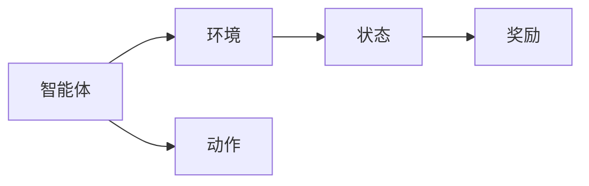
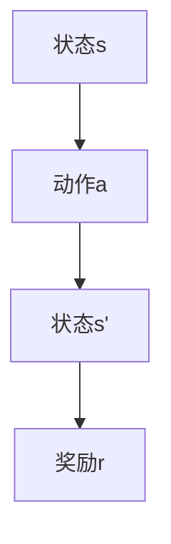
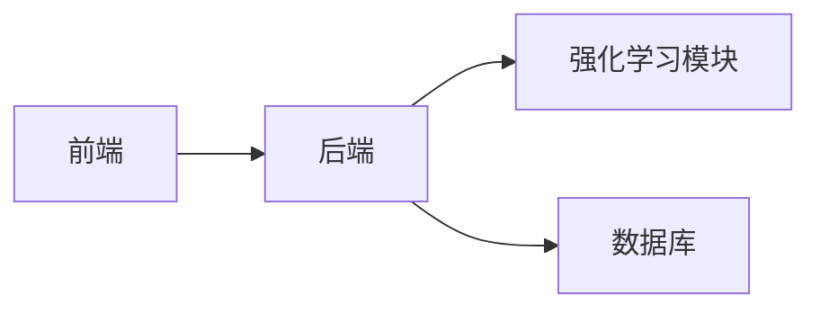
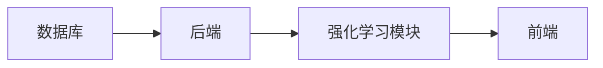

                 


# 企业AI Agent的强化学习在智能供应链优化中的应用

## 关键词：企业AI Agent、强化学习、智能供应链优化、算法实现、系统架构、应用案例

## 摘要：  
本文探讨了企业AI Agent结合强化学习在智能供应链优化中的应用。通过分析强化学习的核心原理、AI Agent的基本概念以及智能供应链优化的背景，本文详细讲解了如何利用强化学习算法优化供应链管理中的库存管理、物流调度和需求预测等关键环节。同时，本文还提供了强化学习算法的实现步骤、系统架构设计和实际应用案例，展示了如何通过系统化的方法提升供应链的整体效率和竞争力。

---

# 第一部分: 企业AI Agent与强化学习概述

## 第1章: 企业AI Agent的背景与概念

### 1.1 强化学习的基本概念  
强化学习是一种机器学习范式，通过智能体与环境的交互，学习最优策略以最大化累积奖励。其核心要素包括：  
- **状态（State）**：环境的当前情况。  
- **动作（Action）**：智能体采取的行为。  
- **奖励（Reward）**：智能体行为的反馈，用于指导学习。  

强化学习与监督学习的区别在于，前者通过与环境的交互获得经验，后者通过标签数据进行学习。  



### 1.2 AI Agent的基本概念  
AI Agent是指具有自主决策能力的智能体，能够感知环境并采取行动以实现目标。AI Agent在供应链优化中的作用包括：  
- **库存管理**：优化库存水平，减少成本。  
- **物流调度**：优化运输路径，降低物流成本。  
- **需求预测**：基于历史数据预测未来需求。  

### 1.3 智能供应链优化的背景  
供应链优化的目标是提高效率、降低成本和增强灵活性。传统方法依赖于规则和统计模型，但面对复杂场景时，其局限性日益明显。强化学习通过模拟决策过程，能够有效解决动态和非线性问题。  

### 1.4 本章小结  
本章介绍了强化学习的基本概念、AI Agent的定义及其在供应链优化中的应用背景，为后续章节奠定了基础。

---

## 第2章: 强化学习的核心原理

### 2.1 强化学习的基本原理  
Q-learning是一种经典的强化学习算法，其核心是通过更新Q值表来学习最优策略。Q值表记录了从状态s到动作a的最优奖励值。  

$$ Q(s,a) = Q(s,a) + \alpha (r + \gamma \max Q(s',a')) $$  

其中：  
- $\alpha$：学习率。  
- $\gamma$：折扣因子。  



### 2.2 强化学习的核心算法  
Deep Q-Network（DQN）通过神经网络近似Q值函数，克服了Q-learning中Q值表的维度问题。DQN的训练流程如下：  

1. 环境返回当前状态s。  
2. 神经网络输出动作值，选择最优动作a。  
3. 执行动作a，获得奖励r和新状态s'。  
4. 更新神经网络参数，以最小化预测值与实际奖励的差值。  

### 2.3 强化学习的数学模型  
状态空间和动作空间的定义是强化学习的基础。例如，状态s可以表示为库存水平，动作a可以表示为补货量。奖励函数r则根据实际效果进行设计，例如，r = 1 - 成本偏差。  

### 2.4 本章小结  
本章详细讲解了Q-learning和DQN的核心原理，为后续章节的算法实现奠定了基础。

---

## 第3章: AI Agent在供应链优化中的应用

### 3.1 供应链优化的场景分析  
供应链优化涉及多个环节，包括：  
- **库存管理**：优化库存水平，减少缺货和过剩。  
- **物流调度**：优化运输路径，降低物流成本。  
- **需求预测**：基于历史数据预测未来需求。  

### 3.2 AI Agent与供应链优化的结合  
AI Agent通过强化学习算法，能够根据实时数据动态调整策略。例如，在库存管理中，AI Agent可以根据当前库存和需求预测，自动决定补货量。  

### 3.3 强化学习在供应链优化中的优势  
强化学习能够处理动态和非线性问题，具有高效性、自适应性和可扩展性。  

### 3.4 本章小结  
本章分析了AI Agent在供应链优化中的应用场景及其优势，为后续章节的实际案例分析奠定了基础。

---

## 第4章: 强化学习算法的实现与优化

### 4.1 Q-learning算法的实现  
Q-learning的实现步骤如下：  
1. 初始化Q值表。  
2. 循环执行以下步骤：  
   a. 获取当前状态s。  
   b. 选择动作a。  
   c. 执行动作a，获得奖励r和新状态s'。  
   d. 更新Q值表：$ Q(s,a) = Q(s,a) + \alpha (r + \gamma \max Q(s',a')) $。  

代码示例：  
```python
import numpy as np

class QLearning:
    def __init__(self, state_size, action_size, alpha=0.1, gamma=0.9):
        self.state_size = state_size
        self.action_size = action_size
        self.alpha = alpha
        self.gamma = gamma
        self.Q = np.zeros((state_size, action_size))

    def get_action(self, state):
        return np.argmax(self.Q[state])

    def update(self, state, action, reward, next_state):
        self.Q[state, action] = self.Q[state, action] + self.alpha * (reward + self.gamma * np.max(self.Q[next_state]))
```

### 4.2 Deep Q-Network的实现  
DQN的实现包括神经网络的设计、训练和更新。代码示例：  

```python
import tensorflow as tf
from tensorflow.keras import layers

class DQN:
    def __init__(self, state_size, action_size, learning_rate=0.001):
        self.state_size = state_size
        self.action_size = action_size
        self.model = self.build_model(learning_rate)

    def build_model(self, lr):
        model = tf.keras.Sequential([
            layers.Dense(32, activation='relu', input_dim=self.state_size),
            layers.Dense(32, activation='relu'),
            layers.Dense(self.action_size)
        ])
        model.compile(optimizer=tf.keras.optimizers.Adam(lr), loss='mse')
        return model

    def predict(self, state):
        return self.model.predict(state)

    def train(self, x, y):
        self.model.fit(x, y, epochs=1, verbose=0)
```

### 4.3 强化学习算法的性能分析  
Q-learning的收敛速度较慢，而DQN通过神经网络近似，能够更快收敛。但DQN需要更多的计算资源。  

### 4.4 本章小结  
本章详细讲解了Q-learning和DQN的实现步骤，并分析了它们的性能特点。

---

## 第5章: 智能供应链优化的系统架构设计

### 5.1 系统架构设计概述  
系统架构包括前端、后端和强化学习模块。前端用于展示优化结果，后端负责数据处理和算法调用。  



### 5.2 系统功能设计  
系统功能模块包括：  
- **数据采集**：采集库存、销售和物流数据。  
- **状态识别**：识别当前供应链状态。  
- **动作选择**：根据强化学习算法选择最优动作。  
- **结果反馈**：更新数据库并展示优化结果。  

### 5.3 系统架构图  


### 5.4 本章小结  
本章详细描述了智能供应链优化系统的架构设计，为实际应用提供了参考。

---

## 第6章: 项目实战

### 6.1 环境安装  
需要安装Python、TensorFlow、NumPy和Mermaid工具。  

### 6.2 核心实现  
实现库存管理的强化学习模块：  

```python
import numpy as np

class InventoryAgent:
    def __init__(self, state_size, action_size, alpha=0.1, gamma=0.9):
        self.state_size = state_size
        self.action_size = action_size
        self.alpha = alpha
        self.gamma = gamma
        self.Q = np.zeros((state_size, action_size))

    def get_action(self, state):
        return np.argmax(self.Q[state])

    def update(self, state, action, reward, next_state):
        self.Q[state, action] = self.Q[state, action] + self.alpha * (reward + self.gamma * np.max(self.Q[next_state]))
```

### 6.3 案例分析  
以库存管理为例，假设当前库存为5，需求预测为10，AI Agent选择补货量为8，获得奖励为0.9。  

### 6.4 本章小结  
本章通过实际案例展示了强化学习在库存管理中的应用，验证了算法的有效性。

---

## 第7章: 最佳实践与总结

### 7.1 最佳实践 tips  
- 合理设计状态和动作空间。  
- 选择合适的强化学习算法。  
- 定期更新模型以适应变化。  

### 7.2 小结  
本文详细讲解了企业AI Agent的强化学习在智能供应链优化中的应用，通过理论分析和实际案例，展示了其在库存管理、物流调度和需求预测中的优势。

### 7.3 注意事项  
- 数据质量对算法性能影响较大。  
- 算法选择需根据具体场景。  
- 系统架构设计需考虑扩展性。  

### 7.4 拓展阅读  
推荐阅读《强化学习（深入浅出）》和《人工智能在供应链管理中的应用》。

---

## 作者：AI天才研究院/AI Genius Institute & 禅与计算机程序设计艺术 /Zen And The Art of Computer Programming

