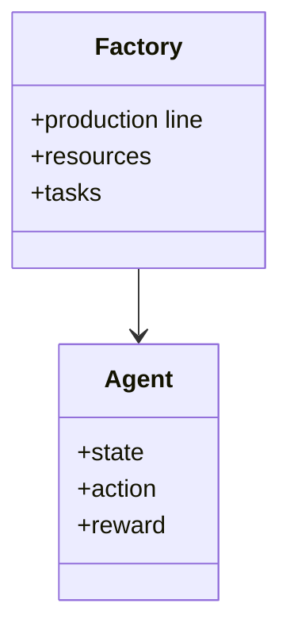

                 


# 企业AI Agent的强化学习在智能工厂调度中的应用

> 关键词：企业AI Agent，强化学习，智能工厂调度，数学模型，算法实现，系统架构设计

> 摘要：本文系统性地探讨了企业AI Agent在智能工厂调度中的应用，详细介绍了强化学习的基本原理、算法实现、数学模型以及在智能工厂调度中的实际应用。文章通过理论分析与实践案例相结合的方式，深入讲解了强化学习在智能工厂调度中的优势与挑战，为读者提供了从理论到实践的全面指导。

---

## 第1章 强化学习与AI Agent概述

### 1.1 强化学习的基本概念

#### 1.1.1 强化学习的定义
强化学习（Reinforcement Learning，RL）是一种机器学习范式，通过智能体与环境的交互，学习最优策略以最大化累积奖励。与监督学习和无监督学习不同，强化学习强调动态交互和实时反馈。

#### 1.1.2 强化学习的核心要素
强化学习的核心要素包括：
1. **智能体（Agent）**：执行动作的主体。
2. **环境（Environment）**：智能体所处的外部世界。
3. **状态（State）**：环境在某一时刻的描述。
4. **动作（Action）**：智能体在某一状态下采取的行为。
5. **奖励（Reward）**：环境对智能体行为的反馈。

#### 1.1.3 强化学习与监督学习的区别
| 对比维度 | 监督学习 | 强化学习 |
|----------|----------|----------|
| 数据来源 | 标签数据 | 环境反馈 |
| 学习目标 | 预测准确 | 最大化奖励 |
| 适用场景 | 分类、回归 | 控制、游戏 |

### 1.2 AI Agent的定义与特点

#### 1.2.1 AI Agent的定义
AI Agent是一种智能实体，能够感知环境、自主决策并执行动作，以实现特定目标。

#### 1.2.2 AI Agent的核心特点
1. **自主性**：AI Agent能够自主决策。
2. **反应性**：能够实时感知环境并做出反应。
3. **目标导向性**：以目标为导向，优化行为。
4. **学习能力**：能够通过学习提高性能。

#### 1.2.3 AI Agent与传统AI的区别
| 对比维度 | 传统AI | AI Agent |
|----------|---------|----------|
| 行为方式 | 被动计算 | 主动决策 |
| 适应性 | 固定规则 | 动态调整 |
| 应用场景 | 数据处理 | 自动控制 |

### 1.3 强化学习在AI Agent中的应用

#### 1.3.1 强化学习在AI Agent中的作用
强化学习为AI Agent提供了动态决策的能力，使其能够在复杂环境中优化行为。

#### 1.3.2 强化学习与AI Agent结合的优势
1. **动态适应性**：强化学习使AI Agent能够实时调整策略。
2. **自主决策**：强化学习赋予AI Agent自主决策的能力。
3. **优化性能**：通过强化学习，AI Agent能够实现性能的最优。

#### 1.3.3 强化学习在智能工厂调度中的潜力
智能工厂调度涉及复杂的资源分配和任务调度问题，强化学习能够通过动态调整策略，优化生产效率。

---

## 第2章 智能工厂调度的背景与挑战

### 2.1 智能工厂的基本概念

#### 2.1.1 智能工厂的定义
智能工厂是通过物联网、大数据和人工智能等技术实现智能化生产的现代工厂。

#### 2.1.2 智能工厂的核心技术
1. **物联网技术**：实现设备的互联互通。
2. **大数据分析**：支持数据驱动的决策。
3. **人工智能**：实现智能化控制和优化。

#### 2.1.3 智能工厂与传统工厂的区别
| 对比维度 | 传统工厂 | 智能工厂 |
|----------|----------|----------|
| 生产方式 | 批量生产 | 智能化、定制化 |
| 控制方式 | 人工控制 | 自动化、智能化 |
| 数据利用 | 简单记录 | 数据分析与优化 |

### 2.2 智能工厂调度的挑战

#### 2.2.1 调度问题的复杂性
智能工厂的调度问题涉及多目标优化，例如生产效率、资源利用率等。

#### 2.2.2 调度问题的多样性
不同生产场景下的调度需求多样化，需要灵活的解决方案。

#### 2.2.3 调度问题的动态性
生产环境动态变化，调度策略需要实时调整。

### 2.3 强化学习在智能工厂调度中的应用前景

#### 2.3.1 强化学习在调度问题中的优势
强化学习能够处理动态环境下的优化问题，适合智能工厂的复杂调度场景。

#### 2.3.2 强化学习在智能工厂调度中的潜在应用
1. **任务分配优化**：通过强化学习优化任务分配策略。
2. **资源调度优化**：动态调整资源分配，提高效率。
3. **生产流程优化**：通过强化学习优化生产流程。

#### 2.3.3 强化学习在智能工厂调度中的挑战
1. **计算复杂度**：强化学习算法的计算复杂度较高。
2. **环境建模**：需要准确建模复杂的生产环境。
3. **实时性要求**：智能工厂调度需要实时决策，对算法的响应速度提出高要求。

---

## 第3章 企业AI Agent的强化学习模型

### 3.1 强化学习的基本原理

#### 3.1.1 强化学习的三要素
强化学习的三要素包括：智能体、环境和交互。

#### 3.1.2 强化学习的数学模型
强化学习的数学模型包括状态、动作、奖励和策略的定义。

#### 3.1.3 强化学习的算法框架
强化学习的算法框架包括Q-learning、Deep Q-Network和Policy Gradient等。

### 3.2 AI Agent的强化学习模型

#### 3.2.1 AI Agent的强化学习框架
AI Agent通过强化学习框架与环境交互，学习最优策略。

#### 3.2.2 强化学习在AI Agent中的应用
强化学习使AI Agent能够在复杂环境中实现自主决策和优化。

#### 3.2.3 强化学习与AI Agent结合的案例
通过具体案例分析，展示强化学习在AI Agent中的实际应用。

### 3.3 强化学习在智能工厂调度中的应用模型

#### 3.3.1 智能工厂调度的强化学习模型
通过强化学习模型实现智能工厂的优化调度。

#### 3.3.2 强化学习在调度问题中的具体应用
展示强化学习在智能工厂调度中的具体应用场景。

#### 3.3.3 强化学习在智能工厂调度中的优化策略
通过优化策略提升智能工厂的生产效率和资源利用率。

---

## 第4章 强化学习算法的数学模型与公式

### 4.1 强化学习的基本算法

#### 4.1.1 Q-learning算法
Q-learning是一种经典的强化学习算法，通过更新Q值表实现最优策略。

#### 4.1.2 Deep Q-Network算法
Deep Q-Network结合深度学习和强化学习，通过神经网络逼近Q值函数。

#### 4.1.3 Policy Gradient算法
Policy Gradient通过优化策略直接更新策略参数，实现最优行为。

### 4.2 强化学习算法的数学模型

#### 4.2.1 Q-learning的数学模型
Q值更新公式：
$$ Q(s, a) = Q(s, a) + \alpha [r + \max Q(s', a') - Q(s, a)] $$

#### 4.2.2 Deep Q-Network的数学模型
神经网络逼近Q值函数：
$$ Q(s, a) = \theta \cdot \phi(s, a) $$

#### 4.2.3 Policy Gradient的数学模型
策略梯度更新公式：
$$ \nabla J(\theta) = \mathbb{E}[ \nabla \log \pi(a|s) \cdot Q(s, a)] $$

---

## 第5章 系统分析与架构设计

### 5.1 问题场景介绍
智能工厂调度问题涉及多目标优化和动态调整。

### 5.2 项目介绍
介绍强化学习在智能工厂调度中的具体应用项目。

### 5.3 系统功能设计
通过领域模型展示系统功能模块。

#### 5.3.1 领域模型


### 5.4 系统架构设计
展示系统架构设计的mermaid图。

#### 5.4.1 系统架构
```mermaid
archiDiagram
    component Agent {
        +Controller
        +Model
        +Environment
    }
    component Environment {
        +Production Line
        +Resources
        +Tasks
    }
```

### 5.5 系统接口设计
定义系统接口设计和交互流程。

### 5.6 系统交互设计
展示系统交互流程的mermaid图。

---

## 第6章 项目实战

### 6.1 环境安装
介绍强化学习环境的安装步骤。

### 6.2 核心代码实现
展示强化学习算法的核心代码。

#### 6.2.1 Q-learning实现
```python
class QLearning:
    def __init__(self, state_space, action_space):
        self.q_table = np.zeros(state_space + action_space)
```

### 6.3 案例分析
通过具体案例分析强化学习在智能工厂调度中的应用。

### 6.4 项目小结
总结项目实现的关键点和经验教训。

---

## 第7章 最佳实践与小结

### 7.1 小结
总结全文的核心内容和主要结论。

### 7.2 注意事项
提醒读者在实际应用中的注意事项和常见问题。

### 7.3 拓展阅读
推荐相关领域的深度学习资源。

---

## 作者信息

作者：AI天才研究院/AI Genius Institute & 禅与计算机程序设计艺术 /Zen And The Art of Computer Programming

