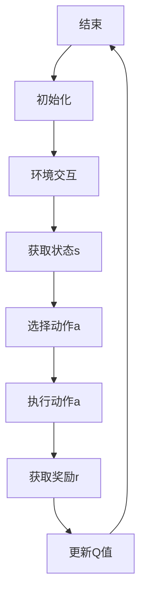
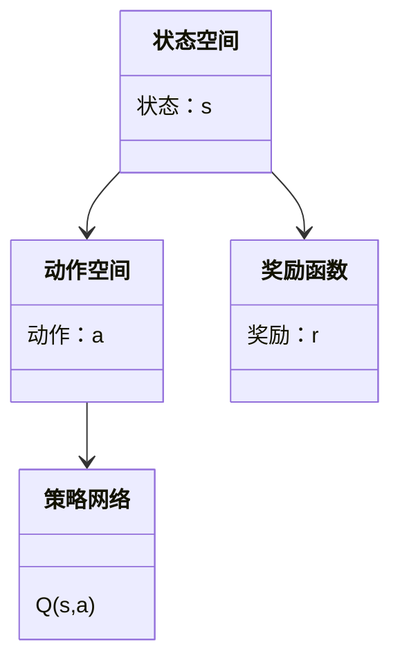
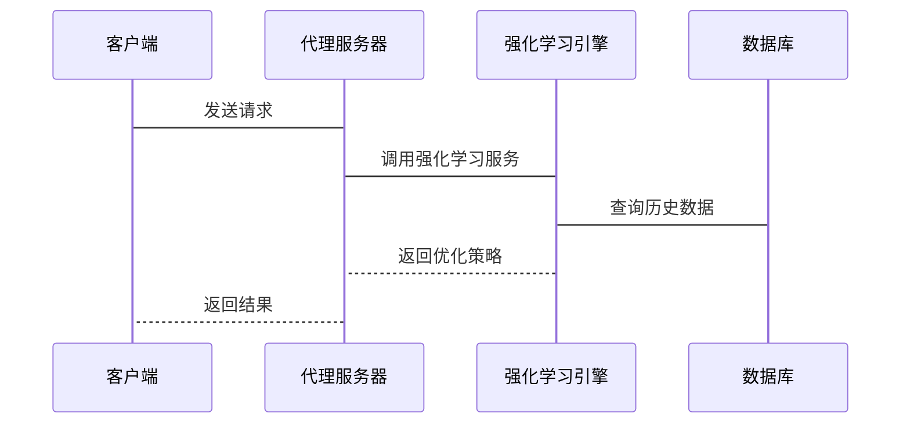

                 


# 企业AI Agent的强化学习在智能建筑管理中的应用

> 关键词：企业AI Agent，强化学习，智能建筑管理，算法原理，系统架构

> 摘要：本文探讨了企业AI Agent在智能建筑管理中的应用，重点分析了强化学习在优化建筑管理决策中的作用。文章从强化学习的基本概念、算法原理、系统架构设计，到项目实战和优化建议，详细介绍了如何利用AI技术提升智能建筑的管理水平。

---

## 第一部分：企业AI Agent与强化学习基础

### 第1章：企业AI Agent与强化学习概述

#### 1.1 企业AI Agent的定义与特点
- **1.1.1 什么是企业AI Agent**  
  企业AI Agent（Artificial Intelligence Agent）是一种能够感知环境、做出决策并执行操作的智能体。它通常用于企业级应用中，帮助组织优化流程、提高效率并降低成本。

- **1.1.2 AI Agent的核心特点**  
  - **自主性**：能够自主决策和行动。  
  - **反应性**：能够实时感知环境并做出反应。  
  - **目标导向**：基于目标进行决策和优化。  
  - **学习能力**：通过数据和经验不断优化自身行为。

- **1.1.3 企业AI Agent的应用场景**  
  - 智能建筑管理：优化能源使用、设备调度和空间利用。  
  - 供应链管理：优化库存、物流和订单处理。  
  - 客户服务：智能客服机器人、个性化推荐系统。  

#### 1.2 强化学习的基本概念
- **1.2.1 强化学习的定义**  
  强化学习（Reinforcement Learning, RL）是一种机器学习范式，通过智能体与环境的交互，学习如何在特定环境中做出最优决策。智能体通过试错的方式，基于当前状态和历史经验，选择最优的动作以最大化累积奖励。

- **1.2.2 强化学习的核心要素**  
  - **状态（State）**：环境中的当前情况，表示为$S$。  
  - **动作（Action）**：智能体可以执行的操作，表示为$A$。  
  - **奖励（Reward）**：智能体执行动作后获得的反馈，表示为$r$。  
  - **策略（Policy）**：智能体选择动作的概率分布，表示为$\pi(a|s)$。  
  - **价值函数（Value Function）**：评估状态或状态-动作对的优劣，表示为$V(s)$或$Q(s,a)$。

- **1.2.3 强化学习与监督学习的区别**  
  - 监督学习：基于标记的训练数据，学习输入到输出的映射关系。  
  - 强化学习：基于与环境的交互，学习最优策略。  

#### 1.3 强化学习在智能建筑管理中的应用前景
- **1.3.1 智能建筑管理的定义与特点**  
  智能建筑管理（Smart Building Management）是指利用物联网、大数据和人工智能技术，对建筑内的设备、能源和空间进行智能化管理，以实现节能减排、提高效率和优化用户体验的目标。

- **1.3.2 强化学习在智能建筑管理中的优势**  
  - 能够处理动态变化的环境，优化实时决策。  
  - 可以通过历史数据不断优化策略，提升管理效率。  
  - 能够在复杂环境中找到最优解决方案。  

- **1.3.3 应用中的挑战与机遇**  
  - **挑战**：环境复杂、不确定性高、数据获取困难。  
  - **机遇**：技术进步（如深度学习、强化学习）为智能建筑管理提供了新的可能性。  

---

## 第二部分：强化学习算法原理

### 第2章：Q-learning算法
- **2.1 Q-learning的基本原理**  
  Q-learning是一种基于值函数的强化学习算法，通过学习状态-动作对的Q值（$Q(s,a)$）来优化决策。智能体通过与环境交互，更新Q值以最大化未来奖励。

- **2.2 Q值更新的数学公式**  
  $$ Q(s,a) = Q(s,a) + \alpha (r + \gamma \max Q(s',a') - Q(s,a)) $$
  - $\alpha$：学习率，控制更新步长。  
  - $\gamma$：折扣因子，平衡当前奖励和未来奖励。  

- **2.3 Q-learning的收敛性分析**  
  在离散状态和动作空间中，Q-learning算法可以收敛到最优策略，前提是满足探索-利用平衡和充分的环境交互。  

### 第3章：Deep Q-Network (DQN)算法
- **3.1 DQN的基本原理**  
  DQN通过深度神经网络近似Q值函数，解决了传统Q-learning在高维状态空间中的计算难题。智能体通过经验回放机制（Experience Replay）学习，减少数据偏差。

- **3.2 神经网络在Q值计算中的应用**  
  深度神经网络（DNN）用于近似$Q(s,a)$函数，输入为状态$s$，输出为动作$a$的Q值。  

- **3.3 经验回放机制的实现**  
  智能体将经历的状态、动作、奖励和新状态存储在经验池中，随机采样以减少相关性，提高学习效率。  

### 第4章：算法流程图


---

## 第三部分：智能建筑管理中的系统分析与架构设计

### 第5章：系统分析与架构设计

#### 5.1 系统场景介绍
- 智能建筑管理系统的典型场景包括：  
  - 能源管理：优化电力、燃气等能源的使用。  
  - 设备调度：协调电梯、空调等设备的运行。  
  - 空间利用：优化会议室、办公室等空间的使用效率。  

#### 5.2 系统功能设计
- **5.2.1 领域模型（Domain Model）**  
  使用Mermaid类图表示系统的实体和关系。  



- **5.2.2 系统架构设计**  
  使用Mermaid架构图展示系统的整体结构。  


- **5.2.3 系统接口设计**  
  - **API接口**：提供RESTful API，供客户端调用强化学习服务。  
  - **数据接口**：与建筑管理系统（BMS）集成，获取实时数据。  

- **5.2.4 系统交互流程**  
  使用Mermaid序列图展示系统交互流程。  



---

## 第四部分：项目实战与优化建议

### 第6章：项目实战

#### 6.1 环境安装
- 安装必要的Python库：  
  ```bash
  pip install numpy tensorflow-gpu gym
  ```

#### 6.2 核心实现代码
- 示例代码：基于DQN算法的智能建筑能源管理。  

```python
import gym
import numpy as np

class DQN:
    def __init__(self, state_space, action_space):
        self.state_space = state_space
        self.action_space = action_space
        self.learning_rate = 0.01
        self.discount_factor = 0.99
        self.epsilon = 1.0

    def epsilon_greedy_policy(self, state):
        if np.random.random() < self.epsilon:
            return np.random.randint(self.action_space)
        else:
            return np.argmax(self.model.predict(state))

    def update_epsilon(self):
        self.epsilon = max(0.01, self.epsilon * 0.99)

# 初始化环境
env = gym.make('EnergyManagement-v0')
agent = DQN(env.observation_space.shape[0], env.action_space.n)

# 训练过程
for episode in range(1000):
    state = env.reset()
    total_reward = 0
    done = False
    while not done:
        action = agent.epsilon_greedy_policy(state)
        next_state, reward, done, _ = env.step(action)
        agent.update(state, action, reward, next_state)
        total_reward += reward
    agent.update_epsilon()
```

#### 6.3 代码分析与优化建议
- **代码分析**：  
  代码实现了基于DQN的强化学习算法，用于智能建筑的能源管理。通过与环境的交互，智能体不断更新策略以优化能源使用效率。  

- **优化建议**：  
  - 增加经验回放机制，提高学习效率。  
  - 使用更复杂的神经网络结构（如CNN、Transformer）来近似Q值函数。  
  - 引入多智能体协同学习，优化多设备协同工作。  

---

## 第五部分：总结与展望

### 第7章：总结与展望

#### 7.1 本章总结
- 本文详细介绍了企业AI Agent在智能建筑管理中的应用，重点分析了强化学习的算法原理和系统架构设计。通过项目实战，展示了如何利用强化学习优化智能建筑的能源管理和设备调度。

#### 7.2 未来展望
- **算法优化**：探索更高效的强化学习算法，如Actor-Critic、SAC等。  
- **多智能体协同**：研究多智能体在智能建筑管理中的协同优化问题。  
- **边缘计算结合**：将强化学习应用于边缘计算环境，提升实时性和响应速度。  

#### 7.3 最佳实践建议
- **小结**：强化学习在智能建筑管理中具有广阔的应用前景，但仍需解决环境复杂性和数据获取等问题。  
- **注意事项**：在实际应用中，需注意算法的收敛性、计算资源的消耗以及系统的实时性要求。  
- **拓展阅读**：建议深入学习强化学习的经典算法（如DQN、PPO）和最新研究成果（如多智能体强化学习）。  

---

## 作者信息

作者：AI天才研究院（AI Genius Institute） & 禅与计算机程序设计艺术（Zen And The Art of Computer Programming）

---

**[完]**

