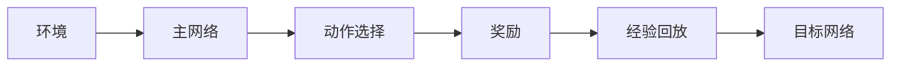
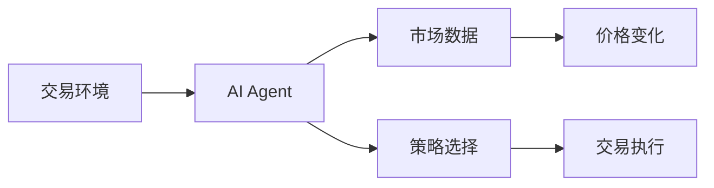

                 


# 企业AI Agent的强化学习在自动化交易策略中的高频应用

> 关键词：AI Agent, 强化学习, 自动化交易策略, 高频交易, 机器学习算法

> 摘要：本文深入探讨了AI Agent在高频交易中的应用，结合强化学习算法，详细分析了其在自动化交易策略中的高频应用场景。通过系统化的分析与设计，从理论到实践，全面揭示了AI Agent如何通过强化学习实现高效的交易策略优化。

---

## 第一部分: AI Agent与强化学习的背景

### 第1章: AI Agent的基本概念

#### 1.1 AI Agent的定义与特点
AI Agent（人工智能代理）是一种能够感知环境、做出决策并采取行动的智能实体。其特点包括：
- **自主性**：能够在没有外部干预的情况下自主运行。
- **反应性**：能够根据环境的变化实时调整行为。
- **目标导向**：通过设定目标来优化决策过程。

#### 1.2 AI Agent的核心要素与组成
AI Agent的核心要素包括：
- **感知模块**：负责接收环境中的信息。
- **决策模块**：基于感知信息做出决策。
- **执行模块**：将决策转化为具体行动。

#### 1.3 AI Agent的分类与应用场景
AI Agent可以根据智能水平分为：
- **反应式AI Agent**：基于当前环境信息做出反应。
- **认知式AI Agent**：具备复杂推理和规划能力。

应用场景包括：金融交易、游戏AI、自动驾驶等。

### 第2章: 强化学习的基本原理

#### 2.1 强化学习的定义与特点
强化学习是一种通过试错方式来优化决策的机器学习方法。其特点包括：
- **目标导向**：通过最大化累积奖励来优化策略。
- **实时反馈**：通过奖励信号调整行为。

#### 2.2 强化学习的核心概念
- **状态（State）**：环境的当前情况。
- **动作（Action）**：AI Agent可以执行的操作。
- **奖励（Reward）**：对动作的反馈，用于指导优化方向。

#### 2.3 强化学习与监督学习的区别
| 概念 | 监督学习 | 强化学习 |
|------|----------|----------|
| 数据 | 标签化数据 | 状态和奖励 |
| 目标 | 模拟人类经验 | 最大化累积奖励 |

### 第3章: 高频交易与自动化策略的背景

#### 3.1 高频交易的定义与特点
高频交易是指在极短时间内进行的大量交易行为，其特点包括：
- **高速性**：交易决策必须在毫秒级别完成。
- **自动化**：依赖算法自动执行交易。

#### 3.2 自动化交易策略的必要性
- **减少人为干扰**：避免情绪化决策。
- **提高效率**：快速响应市场变化。
- **降低成本**：通过自动化减少人工成本。

#### 3.3 AI Agent在高频交易中的优势
- **实时决策能力**：能够快速响应市场变化。
- **复杂策略优化**：通过强化学习优化交易策略。

---

## 第二部分: 强化学习的核心概念与数学模型

### 第4章: 强化学习的数学模型

#### 4.1 状态空间与动作空间的定义
- **状态空间**：表示环境中的所有可能状态。
- **动作空间**：表示AI Agent可以执行的所有动作。

| 概念 | 定义 | 示例 |
|------|------|------|
| 状态空间 | 股票价格、市场情绪等 | 股票价格、市场情绪等 |
| 动作空间 | 买入、卖出、持有等 | 买入、卖出、持有等 |

#### 4.2 奖励函数的构建
- **即时奖励**：对单个动作的反馈。
- **累积奖励**：多个动作的总和。

#### 4.3 策略函数与价值函数的数学表达
- **策略函数**：$ \pi(a|s) $，表示在状态$s$下选择动作$a$的概率。
- **价值函数**：$ V(s) $，表示从状态$s$开始的期望累积奖励。

### 第5章: 强化学习算法的原理与实现

#### 5.1 Q-Learning算法
- **原理**：通过Q表记录状态-动作对的期望奖励。
- **数学公式**：
$$ Q(s, a) = Q(s, a) + \alpha (r + \gamma \max Q(s', a') - Q(s, a)) $$

#### 5.2 Deep Q-Learning算法
- **原理**：使用深度神经网络近似Q函数。
- **网络结构**：


---

## 第三部分: 强化学习算法的实现

### 第6章: Actor-Critic算法

#### 6.1 算法原理
- **Actor**：负责选择动作。
- **Critic**：负责评估动作的价值。

#### 6.2 算法流程


#### 6.3 优缺点分析
- **优点**：平衡了探索与利用。
- **缺点**：计算复杂度较高。

---

## 第四部分: 系统架构与设计

### 第7章: 系统架构设计

#### 7.1 系统总体架构


#### 7.2 系统功能设计
- **数据采集模块**：实时采集市场数据。
- **策略执行模块**：根据策略执行交易。

#### 7.3 系统接口设计
- **输入接口**：接收市场数据。
- **输出接口**：发送交易指令。

---

## 第五部分: 项目实战

### 第8章: 项目实现

#### 8.1 环境安装
```bash
pip install gym numpy tensorflow
```

#### 8.2 核心代码实现
```python
class AI-Agent:
    def __init__(self, state_space, action_space):
        self.state_space = state_space
        self.action_space = action_space
        # 初始化Q网络
        self.q_network = QNetwork(state_space, action_space)
        self.target_network = TargetNetwork(state_space, action_space)
        
    def perceive(self, state, reward):
        # 更新Q网络
        self.q_network.update(state, reward)
        # 同步Q网络到目标网络
        self.target_network.sync(self.q_network)
```

#### 8.3 案例分析
- **案例1**：使用Q-Learning算法实现简单的买卖策略。
- **案例2**：使用Deep Q-Learning算法实现复杂的多资产交易策略。

---

## 第六部分: 总结与展望

### 第9章: 总结
- **核心内容回顾**：AI Agent通过强化学习实现高效的交易策略。
- **算法优缺点分析**：强化学习在高频交易中的优势与挑战。

### 第10章: 未来展望
- **算法优化**：探索更高效的强化学习算法。
- **应用场景扩展**：将AI Agent应用于更多金融领域。

---

## 作者：AI天才研究院/AI Genius Institute & 禅与计算机程序设计艺术 /Zen And The Art of Computer Programming

