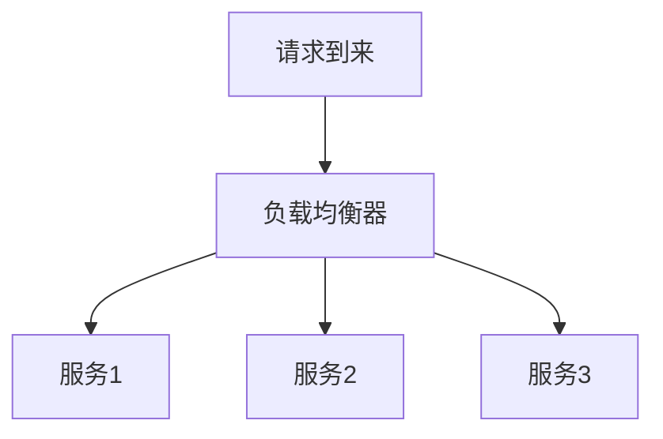
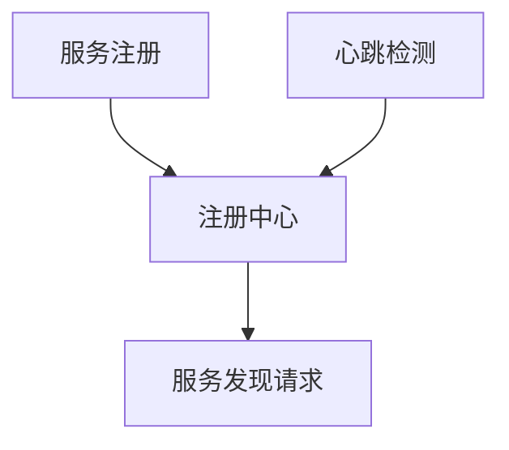

                 


# 企业AI Agent的微服务性能优化策略

> 关键词：企业AI Agent、微服务架构、性能优化、负载均衡、服务发现、算法原理

> 摘要：本文将深入探讨企业AI Agent在微服务架构下的性能优化策略，从核心概念到算法实现，从系统架构设计到项目实战，全面解析如何通过优化算法和架构设计提升企业AI Agent的性能表现。

---

# 第一部分: 企业AI Agent的微服务性能优化背景

## 第1章: 企业AI Agent与微服务性能优化概述

### 1.1 问题背景与描述

企业AI Agent是一种基于人工智能的代理系统，能够根据企业的业务需求自动执行任务、优化流程并提供决策支持。随着企业数字化转型的推进，AI Agent的应用场景越来越广泛，例如智能客服、供应链优化、精准营销等。然而，在实际应用中，AI Agent往往需要与微服务架构结合，以实现高效的服务调用和协同工作。

在微服务架构中，AI Agent需要通过服务发现、负载均衡、消息通信等方式与其他微服务进行交互。然而，这种交互过程中常常会遇到性能瓶颈，例如：

- **服务调用延迟**：AI Agent需要频繁调用其他微服务，但服务发现和通信的效率直接影响整体性能。
- **资源利用率低**：由于服务请求分布不均，部分服务节点可能处于空闲状态，而另一些节点则超负荷运转。
- **链路拥堵**：在高并发场景下，服务调用链路可能出现拥塞，导致响应时间增加，甚至引发服务雪崩。

因此，如何在微服务架构下优化AI Agent的性能，成为企业技术团队面临的重要挑战。

### 1.2 问题解决与边界

为了解决上述问题，我们需要从以下几个方面入手：

1. **服务发现与负载均衡**：通过优化服务发现机制和负载均衡算法，确保AI Agent能够高效地找到可用的服务实例，并将请求均匀分配到不同的服务节点。
2. **消息通信优化**：减少AI Agent与微服务之间的通信延迟，例如通过消息队列、缓存优化等方式提升通信效率。
3. **容错与自愈能力**：在AI Agent和微服务架构中引入容错机制，确保单点故障不会导致整个系统崩溃。

需要注意的是，性能优化是有边界的。例如，过度追求性能优化可能导致系统设计复杂度上升，维护成本增加。因此，在优化过程中需要权衡性能提升与系统复杂性之间的关系。

### 1.3 概念结构与核心要素

企业AI Agent的微服务性能优化涉及多个核心要素，包括：

1. **AI Agent**：负责接收请求、分析需求并调用相应的微服务。
2. **微服务架构**：提供各种功能模块，例如用户认证、数据处理、业务逻辑执行等。
3. **服务发现**：AI Agent需要通过服务发现机制找到可用的服务实例。
4. **负载均衡**：将请求分摊到不同的服务节点，避免单点压力过大。
5. **消息通信**：AI Agent与微服务之间的通信机制，例如HTTP、RPC、消息队列等。
6. **性能指标**：包括响应时间、吞吐量、资源利用率等。

这些要素共同构成了企业AI Agent微服务性能优化的核心框架。

---

# 第二部分: 核心概念与联系

## 第2章: AI Agent与微服务架构的核心原理

### 2.1 AI Agent的工作原理

AI Agent的核心任务是接收请求、分析需求并调用相应的微服务。其工作流程如下：

1. **请求接收**：AI Agent通过API接口接收用户的请求。
2. **需求分析**：AI Agent利用自然语言处理（NLP）或规则引擎分析请求内容，确定需要调用哪些微服务。
3. **服务调用**：AI Agent通过服务发现机制找到可用的服务实例，并通过通信机制发送请求。
4. **结果处理**：AI Agent接收微服务返回的结果，进行必要的处理（如格式转换、数据聚合）后，将结果反馈给用户。

### 2.2 微服务架构的关键要素

微服务架构的核心在于将功能模块化，每个服务独立运行，通过API进行通信。其关键要素包括：

1. **服务发现**：通过服务注册与发现机制（如Consul、Eureka）动态获取服务实例的信息。
2. **负载均衡**：将请求分摊到不同的服务实例，避免单点压力过大。
3. **API网关**：作为请求的统一入口，负责路由、鉴权、限流等功能。
4. **消息通信**：通过HTTP、gRPC、消息队列等方式实现服务间的通信。

### 2.3 核心概念对比分析

为了更好地理解AI Agent与微服务架构的关系，我们可以通过对比分析来明确其特点：

| **对比维度** | **AI Agent** | **微服务架构** |
|--------------|--------------|----------------|
| **功能定位** | 负责接收请求、分析需求、调用服务 | 提供功能模块，通过API实现协作 |
| **服务发现** | 需要依赖服务发现机制 | 服务实例通过注册中心动态更新 |
| **通信机制** | 支持多种通信方式，如HTTP、WebSocket | 通过API网关或直接调用API |
| **性能优化** | 依赖服务发现和负载均衡的优化 | 通过负载均衡和分布式部署提升性能 |

### 2.4 ER实体关系图

为了更直观地展示AI Agent与微服务架构的关系，我们可以绘制一个简单的ER实体关系图：

```mermaid
er
actor(AI Agent, 微服务架构, 性能优化策略)
```

---

# 第三部分: 算法原理讲解

## 第3章: 微服务性能优化算法

### 3.1 负载均衡算法

负载均衡是微服务架构中提升性能的重要手段。常见的负载均衡算法包括：

#### 3.1.1 基于轮询的负载均衡



实现代码如下：

```python
def round_robin_load_balancer(services):
    index = len(services) % len(services)
    return services[index]
```

#### 3.1.2 基于权重的负载均衡

基于权重的负载均衡可以根据服务实例的处理能力分配不同的权重，确保请求被合理分摊。

实现代码如下：

```python
def weighted_load_balancer(services, weights):
    total = sum(weights)
    random_value = random.uniform(0, total)
    for i in range(len(weights)):
        if random_value <= weights[i]:
            return services[i]
        random_value -= weights[i]
    return services[-1]
```

### 3.2 服务发现算法

服务发现是AI Agent调用微服务的关键步骤。以下是常见的服务发现算法：

#### 3.2.1 基于心跳机制的服务发现



实现代码如下：

```python
def heartbeat_monitor(service_health):
    if service_health['status'] == 'up':
        return True
    else:
        return False
```

---

通过以上算法实现，我们可以显著提升企业AI Agent在微服务架构下的性能表现。

