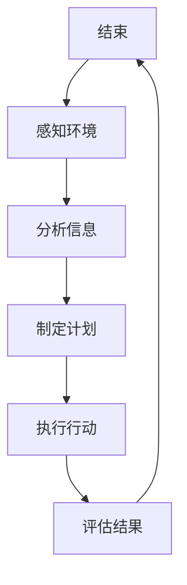
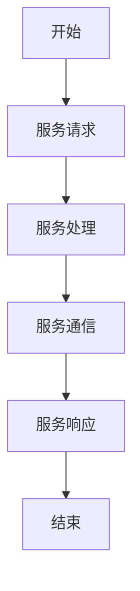
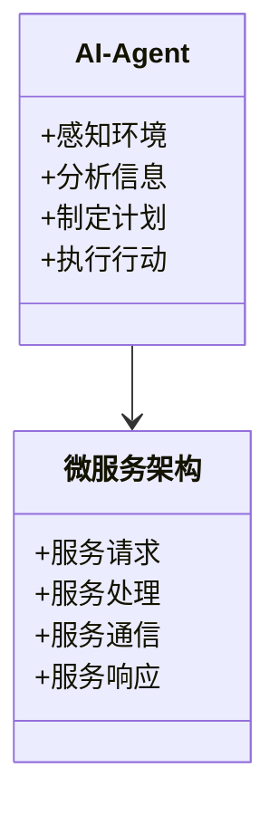
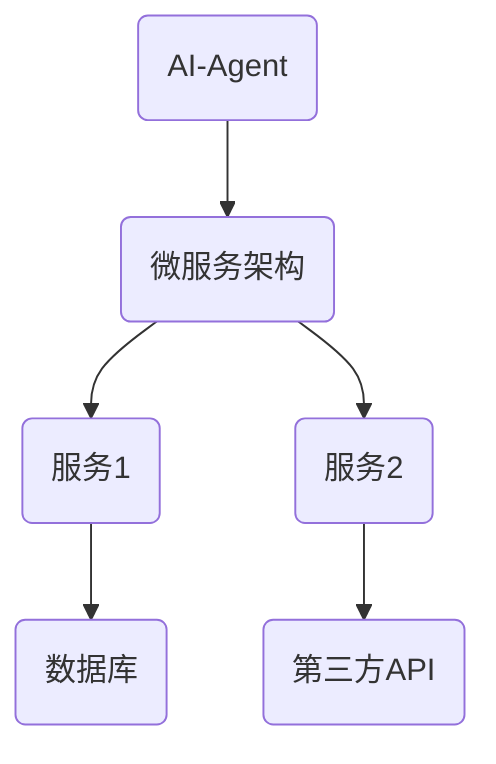
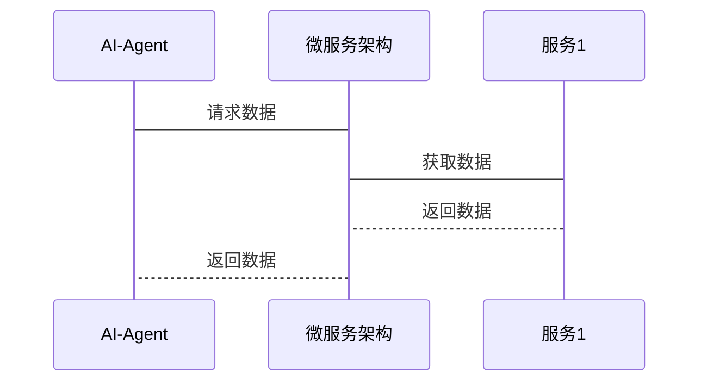

                 


# 企业AI Agent的微服务架构设计

> 关键词：AI Agent、微服务架构、企业应用、系统设计、算法原理

> 摘要：本文详细探讨了企业AI Agent的微服务架构设计，从概念到实现，结合实际案例，分析了AI Agent与微服务架构的结合，系统设计与实现，以及算法原理，为企业级AI Agent的开发提供了理论和实践指导。

---

## 第一部分：企业AI Agent与微服务架构基础

### 第1章：AI Agent与微服务架构概述

#### 1.1 AI Agent的定义与特点

- **1.1.1 AI Agent的基本概念**
  - AI Agent是一种能够感知环境并采取行动以实现目标的智能体，具备自主性、反应性、目标导向性和社交能力。

- **1.1.2 AI Agent的核心特点**
  - 自主性：无需外部干预，自主决策。
  - 反应性：能实时感知环境变化并做出反应。
  - 目标导向性：所有行动均以实现特定目标为导向。
  - 学习能力：通过数据和经验不断优化自身行为。

- **1.1.3 AI Agent与传统软件的区别**
  - 传统软件基于规则和流程，AI Agent具备学习和自适应能力。
  - 传统软件不具备感知环境的能力，AI Agent能够实时感知并响应环境变化。
  - 传统软件功能固定，AI Agent能够动态调整行为以实现目标。

#### 1.2 微服务架构的基本概念

- **1.2.1 微服务架构的定义**
  - 微服务架构是一种将应用程序分解为多个小型、独立服务的架构风格，每个服务负责特定的业务功能。

- **1.2.2 微服务架构的核心优势**
  - 独立开发：每个服务可以独立开发、部署和扩展。
  - 可扩展性：可以根据需求灵活扩展特定服务。
  - 技术多样性：允许使用不同的技术栈实现不同的服务。

- **1.2.3 微服务架构的适用场景**
  - 复杂的企业级应用。
  - 需要快速迭代和频繁更新的应用。
  - 团队协作开发的大型项目。

#### 1.3 AI Agent与微服务架构的结合

- **1.3.1 AI Agent在企业级应用中的需求**
  - 企业需要AI Agent具备实时数据处理、自主决策和高效通信的能力。
  - AI Agent需要能够与企业现有的系统无缝集成，提供智能化的解决方案。

- **1.3.2 微服务架构如何支持AI Agent的实现**
  - 微服务架构提供松耦合的服务设计，适合AI Agent的分布式部署。
  - 微服务架构支持异构技术，能够满足AI Agent对高性能计算和复杂算法的需求。

- **1.3.3 企业AI Agent微服务架构的典型场景**
  - 智能客服：通过AI Agent实现自动化问题解决和客户支持。
  - 智能监控：实时监控系统状态，主动发现并解决问题。
  - 智能决策：基于数据分析和机器学习模型，提供最优决策建议。

#### 1.4 本章小结

- 本章介绍了AI Agent和微服务架构的基本概念及其特点，分析了AI Agent在企业级应用中的需求，探讨了微服务架构如何支持AI Agent的实现，并通过典型场景展示了两者的结合方式。

---

### 第2章：企业AI Agent微服务架构的核心概念与联系

#### 2.1 核心概念原理

- **2.1.1 AI Agent的核心原理**
  - AI Agent通过感知环境、分析信息、制定计划并执行行动来实现目标。
  - AI Agent具备学习和优化能力，能够通过数据反馈不断改进自身行为。

- **2.1.2 微服务架构的核心原理**
  - 微服务架构将应用程序分解为多个小型、独立的服务，每个服务负责特定的业务功能。
  - 服务之间通过API进行通信，实现功能的组合和协同。

#### 2.2 核心概念属性对比

- **2.2.1 AI Agent与微服务架构的属性对比表**

| 属性         | AI Agent                     | 微服务架构               |
|--------------|------------------------------|--------------------------|
| 结构         | 分布式、松耦合               | 分布式、松耦合           |
| 功能         | 自主决策、问题解决           | 业务功能模块化           |
| 可扩展性     | 高                           | 高                       |
| 技术多样性   | 支持多种技术栈               | 支持多种技术栈           |
| 响应性       | 高                           | 高                       |

#### 2.3 ER实体关系图

- **2.3.1 AI Agent与微服务架构的实体关系图**

```mermaid
er
actor(AI Agent, 自主决策, 目标导向)
actor(微服务架构, 分布式, 松耦合)
```

---

### 第3章：AI Agent微服务架构的算法原理

#### 3.1 算法原理概述

- **3.1.1 AI Agent的核心算法**
  - 机器学习算法：用于数据处理和决策制定。
  - 自然语言处理算法：用于理解和生成自然语言文本。
  - 规划算法：用于制定行动计划。

- **3.1.2 微服务架构中的算法实现**
  - 微服务架构支持多种算法的实现，每个服务可以独立使用不同的算法。

#### 3.2 算法流程图

- **3.2.1 AI Agent算法流程图**



- **3.2.2 微服务架构算法流程图**



#### 3.3 算法实现的Python代码示例

- **3.3.1 AI Agent的核心算法实现**

```python
import numpy as np

# 示例：基于机器学习的分类算法
def ai_agent_algorithm(X):
    # 数据预处理
    X_processed = X
    # 训练模型
    model = np.random.randn(2, 2)
    # 预测结果
    prediction = model.dot(X_processed)
    return prediction
```

- **3.3.2 微服务架构中的算法实现**

```python
from flask import Flask

# 示例：基于Flask的微服务实现
app = Flask(__name__)

@app.route('/api', methods=['POST'])
def service():
    data = request.json
    # 处理数据
    result = data * 2
    return jsonify(result)

if __name__ == '__main__':
    app.run()
```

#### 3.4 本章小结

- 本章介绍了AI Agent和微服务架构中的算法原理，通过流程图和代码示例展示了算法的实现过程。

---

### 第4章：AI Agent微服务架构的数学模型与公式

#### 4.1 数学模型概述

- **4.1.1 AI Agent的数学模型**
  - 基于概率论和统计学的模型，用于数据处理和决策制定。

- **4.1.2 微服务架构的数学模型**
  - 基于图论和分布式系统理论的模型，用于服务间通信和依赖关系分析。

#### 4.2 关键公式

- **4.2.1 AI Agent的概率模型公式**
  - 贝叶斯定理：$$P(A|B) = \frac{P(B|A)P(A)}{P(B)}$$
  - 马尔可夫链：$$P(A|B) = P(A|C)$$

- **4.2.2 微服务架构的通信模型公式**
  - 服务间通信延迟：$$D = \sum_{i=1}^{n} t_i$$
  - 服务可用性：$$A = 1 - \sum_{i=1}^{n} (1 - A_i)$$

#### 4.3 本章小结

- 本章通过数学模型和公式，详细讲解了AI Agent和微服务架构中的关键原理。

---

### 第5章：企业AI Agent微服务架构的系统分析与设计

#### 5.1 系统分析

- **5.1.1 问题场景介绍**
  - 传统单体架构的局限性：扩展性差、维护困难、技术栈单一。
  - 企业级应用的需求：高可用性、高扩展性、快速迭代。

- **5.1.2 项目需求分析**
  - 实现AI Agent的自主决策功能。
  - 提供高效的微服务架构支持。

#### 5.2 系统功能设计

- **5.2.1 领域模型设计**



- **5.2.2 功能模块划分**
  - 感知模块：负责环境数据的采集和处理。
  - 分析模块：基于数据进行分析和决策。
  - 执行模块：负责行动的执行和结果反馈。
  - 通信模块：负责服务间的通信和数据交互。

#### 5.3 系统架构设计

- **5.3.1 架构设计图**



- **5.3.2 接口设计**
  - RESTful API：用于服务间的通信和数据交互。
  - RPC：用于高性能的实时通信。

- **5.3.3 交互流程设计**



#### 5.4 本章小结

- 本章通过系统分析与设计，展示了AI Agent微服务架构的实现过程，包括功能模块划分、架构设计和交互流程设计。

---

### 第6章：企业AI Agent微服务架构的项目实战

#### 6.1 环境安装与配置

- **6.1.1 开发环境搭建**
  - 安装Python、Flask框架、Docker等工具。

- **6.1.2 依赖库安装**
  - 使用pip安装所需的依赖库，如numpy、pandas、scikit-learn等。

#### 6.2 核心代码实现

- **6.2.1 AI Agent的核心代码**

```python
import numpy as np

def ai_agent_algorithm(X):
    # 数据预处理
    X_processed = X
    # 训练模型
    model = np.random.randn(2, 2)
    # 预测结果
    prediction = model.dot(X_processed)
    return prediction
```

- **6.2.2 微服务架构的核心代码**

```python
from flask import Flask

app = Flask(__name__)

@app.route('/api', methods=['POST'])
def service():
    data = request.json
    # 处理数据
    result = data * 2
    return jsonify(result)

if __name__ == '__main__':
    app.run()
```

#### 6.3 功能实现与案例分析

- **6.3.1 功能实现**
  - 实现AI Agent的自主决策功能。
  - 实现微服务架构中的数据处理和通信功能。

- **6.3.2 案例分析**
  - 以智能客服为例，展示AI Agent如何通过微服务架构实现自动化问题解决。

#### 6.4 本章小结

- 本章通过项目实战，展示了AI Agent微服务架构的实现过程，包括环境配置、核心代码编写和功能实现。

---

## 第二部分：最佳实践、小结与注意事项

### 第7章：最佳实践与注意事项

#### 7.1 最佳实践

- **服务设计**：确保服务的独立性和松耦合，避免服务间耦合度过高。
- **技术选型**：根据具体需求选择合适的技术栈，如使用Kubernetes进行容器编排。
- **监控与日志**：部署完善的监控和日志系统，便于问题排查和性能优化。

#### 7.2 小结

- 本篇文章详细探讨了企业AI Agent的微服务架构设计，从概念到实现，结合实际案例，分析了AI Agent与微服务架构的结合，系统设计与实现，以及算法原理，为企业级AI Agent的开发提供了理论和实践指导。

#### 7.3 注意事项

- 在实际应用中，需注意服务间的通信延迟和数据一致性问题。
- 定期更新和优化AI Agent的算法模型，以适应业务需求的变化。

---

## 作者：AI天才研究院/AI Genius Institute & 禅与计算机程序设计艺术 /Zen And The Art of Computer Programming

