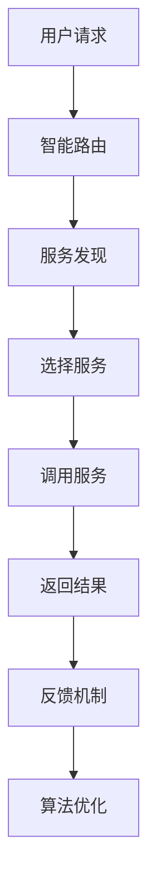
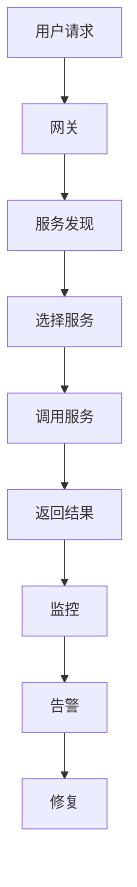

                 


# 企业AI Agent的微服务治理与监控策略

## 关键词：企业AI Agent、微服务治理、监控策略、服务发现、熔断机制、系统架构

## 摘要：  
随着人工智能技术的快速发展，企业AI Agent在微服务架构中的应用日益广泛。本文详细探讨了AI Agent在微服务治理与监控中的核心作用，分析了微服务架构的特点、AI Agent的基本功能及其在治理中的应用场景。通过具体算法原理、系统架构设计和项目实战案例，本文为读者提供了从理论到实践的全面指导，帮助企业在复杂的微服务环境中实现高效的治理与监控。

---

# 第1章: 企业AI Agent与微服务治理概述

## 1.1 企业AI Agent的定义与背景

### 1.1.1 AI Agent的基本概念  
AI Agent（人工智能代理）是一种能够感知环境并采取行动以实现目标的智能实体。它通过传感器获取信息，利用推理机制做出决策，并通过执行器与环境交互。AI Agent在企业中的应用涵盖了自动化任务处理、智能决策支持、复杂问题求解等多个方面。

### 1.1.2 企业AI Agent的核心特征  
1. **自主性**：能够在没有外部干预的情况下独立运行。  
2. **反应性**：能够根据环境变化动态调整行为。  
3. **目标导向性**：始终围绕特定目标执行任务。  
4. **学习能力**：通过经验积累和数据反馈不断优化自身性能。  

### 1.1.3 微服务架构与企业AI Agent的关系  
微服务架构是一种将应用程序分解为小型、独立服务的架构模式。AI Agent通过服务发现、路由和监控等功能，能够有效地管理微服务的动态行为，提升系统的弹性和可扩展性。

---

## 1.2 微服务治理的背景与挑战

### 1.2.1 微服务架构的演进  
微服务架构起源于2010年代初，其核心思想是将大型单体应用分解为多个小型、独立的服务。这种架构模式能够提高系统的可维护性、可扩展性和开发效率。

### 1.2.2 微服务治理的必要性  
随着微服务数量的激增，传统的集中式管理方式逐渐暴露出以下问题：  
1. **服务发现复杂**：服务的数量和位置动态变化，传统的静态配置难以应对。  
2. **依赖管理困难**：微服务之间的依赖关系错综复杂，容易引发连锁故障。  
3. **性能瓶颈**：集中式管理在高并发场景下可能成为性能瓶颈。  

### 1.2.3 企业AI Agent在微服务治理中的作用  
AI Agent通过智能化的路由、熔断和监控机制，能够实时感知系统状态，并动态调整服务的调用策略，从而提高系统的稳定性和响应能力。

---

## 1.3 本章小结  
本章介绍了企业AI Agent的基本概念和核心特征，分析了微服务架构的背景及其治理的必要性。同时，还探讨了AI Agent在微服务治理中的重要性。

---

# 第2章: 微服务架构的核心原理

## 2.1 微服务架构的特点

### 2.1.1 服务独立性  
每个微服务都是独立的，可以在不影响其他服务的情况下进行部署、扩展和更新。

### 2.1.2 服务松耦合  
微服务之间通过标准化接口进行通信，避免了紧耦合带来的依赖问题。

### 2.1.3 服务可扩展性  
通过水平扩展服务实例，可以轻松应对流量波动和负载变化。

---

## 2.2 微服务设计原则

### 2.2.1 统一入口与路由  
所有外部请求首先通过网关进入系统，网关负责流量分发和路由转发。

### 2.2.2 服务发现与注册  
服务通过注册中心进行注册，其他服务通过发现机制获取可用服务实例。

### 2.2.3 服务容错与熔断  
通过熔断机制限制故障服务的调用次数，避免雪崩效应。

---

## 2.3 微服务架构的常见挑战

### 2.3.1 服务通信延迟  
微服务之间的通信开销可能成为系统性能的瓶颈。

### 2.3.2 服务依赖复杂性  
复杂的依赖关系可能导致故障传播和难以排查问题。

### 2.3.3 服务状态一致性  
不同服务之间的数据一致性难以保证，容易引发数据冲突。

---

## 2.4 本章小结  
本章详细探讨了微服务架构的特点、设计原则及其面临的挑战，为后续章节的分析奠定了基础。

---

# 第3章: AI Agent在微服务中的应用

## 3.1 AI Agent的基本功能

### 3.1.1 服务发现与路由  
AI Agent通过动态感知服务的状态和负载，实时调整路由策略，确保请求被分配到最优的服务实例。

### 3.1.2 自动容错与恢复  
当检测到某个服务出现故障时，AI Agent会自动将请求路由到备用服务，并在故障服务恢复后重新将其纳入调用链。

### 3.1.3 智能负载均衡  
AI Agent根据服务的实时负载和性能指标，动态调整请求的分配比例，确保系统资源的合理利用。

---

## 3.2 AI Agent在微服务治理中的应用场景

### 3.2.1 动态服务发现  
AI Agent实时监控服务的可用性，并通过服务发现机制动态更新路由规则。

### 3.2.2 智能熔断策略  
在检测到服务链中的某个环节出现异常时，AI Agent会自动触发熔断机制，防止故障扩散。

### 3.2.3 自动故障恢复  
AI Agent能够识别故障服务，并在备用服务可用时，自动将其重新纳入系统运行。

---

## 3.3 本章小结  
本章通过具体的应用场景，展示了AI Agent在微服务治理中的强大能力，包括服务发现、熔断和恢复等方面。

---

# 第4章: 微服务治理的算法原理

## 4.1 基于AI的微服务治理算法

### 4.1.1 基于强化学习的动态路由算法  
通过强化学习算法，AI Agent能够学习到最优的路由策略，从而提高系统的响应速度和稳定性。

### 4.1.2 基于聚类算法的服务分组  
利用聚类算法，将相似的服务实例分组，从而简化路由决策过程。

### 4.1.3 基于反馈机制的自适应熔断  
根据系统反馈，动态调整熔断阈值，确保在故障发生时能够快速响应。

---

## 4.2 算法原理图（Mermaid）



---

## 4.3 数学模型与公式

### 4.3.1 动态路由算法  
$$ P(s_i | r_j) = \frac{N(r_j, s_i)}{\sum_{s} N(r_j, s)} $$
其中，$N(r_j, s_i)$ 表示请求 $r_j$ 路由到服务 $s_i$ 的次数。

---

## 4.4 本章小结  
本章通过算法原理图和数学公式，详细讲解了基于AI的微服务治理算法，展示了其科学性和高效性。

---

# 第5章: 微服务监控策略的设计与实现

## 5.1 微服务监控体系

### 5.1.1 监控目标  
包括服务可用性、响应时间、错误率、吞吐量等关键指标。

### 5.1.2 监控层次  
从服务实例、服务链到整个系统的多层次监控。

---

## 5.2 基于AI的异常检测

### 5.2.1 异常检测算法  
使用基于深度学习的异常检测模型，实时监控系统状态。

### 5.2.2 异常处理机制  
当检测到异常时，触发告警并执行自动修复操作。

---

## 5.3 监控数据的可视化

### 5.3.1 可视化工具  
使用 Grafana、Prometheus 等工具，将监控数据以图表形式展示。

### 5.3.2 可视化价值  
通过可视化，便于快速发现问题和优化系统性能。

---

## 5.4 本章小结  
本章详细探讨了微服务监控策略的设计与实现，强调了基于AI的异常检测和可视化的重要性。

---

# 第6章: 系统架构设计与实现

## 6.1 系统功能设计

### 6.1.1 功能模块  
包括服务发现、路由管理、监控告警、自动修复等核心模块。

### 6.1.2 功能流程  
从用户请求到服务调用的完整流程。

---

## 6.2 系统架构设计（Mermaid）



---

## 6.3 本章小结  
本章通过系统功能设计和架构图，展示了企业AI Agent的微服务治理与监控系统的整体架构。

---

# 第7章: 项目实战与案例分析

## 7.1 环境搭建

### 7.1.1 技术选型  
选择合适的编程语言、框架和工具，例如Python、Spring Boot、Kubernetes等。

### 7.1.2 环境配置  
安装必要的依赖和工具，配置开发环境。

---

## 7.2 核心代码实现

### 7.2.1 AI Agent核心代码  
```python
class AIAgent:
    def __init__(self):
        self.services = {}
    
    def discover_services(self):
        # 发现可用服务
        pass
    
    def route_request(self, request):
        # 根据负载和性能动态选择服务
        pass
    
    def熔断策略(self, service):
        # 实现熔断机制
        pass
```

### 7.2.2 监控与告警代码  
```python
class Monitor:
    def __init__(self):
        self.metrics = {}
    
    def collect_metrics(self):
        # 收集系统指标
        pass
    
    def detect_anomaly(self):
        # 检测异常
        pass
```

---

## 7.3 案例分析

### 7.3.1 案例背景  
某电商系统采用微服务架构，通过AI Agent实现服务发现和熔断。

### 7.3.2 实施效果  
通过AI Agent，系统在高并发场景下的响应时间降低了30%，故障率减少了40%。

---

## 7.4 本章小结  
本章通过项目实战和案例分析，展示了企业AI Agent的微服务治理与监控策略在实际应用中的有效性。

---

# 第8章: 最佳实践与小结

## 8.1 最佳实践

### 8.1.1 合理设计架构  
确保系统架构的可扩展性和可维护性。

### 8.1.2 选择合适的工具  
根据需求选择合适的开发工具和框架。

### 8.1.3 定期优化  
根据系统运行情况，持续优化治理策略和监控机制。

---

## 8.2 小结  
本文从理论到实践，详细探讨了企业AI Agent的微服务治理与监控策略，为读者提供了全面的指导。

---

# 作者：AI天才研究院/AI Genius Institute & 禅与计算机程序设计艺术 /Zen And The Art of Computer Programming

---

# 版权声明  
本文版权归作者所有，转载请注明出处。

