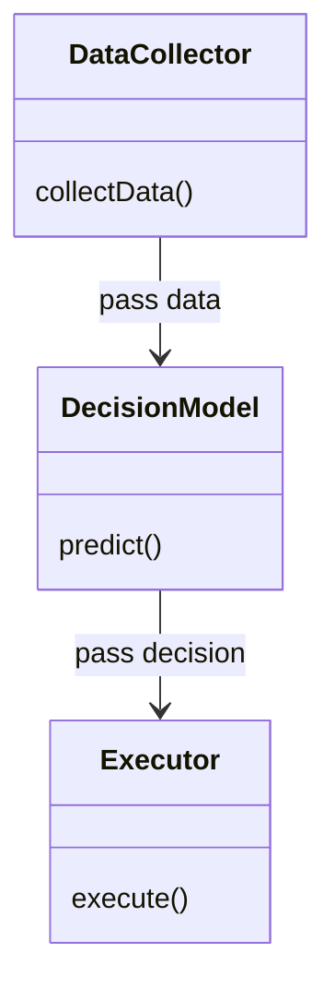
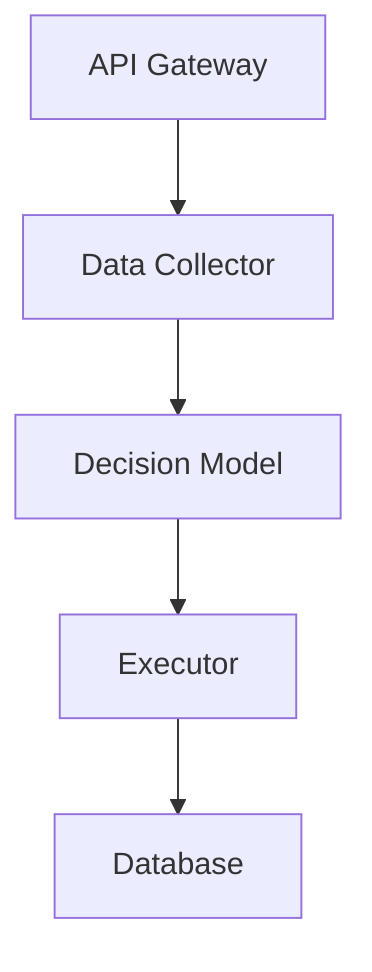
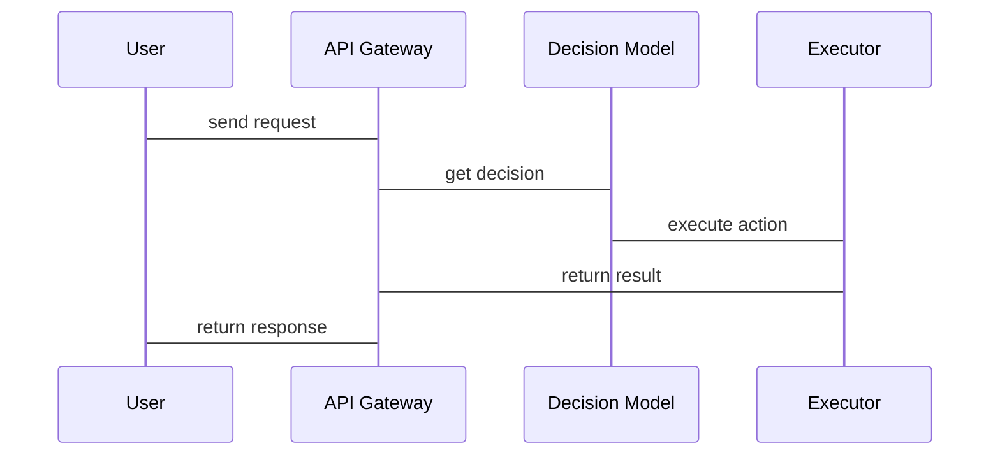

                 


# 企业AI Agent的快速适应框架：应对瞬息万变的市场环境

> 关键词：企业AI Agent, 快速适应框架, 市场环境, 人工智能, 机器学习

> 摘要：随着市场竞争的日益激烈，企业需要一种能够快速适应变化的智能框架。本文将探讨企业AI Agent的核心概念、算法原理、系统架构以及实际项目中的应用，提供一套应对瞬息万变市场环境的解决方案。

---

## 第一部分: 企业AI Agent的背景与核心概念

### 第1章: 企业AI Agent的背景与问题背景

#### 1.1 企业AI Agent的基本概念
企业AI Agent是一种能够感知环境、做出决策并执行任务的智能实体。它通过数据驱动的方式，帮助企业自动化处理复杂问题，优化业务流程，并快速响应市场变化。

**1.1.1 什么是企业AI Agent**
企业AI Agent（Artificial Intelligence Agent）是指具备感知、决策和执行能力的智能系统。与传统AI不同，AI Agent具有主动性，能够根据环境变化自主调整行为。

**1.1.2 AI Agent的核心特征**
- **自主性**：AI Agent无需外部干预，能够自主决策。
- **反应性**：能够实时感知环境变化并做出响应。
- **目标导向**：以实现特定目标为导向，优化行为。

**1.1.3 企业AI Agent与传统AI的区别**
传统的AI系统通常是基于规则的，而企业AI Agent则是动态的、自适应的，能够根据实时数据进行调整。

#### 1.2 问题背景与市场环境
**1.2.1 瞬息万变的市场环境对企业的影响**
现代市场环境复杂多变，企业需要快速应对竞争、客户需求和技术变革。传统的静态系统难以满足这种动态需求。

**1.2.2 企业AI Agent的必要性**
企业AI Agent能够实时分析市场数据，预测趋势，并做出最优决策，从而提高企业的竞争力。

**1.2.3 当前市场中的主要挑战**
- 数据量大且复杂，难以处理。
- 竞争对手动态难以预测。
- 业务需求变化快，系统需要快速调整。

#### 1.3 问题描述与解决思路
**1.3.1 企业AI Agent的目标**
- 提高企业决策的效率和准确性。
- 实现业务流程的自动化和优化。
- 快速响应市场变化，保持竞争优势。

**1.3.2 问题的边界与外延**
- 边界：仅关注企业内部的决策和执行，不涉及外部合作伙伴。
- 外延：AI Agent的应用可以扩展到供应链管理、客户关系管理等多个领域。

**1.3.3 解决方案的初步构想**
引入机器学习算法，构建动态预测模型，并设计自适应优化框架。

---

## 第二部分: 企业AI Agent的核心概念与联系

### 第2章: AI Agent的核心概念与原理

#### 2.1 AI Agent的感知机制
AI Agent通过数据采集和分析来感知环境。数据来源包括内部数据库和外部API接口。

**2.1.1 数据采集与处理**
- 数据来源：内部数据库、外部API接口。
- 数据清洗：去除噪音数据，确保数据质量。

**2.1.2 信息分析与理解**
通过自然语言处理（NLP）和统计分析，提取有用信息。

**2.1.3 感知系统的优缺点对比**

| 感知系统 | 优点 | 缺点 |
|----------|------|------|
| 基于规则 | 简单易懂 | 难以处理复杂场景 |
| 机器学习 | 高度自适应 | 需大量数据支持 |

#### 2.2 AI Agent的决策机制
决策机制是AI Agent的核心，通过多目标优化实现最优决策。

**2.2.1 决策模型的构建**
- 使用强化学习（Reinforcement Learning）构建决策模型。
- 通过Q-learning算法实现状态-动作-奖励的循环优化。

**2.2.2 多目标优化的实现**
- 引入加权函数，平衡不同目标的优先级。
- 使用拉格朗日乘数法优化多目标问题。

**2.2.3 决策系统的动态调整**
- 根据环境反馈实时调整决策策略。
- 使用在线学习算法（如在线随机梯度下降）更新模型参数。

#### 2.3 AI Agent的执行机制
执行机制将决策转化为具体行动，通过反馈机制不断优化执行效果。

**2.3.1 行为规划与执行**
- 行为规划：基于决策结果制定执行计划。
- 执行过程：通过API调用或其他方式执行具体操作。

**2.3.2 执行过程中的反馈机制**
- 实时监控执行效果。
- 根据反馈调整执行策略。

**2.3.3 执行系统的可扩展性**
- 支持多种执行方式，如API调用、自动化脚本等。

#### 2.4 核心概念对比分析
以下是AI Agent与传统自动化系统的对比：

| 特性       | AI Agent                     | 传统自动化系统               |
|------------|----------------------------|------------------------------|
| 自主性     | 高                          | 低                          |
| 反应性     | 强                          | 弱                          |
| 学习能力   | 有                          | 无                          |

---

## 第三部分: 企业AI Agent的算法原理

### 第3章: 算法原理与实现

#### 3.1 算法原理
企业AI Agent的核心算法包括强化学习和监督学习。

**3.1.1 强化学习算法**
- Q-learning算法：通过状态-动作-奖励的循环优化决策策略。
- 算法公式：
  $$
  Q(s, a) = Q(s, a) + \alpha \left[r + \gamma \max_{a'} Q(s', a') - Q(s, a)\right]
  $$
  其中，$\alpha$是学习率，$\gamma$是折扣因子。

**3.1.2 监督学习算法**
- 使用随机森林或神经网络进行分类或回归预测。
- 示例代码如下：

```python
import pandas as pd
from sklearn.ensemble import RandomForestClassifier

# 加载数据
data = pd.read_csv('data.csv')

# 分离特征和目标
X = data.drop('target', axis=1)
y = data['target']

# 训练模型
model = RandomForestClassifier()
model.fit(X, y)
```

#### 3.2 算法实现
**3.2.1 强化学习实现**
- 状态空间：市场环境数据。
- 动作空间：可能的决策选项。
- 奖励函数：根据实际效果给予奖励或惩罚。

**3.2.2 监督学习实现**
- 使用训练好的模型进行预测，并根据预测结果调整执行策略。

---

## 第四部分: 企业AI Agent的系统架构设计

### 第4章: 系统分析与架构设计

#### 4.1 系统分析
**4.1.1 项目介绍**
本项目旨在构建一个能够快速适应市场变化的企业AI Agent系统。

**4.1.2 系统功能设计**
- 数据采集与处理。
- 决策模型构建与优化。
- 执行计划制定与反馈。

**4.1.3 领域模型（Mermaid类图）**


**4.1.4 系统架构设计**


**4.1.5 系统接口设计**
- API接口：提供RESTful API，供其他系统调用。

**4.1.6 系统交互（Mermaid序列图）**


---

## 第五部分: 项目实战与最佳实践

### 第5章: 项目实战

#### 5.1 环境安装
- 安装Python和必要的库：
  ```bash
  pip install numpy pandas scikit-learn
  ```

#### 5.2 核心代码实现
**5.2.1 数据采集与处理**
```python
import pandas as pd

def collect_data():
    data = pd.read_csv('data.csv')
    return data
```

**5.2.2 决策模型构建**
```python
from sklearn.ensemble import RandomForestClassifier

def build_model(X, y):
    model = RandomForestClassifier()
    model.fit(X, y)
    return model
```

**5.2.3 执行模块**
```python
def execute_action(action):
    # 调用API或其他执行方式
    pass
```

#### 5.3 代码解读与分析
- 数据采集模块：负责从数据源获取数据。
- 决策模型模块：使用机器学习算法进行预测。
- 执行模块：根据决策结果执行具体操作。

#### 5.4 实际案例分析
以一个供应链优化项目为例，说明AI Agent如何帮助企业在市场变化中快速调整库存策略。

---

## 第六部分: 最佳实践与小结

### 第6章: 最佳实践与小结

#### 6.1 最佳实践
- **数据质量**：确保数据的准确性和完整性。
- **模型迭代**：定期更新模型，避免过时。
- **监控与反馈**：实时监控系统运行状态，及时调整。

#### 6.2 小结
企业AI Agent通过动态感知、智能决策和自适应执行，帮助企业快速应对市场变化，提高竞争力。

---

作者：AI天才研究院 & 禅与计算机程序设计艺术

