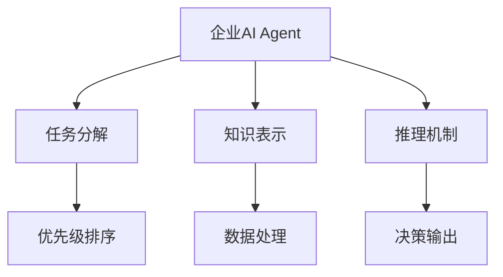
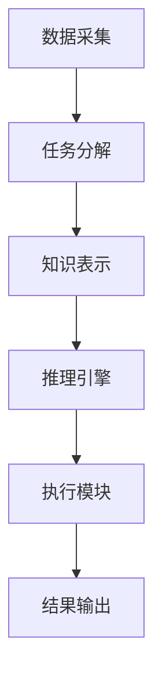

                 


# 企业AI Agent的性能优化策略

> 关键词：企业AI Agent，性能优化，人工智能，系统架构，算法优化，资源分配

> 摘要：本文详细探讨了企业AI Agent的性能优化策略，从基础概念到高级算法，再到系统架构和实战案例，全面解析如何提升企业AI Agent的效率和效果。

---

## 第1章: 企业AI Agent的背景与概念

### 1.1 企业AI Agent的基本概念

#### 1.1.1 什么是企业AI Agent
企业AI Agent（Artificial Intelligence Agent）是指在企业环境中，通过人工智能技术实现特定任务的智能代理。它能够感知环境、执行任务并做出决策，帮助企业在自动化、数据分析和决策优化等方面实现智能化。

企业AI Agent的核心功能包括信息处理、任务执行和智能决策。例如，它可以用于客户服务、供应链管理、数据分析和预测等领域。

#### 1.1.2 企业AI Agent的核心特征
- **自主性**：能够自主决策和执行任务，无需人工干预。
- **反应性**：能够实时感知环境变化并做出响应。
- **学习能力**：通过机器学习算法不断优化自身的性能。
- **协作性**：能够与其他系统、人员或AI Agent协同工作。

#### 1.1.3 企业AI Agent的分类与应用场景
企业AI Agent可以分为以下几类：
- **工具型AI Agent**：主要用于辅助任务，如数据分析工具。
- **对话型AI Agent**：用于与用户进行交互，如智能客服。
- **决策型AI Agent**：用于复杂决策，如供应链优化。

应用场景包括：
- 客户服务：提供24/7的智能支持。
- 供应链管理：优化库存和物流。
- 财务分析：自动处理财务数据和预测。

---

### 1.2 企业AI Agent的发展背景

#### 1.2.1 AI技术的演进历程
人工智能技术经历了多个阶段的发展：
- **早期阶段**：基于规则的专家系统。
- **发展阶段**：引入机器学习和神经网络。
- **当前阶段**：深度学习和大语言模型的应用。

#### 1.2.2 企业智能化转型的需求
企业面临市场竞争加剧、效率提升的压力，AI Agent成为实现智能化转型的重要工具。通过AI Agent，企业可以自动化处理大量数据，提高决策效率。

#### 1.2.3 企业AI Agent的兴起与趋势
随着计算能力的提升和数据量的增加，AI Agent在企业中的应用越来越广泛。未来，AI Agent将更加智能化、个性化，并与其他技术如区块链和物联网结合，提供更强大的功能。

---

### 1.3 企业AI Agent的核心价值

#### 1.3.1 提升企业效率的潜力
AI Agent可以自动化处理重复性任务，减少人工干预，提高工作效率。

#### 1.3.2 优化决策能力的作用
通过分析大量数据，AI Agent可以帮助企业做出更准确的决策。

#### 1.3.3 降低企业运营成本的可能性
自动化和优化决策可以显著降低企业的运营成本。

---

## 第2章: 企业AI Agent的性能优化背景

### 2.1 企业AI Agent性能优化的必要性

#### 2.1.1 为什么需要优化企业AI Agent
随着企业AI Agent的应用范围扩大，性能瓶颈逐渐显现，如响应速度慢、资源消耗大等问题。

#### 2.1.2 性能瓶颈对企业的影响
性能不佳的AI Agent可能导致用户体验差、效率降低，甚至影响企业的声誉。

#### 2.1.3 优化目标与关键指标
优化目标包括提升响应速度、降低资源消耗和提高准确率。关键指标有响应时间、资源利用率和准确率。

---

### 2.2 企业AI Agent性能优化的核心问题

#### 2.2.1 计算效率的瓶颈
AI Agent需要处理大量数据，计算资源有限可能导致性能下降。

#### 2.2.2 数据处理的挑战
数据量大、数据复杂性高，如何高效处理数据是关键问题。

#### 2.2.3 模型复杂度与泛化能力的平衡
复杂的模型可能泛化能力差，简单的模型又可能无法准确处理复杂任务。

---

### 2.3 企业AI Agent性能优化的边界与外延

#### 2.3.1 优化的边界条件
优化应在不影响AI Agent核心功能的前提下进行，避免过度优化导致功能受损。

#### 2.3.2 外延的适用范围
性能优化不仅限于单点优化，还包括系统整体的优化。

#### 2.3.3 与其他优化策略的关系
性能优化需要与成本优化、功能优化等策略相结合，才能达到最佳效果。

---

## 第3章: 企业AI Agent性能优化的核心概念与联系

### 3.1 核心概念原理

#### 3.1.1 任务分解与优先级排序
将复杂任务分解为多个子任务，并根据优先级进行排序，确保关键任务优先处理。

#### 3.1.2 知识表示与推理机制
通过知识图谱表示知识，并利用推理算法进行逻辑推理，帮助AI Agent做出决策。

#### 3.1.3 模型训练与部署流程
包括数据准备、模型训练、评估和部署等步骤，确保模型在实际应用中有效。

---

### 3.2 核心概念属性特征对比

| 核心概念       | 特征1 | 特征2 | 特征3 |
|----------------|-------|-------|-------|
| 任务分解       | 粒度   | 优先级 | 依赖性 |
| 知识表示       | 表达能力 | 可扩展性 | 语义理解 |
| 推理机制       | 精度   | 效率   | 灵活性 |

---

### 3.3 实体关系图（ER图）



---

## 第4章: 企业AI Agent性能优化的算法原理

### 4.1 算法原理概述

#### 4.1.1 优化算法的选择与应用

##### 1. 基于规则的优化
- **简单规则**：适用于任务分解和优先级排序。
- **复杂规则**：结合上下文进行推理。

##### 2. 基于机器学习的优化
- **监督学习**：用于分类和回归任务。
- **无监督学习**：用于聚类和异常检测。
- **强化学习**：用于序列决策和策略优化。

##### 3. 基于知识图谱的优化
- **知识嵌入**：将知识转化为向量表示。
- **推理引擎**：基于知识图谱进行推理。

#### 4.1.2 优化算法的数学模型与公式

##### 1. 任务分解的数学模型
任务分解可以看作是一个组合优化问题，目标是最小化执行时间或最大化效率。

$$ \text{目标函数} = \sum_{i=1}^{n} t_i $$
其中，$t_i$ 是任务 $i$ 的执行时间。

##### 2. 优先级排序的数学模型
优先级排序可以通过贪心算法实现，选择当前最优的任务优先执行。

$$ \text{优先级} = \frac{1}{t_i} $$
优先级越高，任务越优先执行。

##### 3. 推理机制的数学模型
基于知识图谱的推理可以使用图遍历算法，如深度优先搜索（DFS）或广度优先搜索（BFS）。

---

### 4.2 算法实现与优化

#### 4.2.1 算法实现步骤

##### 1. 数据准备
- 收集任务数据和知识图谱。
- 数据预处理，包括清洗和特征提取。

##### 2. 模型训练
- 选择合适的算法，如监督学习或强化学习。
- 调参和优化，确保模型性能最佳。

##### 3. 模型部署
- 将模型部署到生产环境，实现任务分解和优先级排序。
- 监控模型性能，及时调整和优化。

#### 4.2.2 算法优化策略

##### 1. 并行计算
通过并行计算加速模型训练和推理。

##### 2. 模型压缩
通过剪枝和量化等技术减少模型大小，降低计算资源消耗。

##### 3. 混合优化
结合多种优化策略，如规则优化和机器学习优化，提升整体性能。

---

## 第5章: 企业AI Agent性能优化的系统架构与设计

### 5.1 系统架构设计

#### 5.1.1 系统功能模块

##### 1. 数据采集模块
负责采集企业内部数据，如日志和交易数据。

##### 2. 任务分解模块
将复杂任务分解为多个子任务，进行优先级排序。

##### 3. 知识表示模块
构建知识图谱，实现知识的表示和存储。

##### 4. 推理引擎模块
基于知识图谱进行逻辑推理，生成决策输出。

##### 5. 执行模块
根据推理结果执行任务，输出结果。

#### 5.1.2 系统架构设计图



---

### 5.2 系统接口设计

#### 5.2.1 接口定义

##### 1. 输入接口
- 数据接口：接收企业数据。
- 任务接口：接收任务请求。

##### 2. 输出接口
- 结果接口：输出推理结果。
- 日志接口：输出运行日志。

#### 5.2.2 接口实现

##### 1. 数据接口实现
通过API接收企业数据，进行预处理和存储。

##### 2. 任务接口实现
根据任务请求进行任务分解和优先级排序，调用推理引擎进行处理。

---

## 第6章: 企业AI Agent性能优化的项目实战

### 6.1 项目介绍

#### 6.1.1 项目背景
假设我们正在优化一个客户服务AI Agent，用于处理客户的咨询和问题。

#### 6.1.2 项目目标
- 提升响应速度。
- 提高问题解决的准确率。
- 降低运营成本。

### 6.2 系统实现

#### 6.2.1 环境搭建

##### 1. 安装依赖
```bash
pip install numpy pandas scikit-learn spacy
```

##### 2. 安装工具
- Python 3.8+
- Jupyter Notebook
- GPU支持（可选）

#### 6.2.2 核心代码实现

##### 1. 数据预处理
```python
import pandas as pd
import numpy as np

# 加载数据
data = pd.read_csv('customer_service.csv')

# 数据清洗
data.dropna(inplace=True)
data = data.sample(frac=0.8)
```

##### 2. 任务分解与优先级排序
```python
def decompose_task(task):
    # 分解任务为子任务
    sub_tasks = task.split(' ')
    return sub_tasks

def prioritize_tasks(tasks):
    # 根据长度排序，短的任务优先
    tasks.sort(key=lambda x: len(x))
    return tasks

tasks = decompose_task('解决客户投诉 提供解决方案')
prioritized_tasks = prioritize_tasks(tasks)
```

##### 3. 知识表示与推理
```python
import spacy

# 加载模型
nlp = spacy.load('en_core_web_sm')

# 推理过程
doc = nlp('客户投诉产品问题')
for token in doc:
    print(token.text, token.pos_)
```

---

### 6.3 案例分析与优化

#### 6.3.1 案例分析
在客户服务场景中，AI Agent需要快速响应客户的投诉，并提供解决方案。通过任务分解和优先级排序，AI Agent能够优先处理简单的投诉，减少响应时间。

#### 6.3.2 优化策略
- 优化任务分解算法，提高分解效率。
- 使用更高效的推理算法，提升推理速度。
- 增加训练数据，提高模型准确率。

---

## 第7章: 总结与展望

### 7.1 总结

企业AI Agent的性能优化是一个复杂而重要的任务。通过任务分解、知识表示和推理机制的优化，可以显著提升AI Agent的效率和效果。系统架构和算法优化是实现高性能AI Agent的关键。

---

### 7.2 展望

未来，企业AI Agent将更加智能化和个性化，与更多新兴技术结合，为企业带来更大的价值。

---

## 附录

### 附录A: 优化工具与资源

#### 1. 开源工具
- **spaCy**：自然语言处理工具。
- **Scikit-learn**：机器学习库。
- **TensorFlow**：深度学习框架。

#### 2. 在线资源
- [AI Agent技术博客](https://example.com)
- [相关书籍推荐](https://example.com)

---

## 作者

作者：AI天才研究院/AI Genius Institute & 禅与计算机程序设计艺术 /Zen And The Art of Computer Programming

---

**注**：本文为技术博客文章，涵盖企业AI Agent的性能优化策略，从基本概念到系统架构和实战案例，详细讲解了如何提升企业AI Agent的性能和效果。

