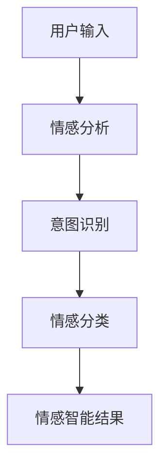
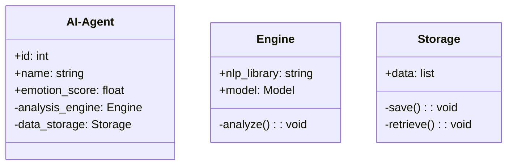

                 


# 企业AI Agent的情感智能：提升员工体验与忠诚度

**关键词：** AI Agent, 情感智能, 员工体验, 忠诚度, 情感分析, 自然语言处理, 机器学习

**摘要：** 本文探讨了企业AI Agent在情感智能方面的应用，分析了情感智能如何提升员工体验和忠诚度。文章从背景、技术原理、系统架构到项目实战，详细讲解了情感智能在企业中的实现与应用，结合实际案例和最佳实践，为读者提供了全面的视角。

---

# 《企业AI Agent的情感智能：提升员工体验与忠诚度》

## 第1章 企业AI Agent与情感智能的背景

### 1.1 AI Agent的基本概念

#### 1.1.1 AI Agent的定义与分类

AI Agent（人工智能代理）是一种能够感知环境并采取行动以实现目标的智能实体。根据功能和应用场景，AI Agent可以分为以下几类：

- **反应式AI Agent**：基于当前输入做出反应，如聊天机器人。
- **认知式AI Agent**：具备推理和规划能力，能够处理复杂任务。
- **协作式AI Agent**：能够与其他Agent或人类协作完成任务。

#### 1.1.2 情感智能的定义与特点

情感智能（Emotional Intelligence, EI）是指个体识别、理解和管理自己及他人情感的能力。在AI Agent中，情感智能使其能够理解并回应人类的情感需求。

- **情感识别**：通过自然语言处理技术识别用户的情感状态。
- **情感分析**：对文本进行情感倾向分析，判断情绪是积极、消极还是中性。
- **情感反馈**：根据情感分析结果生成相应的回应，提升用户体验。

#### 1.1.3 企业AI Agent的应用场景

在企业环境中，AI Agent可以应用于员工管理、客户支持、内部沟通等多个方面。例如：

- **员工反馈系统**：通过AI Agent收集员工情绪数据，优化员工体验。
- **客户支持**：提供智能化的情感支持，提升客户满意度。

---

### 1.2 企业员工体验与忠诚度的重要性

#### 1.2.1 员工体验的核心要素

员工体验包括员工在工作中的感受、体验和满意度。核心要素包括：

- **工作满意度**：员工对工作的满意程度。
- **职业发展**：员工在职业上的成长机会。
- **工作环境**：物理和心理的工作环境。

#### 1.2.2 员工忠诚度对企业的影响

员工忠诚度高的员工更可能长期留在企业，为企业创造更大的价值。其影响包括：

- **降低招聘成本**：减少因员工流失带来的招聘支出。
- **提升生产力**：忠诚员工更投入工作，生产效率更高。
- **增强企业声誉**：高忠诚度员工有助于提升企业形象。

#### 1.2.3 当前企业员工管理的痛点

当前企业在员工管理中面临以下痛点：

- **情感需求未被满足**：员工的情感需求未被有效识别和回应。
- **反馈机制不完善**：员工反馈渠道不畅，难以及时解决问题。
- **个性化支持不足**：员工需求多样化，传统管理方式难以满足。

---

### 1.3 情感智能在员工管理中的作用

#### 1.3.1 情感智能如何提升员工体验

情感智能通过以下方式提升员工体验：

- **实时情感识别**：通过AI Agent实时分析员工情绪，提供情感支持。
- **个性化反馈**：根据员工情绪提供个性化的反馈和建议。
- **情感支持服务**：提供情感咨询和支持，帮助员工缓解压力。

#### 1.3.2 情感智能如何增强员工忠诚度

情感智能通过增强员工与企业的联系，提升忠诚度：

- **建立情感纽带**：通过情感支持建立员工与企业之间的情感联系。
- **提升员工满意度**：满足员工的情感需求，提升满意度。
- **增强归属感**：让员工感受到被重视和关怀，增强归属感。

#### 1.3.3 情感智能在员工管理中的创新应用

情感智能在员工管理中的创新应用包括：

- **情感数据分析**：通过分析员工情感数据，优化管理策略。
- **情感驱动决策**：利用情感数据辅助决策，提升管理效果。
- **情感反馈闭环**：建立情感反馈机制，形成管理闭环。

---

## 第2章 情感智能的核心技术与算法原理

### 2.1 自然语言处理技术

#### 2.1.1 NLP的基本概念

自然语言处理（NLP）是研究人机交互中自然语言理解与生成的领域。核心技术包括：

- **词嵌入**：将单词或短语映射为向量，如Word2Vec、GloVe。
- **句法分析**：分析句子的语法结构，如分词、句法树。
- **语义理解**：理解文本的语义含义，如BERT模型。

#### 2.1.2 情感分析的实现原理

情感分析是NLP中的一个重要任务，通过分析文本的情感倾向进行分类。实现步骤包括：

1. **数据预处理**：清洗数据，提取特征。
2. **特征提取**：使用词袋模型、TF-IDF等方法提取特征。
3. **模型训练**：使用机器学习算法（如SVM、随机森林）或深度学习模型（如LSTM、BERT）进行训练。
4. **情感分类**：对新文本进行分类，判断情感倾向。

#### 2.1.3 基于深度学习的NLP模型

深度学习模型在情感分析中表现优异，常用模型包括：

- **LSTM**：循环神经网络，适合处理序列数据。
- **BERT**：基于变换器的模型，具有强大的上下文理解能力。
- **GPT**：生成式模型，适用于生成任务。

---

### 2.2 机器学习与情感分类

#### 2.2.1 机器学习的基本原理

机器学习是通过数据训练模型，使其能够进行预测或分类。核心步骤包括：

1. **数据收集**：获取训练数据。
2. **特征工程**：提取特征，如TF-IDF。
3. **模型训练**：使用训练数据训练模型。
4. **模型评估**：通过测试数据评估模型性能。

#### 2.2.2 情感分类的算法选择

常用的情感分类算法包括：

- **支持向量机（SVM）**：适用于小规模数据，分类效果好。
- **随机森林**：适用于特征较多的情况，具有较高的鲁棒性。
- **卷积神经网络（CNN）**：适用于文本序列数据，适合短文本分类。

#### 2.2.3 基于SVM的情感分类案例

以下是一个基于SVM的情感分类案例：

```python
from sklearn.feature_extraction.text import TfidfVectorizer
from sklearn.svm import SVC

# 数据预处理
texts = ["I love this product!", "This is terrible."]
labels = [1, 0]

# 特征提取
vectorizer = TfidfVectorizer()
X = vectorizer.fit_transform(texts)

# 模型训练
model = SVC()
model.fit(X, labels)

# 模型预测
test_text = "This product is great!"
test_X = vectorizer.transform([test_text])
print(model.predict(test_X))  # 输出：array([1])
```

---

### 2.3 情感智能的算法流程图



---

## 第3章 情感智能的系统架构与设计

### 3.1 系统功能需求分析

#### 3.1.1 用户需求分析

用户需求包括：

- **实时情感识别**：快速准确地识别用户情感。
- **个性化反馈**：根据情感分析结果提供个性化建议。
- **数据隐私保护**：确保用户数据的安全性。

#### 3.1.2 功能模块划分

功能模块包括：

- **输入模块**：接收用户输入。
- **情感分析模块**：分析用户情感。
- **反馈模块**：生成并输出反馈。
- **数据管理模块**：存储和管理用户数据。

#### 3.1.3 系统性能指标

系统性能指标包括：

- **处理速度**：每秒处理请求的数量。
- **准确率**：情感分类的准确率。
- **响应时间**：系统的响应速度。

---

### 3.2 系统架构设计

#### 3.2.1 系统架构图



---

## 第4章 情感智能在企业中的应用案例

### 4.1 案例背景介绍

某企业希望提升员工体验和忠诚度，引入了情感智能AI Agent。

---

### 4.2 项目实战

#### 4.2.1 环境安装

安装必要的库：

```bash
pip install numpy
pip install scikit-learn
pip install transformers
```

---

#### 4.2.2 系统核心实现源代码

```python
from transformers import pipeline

# 初始化情感分析模型
sentiment_analyzer = pipeline("sentiment-analysis")

# 情感分析函数
def analyze_emotion(text):
    result = sentiment_analyzer(text)
    return result[0]['label']

# 主程序
def main():
    while True:
        text = input("请输入您的反馈：")
        emotion = analyze_emotion(text)
        print(f"情感分析结果：{emotion}")

if __name__ == "__main__":
    main()
```

---

### 4.3 实际案例分析

通过上述代码实现的AI Agent可以应用于员工反馈系统，实时分析员工情感，提供个性化支持。

---

## 第5章 情感智能的最佳实践与小结

### 5.1 最佳实践

- **数据隐私保护**：确保用户数据的安全性。
- **模型优化**：定期优化模型，提升分类准确率。
- **用户教育**：培训员工正确使用AI Agent。

### 5.2 小结

情感智能通过提升员工体验和忠诚度，为企业创造更大的价值。结合先进的AI技术，企业可以更有效地管理员工，构建和谐高效的工作环境。

---

## 第6章 注意事项与拓展阅读

### 6.1 注意事项

- **数据质量**：确保训练数据的多样性和代表性。
- **模型更新**：定期更新模型，适应新的情感表达方式。
- **用户体验**：确保系统易用性和交互性。

### 6.2 拓展阅读

推荐阅读以下书籍和文章：

- 《Deep Learning》—— Ian Goodfellow
- 《自然语言处理入门》—— 李航
- 《情感智能：人类与机器的未来》—— 彼得·里森

---

## 作者信息

作者：AI天才研究院/AI Genius Institute & 禅与计算机程序设计艺术/Zen And The Art of Computer Programming

---

通过以上内容，我们可以看到，情感智能在企业中的应用潜力巨大。结合AI Agent和情感智能技术，企业可以更有效地提升员工体验和忠诚度，构建更加和谐高效的工作环境。

