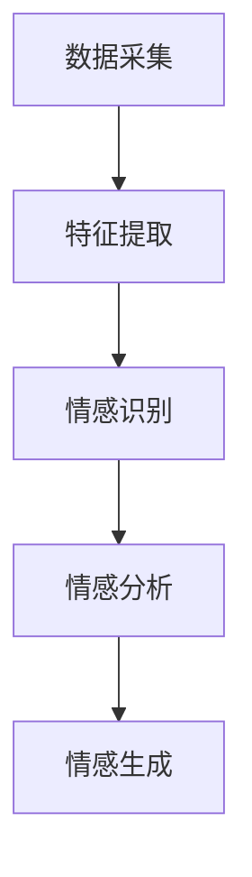
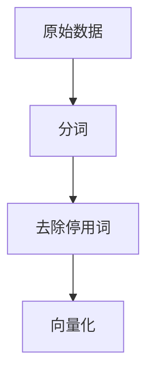
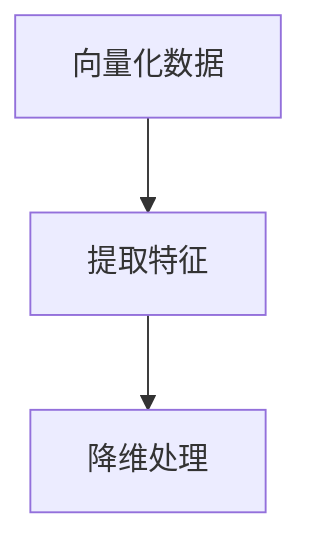
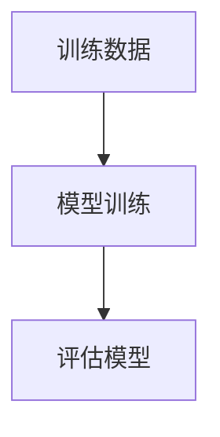
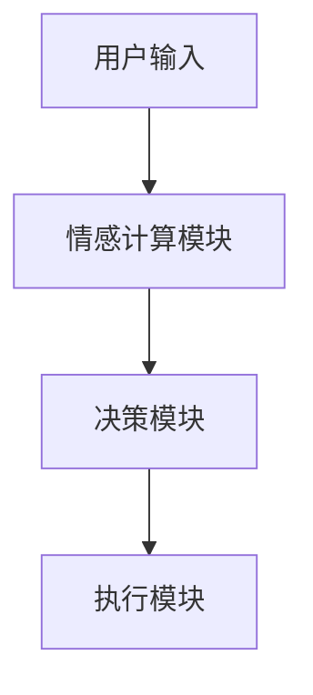
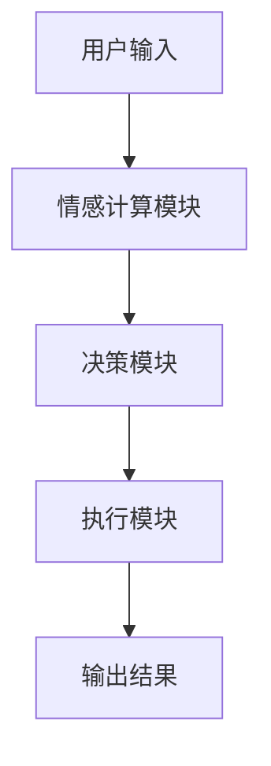
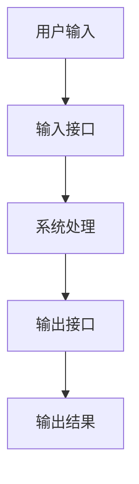

                 


# 企业AI Agent的情感计算应用：提升用户体验

> 关键词：企业AI Agent，情感计算，用户体验，机器学习，情感识别，用户情感分析，人工智能

> 摘要：本文将深入探讨企业AI Agent中情感计算的应用，分析情感计算的核心概念、算法原理、系统设计以及实际应用案例，为企业在提升用户体验方面提供理论和实践指导。

---

## 第1章 情感计算与AI Agent概述

### 1.1 情感计算的定义与背景

#### 1.1.1 情感计算的定义
情感计算（Affective Computing）是通过计算机技术来识别、分析和处理人类情感的一种新兴技术。它关注人类的情感状态，如快乐、悲伤、愤怒等，并将其融入到人机交互过程中。

#### 1.1.2 情感计算的发展历程
情感计算的发展可以追溯到20世纪末，随着人工智能和机器学习技术的进步，情感计算逐渐从理论研究走向实际应用。

#### 1.1.3 情感计算在企业中的应用价值
在企业中，情感计算可以帮助企业更好地理解用户需求，提升用户体验，优化产品设计。

### 1.2 AI Agent的基本概念

#### 1.2.1 AI Agent的定义
AI Agent（人工智能代理）是一种能够感知环境并采取行动以实现目标的智能实体。它可以在多种场景中代替人类完成任务。

#### 1.2.2 AI Agent的核心特点
- **自主性**：能够在没有外部干预的情况下运行。
- **反应性**：能够根据环境变化调整行为。
- **目标导向**：所有行为都围绕特定目标展开。

#### 1.2.3 AI Agent与传统Agent的区别
| 特性 | AI Agent | 传统Agent |
|------|-----------|------------|
| 智能水平 | 高 | 低 |
| 交互方式 | 多样化 | 单一化 |
| 学习能力 | 强大 | 无 |

### 1.3 情感计算与AI Agent的结合

#### 1.3.1 情感计算在AI Agent中的作用
情感计算使AI Agent能够理解用户的情感状态，从而提供更个性化的服务。

#### 1.3.2 AI Agent如何利用情感计算提升用户体验
通过分析用户情感，AI Agent可以调整交互方式，提供更贴心的服务，增强用户的满意度。

#### 1.3.3 情感计算与AI Agent的未来发展趋势
随着技术的进步，情感计算将更加精准，AI Agent的应用场景也将更加广泛。

---

## 第2章 情感计算的核心概念与原理

### 2.1 情感计算的核心概念

#### 2.1.1 情感识别
情感识别是通过分析用户的行为、语言和面部表情来判断其情感状态。

#### 2.1.2 情感分析
情感分析是对文本、语音等信息进行情感倾向性分析的过程。

#### 2.1.3 情感生成
情感生成是指AI系统模拟人类情感，生成符合情感需求的内容。

### 2.2 情感计算的原理

#### 2.2.1 情感计算的基本流程


#### 2.2.2 情感计算的关键技术
- **数据采集**：通过传感器或API获取用户输入。
- **特征提取**：提取有用的情感特征。
- **情感识别**：利用算法识别情感状态。

#### 2.2.3 情感计算的数学模型
$$
\text{情感评分} = \sum_{i=1}^{n} w_i \times f_i
$$
其中，\( w_i \) 是特征 \( f_i \) 的权重。

### 2.3 情感计算的核心要素

#### 2.3.1 情感数据的采集与处理
- **数据采集**：通过问卷、传感器等方式获取情感数据。
- **数据处理**：清洗和预处理数据，提取特征。

#### 2.3.2 情感特征的提取与分析
- **特征提取**：使用NLP技术提取文本特征。
- **特征分析**：分析特征之间的关系。

#### 2.3.3 情感结果的输出与应用
- **结果输出**：生成情感评分或情感标签。
- **结果应用**：根据情感结果调整AI Agent的行为。

---

## 第3章 情感计算的算法原理

### 3.1 情感计算的主要算法

#### 3.1.1 基于规则的情感计算算法
```python
def rule_based_emotion(text):
    # 定义情感词典
    positive_words = {"happy", "good", "excellent"}
    negative_words = {"sad", "bad", "terrible"}
    
    # 分词处理
    words = text.split()
    
    # 判断情感倾向
    positive_count = sum(1 for word in words if word in positive_words)
    negative_count = sum(1 for word in words if word in negative_words)
    
    if positive_count > negative_count:
        return "positive"
    elif negative_count > positive_count:
        return "negative"
    else:
        return "neutral"
```

#### 3.1.2 基于机器学习的情感计算算法
```python
from sklearn.feature_extraction.text import TfidfVectorizer
from sklearn.svm import SVC

# 数据预处理
vectorizer = TfidfVectorizer()
X = vectorizer.fit_transform(texts)
y = labels

# 训练模型
model = SVC()
model.fit(X, y)
```

#### 3.1.3 基于深度学习的情感计算算法
```python
import tensorflow as tf
from tensorflow.keras import layers

# 构建模型
model = tf.keras.Sequential()
model.add(layers.Embedding(input_dim=10000, output_dim=50))
model.add(layers.LSTM(64))
model.add(layers.Dense(1, activation="sigmoid"))
```

### 3.2 情感计算算法的实现流程

#### 3.2.1 数据预处理


#### 3.2.2 特征提取


#### 3.2.3 模型训练


#### 3.2.4 模型评估
使用准确率、召回率等指标评估模型性能。

### 3.3 情感计算的数学模型

#### 3.3.1 情感评分计算公式
$$
\text{情感评分} = \sum_{i=1}^{n} w_i \times f_i
$$
其中，\( w_i \) 是特征 \( f_i \) 的权重。

#### 3.3.2 情感分类模型
使用支持向量机（SVM）或卷积神经网络（CNN）进行情感分类。

---

## 第4章 企业级AI Agent的设计与实现

### 4.1 系统架构设计

#### 4.1.1 系统模块划分


#### 4.1.2 模块交互流程


### 4.2 功能设计

#### 4.2.1 核心功能模块
- **情感识别模块**：识别用户情感状态。
- **决策模块**：根据情感状态做出决策。

#### 4.2.2 系统功能流程


### 4.3 接口设计

#### 4.3.1 系统接口
- **输入接口**：接收用户输入。
- **输出接口**：输出处理结果。

#### 4.3.2 接口交互流程


---

## 第5章 项目实战：情感计算在企业AI Agent中的应用

### 5.1 项目背景

#### 5.1.1 项目目标
提升用户体验，优化客户服务。

#### 5.1.2 项目需求
实现情感计算功能，提升客户满意度。

### 5.2 项目实施

#### 5.2.1 环境安装
安装必要的Python库：
```bash
pip install numpy scikit-learn tensorflow
```

#### 5.2.2 核心代码实现

##### 情感识别模块
```python
def emotional_analysis(text):
    # 分词处理
    words = text.split()
    
    # 情感分析
    model = load_model('emotion_model.h5')
    prediction = model.predict(vectorizer.transform([text]))
    
    return 'positive' if prediction[0][0] > 0.5 else 'negative'
```

##### 决策模块
```python
def decision_module(emotion):
    if emotion == 'positive':
        return '感谢您的反馈！'
    else:
        return '我们会改进，请您提供具体建议。'
```

### 5.3 项目小结

#### 5.3.1 项目成果
实现了情感计算功能，提升了用户体验。

#### 5.3.2 经验总结
- 数据质量影响模型性能。
- 模型调优可以进一步提升准确率。

---

## 第6章 最佳实践与未来展望

### 6.1 最佳实践

#### 6.1.1 数据采集
确保数据多样性和代表性。

#### 6.1.2 模型选择
根据实际需求选择合适的模型。

#### 6.1.3 模型优化
通过调参和数据增强提升模型性能。

### 6.2 小结

#### 6.2.1 核心观点回顾
情感计算在企业AI Agent中的应用可以显著提升用户体验。

### 6.3 未来展望

#### 6.3.1 技术进步
情感计算将更加精准和智能化。

#### 6.3.2 应用场景扩展
情感计算将在更多领域得到应用。

---

## 附录

### 附录A 参考文献
- 省略

### 附录B 工具与库
- Python
- Scikit-learn
- TensorFlow

---

## 作者：AI天才研究院/AI Genius Institute & 禅与计算机程序设计艺术 /Zen And The Art of Computer Programming

---

**感谢您的阅读！希望本文对您理解企业AI Agent的情感计算应用有所帮助。**

