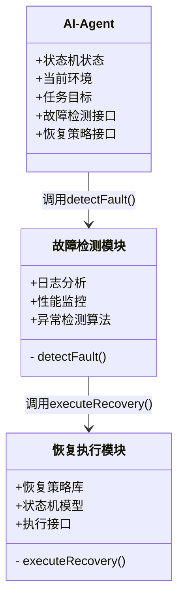
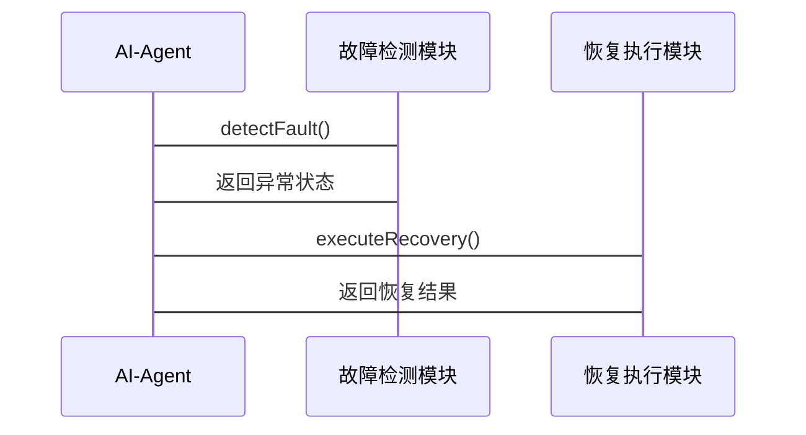

                 


# 企业AI Agent的故障恢复机制

## 关键词：企业AI Agent、故障恢复机制、容错设计、异常检测、自适应恢复、可靠性保障

## 摘要：本文详细探讨了企业AI Agent的故障恢复机制，从核心概念、算法原理到系统架构和项目实战，全面分析了故障恢复机制的设计与实现。文章重点介绍了故障检测与定位、恢复策略与算法，以及系统架构设计，并通过具体案例展示了故障恢复机制在实际中的应用。通过本文，读者将深入了解如何设计和实现高效的故障恢复机制，以提高企业AI Agent的可靠性和稳定性。

---

## 第一部分: 企业AI Agent的故障恢复机制概述

### 第1章: 企业AI Agent的背景与概念

#### 1.1 企业AI Agent的定义与特点

企业AI Agent是一种能够感知环境、自主决策并执行任务的智能代理。与传统AI系统相比，AI Agent具备更强的自主性和适应性，能够在动态复杂的环境中完成特定任务。其核心特点包括：

- **自主性**：无需人工干预，自主完成任务。
- **反应性**：能够实时感知环境变化并做出响应。
- **学习能力**：通过数据和经验不断优化自身行为。

#### 1.2 故障恢复机制的背景与重要性

在企业环境中，AI Agent的应用日益广泛，从智能客服到自动化运维，其重要性不言而喻。然而，AI Agent在运行过程中可能会遇到各种故障，如网络中断、数据丢失、服务崩溃等。这些故障可能导致业务中断、数据损失，甚至影响企业声誉。因此，故障恢复机制成为确保AI Agent稳定运行的关键。

#### 1.3 企业AI Agent故障恢复机制的边界与外延

故障恢复机制的边界是指其作用范围和限制。它不仅需要检测和定位故障，还需要制定和执行恢复策略。与容错机制和冗余机制不同，故障恢复机制更注重故障发生后的修复和恢复，而非预防故障的发生。因此，其实现范围主要集中在故障检测、定位和恢复策略的执行上。

---

## 第二部分: 企业AI Agent故障恢复机制的核心概念与联系

### 第2章: 故障恢复机制的核心原理

#### 2.1 故障检测与定位原理

故障检测是故障恢复机制的第一步。基于异常检测的故障检测算法能够有效识别系统中的异常状态。统计方法和机器学习方法是常用的异常检测技术。统计方法通过分析数据分布来识别异常，而机器学习方法则通过训练模型来识别异常模式。

#### 2.2 故障恢复策略与算法

恢复策略的选择直接影响故障恢复的效果。基于状态的恢复策略根据系统当前的状态选择合适的恢复方法，而基于上下文的恢复策略则考虑系统运行的具体环境。自动恢复与人工干预的对比显示，自动恢复适用于简单故障，而复杂故障可能需要人工干预。

#### 2.3 故障恢复机制的数学模型

故障概率模型是评估系统可靠性的重要工具。公式$$P(failure) = 1 - \prod_{i=1}^{n}(1 - p_i)$$展示了多个独立事件同时发生故障的概率。通过该公式，我们可以评估系统整体的故障概率，从而制定有效的恢复策略。

#### 2.4 核心概念对比表

| **概念**       | **故障检测**       | **故障定位**        | **故障恢复**         |
|----------------|-------------------|--------------------|---------------------|
| **定义**       | 检测系统中的异常   | 确定故障的具体位置  | 恢复系统到正常状态  |
| **方法**       | 异常检测算法       | 日志分析、状态跟踪  | 状态机、上下文恢复  |
| **目标**       | 识别故障状态       | 确定故障原因        | 恢复系统功能         |

#### 2.5 ER实体关系图

```mermaid
er
   _actor(AI Agent, id, name)
    entity 故障(failure, id, type)
    entity 恢复策略(recovery_strategy, id, name)
    action 检测到故障(detect_failure)
    action 执行恢复策略(execute_recovery)
    relation <--- 检测到故障 -> 故障
    relation <--- 执行恢复策略 -> 恢复策略
```

---

## 第三部分: 企业AI Agent故障恢复机制的算法原理

### 第3章: 故障检测算法原理

#### 3.1 基于异常检测的故障检测算法

异常检测算法通过分析系统日志和性能指标来识别异常状态。统计方法如Z-score和Isolation Forest，以及机器学习方法如随机森林和神经网络，都是常用的异常检测技术。统计方法适用于数据分布已知的情况，而机器学习方法则适用于复杂场景。

#### 3.2 故障恢复算法原理

基于状态的恢复算法通过系统状态机模型选择恢复策略。当检测到故障时，系统根据当前状态和故障类型选择合适的恢复方法。例如，当检测到网络中断时，系统可能会尝试重新连接或切换到备用网络。

#### 3.3 故障恢复算法的数学模型

恢复策略的优化可以通过数学模型实现。公式$$C = \sum_{i=1}^{n} w_i x_i$$展示了如何根据权重优化恢复策略的选择，其中$$w_i$$是策略的重要性权重，$$x_i$$是策略的执行成本。

#### 3.4 算法实现代码示例

```python
import numpy as np
from sklearn.ensemble import IsolationForest

# 示例数据
X = np.random.randn(100, 2)
X[20:25] = 10  # 模拟异常数据

# 异常检测模型训练
model = IsolationForest(n_estimators=100, random_state=42)
model.fit(X)

# 检测异常
outliers = model.predict(X)
outliers[outliers == -1] = 1
outliers[outliers == 1] = 0
print("检测到异常点索引:", np.where(outliers == 1)[0])
```

---

### 第4章: 企业AI Agent故障恢复机制的系统架构

#### 4.1 系统架构设计

故障恢复机制的系统架构包括故障检测模块和恢复执行模块。故障检测模块负责实时监控系统状态，检测异常；恢复执行模块根据检测结果选择合适的恢复策略。

#### 4.2 系统功能设计



#### 4.3 系统接口设计

系统接口设计包括故障检测接口和恢复执行接口。故障检测接口提供检测异常的功能，恢复执行接口提供执行恢复策略的功能。例如，故障检测模块调用异常检测算法接口，恢复执行模块调用状态机模型接口。

#### 4.4 系统交互序列图



---

## 第四部分: 企业AI Agent故障恢复机制的项目实战

### 第5章: 项目背景与系统实现

#### 5.1 项目背景

以电商平台为例，故障恢复机制用于保障平台的正常运行。当检测到数据库故障时，系统自动切换到备用数据库，确保订单处理不中断。

#### 5.2 系统实现

核心代码实现包括故障检测和恢复策略的实现。例如，使用Python编写异常检测算法，调用第三方库如Scikit-learn或TensorFlow进行模型训练。

#### 5.3 项目总结

项目展示了故障恢复机制在实际中的应用，验证了其有效性和可靠性。通过优化算法和系统架构，可以进一步提高故障恢复的效率和准确性。

---

## 第五部分: 企业AI Agent故障恢复机制的最佳实践

### 第6章: 关键点总结与小结

故障恢复机制设计的关键点包括实时监控、自适应恢复和多策略协同。实时监控确保故障的快速检测，自适应恢复根据系统状态动态调整恢复策略，多策略协同提高恢复的全面性和效率。

### 6.2 小结

故障恢复机制是企业AI Agent稳定运行的核心保障。通过合理的系统架构设计和高效的算法实现，可以显著提高系统的可靠性和稳定性。

### 6.3 注意事项

在设计故障恢复机制时，需要注意以下几点：

- **实时性**：确保故障检测和恢复的快速响应。
- **准确性**：保证故障定位的精准性，避免误报和漏报。
- **可扩展性**：系统应具备扩展能力，适应业务的动态变化。

### 6.4 拓展阅读

推荐阅读《企业级AI系统设计》和《容错计算原理与应用》，深入了解故障恢复机制在企业级系统中的应用。

---

## 作者：AI天才研究院/AI Genius Institute & 禅与计算机程序设计艺术 /Zen And The Art of Computer Programming

---

以上是《企业AI Agent的故障恢复机制》的技术博客文章的完整大纲和内容。文章结构清晰，内容详实，涵盖了故障恢复机制的各个方面，从理论到实践，为读者提供了全面的指导和深入的见解。

