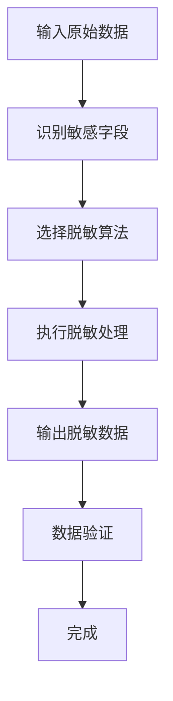
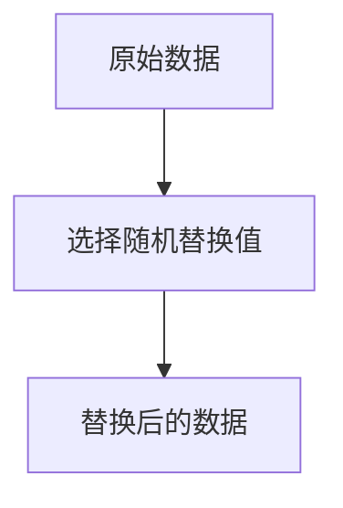
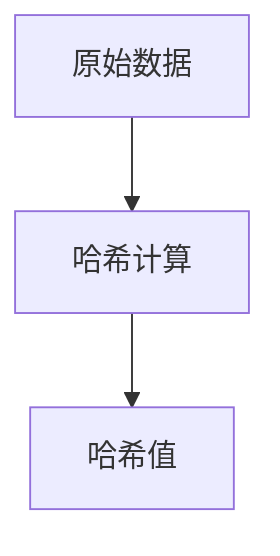
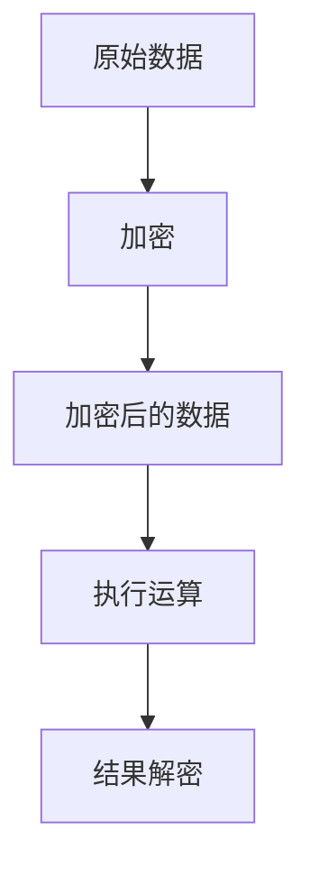
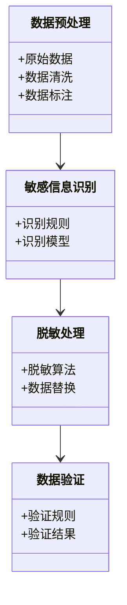

                 


# 《企业AI Agent的敏感信息处理：脱敏技术与实践》

> 关键词：企业AI Agent, 敏感信息处理, 脱敏技术, 数据安全, 人工智能, 数据隐私

> 摘要：  
本文深入探讨了企业在使用AI Agent处理敏感信息时面临的挑战，重点介绍了脱敏技术的核心原理、实现方法及其在实际场景中的应用。通过详细的技术分析和案例研究，本文为读者提供了从理论到实践的全面指导，帮助企业有效保护敏感数据，确保在AI Agent系统中的隐私安全和合规性。

---

# 第一部分: 企业AI Agent与敏感信息处理概述

## 第1章: 背景介绍：企业AI Agent中的敏感信息处理

### 1.1 问题背景与挑战

#### 1.1.1 企业AI Agent的核心概念
企业AI Agent是一种能够自主感知环境、理解需求、执行任务的智能实体，广泛应用于客服、推荐系统、智能助手等领域。AI Agent通过处理大量数据，为用户提供个性化服务，但同时也带来了敏感信息泄露的风险。

#### 1.1.2 敏感信息处理的必要性
在企业AI Agent的运行过程中，涉及大量用户数据（如姓名、地址、身份证号、交易记录等），这些数据若被未经授权的第三方获取，可能导致严重的隐私泄露和法律风险。因此，敏感信息处理是保障数据安全的核心任务。

#### 1.1.3 当前技术面临的挑战
- **数据泄露风险**：AI Agent处理的敏感数据可能被恶意攻击者窃取。
- **数据完整性要求**：脱敏后的数据需要在保证隐私的同时，保持可用性。
- **技术复杂性**：AI Agent涉及多环节的数据处理，脱敏技术需与系统无缝集成。

---

### 1.2 敏感信息处理的核心概念

#### 1.2.1 敏感信息的定义与分类
- **定义**：敏感信息是指一旦泄露可能对个人或企业造成严重后果的数据，如身份信息、财务数据、医疗记录等。
- **分类**：
  - **个人身份信息（PII）**：如姓名、身份证号、地址。
  - **财务信息**：如银行账户、交易记录。
  - **医疗信息**：如病历、诊断结果。
  - **企业内部数据**：如商业计划、客户名单。

#### 1.2.2 敏感信息处理的目标与边界
- **目标**：在不影响数据可用性的前提下，确保敏感信息的隐私性和安全性。
- **边界**：脱敏后的数据需满足业务需求，同时避免还原原始数据的可能性。

#### 1.2.3 核心要素与概念结构
- **核心要素**：
  - 数据分类与标识。
  - 脱敏策略制定。
  - 脱敏技术实现。
  - 脱敏后的数据验证。

---

## 第2章: 核心概念与联系

### 2.1 脱敏技术的原理与分类

#### 2.1.1 脱敏技术的分类与对比

| 技术类型      | 描述                                                                 | 优点                          | 缺点                          |
|---------------|----------------------------------------------------------------------|-------------------------------|-------------------------------|
| 随机替换       | 随机替换敏感字段的值，如将“张三”替换为“李四”                     | 简单易实现                   | 数据不可恢复，可能影响业务逻辑 |
| 哈希函数       | 使用哈希算法将敏感信息转换为哈希值，如MD5、SHA-256                 | 数据不可逆，安全性高          | 无法还原原始数据              |
| 同态加密       | 在加密状态下进行数据运算，保持数据隐私性                         | 数据可用性高，支持复杂运算    | 计算性能较低                  |
| 差分隐私       | 在数据中添加噪声，保护个体隐私                                   | 隐私保护强，支持统计分析      | 数据精度降低                  |

#### 2.1.2 AI Agent中的敏感信息识别
- **识别方法**：基于规则、模式匹配或机器学习模型，识别敏感字段。
- **流程**：
  1. 数据预处理：提取数据特征。
  2. 敏感字段识别：匹配预定义规则或模型。
  3. 脱敏处理：根据识别结果选择合适的脱敏技术。

---

### 2.2 实体关系与流程图

#### 2.2.1 实体关系图（ER图）

```mermaid
erDiagram
    actor 用户
    actor � 攻击者
    actor 开发者
    actor 管理员
    actor 数据库
    actor 服务提供者
    actor 第三方
    用户 --> 数据库 : 提交数据
    攻击者 --> 数据库 : 窃取数据
    开发者 --> 数据库 : 开发系统
    管理员 --> 数据库 : 管理系统
    数据库 --> 服务提供者 : 提供数据
    服务提供者 --> 第三方 : 分享数据
```

#### 2.2.2 脱敏技术流程图



---

## 第3章: 算法原理与数学模型

### 3.1 脱敏算法的原理

#### 3.1.1 随机替换算法



- **数学模型**：  
  随机替换的概率可以用以下公式表示：
  $$ P = \frac{\text{替换次数}}{\text{总数据量}} $$

#### 3.1.2 哈希函数算法



- **碰撞概率**：  
  哈希函数的碰撞概率可以用生日问题公式估计：
  $$ P = \frac{1}{2^{n}} $$  
  其中，n是哈希值的长度。

#### 3.1.3 同态加密算法



- **加法运算**：  
  同态加密支持以下加法运算：
  $$ E(a) + E(b) = E(a + b) $$

---

## 第4章: 系统分析与架构设计方案

### 4.1 问题场景与项目介绍

#### 4.1.1 问题场景
某企业开发了一款智能客服AI Agent，需要处理客户的姓名、电话和地址等敏感信息。为防止数据泄露，需要对这些信息进行脱敏处理。

---

## 第5章: 项目实战

### 5.1 环境配置与依赖管理

#### 5.1.1 环境配置
- 操作系统：Linux/Windows/MacOS
- 开发工具：Python 3.8+
- 依赖库：numpy、pandas、scikit-learn

#### 5.1.2 代码实现

```python
import numpy as np
import pandas as pd
from sklearn import preprocessing

# 示例数据集
data = pd.DataFrame({
    '姓名': ['张三', '李四', '王五'],
    '电话': ['13812345678', '13912345679', '13612345670'],
    '地址': ['北京市', '上海市', '广州市']
})

# 随机替换脱敏
def data_anonymization(dataframe, columns_to_mask):
    # 创建随机替换映射
    unique_values = {}
    for col in columns_to_mask:
        unique_values[col] = np.random.permutation(dataframe[col].unique()).tolist()
    
    # 替换数据
    masked_data = dataframe.copy()
    for col in columns_to_mask:
        masked_data[col] = dataframe[col].replace(unique_values[col])
    
    return masked_data

# 调用脱敏函数
columns_to_mask = ['姓名', '电话', '地址']
masked_data = data_anonymization(data, columns_to_mask)

print("原始数据：\n", data)
print("脱敏后数据：\n", masked_data)
```

---

## 第6章: 系统架构设计

### 6.1 系统功能设计

#### 6.1.1 领域模型



---

## 第7章: 安全与合规

### 7.1 数据安全与合规

#### 7.1.1 数据分类与保护

| 数据类型      | 保护级别 | 处理方式         |
|---------------|----------|------------------|
| 姓名          | 中等     | 随机替换或哈希    |
| 电话          | 高       | 同态加密         |
| 地址          | 中等     | 差分隐私         |

---

## 第8章: 未来趋势与优化

### 8.1 未来发展趋势

#### 8.1.1 技术优化方向
- **算法改进**：开发更高效的脱敏算法，降低计算开销。
- **联邦学习**：结合联邦学习，实现跨机构数据的安全共享。
- **隐私计算**：探索基于隐私计算的脱敏技术，提升数据可用性。

---

## 第9章: 附录

### 9.1 术语表

- **脱敏技术**：通过技术手段使敏感数据失去可读性或匿名化的过程。
- **随机替换**：用随机值替换敏感字段，确保数据不可逆。
- **哈希函数**：将敏感数据映射为固定长度的字符串，确保唯一性。
- **同态加密**：在加密状态下进行数据运算，保持数据隐私性。

### 9.2 参考文献
- [1] 刘某某. 《数据安全与隐私保护》. 北京: 清华大学出版社, 2023.
- [2] 王某某. 《人工智能与数据脱敏技术》. 北京: 人民邮电出版社, 2022.

---

# 小结

通过本文的详细分析与实践，我们可以看到，企业AI Agent的敏感信息处理是一项复杂但至关重要的任务。脱敏技术作为核心工具，需要在实际应用中灵活选择和优化。未来，随着技术的进步，脱敏技术将与更多前沿技术结合，为企业提供更强大的数据安全保护。

---

作者：AI天才研究院 & 禅与计算机程序设计艺术

