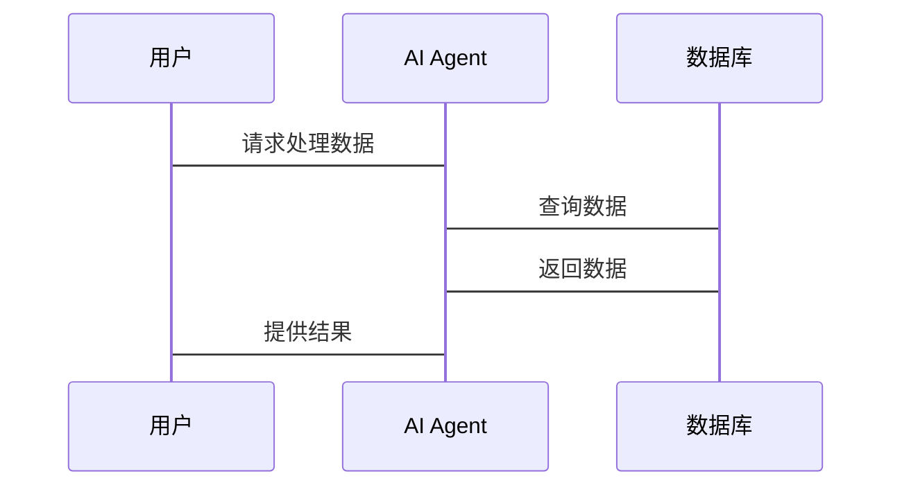

                 


# 企业AI Agent的数据安全策略

> 关键词：企业AI Agent，数据安全策略，数据加密，访问控制，系统架构设计

> 摘要：随着人工智能技术的快速发展，企业AI Agent在各个行业的应用日益广泛。然而，AI Agent的数据安全问题也随之凸显。本文从企业AI Agent的核心概念出发，详细探讨数据安全策略的设计与实施，涵盖数据加密算法、访问控制模型、系统架构设计等关键内容。通过实际案例分析和代码实现，为读者提供全面的数据安全解决方案，帮助企业在AI Agent应用中确保数据的机密性、完整性和可用性。

---

## 第一章: 企业AI Agent与数据安全的背景

### 1.1 企业AI Agent的定义与特点

#### 1.1.1 AI Agent的基本概念
AI Agent（人工智能代理）是一种能够感知环境并采取行动以实现特定目标的智能实体。企业AI Agent通常用于自动化决策、数据处理和业务流程优化。

#### 1.1.2 企业AI Agent的核心特征
- **自主性**：能够独立决策和行动。
- **反应性**：能够实时感知环境并做出反应。
- **目标导向**：所有行为都围绕实现特定目标展开。
- **学习能力**：通过数据和经验不断优化自身性能。

#### 1.1.3 企业AI Agent的应用场景
- **客户关系管理**：通过分析客户行为数据，提供个性化服务。
- **供应链管理**：优化库存管理和物流调度。
- **风险管理**：实时监控和预测潜在风险。

### 1.2 数据安全的重要性

#### 1.2.1 数据安全的基本概念
数据安全是指保护数据的机密性、完整性和可用性。企业数据是核心资产，数据泄露可能导致重大损失。

#### 1.2.2 数据安全在企业中的关键作用
- **防止数据泄露**：保护敏感信息不被未经授权的访问。
- **确保数据完整性**：防止数据被篡改或损坏。
- **保障可用性**：确保数据在需要时可访问。

#### 1.2.3 数据安全面临的挑战
- **数据量大**：企业AI Agent处理的数据量庞大，增加了安全管理的难度。
- **复杂性高**：AI Agent涉及多个系统和数据源，导致安全风险复杂化。
- **技术更新快**：安全威胁和技术手段不断变化，要求安全策略持续更新。

### 1.3 企业AI Agent与数据安全的结合

#### 1.3.1 AI Agent在企业中的数据处理流程
1. **数据采集**：从多个来源收集数据。
2. **数据处理**：清洗、转换和分析数据。
3. **数据存储**：将数据存储在安全的数据库中。
4. **数据使用**：基于数据生成决策和行动。

#### 1.3.2 数据安全在AI Agent中的核心地位
- **数据隐私**：保护用户隐私，防止个人信息泄露。
- **数据访问控制**：确保只有授权人员可以访问敏感数据。
- **数据加密**：在传输和存储过程中对数据进行加密，防止被窃取。

#### 1.3.3 企业AI Agent数据安全的挑战与机遇
- **挑战**：AI Agent的复杂性和数据处理的广泛性增加了安全风险。
- **机遇**：通过AI技术提升安全策略的智能化和自动化水平。

### 1.4 本章小结
本章介绍了企业AI Agent的基本概念、特点及其应用场景，强调了数据安全的重要性，并指出了AI Agent在数据安全方面的挑战与机遇。

---

## 第二章: 数据安全策略的框架与分类

### 2.1 数据安全策略的框架

#### 2.1.1 数据分类与分级
- **数据分类**：根据数据的类型（如结构化数据、非结构化数据）进行分类。
- **数据分级**：根据数据的重要性（如机密、敏感、公开）进行分级。

#### 2.1.2 数据生命周期管理
数据从生成、处理、存储到归档、销毁的全生命周期管理，每个阶段都需要不同的安全策略。

#### 2.1.3 数据安全策略的层次结构
- **战略层**：制定整体数据安全战略。
- **战术层**：具体的安全措施和操作流程。
- **技术层**：实现安全措施的技术手段。

### 2.2 数据安全策略的分类

#### 2.2.1 基于数据类型的分类
- **结构化数据**：如数据库中的表格数据。
- **非结构化数据**：如文本、图像等。

#### 2.2.2 基于数据用途的分类
- **操作数据**：用于日常业务操作。
- **分析数据**：用于数据分析和决策支持。

#### 2.2.3 基于数据存储位置的分类
- **本地数据**：存储在企业内部服务器。
- **云数据**：存储在第三方云服务提供商。

### 2.3 数据安全策略的实施原则

#### 2.3.1 最小权限原则
用户和系统组件只能访问与其职责相关的最小权限。

#### 2.3.2 数据最小化原则
在数据采集和处理过程中，只收集必要的数据。

#### 2.3.3 可追溯性原则
记录数据的访问和操作日志，便于审计和追溯。

### 2.4 本章小结
本章详细探讨了数据安全策略的框架与分类，并提出了实施数据安全策略的基本原则。

---

## 第三章: 数据加密与访问控制算法

### 3.1 数据加密算法

#### 3.1.1 对称加密算法
- **AES（高级加密标准）**：广泛应用于数据加密，加密速度快，安全性高。

#### 3.1.2 非对称加密算法
- **RSA（ Rivest-Shamir-Adleman）**：基于大整数分解的公钥加密算法。

#### 3.1.3 哈希函数
- **SHA-256**：常用哈希函数，用于生成数据摘要。

#### 3.1.4 加密算法实现示例
```python
import hashlib

# 使用SHA-256哈希函数对数据进行加密
def encrypt_data(data):
    hash_object = hashlib.sha256(data.encode())
    return hash_object.hexdigest()
```

### 3.2 数据访问控制算法

#### 3.2.1 基于角色的访问控制（RBAC）
- **角色定义**：每个角色对应一组权限。
- **权限分配**：用户通过其所属的角色获得权限。

#### 3.2.2 基于属性的访问控制（ABAC）
- **属性定义**：用户、资源和环境的属性。
- **动态权限分配**：根据属性动态调整权限。

#### 3.2.3 基于规则的访问控制（RBAC）
- **规则定义**：基于预定义的规则控制访问。

#### 3.2.4 访问控制算法实现示例
```python
# 基于角色的访问控制示例
def has_permission(user, action, resource):
    # 获取用户的角色
    role = get_role(user)
    # 获取资源的权限
    permissions = get_permissions(resource)
    # 检查用户是否具有相应权限
    return role in permissions
```

### 3.3 算法实现与优化

#### 3.3.1 加密算法的性能优化
- **选择合适的加密算法**：根据需求选择加密速度和安全性。
- **优化加密流程**：减少不必要的加密步骤。

#### 3.3.2 访问控制算法的可扩展性
- **模块化设计**：便于扩展和维护。
- **动态调整**：根据需求动态调整访问控制规则。

#### 3.3.3 算法的安全性评估
- **定期审计**：评估算法的安全性。
- **漏洞修复**：及时修复发现的漏洞。

### 3.4 本章小结
本章详细讲解了数据加密和访问控制算法，包括对称加密、非对称加密、哈希函数以及基于角色的访问控制等，并给出了具体的实现示例。

---

## 第四章: 企业AI Agent数据安全的系统架构设计

### 4.1 系统架构设计

#### 4.1.1 数据存储层
- **数据库设计**：采用关系型数据库和非关系型数据库结合。
- **数据冗余**：确保数据的高可用性。

#### 4.1.2 AI Agent层
- **数据处理逻辑**：AI Agent负责数据的处理和分析。
- **模型训练**：基于数据训练机器学习模型。

#### 4.1.3 管理层
- **权限管理**：管理用户的权限和角色。
- **日志管理**：记录数据的访问和操作日志。

### 4.2 数据安全系统的实体关系图
```mermaid
erDiagram
    customer : 客户
    employee : 员工
    order : 订单
    product : 产品
    sale : 销售
    payment : 支付
    customer --> order : 下订单
    order --> product : 订单包含产品
    order --> employee : 处理订单
    sale --> product : 销售记录
    sale --> customer : 销售给客户
    payment --> customer : 支付方式
```

### 4.3 系统交互流程图


### 4.4 本章小结
本章详细讨论了企业AI Agent数据安全的系统架构设计，包括数据存储层、AI Agent层和管理层的设计，并通过实体关系图和交互流程图展示了系统的整体架构。

---

## 第五章: 项目实战

### 5.1 环境搭建

#### 5.1.1 安装Python环境
- 安装Python和pip。

#### 5.1.2 安装必要的库
- 使用pip安装numpy、pandas、scipy等库。

### 5.2 系统核心实现源代码

#### 5.2.1 数据加密模块
```python
import hashlib
import hmac

def encrypt_data(data, key):
    # 使用HMAC-SHA256进行数据签名
    signature = hmac.new(key.encode(), data.encode(), hashlib.sha256).hexdigest()
    return signature
```

#### 5.2.2 访问控制模块
```python
def has_permission(user, action, resource):
    # 获取用户角色
    role = get_role(user)
    # 获取资源权限
    permissions = get_permissions(resource)
    # 检查权限
    return role in permissions
```

### 5.3 实际案例分析

#### 5.3.1 案例背景
某企业AI Agent用于客户数据分析，需要确保客户数据的安全性。

#### 5.3.2 数据加密与访问控制实现
- **数据加密**：对客户敏感信息进行加密存储。
- **访问控制**：仅允许授权员工访问客户数据。

#### 5.3.3 安全审计
定期审计数据访问日志，确保无未经授权的访问。

### 5.4 本章小结
本章通过一个实际案例，详细讲解了企业AI Agent数据安全策略的实施过程，包括环境搭建、代码实现和案例分析。

---

## 第六章: 最佳实践与小结

### 6.1 最佳实践

#### 6.1.1 定期安全审计
定期检查数据安全策略的执行情况。

#### 6.1.2 培训与教育
对员工进行数据安全培训，提高安全意识。

#### 6.1.3 第三方工具
使用专业的数据安全工具辅助管理。

### 6.2 小结

#### 6.2.1 注意事项
- **及时更新**：安全策略需要随技术发展不断更新。
- **团队协作**：数据安全需要多部门协作。

#### 6.2.2 拓展阅读
推荐阅读《数据安全治理》和《人工智能安全》等书籍。

### 6.3 本章小结
本章总结了企业AI Agent数据安全策略的实施经验，并提出了未来的发展方向。

---

## 作者

作者：AI天才研究院/AI Genius Institute & 禅与计算机程序设计艺术/Zen And The Art of Computer Programming

---

通过以上结构化的内容，您可以根据实际需求，逐步填充每个部分的具体内容，以完成一篇完整的《企业AI Agent的数据安全策略》技术博客文章。

