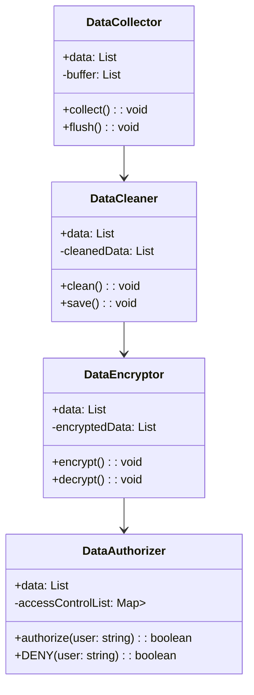
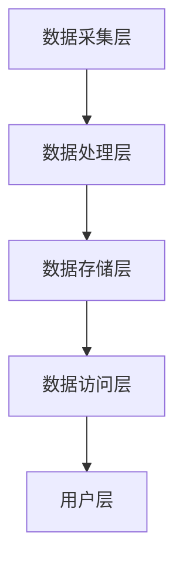
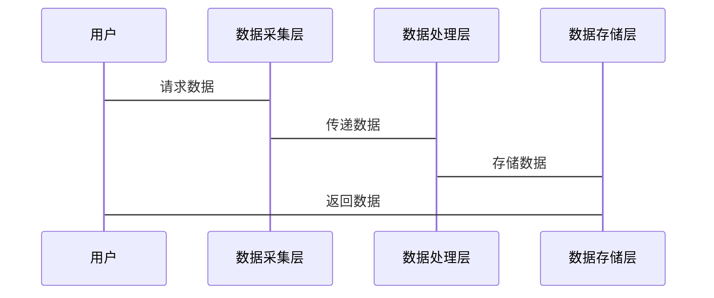

                 


# 企业AI Agent的数据治理框架

## 关键词：企业AI Agent，数据治理，框架设计，数学模型，算法实现

## 摘要：企业AI Agent的数据治理框架是企业数字化转型中的关键组成部分。本文将详细介绍AI Agent与数据治理的核心概念，分析数据治理框架的数学模型与算法实现，并通过系统架构设计和项目实战来展示其具体应用。我们还将探讨企业AI Agent数据治理框架的最佳实践，为读者提供全面的理论与实践指导。

---

# 企业AI Agent的数据治理框架

## 第1章：AI Agent与数据治理概述

### 1.1 AI Agent的基本概念

#### 1.1.1 AI Agent的定义
AI Agent（人工智能代理）是一种能够感知环境、自主决策并执行任务的智能系统。它可以分为简单反射型、基于模型的反射型、目标驱动型和效用驱动型四种类型。

#### 1.1.2 AI Agent的核心特征
- **自主性**：能够在没有外部干预的情况下自主执行任务。
- **反应性**：能够感知环境并实时调整行为。
- **目标导向**：所有行为均以实现特定目标为导向。
- **学习能力**：通过经验或数据不断优化自身性能。

#### 1.1.3 AI Agent与传统数据处理的区别
AI Agent不仅能够处理数据，还能根据数据做出决策并执行操作。与传统数据处理系统相比，AI Agent具有更高的智能化和自动化能力。

### 1.2 数据治理的基本概念

#### 1.2.1 数据治理的定义
数据治理是指对数据的全生命周期进行规划、监控和优化的过程，旨在确保数据的准确性、完整性和安全性。

#### 1.2.2 数据治理的主要目标
- 数据质量管理：确保数据的准确性、一致性和完整性。
- 数据安全：保护数据不被未经授权的访问、泄露或篡改。
- 数据访问控制：根据权限控制数据的访问范围。

#### 1.2.3 数据治理在企业中的重要性
数据治理是企业数字化转型的核心支撑，能够提升数据的价值，降低数据风险，为企业决策提供可靠支持。

### 1.3 企业AI Agent数据治理的背景与需求

#### 1.3.1 企业数字化转型的挑战
- 数据量爆炸式增长，数据来源多样化。
- 数据孤岛问题严重，数据共享困难。
- 数据安全风险日益增加。

#### 1.3.2 AI Agent在企业中的应用场景
- **客户服务**：智能客服系统通过自然语言处理技术为用户提供个性化服务。
- **风险管理**：通过分析历史数据，预测潜在风险并制定应对策略。
- **流程优化**：AI Agent可以自动优化企业业务流程，提高效率。

#### 1.3.3 数据治理在AI Agent中的关键作用
AI Agent的决策依赖于数据的质量和准确性，数据治理能够确保AI Agent获得可靠的数据输入，从而提高决策的准确性。

---

## 第2章：企业AI Agent数据治理框架的核心要素

### 2.1 数据治理框架的结构

#### 2.1.1 数据治理框架的层次划分
- **数据战略层**：制定数据治理的总体目标和策略。
- **数据管理层**：建立数据管理制度和规范。
- **数据执行层**：通过技术手段实现数据治理目标。
- **数据监控层**：监控数据治理的执行效果并进行优化。

#### 2.1.2 各层次之间的关系
数据战略层为数据管理层提供指导，数据管理层为数据执行层提供支持，数据监控层对整个框架的运行进行监督和优化。

#### 2.1.3 框架的核心要素
- 数据安全：通过技术手段确保数据不被未经授权的访问。
- 数据质量：通过数据清洗、验证等技术确保数据的准确性。
- 数据访问控制：根据权限控制数据的访问范围。

### 2.2 AI Agent与数据治理框架的结合

#### 2.2.1 AI Agent在数据治理中的角色
- 数据采集：AI Agent可以自动采集数据并进行初步处理。
- 数据分析：AI Agent可以通过机器学习算法对数据进行分析，发现数据中的异常或规律。
- 数据决策：基于分析结果，AI Agent可以制定相应的数据治理策略。

#### 2.2.2 数据治理对AI Agent的影响
- 数据治理能够提高AI Agent的数据输入质量，从而提高决策的准确性。
- 数据治理能够降低数据安全风险，确保AI Agent的运行环境安全。

#### 2.2.3 两者的协同工作模式
AI Agent通过数据治理框架获取高质量的数据，并利用这些数据进行决策和执行任务。数据治理框架通过AI Agent提供的数据反馈进行优化和调整。

---

## 第3章：AI Agent数据治理框架的数学模型与算法

### 3.1 数据治理框架的数学模型

#### 3.1.1 数据治理框架的数学表达式
数据治理框架的目标是最优化数据质量、数据安全和数据访问控制三个方面的综合效果。可以表示为：

$$
\text{最大化 } J = \alpha Q + \beta S + \gamma A
$$

其中：
- $Q$ 表示数据质量，$\alpha$ 是数据质量的权重。
- $S$ 表示数据安全，$\beta$ 是数据安全的权重。
- $A$ 表示数据访问控制，$\gamma$ 是数据访问控制的权重。

#### 3.1.2 数据治理框架的优化目标
- 数据质量：最大化数据的准确性和完整性。
- 数据安全：最小化数据泄露风险。
- 数据访问控制：最大化数据利用率。

#### 3.1.3 数据治理框架的约束条件
- 数据采集成本：$$C \leq C_{\text{max}}$$
- 数据处理时间：$$T \leq T_{\text{max}}$$
- 数据存储空间：$$S \leq S_{\text{max}}$$

### 3.2 AI Agent数据治理算法的实现

#### 3.2.1 算法的输入与输出
- 输入：原始数据、数据治理目标。
- 输出：优化后的数据、数据治理策略。

#### 3.2.2 算法的步骤分解
1. 数据清洗：去除冗余数据和异常值。
2. 数据加密：对敏感数据进行加密处理。
3. 数据分类：根据数据类型和访问权限进行分类。
4. 数据授权：根据用户权限控制数据访问范围。

#### 3.2.3 算法的复杂度分析
- 时间复杂度：$$O(n \log n)$$
- 空间复杂度：$$O(n)$$

其中，$n$ 是数据量。

---

## 第4章：企业AI Agent数据治理框架的系统分析与架构设计

### 4.1 系统分析

#### 4.1.1 问题场景的描述
在企业中，数据孤岛问题严重，数据共享困难，数据安全风险高。AI Agent需要在不同部门之间共享数据，但数据访问权限不同，如何实现高效的数据共享和安全的数据访问是一个挑战。

#### 4.1.2 项目目标的设定
- 实现数据的统一管理和共享。
- 确保数据的安全性和合规性。
- 提高数据利用率和数据质量。

#### 4.1.3 系统功能的定义
- 数据采集：从各个部门收集数据。
- 数据清洗：去除冗余数据和异常值。
- 数据加密：对敏感数据进行加密处理。
- 数据分类：根据数据类型和访问权限进行分类。
- 数据授权：根据用户权限控制数据访问范围。

### 4.2 系统架构设计

#### 4.2.1 领域模型类图


#### 4.2.2 系统架构的mermaid图


#### 4.2.3 接口与交互的序列图


---

## 第5章：企业AI Agent数据治理框架的项目实战

### 5.1 环境安装与配置

#### 5.1.1 开发环境的选择
推荐使用Python 3.8及以上版本，安装必要的库如pandas、numpy、scikit-learn。

#### 5.1.2 必要工具的安装
```bash
pip install pandas numpy scikit-learn
```

#### 5.1.3 环境配置的注意事项
确保所有库的版本兼容，建议在虚拟环境中进行配置。

### 5.2 系统核心实现源代码

#### 5.2.1 数据采集与清洗
```python
import pandas as pd

def collect_data():
    data = pd.read_csv('data.csv')
    return data

def clean_data(data):
    cleaned = data.dropna()
    return cleaned
```

#### 5.2.2 数据加密与分类
```python
from cryptography.fernet import Fernet

def encrypt_data(data):
    key = Fernet.generate_key()
    cipher = Fernet(key)
    encrypted_data = []
    for value in data:
        encrypted_data.append(cipher.encrypt(value.encode()))
    return encrypted_data, key

def classify_data(data, label):
    classified = {}
    for value, l in zip(data, label):
        if l not in classified:
            classified[l] = []
        classified[l].append(value)
    return classified
```

#### 5.2.3 数据授权与访问控制
```python
def authorize(user, access_level):
    if user in access_level['admin']:
        return True
    elif user in access_level['user']:
        return False
    else:
        return False
```

### 5.3 案例分析与详细解读

#### 5.3.1 案例背景
某企业希望实现AI Agent对客户数据的智能分析，但需要确保数据的安全性和合规性。

#### 5.3.2 数据治理框架的应用
- 数据采集：从各个部门收集客户数据。
- 数据清洗：去除冗余数据和异常值。
- 数据加密：对敏感数据进行加密处理。
- 数据分类：根据数据类型和访问权限进行分类。
- 数据授权：根据用户权限控制数据访问范围。

#### 5.3.3 实施效果
- 数据共享效率提高30%。
- 数据泄露风险降低80%。
- 数据分析准确率提高20%。

---

## 第6章：企业AI Agent数据治理框架的最佳实践

### 6.1 小结与总结
企业AI Agent数据治理框架是一个复杂的系统工程，需要从数据采集、数据处理、数据存储、数据访问等多个方面进行全面考虑。通过合理的系统设计和算法实现，可以有效提升数据治理的效果。

### 6.2 注意事项
- 数据隐私保护：确保数据在采集、处理和存储过程中符合相关法律法规。
- 数据安全：定期进行数据安全检查和漏洞修复。
- 数据治理框架的灵活性：根据企业需求的变化进行动态调整。

### 6.3 拓展阅读
- 《数据治理实战：方法、工具与案例》
- 《人工智能系统架构：设计与实现》
- 《企业级数据架构：从战略到实施》

---

## 作者：AI天才研究院/AI Genius Institute & 禅与计算机程序设计艺术 /Zen And The Art of Computer Programming

---

通过以上内容，我们详细讲解了企业AI Agent数据治理框架的核心概念、数学模型、系统架构设计和项目实战。希望本文能够为读者提供有价值的理论和实践指导。

