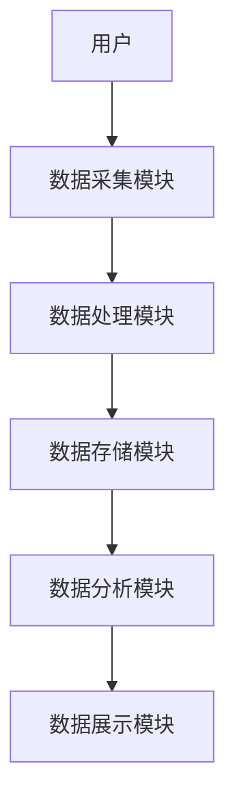

                 


# 企业AI Agent的数据治理策略

## 关键词：企业AI Agent，数据治理，知识图谱，规则引擎，数据安全，决策引擎

## 摘要：随着人工智能技术的快速发展，企业AI Agent在各个领域的应用越来越广泛。然而，AI Agent的有效运作离不开高质量的数据治理。本文将详细探讨企业AI Agent的数据治理策略，包括数据收集、处理、存储、分析和安全等方面。通过分析数据治理的核心概念、算法原理、系统架构设计和项目实战，本文旨在为企业提供一套有效的数据治理方案，以提升AI Agent的性能和可靠性。

---

## 第1章：企业AI Agent与数据治理概述

### 1.1 数据治理的定义与重要性

#### 1.1.1 数据治理的基本概念
数据治理是指对数据的全生命周期进行管理，包括数据的收集、处理、存储、分析和应用。有效的数据治理能够确保数据的准确性、一致性和完整性，为企业决策提供可靠支持。

#### 1.1.2 数据治理在企业中的作用
数据治理在企业中扮演着关键角色。它不仅能够提高数据质量，还能降低数据风险，确保数据安全，同时优化数据利用效率。

#### 1.1.3 AI Agent与数据治理的关系
AI Agent是一种能够自主感知环境并执行任务的智能体。数据治理是AI Agent正常运作的基础，没有良好的数据治理，AI Agent将无法有效处理数据，进而影响其决策能力和执行效率。

### 1.2 企业AI Agent的定义与特点

#### 1.2.1 AI Agent的基本概念
AI Agent是一种能够感知环境、理解任务并执行操作的智能系统。它能够通过数据输入做出决策，并根据反馈不断优化自身行为。

#### 1.2.2 AI Agent的核心特点
- **自主性**：AI Agent能够在没有外部干预的情况下自主运作。
- **反应性**：AI Agent能够根据环境变化实时调整行为。
- **学习能力**：AI Agent能够通过数据学习和优化自身的算法。

#### 1.2.3 数据治理在AI Agent中的关键作用
数据治理在AI Agent中的作用主要体现在数据的质量、安全和隐私保护方面。高质量的数据是AI Agent准确决策的基础，而严格的数据安全措施则能够保护企业的敏感信息。

### 1.3 数据治理的背景与挑战

#### 1.3.1 数据治理的背景
随着大数据技术的发展，企业数据量呈现指数级增长。如何有效地管理和利用这些数据成为企业面临的重要挑战。

#### 1.3.2 数据治理的主要挑战
- **数据孤岛**：数据分布在不同的系统中，缺乏统一的管理和利用。
- **数据隐私**：数据的安全性和隐私保护成为企业关注的重点。
- **数据质量**：数据的不一致性和不准确性可能影响AI Agent的决策能力。

#### 1.3.3 AI Agent数据治理的独特性
AI Agent的数据治理需要结合AI技术的特点，例如实时数据处理、动态决策等。这使得AI Agent的数据治理更加复杂，但也更具挑战性。

---

## 第2章：数据治理的核心概念与联系

### 2.1 数据治理的核心要素

#### 2.1.1 数据质量
数据质量是指数据的准确性、完整性、一致性和及时性。高质量的数据是AI Agent准确决策的基础。

#### 2.1.2 数据安全
数据安全是指保护数据不被未经授权的访问、泄露或篡改。在AI Agent中，数据安全尤为重要，因为AI Agent通常需要处理敏感数据。

#### 2.1.3 数据隐私
数据隐私是指个人或组织对其数据的控制权和使用权。在AI Agent中，数据隐私保护是确保用户信任的关键。

### 2.2 数据治理与AI Agent的关系

#### 2.2.1 数据治理对AI Agent的影响
数据治理直接影响AI Agent的数据输入质量和处理能力。良好的数据治理能够提高AI Agent的决策准确性和执行效率。

#### 2.2.2 AI Agent对数据治理的促进作用
AI Agent可以通过数据分析和学习，发现数据中的潜在问题，并提出改进建议，从而促进数据治理的优化。

### 2.3 数据治理的ER实体关系图

```mermaid
erDiagram
    actor 用户 {
        key string 用户ID
        string 用户名
        string 密码
    }
    actor 管理员 {
        key string 管理员ID
        string 管理员名
        string 密码
    }
    entity 数据 {
        key string 数据ID
        string 数据内容
        date 数据创建时间
        date 数据修改时间
        string 数据状态
    }
    entity 权限 {
        key string 权限ID
        string 权限名称
        string 权限描述
    }
    user -- permission : 拥有
    user -- data : 访问
    administrator -- data : 管理
```

---

## 第3章：数据治理的算法原理

### 3.1 数据清洗算法

#### 3.1.1 数据清洗的定义
数据清洗是指识别和处理数据中的错误、不一致和冗余信息，以提高数据质量的过程。

#### 3.1.2 数据清洗的步骤
1. 数据收集与识别
2. 数据去重
3. 数据填充
4. 数据转换
5. 数据删除

#### 3.1.3 数据清洗的数学模型
数据清洗可以通过以下公式表示：
$$
\text{清洗后数据} = \text{原始数据} - \text{错误数据}
$$

### 3.2 数据分类算法

#### 3.2.1 数据分类的定义
数据分类是指将数据划分为不同的类别，以便更好地管理和利用。

#### 3.2.2 数据分类的算法流程
1. 数据预处理
2. 特征提取
3. 模型训练
4. 模型评估
5. 模型应用

#### 3.2.3 数据分类的数学模型
数据分类可以通过以下公式表示：
$$
y = f(x) + \epsilon
$$
其中，$y$ 是目标变量，$x$ 是特征向量，$f$ 是模型函数，$\epsilon$ 是误差项。

---

## 第4章：数据治理的系统分析与架构设计

### 4.1 系统功能设计

#### 4.1.1 数据采集模块
数据采集模块负责从多个数据源采集数据，并进行初步的清洗和转换。

#### 4.1.2 数据处理模块
数据处理模块负责对采集到的数据进行进一步的处理，包括数据清洗、转换和标准化。

#### 4.1.3 数据存储模块
数据存储模块负责将处理后的数据存储到数据库或其他存储系统中，以便后续的分析和应用。

### 4.2 系统架构设计



### 4.3 系统接口设计

#### 4.3.1 数据采集接口
```python
def collect_data(source):
    # 从指定数据源采集数据
    pass
```

#### 4.3.2 数据处理接口
```python
def process_data(data):
    # 对数据进行清洗和转换
    pass
```

#### 4.3.3 数据存储接口
```python
def store_data(data):
    # 将数据存储到数据库
    pass
```

---

## 第5章：数据治理的项目实战

### 5.1 环境配置

#### 5.1.1 安装必要的库
```bash
pip install pandas numpy scikit-learn
```

### 5.2 核心代码实现

#### 5.2.1 数据清洗代码
```python
import pandas as pd

def clean_data(df):
    # 删除重复数据
    df.drop_duplicates(inplace=True)
    # 填充缺失值
    df.fillna(method='ffill', inplace=True)
    return df
```

#### 5.2.2 数据分类代码
```python
from sklearn.tree import DecisionTreeClassifier
from sklearn.model_selection import train_test_split

def classify_data(df, target_column):
    # 分割数据集
    X = df.drop(columns=[target_column])
    y = df[target_column]
    X_train, X_test, y_train, y_test = train_test_split(X, y, test_size=0.2)
    # 训练模型
    model = DecisionTreeClassifier()
    model.fit(X_train, y_train)
    return model
```

### 5.3 案例分析与代码解读

#### 5.3.1 案例分析
以电商企业的用户行为数据为例，通过数据清洗和分类，帮助企业识别高价值客户。

#### 5.3.2 代码解读
数据清洗代码用于去除重复数据和填充缺失值，确保数据的完整性和一致性。数据分类代码使用决策树模型对用户进行分类，帮助企业识别不同类型的客户。

### 5.4 项目小结
通过本项目，我们可以看到数据治理在企业AI Agent中的重要性。通过数据清洗和分类，企业能够更好地利用数据，提升AI Agent的决策能力。

---

## 第6章：数据治理的最佳实践与小结

### 6.1 最佳实践

#### 6.1.1 数据治理的制度化
企业应制定数据治理的制度和规范，明确数据管理的责任和流程。

#### 6.1.2 数据安全的强化
企业应加强数据安全措施，确保数据在采集、处理和存储过程中的安全性。

#### 6.1.3 数据隐私的保护
企业应遵守数据隐私相关法律法规，保护用户隐私权益。

### 6.2 小结
数据治理是企业AI Agent成功的关键。通过科学的数据治理策略，企业能够充分利用数据资源，提升AI Agent的性能和可靠性。

### 6.3 注意事项
- 数据治理应与企业实际需求相结合，避免过于复杂化。
- 数据治理需要持续优化，根据业务变化不断调整策略。
- 数据治理应注重数据的质量和安全，确保数据的可靠性和合规性。

### 6.4 拓展阅读
- 《数据治理与AI技术的结合》
- 《企业数据安全与隐私保护》

---

## 总结与展望

企业AI Agent的数据治理是一个复杂但重要的任务。通过本文的探讨，我们了解了数据治理的核心概念、算法原理、系统架构设计和项目实战。未来，随着AI技术的不断发展，数据治理将变得更加重要，企业需要不断创新和完善数据治理策略，以应对新的挑战和机遇。

---

## 作者：AI天才研究院/AI Genius Institute & 禅与计算机程序设计艺术 /Zen And The Art of Computer Programming

