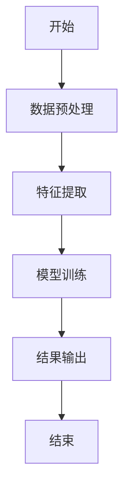
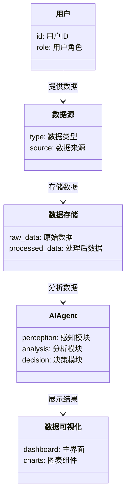
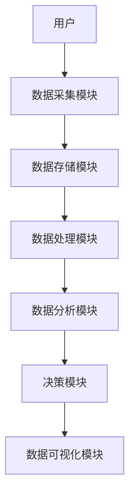
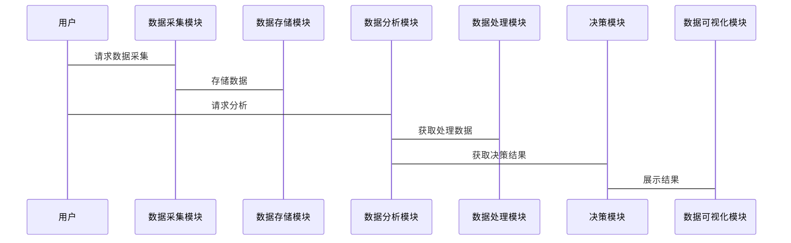

                 


# 《企业AI Agent的时空大数据挖掘平台》

---

## 关键词：企业AI Agent, 时空大数据, 数据挖掘, 算法原理, 系统架构

---

## 摘要：  
本文详细探讨了企业AI Agent在时空大数据挖掘中的应用，分析了时空大数据的核心概念、算法原理及系统架构，结合实际案例展示了如何构建高效的企业AI Agent时空大数据挖掘平台，并提出了最佳实践建议。

---

## 第一部分: 企业AI Agent与时空大数据挖掘平台背景介绍

### 第1章: 企业AI Agent的时空大数据挖掘概述

#### 1.1 问题背景与问题描述
##### 1.1.1 企业AI Agent的定义与特点
企业AI Agent是一种能够自主感知、分析和决策的智能体，具备以下特点：
- **自主性**：无需人工干预，自动执行任务。
- **反应性**：能实时感知环境变化并做出响应。
- **目标导向**：基于预设目标优化决策。

##### 1.1.2 时空大数据的概念与特征
时空大数据是指在时间和空间维度上具有高度结构化、半结构化或非结构化的海量数据，其主要特征包括：
- **时空关联性**：数据点之间存在地理位置和时间上的联系。
- **异构性**：数据来源多样，格式复杂。
- **动态性**：数据随时间和空间变化而不断更新。

##### 1.1.3 企业AI Agent与时空大数据挖掘的结合
企业AI Agent通过时空大数据挖掘技术，能够从海量数据中提取有价值的信息，支持企业的智能决策和业务优化。

#### 1.2 问题解决与边界外延
##### 1.2.1 时空大数据挖掘的核心目标
- 提供实时、精准的决策支持。
- 发现数据中的潜在模式和趋势。
- 支持复杂场景下的智能决策。

##### 1.2.2 企业AI Agent在时空大数据中的应用边界
- **数据范围**：处理企业内部及外部相关数据。
- **决策范围**：支持企业的战略、战术级决策。
- **技术边界**：基于现有的AI技术和大数据处理能力。

##### 1.2.3 时空大数据挖掘的外延与扩展
- **数据源扩展**：支持更多数据源的接入。
- **应用场景扩展**：从企业内部扩展到行业生态。
- **算法扩展**：引入更先进的AI算法。

#### 1.3 概念结构与核心要素
##### 1.3.1 时空大数据挖掘的核心要素
- **数据采集**：实时采集多源数据。
- **数据处理**：清洗、转换和集成。
- **数据分析**：挖掘时空关联性。
- **结果呈现**：可视化和决策支持。

##### 1.3.2 企业AI Agent的构成要素
- **感知模块**：实时感知环境数据。
- **分析模块**：基于AI算法进行分析。
- **决策模块**：制定并执行决策。

##### 1.3.3 时空大数据与企业AI Agent的关系
时空大数据是企业AI Agent的“原料”，而企业AI Agent则是时空大数据挖掘的“工具”。

#### 1.4 本章小结
本章从企业AI Agent和时空大数据的基本概念出发，分析了两者结合的应用背景、核心目标及边界条件，为后续章节的深入探讨奠定了基础。

---

### 第2章: 时空大数据挖掘的核心概念与联系

#### 2.1 核心概念原理
##### 2.1.1 时空数据的特征与属性
- **空间特征**：地理位置、区域划分。
- **时间特征**：时间戳、时间段。

##### 2.1.2 AI Agent的核心算法与模型
- **监督学习**：决策树、随机森林。
- **无监督学习**：聚类、降维。
- **强化学习**：策略优化。

##### 2.1.3 时空大数据挖掘的基本原理
通过算法提取数据中的时空关联性，支持AI Agent的智能决策。

#### 2.2 核心概念属性对比表
| 对比维度 | 时空数据 | 传统数据 |
|----------|----------|----------|
| 数据特征 | 空间+时间 | 仅时间或空间 |
| 数据量   | 海量     | 中等或小规模 |
| 处理难度 | 高       | 中等       |

#### 2.3 ER实体关系图
```mermaid
er
  actor: 用户
  agent: AI Agent
  data: 时空数据
  relation: 属于
  actor -[属于]-> agent
  agent -[处理]-> data
```

#### 2.4 本章小结
本章通过对比分析，明确了时空大数据与传统数据的区别，以及企业AI Agent在时空大数据挖掘中的角色和作用。

---

### 第3章: 时空大数据挖掘的算法原理

#### 3.1 算法原理概述
##### 3.1.1 时空数据预处理
- 数据清洗：去除噪声数据。
- 数据转换：统一数据格式。

##### 3.1.2 时空特征提取
- 空间特征：地理位置编码。
- 时间特征：时间序列分析。

##### 3.1.3 时空数据建模
- 空间模型：空间权重矩阵。
- 时间模型：时间序列预测。

#### 3.2 算法流程图


#### 3.3 时空数据挖掘算法实现
##### 3.3.1 Python代码示例
```python
import pandas as pd
from sklearn.model_selection import train_test_split
from sklearn.ensemble import RandomForestClassifier

# 数据预处理
data = pd.read_csv('spatiotemporal_data.csv')
X = data.drop('label', axis=1)
y = data['label']

X_train, X_test, y_train, y_test = train_test_split(X, y, test_size=0.2)

# 特征提取
# 假设已经提取了时空特征
selected_features = ['time_feature', 'space_feature']

# 模型训练
model = RandomForestClassifier()
model.fit(X_train[selected_features], y_train)

# 预测与评估
accuracy = model.score(X_test[selected_features], y_test)
print(f'模型准确率: {accuracy}')
```

##### 3.3.2 数学模型与公式
时空权重计算模型：
$$ w_{ij} = \frac{1}{(distance_{ij} + 1)^2} $$

时间序列预测模型：
$$ y_t = \alpha y_{t-1} + \beta x_t + \epsilon $$

#### 3.4 本章小结
本章详细介绍了时空大数据挖掘的核心算法及其实现，通过代码示例和数学公式，帮助读者理解算法的实现细节。

---

### 第4章: 系统分析与架构设计方案

#### 4.1 问题场景介绍
企业需要构建一个实时处理时空大数据的AI Agent平台，支持多种应用场景。

#### 4.2 项目介绍
##### 4.2.1 项目目标
构建高效、可靠的时空大数据挖掘平台。

##### 4.2.2 项目范围
涵盖数据采集、处理、分析和可视化。

#### 4.3 系统功能设计
##### 4.3.1 领域模型


##### 4.3.2 系统架构设计


##### 4.3.3 系统交互设计


#### 4.4 本章小结
本章通过系统架构设计，展示了企业AI Agent时空大数据挖掘平台的实现方案，明确了各模块的功能与交互关系。

---

### 第5章: 项目实战

#### 5.1 环境安装与配置
- 安装Python、Pandas、Scikit-learn等工具。

#### 5.2 核心功能实现
##### 5.2.1 数据采集模块
```python
import requests

def fetch_data(api_url):
    response = requests.get(api_url)
    return response.json()
```

##### 5.2.2 数据处理模块
```python
import pandas as pd

def process_data(data):
    df = pd.DataFrame(data)
    # 数据清洗
    df = df.dropna()
    return df
```

##### 5.2.3 数据分析模块
```python
from sklearn.ensemble import RandomForestClassifier

def train_model(X, y):
    model = RandomForestClassifier()
    model.fit(X, y)
    return model
```

##### 5.2.4 数据可视化模块
```python
import matplotlib.pyplot as plt

def visualize_results(data):
    plt.plot(data['time'], data['value'])
    plt.show()
```

#### 5.3 案例分析与详细解读
通过一个具体案例，展示如何利用企业AI Agent进行时空大数据挖掘，实现智能决策。

#### 5.4 本章小结
本章通过实际项目案例，展示了企业AI Agent时空大数据挖掘平台的实现过程，帮助读者掌握核心功能的实现方法。

---

### 第6章: 最佳实践与小结

#### 6.1 最佳实践
- **数据质量管理**：确保数据的准确性和完整性。
- **算法优化**：根据业务需求选择合适的算法。
- **系统安全性**：保护数据安全和系统稳定。

#### 6.2 小结
企业AI Agent时空大数据挖掘平台的建设需要综合考虑数据、算法、系统架构等多个方面，通过不断优化和实践，才能实现高效的智能决策支持。

#### 6.3 注意事项
- 数据隐私保护
- 系统性能优化
- 业务需求匹配

#### 6.4 拓展阅读
- 《时空数据挖掘的算法研究》
- 《企业AI Agent的实践应用》

---

## 作者：AI天才研究院/AI Genius Institute & 禅与计算机程序设计艺术 /Zen And The Art of Computer Programming

---

**感谢您的阅读！希望本文能为您提供有价值的技术见解和实践指导！**

