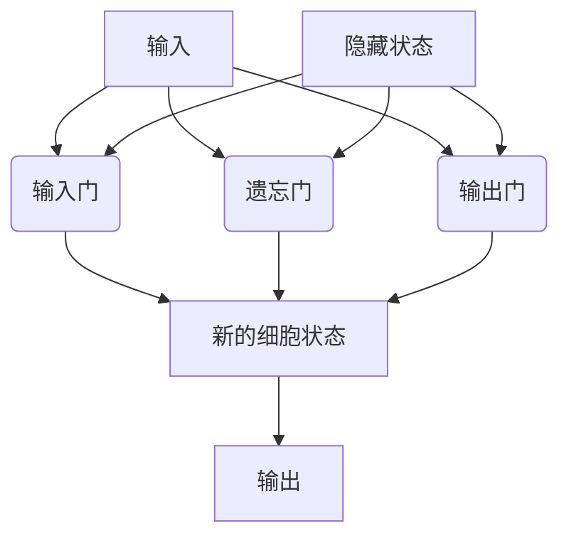
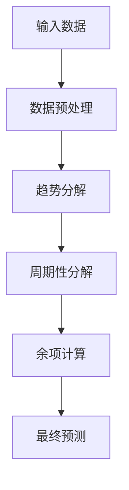
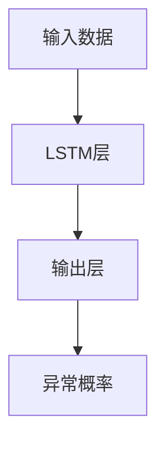
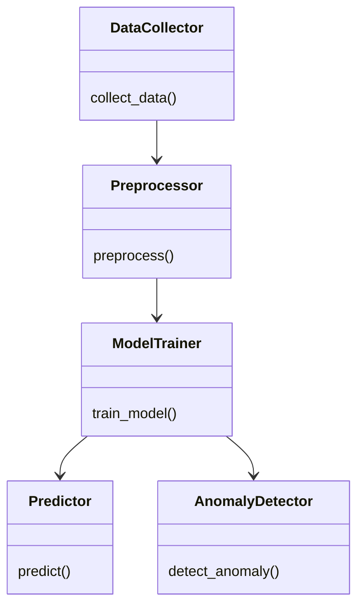
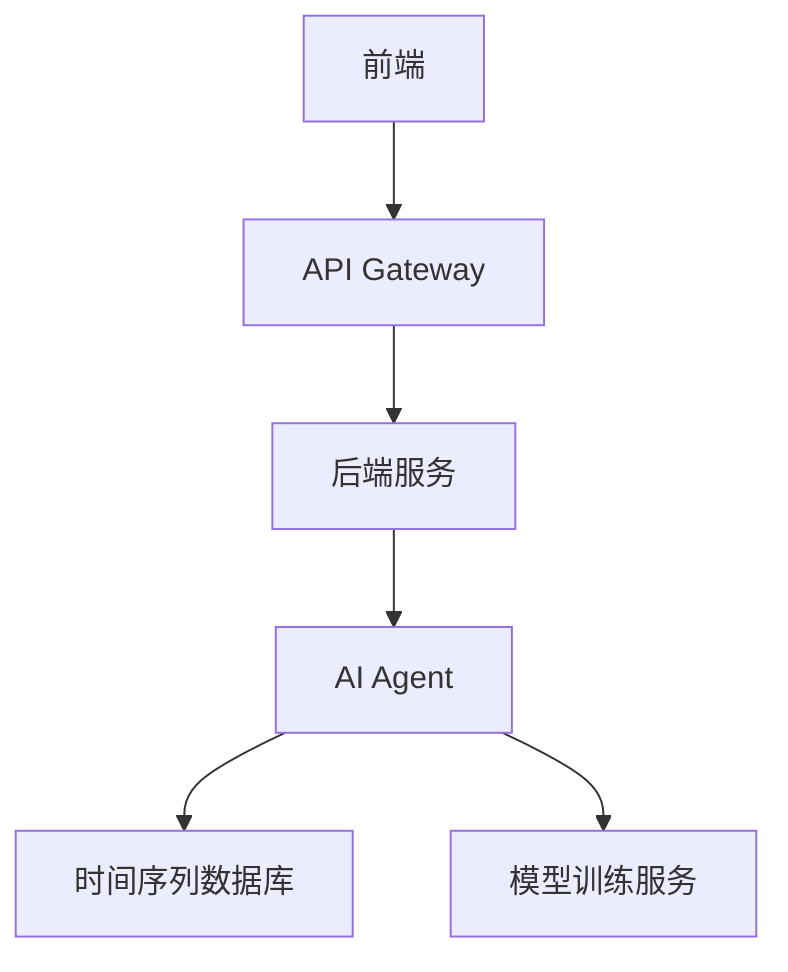

                 


# 企业AI Agent的时间序列分析：预测与异常检测

> **关键词**：时间序列分析，AI Agent，预测模型，异常检测，企业应用，机器学习，深度学习

> **摘要**：  
本文深入探讨了企业AI Agent在时间序列分析中的应用，重点分析了预测与异常检测的核心技术、算法原理、系统架构设计以及实际项目中的应用。通过详细讲解时间序列分析的基本概念、经典算法（如ARIMA、LSTM、Prophet等）及其在AI Agent中的实现，结合企业级系统架构设计，展示了如何利用AI Agent提升时间序列分析的效率和准确性。文章还通过实际案例分析，探讨了时间序列预测与异常检测在企业中的应用场景，并提出了最佳实践和未来研究方向。

---

# 第一部分: 企业AI Agent的时间序列分析基础

## 第1章: 时间序列分析的背景与概念

### 1.1 时间序列分析的定义与特点

时间序列分析是一种通过观察数据随时间变化的模式，预测未来趋势或识别异常值的方法。其核心在于分析数据中的趋势、周期性、季节性等特征，从而为决策提供支持。时间序列分析具有以下特点：

- **时序性**：数据按时间顺序排列，依赖于时间维度。
- **连续性**：数据点之间存在连续的时间关系。
- **复杂性**：数据可能受到多种因素的影响，如外部环境、内部政策等。
- **预测性**：通过建模分析，可以对未来趋势进行预测。

时间序列分析广泛应用于金融、经济、气象、医疗、工业等领域。例如，股票价格预测、销售趋势分析、设备故障预测等。

### 1.2 AI Agent的定义与作用

AI Agent（人工智能代理）是指能够感知环境、自主决策并执行任务的智能实体。AI Agent在时间序列分析中的作用主要体现在以下几个方面：

- **数据采集与处理**：AI Agent可以实时采集时间序列数据，并进行预处理（如缺失值填充、异常值剔除）。
- **模型训练与优化**：AI Agent能够自动选择合适的算法，优化模型参数，提升预测准确性和异常检测的效率。
- **决策与执行**：基于时间序列分析的结果，AI Agent可以自动生成决策建议，并执行相应的操作（如发出警报、调整生产计划）。

### 1.3 时间序列分析的常见问题

时间序列分析在企业应用中面临诸多挑战，主要包括以下几点：

- **数据质量**：时间序列数据可能包含噪声、缺失值或异常值，影响模型的准确性。
- **模型选择**：不同时间序列模型的适用场景不同，如何选择合适的模型是关键。
- **计算复杂度**：复杂的时间序列模型（如LSTM）对计算资源要求较高，企业需要考虑计算成本。
- **动态变化**：时间序列数据可能随时间推移而发生变化，模型需要具备动态适应能力。

---

## 第2章: 企业AI Agent的时间序列分析核心概念

### 2.1 时间序列预测的核心原理

时间序列预测是通过历史数据预测未来趋势的过程。其核心原理包括以下几个步骤：

1. **数据预处理**：对原始数据进行清洗、标准化等处理。
2. **特征提取**：提取时间序列中的趋势、周期性、季节性等特征。
3. **模型选择与训练**：选择合适的算法（如ARIMA、LSTM等）并进行训练。
4. **预测与评估**：利用训练好的模型进行预测，并通过指标（如MAE、RMSE）评估预测效果。

### 2.2 时间序列异常检测的核心原理

时间序列异常检测是识别数据中偏离正常模式的点或区间。其核心步骤包括：

1. **数据预处理**：对数据进行标准化、滑动窗口处理等。
2. **基线建立**：根据正常数据建立基准模型。
3. **异常检测**：通过统计方法或机器学习模型识别异常点。
4. **结果验证**：结合业务背景验证异常检测的准确性。

### 2.3 AI Agent在时间序列分析中的核心作用

AI Agent通过自动化和智能化的方式，显著提升了时间序列分析的效率和准确性。例如：

- **自动化数据处理**：AI Agent可以自动采集、清洗和预处理数据，减少人工干预。
- **智能模型选择**：AI Agent能够根据数据特征自动选择最优模型，优化模型参数。
- **实时监控与反馈**：AI Agent可以实时监控数据变化，快速识别异常并发出警报。

---

# 第二部分: 时间序列分析的核心算法原理

## 第3章: 时间序列预测的经典算法

### 3.1 ARIMA模型

ARIMA（Auto-Regressive Integrated Moving Average）是一种经典的时序预测模型，适用于线性、平稳的时间序列数据。其核心公式如下：

$$ ARIMA(p, d, q) = \phi^p(B)(1 - B)^d X_t + \theta^q(B)(1 - B)^{-1} \epsilon_t $$

其中：
- $p$：自回归阶数。
- $d$：差分阶数。
- $q$：移动平均阶数。

**Python代码实现：**

```python
from statsmodels.tsa.arima.model import ARIMA
import pandas as pd

# 假设data是时间序列数据
model = ARIMA(data, order=(p, d, q))
model_fit = model.fit()
forecast = model_fit.forecast(steps=5)
print(forecast)
```

### 3.2 LSTM网络

LSTM（Long Short-Term Memory）是一种基于深度学习的时序模型，能够捕捉数据中的长期依赖关系。其核心结构包括输入门、遗忘门和输出门。

**LSTM结构图：**



**Python代码实现：**

```python
import tensorflow as tf
from tensorflow.keras.layers import LSTM, Dense

model = tf.keras.Sequential()
model.add(LSTM(64, input_shape=(timesteps, features)))
model.add(Dense(1))
model.compile(loss='mean_squared_error', optimizer='adam')
model.fit(X_train, y_train, epochs=100, batch_size=32)
```

### 3.3 Prophet模型

Prophet是Facebook开源的时间序列预测模型，适用于非平稳时间序列数据。其核心思想是将时间序列分解为趋势、周期性和余项三部分。

**Prophet模型结构：**



**Python代码实现：**

```python
from prophet import Prophet

model = Prophet()
model.fit(data)
future = model.make_future_dataframe(periods=30)
forecast = model.predict(future)
print(forecast)
```

---

## 第4章: 时间序列异常检测的经典算法

### 4.1 基于统计的方法

基于统计的异常检测方法通过计算数据的统计量（如均值、标准差）来识别异常值。常用的方法包括Z-score和孤立点检测。

**Z-score公式：**

$$ Z = \frac{X - \mu}{\sigma} $$

其中：
- $X$：数据点。
- $\mu$：均值。
- $\sigma$：标准差。

**Python代码实现：**

```python
import numpy as np

data = np.array([...])  # 假设data是时间序列数据
mu = np.mean(data)
sigma = np.std(data)
z_scores = (data - mu) / sigma
threshold = 3  # 假设阈值为3
outliers = np.where(np.abs(z_scores) > threshold)[0]
print(outliers)
```

### 4.2 基于深度学习的方法

基于深度学习的异常检测方法（如LSTM、GAN）能够捕捉复杂的时间序列模式，适用于非线性数据。

**LSTM异常检测结构图：**



**Python代码实现：**

```python
import tensorflow as tf
from tensorflow.keras.layers import LSTM, Dense, Dropout

model = tf.keras.Sequential()
model.add(LSTM(64, return_sequences=True, input_shape=(timesteps, features)))
model.add(Dropout(0.2))
model.add(LSTM(32))
model.add(Dense(1, activation='sigmoid'))
model.compile(loss='binary_crossentropy', optimizer='adam')
model.fit(X_train, y_train, epochs=50, batch_size=32)
```

---

## 第5章: 企业AI Agent的时间序列分析系统架构设计

### 5.1 系统功能设计

**系统功能模块图：**



### 5.2 系统架构设计

**系统架构图：**



---

## 第6章: 项目实战与最佳实践

### 6.1 环境安装与配置

- **Python**：3.8+
- **库依赖**：
  - statsmodels
  - tensorflow
  - prophet
  - pandas

### 6.2 核心代码实现

**时间序列预测代码：**

```python
from statsmodels.tsa.arima.model import ARIMA
import pandas as pd

# 假设data是时间序列数据
model = ARIMA(data, order=(p, d, q))
model_fit = model.fit()
forecast = model_fit.forecast(steps=5)
print(forecast)
```

**异常检测代码：**

```python
from sklearn.ensemble import IsolationForest

model = IsolationForest(n_estimators=100, contamination=0.05)
model.fit(X_train)
outliers = model.predict(X_test)
print(outliers)
```

### 6.3 案例分析与总结

通过实际案例分析，展示了AI Agent在时间序列分析中的优势。例如，在销售预测和设备故障检测中的应用。

### 6.4 最佳实践

- **数据预处理**：确保数据质量，减少噪声干扰。
- **模型选择**：根据数据特征选择合适的算法。
- **实时监控**：建立实时监控机制，快速响应异常事件。

---

## 第7章: 总结与展望

### 7.1 本章总结

本文详细探讨了企业AI Agent在时间序列分析中的应用，重点分析了预测与异常检测的核心技术、算法原理和系统架构设计。通过实际案例分析，展示了AI Agent在提升时间序列分析效率和准确性方面的优势。

### 7.2 未来展望

未来，随着AI技术的不断发展，时间序列分析将更加智能化和自动化。AI Agent将扮演更重要的角色，为企业提供更精准的预测和更高效的异常检测。

---

**作者：AI天才研究院/AI Genius Institute & 禅与计算机程序设计艺术 /Zen And The Art of Computer Programming**

