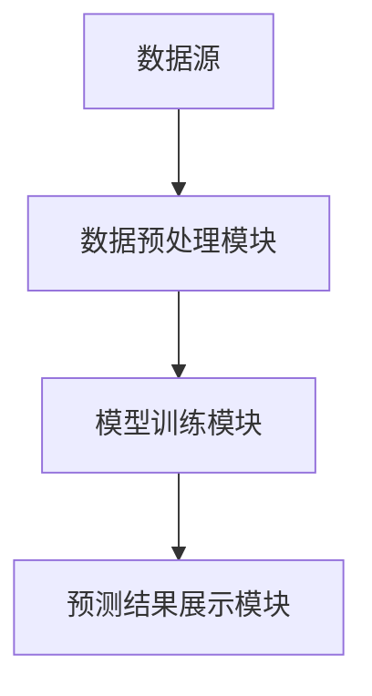
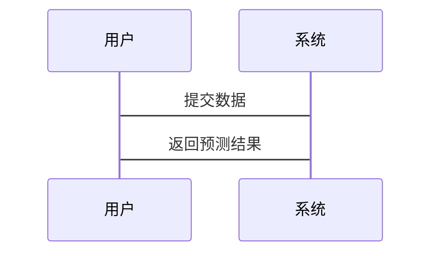

                 


# 企业AI Agent的时间序列预测在财务规划中的应用

> 关键词：时间序列预测，AI Agent，财务规划，机器学习，深度学习

> 摘要：  
本文探讨了企业AI Agent在时间序列预测中的应用，特别是在财务规划中的重要性。通过分析时间序列预测的算法原理、系统架构设计以及实际项目案例，本文详细阐述了AI Agent如何通过先进的算法和智能化的系统架构，提升企业财务规划的准确性和效率。文章还结合实际代码实现和数学模型，深入分析了时间序列预测的核心概念及其在企业中的应用价值，为企业智能化转型提供了有益的参考。

---

# 第一部分：企业AI Agent的时间序列预测基础

## 第1章：时间序列预测的背景与应用

### 1.1 时间序列预测的基本概念

#### 1.1.1 时间序列预测的定义
时间序列预测是一种利用历史数据预测未来趋势的技术，其核心在于分析数据中的时间依赖性。例如，企业的财务数据（如收入、支出、利润）通常具有明显的时序特性，可以通过时间序列预测模型进行预测。

#### 1.1.2 时间序列预测的核心要素
时间序列预测的核心要素包括：
- **数据**：时间戳和对应的观测值。
- **模型**：用于捕捉数据中的趋势、季节性、周期性等特征。
- **预测**：基于模型对未来数据的预测值。

#### 1.1.3 时间序列预测的应用场景
时间序列预测在多个领域都有广泛应用，如金融、经济、天气预测等。在企业财务规划中，时间序列预测可以用于预测收入、成本、现金流等关键指标，帮助企业制定更科学的财务策略。

### 1.2 企业AI Agent的定义与特点

#### 1.2.1 AI Agent的基本概念
AI Agent（人工智能代理）是一种能够感知环境并采取行动以实现目标的智能实体。它可以是一个软件系统，通过分析数据、执行任务或提供决策支持来辅助人类完成目标。

#### 1.2.2 AI Agent的核心功能
AI Agent的核心功能包括：
- **感知环境**：通过传感器、API等方式获取数据。
- **决策与行动**：基于数据进行分析和决策，执行预设或自适应的行动。
- **自适应与学习**：通过机器学习算法不断优化自身的行为。

#### 1.2.3 AI Agent在企业中的角色
在企业中，AI Agent可以扮演多种角色，如数据分析员、预测模型构建者、决策支持工具等。特别是在财务规划中，AI Agent可以通过时间序列预测帮助企业预测未来财务状况，优化资源配置。

### 1.3 时间序列预测在财务规划中的重要性

#### 1.3.1 财务规划的基本概念
财务规划是企业为了实现财务目标而制定的计划，包括预算编制、资金分配、风险控制等。准确的财务规划可以帮助企业更好地应对市场变化和内部需求。

#### 1.3.2 时间序列预测在财务规划中的作用
时间序列预测在财务规划中的作用主要体现在：
- **预测准确性**：通过历史数据预测未来财务指标，帮助企业制定更准确的财务计划。
- **实时性**：时间序列预测可以实时更新，帮助企业及时调整财务策略。
- **决策支持**：基于预测结果，企业可以更好地进行资源分配和风险控制。

#### 1.3.3 AI Agent在财务规划中的优势
AI Agent在财务规划中的优势包括：
- **自动化**：AI Agent可以自动获取数据、训练模型并生成预测结果。
- **高效性**：通过机器学习算法，AI Agent可以快速处理大量数据并生成预测结果。
- **智能化**：AI Agent可以根据历史数据和市场变化，自动优化预测模型。

---

## 第2章：时间序列预测的核心概念与联系

### 2.1 时间序列预测的原理

#### 2.1.1 时间序列预测的基本原理
时间序列预测的基本原理是基于数据的时序特性，通过模型捕捉数据中的趋势、季节性、周期性等特征，从而预测未来的观测值。例如，ARIMA模型可以通过分析数据的自相关性来预测未来的值。

#### 2.1.2 时间序列预测的数学模型
时间序列预测的数学模型是模型的核心部分，不同的模型有不同的数学表达式。例如，ARIMA模型的数学公式如下：

$$ ARIMA(p, d, q) $$

其中，p为自回归阶数，d为差分阶数，q为移动平均阶数。

#### 2.1.3 时间序列预测的特征分析
时间序列预测的特征分析包括对数据的趋势、季节性、周期性等特征的分析。例如，可以通过分解时间序列数据，提取其趋势和季节性成分，从而更好地理解数据的变化规律。

### 2.2 AI Agent与时间序列预测的关系

#### 2.2.1 AI Agent如何实现时间序列预测
AI Agent可以通过集成时间序列预测算法来实现预测功能。例如，AI Agent可以使用LSTM网络对时间序列数据进行建模和预测。

#### 2.2.2 时间序列预测如何赋能AI Agent
时间序列预测可以为AI Agent提供实时的预测结果，帮助AI Agent做出更准确的决策。例如，AI Agent可以根据预测的收入数据，自动调整企业的资源分配策略。

#### 2.2.3 AI Agent与传统时间序列预测的区别
AI Agent与传统时间序列预测的区别主要体现在智能化和自动化方面。AI Agent可以自动获取数据、训练模型并生成预测结果，而传统时间序列预测通常需要手动进行数据预处理和模型调优。

### 2.3 时间序列预测的算法对比

#### 2.3.1 常见时间序列预测算法概述
常见的时间序列预测算法包括ARIMA、LSTM、Prophet等。每种算法都有其独特的优势和适用场景。

#### 2.3.2 不同算法的优缺点对比
以下是几种常见时间序列预测算法的优缺点对比：

| 算法   | 优点                           | 缺点                           |
|--------|--------------------------------|--------------------------------|
| ARIMA  | 基于统计学，适用于线性数据       | 不适用于非线性数据               |
| LSTM   | 基于深度学习，适用于非线性数据   | 计算复杂，需要大量数据           |
| Prophet| 易用性高，适用于非线性数据       | 对异常值敏感                     |

#### 2.3.3 算法选择的依据与策略
算法选择的依据包括数据特性、计算资源、预测精度等。例如，如果数据具有明显的季节性，可以选择Prophet模型；如果数据具有复杂的非线性特征，可以选择LSTM网络。

---

## 第3章：时间序列预测的算法原理

### 3.1 常见时间序列预测算法详解

#### 3.1.1 ARIMA模型
ARIMA模型是一种经典的统计学模型，适用于线性时间序列数据。其核心思想是通过自回归和移动平均来预测未来的观测值。

#### 3.1.2 LSTM网络
LSTM（长短期记忆网络）是一种基于深度学习的时间序列预测模型，能够捕捉数据中的长期依赖关系。其核心组件包括输入门、遗忘门和输出门。

#### 3.1.3 Prophet模型
Prophet模型是由Facebook开源的一种时间序列预测模型，具有较高的易用性和预测精度。其核心思想是将时间序列数据分解为趋势和季节性成分，并进行预测。

### 3.2 算法原理的数学模型

#### 3.2.1 ARIMA模型的数学公式
ARIMA模型的数学公式如下：

$$ ARIMA(p, d, q) $$

其中，p为自回归阶数，d为差分阶数，q为移动平均阶数。

#### 3.2.2 LSTM网络的结构与公式
LSTM网络的结构包括输入门、遗忘门和输出门。其核心公式如下：

$$
i_t = \sigma(w_i x_t + u_i h_{t-1} + b_i) \\
f_t = \sigma(w_f x_t + u_f h_{t-1} + b_f) \\
o_t = \sigma(w_o x_t + u_o h_{t-1} + b_o) \\
h_t = i_t \cdot \tanh(w_c x_t + u_c h_{t-1} + b_c)
$$

其中，$i_t$、$f_t$、$o_t$分别为输入门、遗忘门和输出门，$h_t$为当前状态。

#### 3.2.3 Prophet模型的核心公式
Prophet模型的核心公式如下：

$$
y(t) = g(t) + s(t) + \epsilon_t
$$

其中，$g(t)$为趋势成分，$s(t)$为季节性成分，$\epsilon_t$为误差项。

### 3.3 算法实现的步骤与流程

#### 3.3.1 数据预处理
数据预处理包括数据清洗、数据归一化、数据分训练集和测试集等步骤。

#### 3.3.2 模型训练
模型训练包括选择合适的算法、调整模型参数、训练模型等步骤。

#### 3.3.3 模型预测
模型预测包括使用训练好的模型对未来的观测值进行预测，并评估预测结果的准确性。

---

## 第4章：时间序列预测的系统分析与架构设计

### 4.1 系统架构设计

#### 4.1.1 系统功能设计
系统功能设计包括数据采集、模型训练、预测结果展示等模块。

#### 4.1.2 系统架构图
以下是系统架构图：



#### 4.1.3 系统接口设计
系统接口设计包括数据接口、模型接口、结果接口等。

### 4.2 系统交互设计

#### 4.2.1 系统交互流程
以下是系统交互流程图：



---

## 第5章：时间序列预测的项目实战

### 5.1 项目介绍

#### 5.1.1 项目背景
本项目旨在利用时间序列预测技术，帮助企业预测未来的财务指标，优化财务规划。

#### 5.1.2 项目目标
项目目标包括：
- 实现时间序列预测模型。
- 集成AI Agent，实现预测结果的自动化展示。

### 5.2 项目核心实现

#### 5.2.1 环境安装
需要安装的环境包括Python、TensorFlow、Keras等。

#### 5.2.2 核心代码实现
以下是核心代码实现：

```python
import pandas as pd
import numpy as np
from sklearn.metrics import mean_squared_error
from tensorflow.keras.models import Sequential
from tensorflow.keras.layers import LSTM, Dense

# 数据加载
data = pd.read_csv('financial_data.csv')

# 数据预处理
train_data = data.iloc[:100]
test_data = data.iloc[100:]

# LSTM模型构建
model = Sequential()
model.add(LSTM(50, input_shape=(1, 1)))
model.add(Dense(1))
model.compile(loss='mean_squared_error', optimizer='adam')

# 模型训练
train_labels = train_data['target'].values.reshape(-1, 1)
train_features = train_data['input'].values.reshape(-1, 1, 1)
model.fit(train_features, train_labels, epochs=50, batch_size=32)

# 模型预测
test_features = test_data['input'].values.reshape(-1, 1, 1)
test_labels = test_data['target'].values.reshape(-1, 1)
 predictions = model.predict(test_features)
```

#### 5.2.3 代码应用解读与分析
上述代码实现了LSTM模型的训练和预测。首先，加载数据并进行预处理，然后构建LSTM模型并进行训练，最后使用测试数据进行预测。

### 5.3 项目小结

#### 5.3.1 经验总结
通过本项目，我们掌握了时间序列预测的基本实现方法，同时也认识到模型调优和数据预处理的重要性。

#### 5.3.2 改进方向
未来可以尝试使用其他算法（如Prophet模型）进行预测，并比较不同算法的预测效果。

---

## 第6章：时间序列预测的最佳实践与小结

### 6.1 最佳实践

#### 6.1.1 数据预处理的重要性
数据预处理是时间序列预测的关键步骤，包括数据清洗、归一化等。

#### 6.1.2 模型调优的策略
模型调优的策略包括选择合适的算法、调整模型参数、进行交叉验证等。

### 6.2 小结

#### 6.2.1 本文核心内容回顾
本文详细探讨了时间序列预测在企业AI Agent中的应用，分析了常见算法的原理和实现方法，并结合实际项目案例进行了深入分析。

#### 6.2.2 未来发展方向
未来，时间序列预测将在企业智能化转型中发挥更大的作用，特别是在财务规划、风险控制等领域。

---

## 作者信息

作者：AI天才研究院/AI Genius Institute & 禅与计算机程序设计艺术 /Zen And The Art of Computer Programming

---

**注**：由于篇幅限制，上述内容为文章的部分章节，完整文章可根据此大纲进一步扩展和补充。

