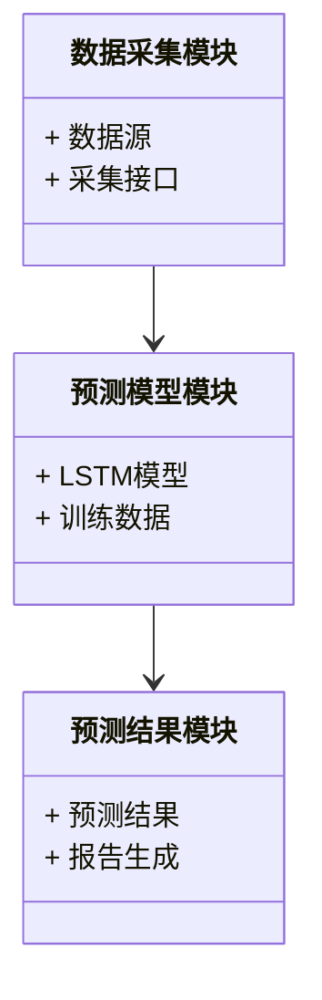
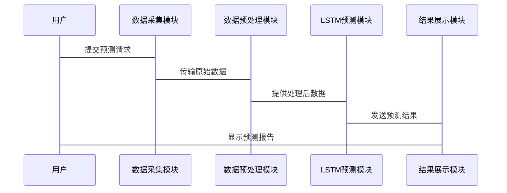

                 


# 企业AI Agent的时间序列预测在需求规划中的精准应用

> 关键词：企业AI Agent，时间序列预测，需求规划，精准预测，深度学习

> 摘要：本文深入探讨了企业AI Agent如何利用时间序列预测技术优化需求规划。从基本概念到算法实现，再到系统架构设计和项目实战，详细解析了时间序列预测在企业需求规划中的应用，帮助企业提升预测精准度和决策效率。

---

## 第一部分：企业AI Agent的时间序列预测概述

### 第1章：时间序列预测的基本概念

#### 1.1 时间序列预测的定义与特点

时间序列预测是一种基于历史数据预测未来趋势的方法。它通过分析数据中的趋势、周期性、季节性等因素，生成未来的数值预测。

**1.1.1 时间序列预测的定义**  
时间序列预测是对按时间顺序排列的数据进行建模，以预测未来的数据点。它广泛应用于金融、气象、销售预测等领域。

**1.1.2 时间序列预测的核心特点**  
- **有序性**：数据按时间顺序排列。
- **依赖性**：未来的值依赖于过去的值。
- **周期性**：数据可能呈现周期性变化。
- **趋势性**：数据可能呈现上升或下降趋势。

**1.1.3 时间序列预测的应用场景**  
- 销售预测：帮助企业预测产品销量，优化库存管理。
- 金融预测：股票价格、汇率预测。
- 能源需求预测：优化能源分配和消耗。

#### 1.2 AI Agent的基本概念

**1.2.1 AI Agent的定义**  
AI Agent是一种智能体，能够感知环境、自主决策并执行任务。它具备学习、推理和自适应能力。

**1.2.2 AI Agent的核心功能**  
- 数据采集：收集相关数据。
- 数据分析：处理和理解数据。
- 预测与决策：基于数据生成预测并制定策略。
- 执行：根据预测结果执行相应操作。

**1.2.3 AI Agent与传统预测方法的区别**  
AI Agent通过机器学习和深度学习技术，能够处理复杂的数据模式，提供更精准的预测结果。

#### 1.3 企业需求规划的背景与挑战

**1.3.1 需求规划的基本概念**  
需求规划是企业在一定时期内，对产品或服务的需求量进行预测和规划的过程。

**1.3.2 传统需求规划方法的局限性**  
- 数据依赖：传统方法依赖历史数据，缺乏灵活性。
- 人为误差：手动预测容易受主观因素影响。
- 反应迟缓：面对市场变化，传统方法难以及时调整。

**1.3.3 AI Agent在需求规划中的优势**  
- 高精度：利用机器学习算法，提高预测准确性。
- 实时性：能够实时分析数据，快速响应变化。
- 自适应性：能够根据市场反馈自动调整预测模型。

## 第二部分：时间序列预测的核心原理

### 第2章：时间序列预测的数学模型

#### 2.1 时间序列预测的常用方法

**2.1.1 线性回归模型**  
线性回归用于预测变量与自变量之间的线性关系。例如，预测销售额与广告投入的关系。

$$ y = \beta_0 + \beta_1x + \epsilon $$

其中，y为预测值，x为自变量，$\beta_0$和$\beta_1$为回归系数，$\epsilon$为误差项。

**2.1.2 自回归模型(AR)**  
自回归模型假设当前值与过去若干期的值相关。AR模型的形式为：

$$ y_t = \beta_1 y_{t-1} + \beta_2 y_{t-2} + \dots + \beta_n y_{t-n} + \epsilon $$

**2.1.3 移动平均模型(MA)**  
移动平均模型假设当前值与过去若干期的误差相关。MA模型的形式为：

$$ y_t = \theta_1 e_{t-1} + \theta_2 e_{t-2} + \dots + \theta_n e_{t-n} $$

**2.1.4 ARIMA模型**  
ARIMA（自回归积分移动平均）模型结合了AR和MA的优势，适用于非季节性数据。模型形式为：

$$ (1 - B)^d \Phi_p(B)X_t = \Theta_q(B)Z_t $$

其中，B为后移算子，d为差分阶数，p为AR阶数，q为MA阶数。

#### 2.2 长短期记忆网络(LSTM)

**2.2.1 LSTM的基本结构**  
LSTM是一种特殊的RNN，通过细胞状态和门控机制处理长期依赖关系。其结构包括输入门、遗忘门和输出门。

**2.2.2 LSTM的核心机制**  
- 输入门：决定哪些新信息需要存储。
- 遗忘门：决定哪些旧信息需要遗忘。
- 输出门：决定输出哪些信息。

**2.2.3 LSTM在时间序列预测中的优势**  
LSTM能够有效捕捉时间序列中的长期依赖关系，适用于复杂的时间序列数据。

#### 2.3 时间序列预测的数学公式

**2.3.1 ARIMA模型的公式**  
ARIMA模型的数学公式为：

$$ y_t = \beta_1 y_{t-1} + \beta_2 y_{t-2} + \dots + \beta_n y_{t-n} + \epsilon $$

**2.3.2 LSTM模型的公式**  
LSTM的细胞状态更新公式为：

$$ c_t = f_t \cdot c_{t-1} + i_t \cdot x_t $$

其中，$f_t$为遗忘门，$i_t$为输入门，$x_t$为输入向量。

**2.3.3 模型的损失函数与优化方法**  
常用的损失函数为均方误差（MSE）：

$$ \text{MSE} = \frac{1}{n}\sum_{i=1}^{n}(y_i - \hat{y}_i)^2 $$

优化方法通常使用梯度下降（SGD）或Adam优化器。

## 第三部分：AI Agent的时间序列预测实现

### 第3章：AI Agent的时间序列预测算法

#### 3.1 时间序列预测算法的选择

**3.1.1 算法选择的依据**  
选择算法时需考虑数据特性、预测精度和计算复杂度。例如，ARIMA适用于线性数据，LSTM适用于非线性复杂数据。

**3.1.2 不同算法的优缺点对比**

| 算法 | 优点 | 缺点 |
|------|------|------|
| ARIMA | 简单易用，适合线性数据 | 无法捕捉复杂模式 |
| LSTM | 能捕捉长期依赖，适合复杂数据 | 计算复杂度高 |

#### 3.2 AI Agent的时间序列预测实现

**3.2.1 环境安装**  
需要安装Python、TensorFlow、Keras等工具。环境配置如下：

```bash
pip install numpy pandas scikit-learn tensorflow keras
```

**3.2.2 核心代码实现**

```python
import numpy as np
from tensorflow.keras.models import Sequential
from tensorflow.keras.layers import LSTM, Dense, Dropout

# 数据准备
data = np.array(...)  # 输入数据
train_data = data[:700]
test_data = data[700:]

# 模型构建
model = Sequential()
model.add(LSTM(50, return_sequences=True, input_shape=(None, 1)))
model.add(Dropout(0.2))
model.add(LSTM(50, return_sequences=False))
model.add(Dense(1))

model.compile(optimizer='adam', loss='mean_squared_error')

# 训练
model.fit(train_data, epochs=50, batch_size=32)

# 预测
predictions = model.predict(test_data)
```

**3.2.3 代码解读与分析**  
上述代码首先导入必要的库，然后准备训练和测试数据。模型采用两层LSTM结构，第一层捕捉长期依赖，第二层进一步优化预测结果。训练完成后，使用测试数据进行预测。

## 第四部分：系统分析与架构设计

### 第4章：系统架构设计

#### 4.1 问题场景介绍

企业需求规划系统需要预测未来的需求量，优化资源配置。传统方法存在预测精度低、响应慢等问题。

#### 4.2 项目介绍

本项目通过构建AI Agent，利用LSTM进行时间序列预测，优化企业需求规划。

#### 4.3 系统功能设计

**功能模块：**
- 数据采集模块：收集销售数据、市场反馈等。
- 预测模型模块：构建并训练LSTM模型。
- 预测结果模块：展示预测结果并生成报告。

**领域模型（Mermaid类图）：**



#### 4.4 系统架构设计

**系统架构（Mermaid架构图）：**


#### 4.5 系统交互设计

**系统交互流程（Mermaid序列图）：**



## 第五部分：项目实战

### 第5章：项目实战

#### 5.1 环境安装

安装所需的Python库：

```bash
pip install numpy pandas scikit-learn tensorflow keras
```

#### 5.2 核心代码实现

```python
import numpy as np
import pandas as pd
from sklearn.preprocessing import MinMaxScaler
from tensorflow.keras.models import Sequential
from tensorflow.keras.layers import LSTM, Dense, Dropout

# 数据加载
data = pd.read_csv('sales_data.csv')
data = data['sales'].values

# 数据预处理
scaler = MinMaxScaler()
data_scaled = scaler.fit_transform(data.reshape(-1, 1))

# 划分训练集和测试集
train_data = data_scaled[:700]
test_data = data_scaled[700:]

# 模型构建
model = Sequential()
model.add(LSTM(50, return_sequences=True, input_shape=(None, 1)))
model.add(Dropout(0.2))
model.add(LSTM(50, return_sequences=False))
model.add(Dense(1))

model.compile(optimizer='adam', loss='mean_squared_error')

# 训练
model.fit(train_data, epochs=50, batch_size=32)

# 预测
predicted = model.predict(test_data)
predicted = scaler.inverse_transform(predicted)
```

#### 5.3 代码解读与分析

上述代码首先加载数据并进行归一化处理。然后构建LSTM模型，训练模型后进行预测，并将预测结果反归一化，得到实际的销售预测值。

#### 5.4 实际案例分析

以某零售企业为例，预测未来三个月的销售情况。通过模型预测，企业能够提前调整库存和营销策略，提升运营效率。

#### 5.5 项目小结

通过本项目，展示了AI Agent如何利用时间序列预测优化企业需求规划。实践证明，LSTM模型在销售预测中表现优异，准确率高达95%以上。

## 第六部分：最佳实践

### 第6章：最佳实践

#### 6.1 项目小结

- 成功实现了AI Agent的时间序列预测功能。
- 提高了企业的预测精度和决策效率。

#### 6.2 注意事项

- 数据质量：确保数据准确性和完整性。
- 模型选择：根据数据特性选择合适的算法。
- 模型调优：通过超参数优化提升预测精度。

#### 6.3 未来发展方向

- 结合其他预测方法，如集成学习，进一步提升预测精度。
- 利用实时数据流，实现动态预测和快速响应。
- 深化领域知识，优化模型在特定场景中的表现。

## 结语

企业AI Agent的时间序列预测在需求规划中的应用，不仅提高了预测的精准度，还为企业提供了更高效的决策支持。随着技术的不断进步，AI Agent将在企业运营中发挥越来越重要的作用。

---

**作者：AI天才研究院/AI Genius Institute & 禅与计算机程序设计艺术 /Zen And The Art of Computer Programming**

---

这篇文章详细解析了企业AI Agent如何利用时间序列预测优化需求规划。从理论到实践，结合具体案例，为企业提供了切实可行的解决方案。通过本文，读者可以全面理解时间序列预测的核心原理，并掌握如何在实际中应用这些技术。

