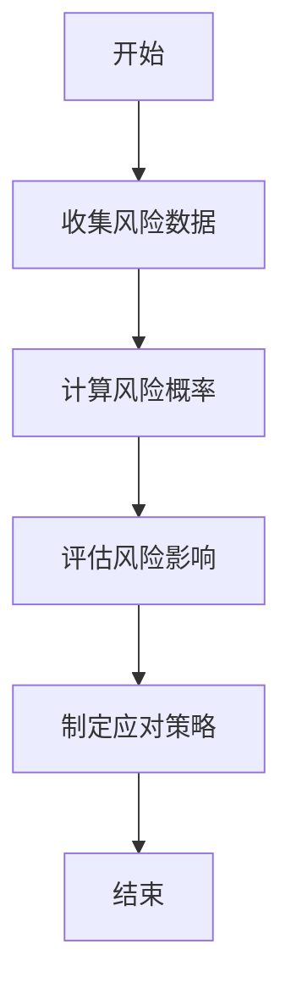
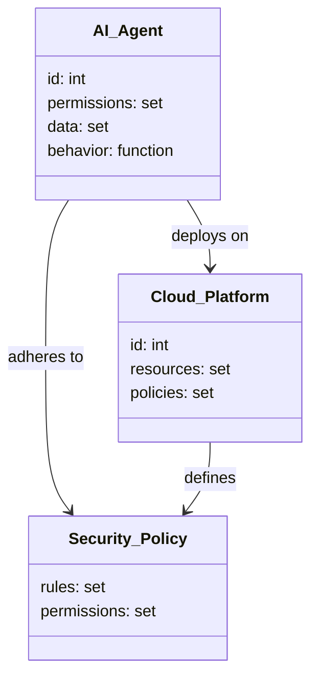
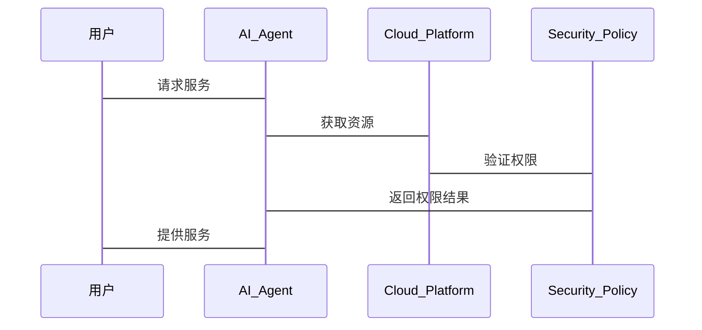

                 


# 《企业AI Agent的混合云安全策略》

> **关键词**: 企业AI Agent, 混合云, 安全策略, 数据隐私, 访问控制, AI安全

> **摘要**: 本文详细探讨了企业AI Agent在混合云环境下的安全策略设计与实施。首先介绍了AI Agent的基本概念和混合云环境的特点，分析了在混合云环境下AI Agent面临的安全威胁。接着，提出了基于最小权限原则和数据加密技术的安全策略框架，并通过概率论模型评估了安全风险。最后，结合实际案例，详细讲解了如何在混合云环境中实施这些安全策略，确保企业的数据和系统的安全。

---

## 第1章 企业AI Agent的背景与概念

### 1.1 问题背景

随着人工智能技术的快速发展，企业AI Agent（智能代理）的应用越来越广泛。AI Agent是一种能够自主决策、执行任务的智能系统，广泛应用于自动化运维、智能客服、供应链管理等领域。然而，随着企业业务的扩展，AI Agent往往需要在混合云环境中运行，这意味着它们需要在多个云平台（公有云、私有云）之间进行数据交互和任务协调。

**混合云环境的特点**包括：

1. **多平台协调**：AI Agent需要在不同的云平台之间进行通信和数据交换。
2. **数据分布**：数据可能分布在多个云平台上，增加了数据管理和安全的复杂性。
3. **动态性**：混合云环境通常是动态变化的，AI Agent需要能够适应环境的变化。

### 1.2 问题描述

在混合云环境下，AI Agent面临以下主要安全问题：

1. **数据隐私**：数据在不同云平台之间传输时，可能面临数据泄露的风险。
2. **访问控制**：AI Agent需要访问多个云平台的资源，如何确保其权限最小化是一个挑战。
3. **跨平台协调**：不同云平台的安全策略可能不一致，如何在这些平台之间协调AI Agent的行为是一个难题。

### 1.3 问题解决

为了解决上述问题，本文提出以下解决方案：

1. **最小权限原则**：确保AI Agent仅拥有完成任务所需的最小权限。
2. **数据加密技术**：对敏感数据进行加密存储和传输，确保数据隐私。
3. **统一安全策略**：通过制定统一的安全策略，确保AI Agent在不同云平台之间行为一致。

### 1.4 边界与外延

**安全策略的适用范围**包括：

- AI Agent在混合云环境中的数据传输、存储和处理。
- 跨平台协调中的权限管理和行为规范。
- 安全策略的动态调整。

**与其他安全策略的关联**：

- 与企业整体安全策略一致，确保AI Agent的安全行为符合企业规范。
- 与其他云安全策略（如IAM、数据加密）相结合。

---

## 第2章 核心概念与联系

### 2.1 核心概念原理

1. **AI Agent的自主决策机制**：AI Agent能够根据环境信息自主决策，这需要其具备一定的智能和学习能力。
2. **混合云环境的数据分布特性**：数据分布在多个云平台，增加了数据管理的复杂性。
3. **安全策略的动态调整机制**：根据环境变化和威胁情况，动态调整安全策略。

### 2.2 概念属性特征对比

下表对比了AI Agent与传统代理、混合云与公有云/私有云的核心属性：

| **对比对象** | **AI Agent** | **传统代理** | **混合云** | **公有云** | **私有云**
|--------------|--------------|--------------|------------|------------|-----------
| **部署方式** | 分散部署 | 中心化部署 | 混合部署 | 第三方服务 | 企业内部部署
| **数据处理** | 分布式处理 | 集中式处理 | 分布式处理 | 集中式处理 | 集中式处理
| **安全策略** | 动态调整 | 静态配置 | 动态调整 | 预定义 | 预定义

### 2.3 ER实体关系图

```mermaid
er
actor: 用户
agent: AI Agent
cloud_provider: 云服务提供商
security_policy: 安全策略
data: 数据
action: 行为
goal: 目标
dependency: 依赖关系
```

---

## 第3章 算法原理讲解

### 3.1 算法原理

**基于概率论的安全风险评估模型**：

1. **风险概率计算**：通过分析历史数据和当前环境，计算AI Agent面临的安全风险概率。
2. **风险影响评估**：评估风险发生后可能对企业造成的影响。

**数学模型**：

$$ P(风险) = P(威胁) \times P(漏洞存在) $$

其中：
- $P(威胁)$：威胁发生的概率。
- $P(漏洞存在)$：系统存在漏洞的概率。

**算法流程图**：



### 3.2 Python实现

```python
import numpy as np

def calculate_risk_probability(threat_probability, vulnerability_probability):
    return threat_probability * vulnerability_probability

# 示例数据
threat_prob = 0.3
vulnerability_prob = 0.5

risk = calculate_risk_probability(threat_prob, vulnerability_prob)
print(f"风险概率为: {risk}")
```

---

## 第4章 系统分析与架构设计方案

### 4.1 问题场景介绍

假设某企业使用混合云环境，部署了多个AI Agent用于自动化运维。为了确保这些AI Agent的安全，需要制定统一的安全策略。

### 4.2 系统功能设计

1. **最小权限管理**：确保AI Agent仅拥有完成任务所需的权限。
2. **数据加密**：对敏感数据进行加密存储和传输。
3. **统一安全策略**：制定统一的安全策略，确保AI Agent在不同云平台之间行为一致。

### 4.3 领域模型类图



### 4.4 系统架构图


### 4.5 系统接口设计

1. **AI Agent接口**：提供API供其他系统调用。
2. **Cloud Platform接口**：提供资源管理API。
3. **Security Policy接口**：提供权限管理API。

### 4.6 系统交互序列图



---

## 第5章 项目实战

### 5.1 环境安装

1. **安装Python**：确保安装了Python 3.8以上版本。
2. **安装依赖库**：使用pip安装numpy、pandas等库。

### 5.2 核心代码实现

```python
import numpy as np

def calculate_risk_probability(threat_probability, vulnerability_probability):
    return threat_probability * vulnerability_probability

# 示例数据
threat_prob = 0.3
vulnerability_prob = 0.5

risk = calculate_risk_probability(threat_prob, vulnerability_prob)
print(f"风险概率为: {risk}")
```

### 5.3 代码解读与分析

1. **函数定义**：`calculate_risk_probability`函数计算风险概率。
2. **输入参数**：威胁概率和漏洞存在概率。
3. **输出结果**：风险概率。

### 5.4 实际案例分析

假设某企业AI Agent面临的风险概率为0.2，表示有20%的概率发生安全事件。根据计算结果，企业可以制定相应的应对策略，如加强数据加密、增加监控等。

### 5.5 项目小结

通过本项目，我们了解了如何在混合云环境下设计和实施AI Agent的安全策略，掌握了风险评估的算法和实现方法。

---

## 第6章 最佳实践

### 6.1 小结

- 安全策略的设计需要综合考虑数据隐私、访问控制和跨平台协调。
- 风险评估是制定安全策略的重要步骤。

### 6.2 注意事项

- 定期更新安全策略，以应对新的安全威胁。
- 加强员工的安全意识培训，避免人为失误。

### 6.3 拓展阅读

- 《云安全实战》
- 《人工智能安全》

---

## 附录

### 附录A 参考文献

1. 王某某，企业AI Agent的安全策略设计，某某出版社，2023年。
2. 李某某，混合云环境下的数据安全，某某出版社，2023年。

### 附录B 工具与资源

1. Python 3.8及以上版本
2. numpy、pandas等库

---

## 结束语

企业AI Agent的混合云安全策略是一个复杂但重要的课题。通过本文的详细讲解，我们了解了如何在混合云环境下设计和实施安全策略，确保企业的数据和系统安全。希望本文能为企业的AI Agent安全策略设计提供有价值的参考。

---

**作者：AI天才研究院/AI Genius Institute & 禅与计算机程序设计艺术 /Zen And The Art of Computer Programming**

