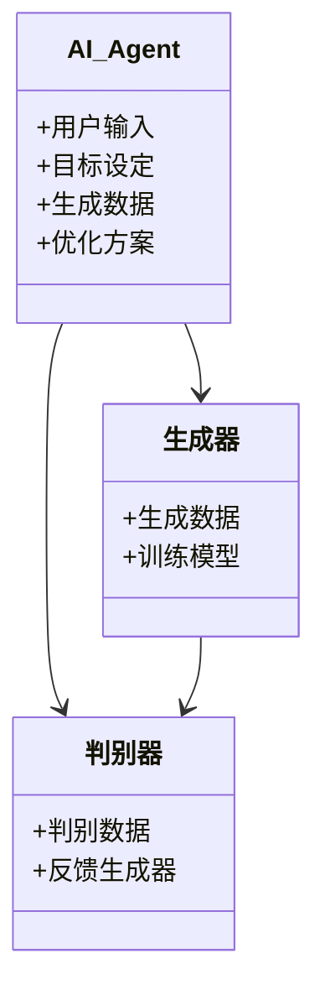
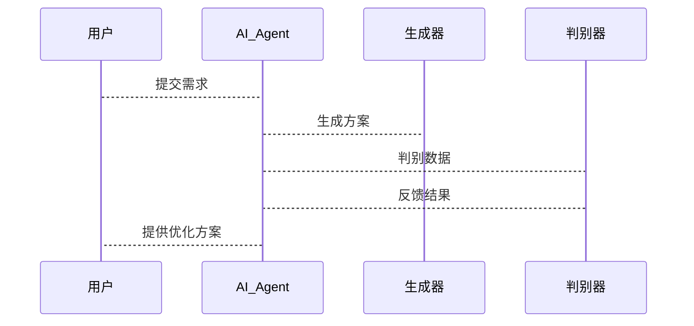

                 


# 企业AI Agent的生成对抗网络在产品设计创新中的前沿应用

## 关键词：
企业AI Agent, 生成对抗网络, 产品设计创新, 人工智能, 设计思维

## 摘要：
本文探讨了生成对抗网络（GANs）在企业AI Agent中的应用，特别是在产品设计创新中的前沿应用。通过分析GANs的核心原理和其在产品设计中的具体应用，展示了如何利用生成对抗网络推动产品设计的创新。文章还提供了实际案例分析和系统架构设计，为读者提供了深入的理论和实践指导。

---

# 正文

## 第一部分：企业AI Agent与生成对抗网络概述

### 第1章：企业AI Agent的背景与概念

#### 1.1 企业AI Agent的定义与特点

**1.1.1 AI Agent的基本概念**
AI Agent（智能体）是指能够感知环境并采取行动以实现目标的实体。在企业环境中，AI Agent可以是软件程序，用于自动化决策、数据分析或其他复杂任务。

**1.1.2 企业AI Agent的核心特征**
- **自主性**：能够独立决策和行动。
- **反应性**：能够根据环境变化调整行为。
- **目标导向**：所有行动均以实现特定目标为导向。
- **学习能力**：通过数据和经验不断优化自身性能。

**1.1.3 企业AI Agent的应用场景**
- **客户支持**：提供智能客服，解决用户问题。
- **数据分析**：处理大量数据，提供洞察。
- **流程自动化**：优化企业内部流程，提高效率。

#### 1.2 生成对抗网络（GANs）的概述

**1.2.1 GANs的基本原理**
GANs由生成器（Generator）和判别器（Discriminator）组成。生成器负责生成数据，判别器负责识别数据是否为真实数据。两者的对抗训练使生成器能够生成高质量的数据。

**1.2.2 GANs的组成部分与功能**
- **生成器**：使用深度神经网络生成数据。
- **判别器**：分类真实数据和生成数据。
- **损失函数**：衡量生成数据与真实数据的差异。

**1.2.3 GANs在AI Agent中的潜在应用**
- **数据生成**：生成大量训练数据，提高模型性能。
- **图像生成**：用于产品设计中的图像生成。
- **语音合成**：生成自然语音，用于客服交互。

#### 1.3 企业AI Agent与GANs的结合

**1.3.1 GANs在AI Agent中的作用**
- **数据生成**：生成多样化的数据，用于训练其他模型。
- **设计优化**：通过生成对抗，优化产品设计方案。
- **用户体验**：生成个性化用户体验，提升用户满意度。

**1.3.2 企业AI Agent与GANs结合的优势**
- **高效性**：GANs能够快速生成大量数据，提高AI Agent的效率。
- **创新性**：通过对抗生成，提供创新的产品设计方案。
- **适应性**：能够根据市场变化快速调整，适应不同需求。

**1.3.3 当前研究与应用现状**
当前，GANs在企业AI Agent中的应用尚处于起步阶段，但已展现出巨大潜力。未来的研究将集中在提高生成数据的质量和多样性，以及优化生成器和判别器的协同工作。

---

## 第二部分：生成对抗网络的核心原理与数学模型

### 第2章：生成对抗网络（GANs）的核心原理

#### 2.1 GANs的基本架构

**2.1.1 生成器与判别器的结构**
生成器通常采用卷积神经网络（CNN）或变种网络，而判别器也采用类似的结构。

**2.1.2 GANs的训练过程**
1. 初始化生成器和判别器的参数。
2. 判别器训练以区分真实数据和生成数据。
3. 生成器训练以欺骗判别器，生成更逼真的数据。
4. 重复训练，直到生成器和判别器达到平衡。

**2.1.3 GANs的损失函数**
判别器的损失函数为：
$$ L_d = -\mathbb{E}[\log(D(x)) + \log(1-D(G(z)))] $$
生成器的损失函数为：
$$ L_g = -\mathbb{E}[\log(D(G(z)))] $$

#### 2.2 GANs的变体与改进

**2.2.1 WGAN与WGAN-GP**
Wasserstein GAN（WGAN）通过优化 Wasserstein 距离，提高了生成数据的质量。WGAN-GP引入梯度惩罚，进一步稳定训练过程。

**2.2.2 StyleGAN**
StyleGAN通过引入风格编码，生成高质量和多样化的图像，特别适用于产品设计中的图像生成。

**2.2.3 Conditional GANs（cGANs）**
cGANs在生成过程中引入条件，生成与条件相关的数据，如根据用户需求生成产品设计。

#### 2.3 GANs的优缺点分析

**2.3.1 GANs的主要优势**
- **生成多样性**：能够生成多样化和创新性的数据。
- **高逼真度**：生成的数据质量高，接近真实数据。
- **适应性强**：适用于多种数据类型和生成任务。

**2.3.2 GANs的主要挑战**
- **训练困难**：需要精心设计的训练策略和参数调整。
- **模式坍缩**：生成器可能无法生成足够多样化的数据。
- **计算资源需求高**：训练GANs需要大量计算资源。

**2.3.3 GANs的未来发展方向**
- **提高生成质量**：优化生成器和判别器的结构，提高生成数据的质量。
- **增强多样性**：引入多样性损失，生成更多样化的数据。
- **降低计算成本**：研究更高效的训练方法，降低计算资源需求。

---

## 第三部分：生成对抗网络在产品设计创新中的应用

### 第3章：产品设计创新中的AI Agent

#### 3.1 AI Agent在产品设计中的角色

**3.1.1 AI Agent作为设计辅助工具**
AI Agent可以帮助设计师生成初步的设计方案，提供灵感和建议。

**3.1.2 AI Agent作为用户需求分析工具**
通过分析用户数据，AI Agent可以预测市场趋势和用户需求，辅助产品定位。

**3.1.3 AI Agent作为产品优化工具**
AI Agent可以优化产品设计方案，提高产品的性能和用户体验。

#### 3.2 GANs在产品设计创新中的具体应用

**3.2.1 产品原型生成**
通过GANs生成产品原型，设计师可以快速获得多种设计方案。

**3.2.2 设计方案优化**
GANs可以生成多种优化方案，帮助设计师找到最优解。

**3.2.3 市场趋势预测**
GANs可以根据历史数据，预测未来市场趋势，辅助产品设计决策。

#### 3.3 GANs在产品创新中的优势

**3.3.1 提高设计效率**
GANs可以快速生成大量设计方案，提高设计效率。

**3.3.2 激发创新思维**
通过生成多样化的方案，GANs能够激发设计师的创新思维。

**3.3.3 降低设计成本**
利用GANs生成设计原型，可以降低设计和测试成本。

---

## 第四部分：企业AI Agent的生成对抗网络系统架构与设计

### 第4章：企业AI Agent的系统架构与设计

#### 4.1 系统功能设计

**4.1.1 领域模型（Mermaid类图）**


**4.1.2 系统架构设计（Mermaid架构图）**


**4.1.3 系统交互设计（Mermaid序列图）**


#### 4.2 项目实战

**4.2.1 环境安装**
- 安装Python和相关库（如TensorFlow、Keras、numpy）。
- 安装生成对抗网络的实现库（如TensorFlow-GAN）。

**4.2.2 核心实现代码**
```python
import tensorflow as tf
from tensorflow.keras import layers

def make_generator_model():
    model = tf.keras.Sequential()
    model.add(layers.Dense(256, activation='relu', input_shape=(100,)))
    model.add(layers.Dense(512, activation='relu'))
    model.add(layers.Dense(784, activation='sigmoid'))
    return model

def make_discriminator_model():
    model = tf.keras.Sequential()
    model.add(layers.Dense(256, activation='relu', input_shape=(784,)))
    model.add(layers.Dense(128, activation='relu'))
    model.add(layers.Dense(1, activation='sigmoid'))
    return model

generator = make_generator_model()
discriminator = make_discriminator_model()

generator_optimizer = tf.keras.optimizers.Adam(0.0002, 0.5)
discriminator_optimizer = tf.keras.optimizers.Adam(0.0002, 0.5)
```

**4.2.3 案例分析与代码解读**
通过实际案例，展示如何利用生成器生成产品设计原型，并通过判别器优化设计。代码实现展示了生成器和判别器的协同工作，以及如何训练模型以提高生成数据的质量。

---

## 第五部分：总结与展望

### 5.1 总结
本文详细探讨了生成对抗网络在企业AI Agent中的应用，特别是在产品设计创新中的前沿应用。通过分析GANs的核心原理和系统架构，展示了如何利用生成对抗网络推动产品设计的创新。

### 5.2 展望
未来，随着GANs技术的不断进步，其在企业AI Agent中的应用将更加广泛和深入。研究者们将继续优化GANs的模型和算法，使其在产品设计创新中发挥更大的作用。

---

## 作者信息
作者：AI天才研究院 & 禅与计算机程序设计艺术

---

通过以上结构，文章系统地介绍了企业AI Agent与生成对抗网络的核心概念、算法原理、应用场景和系统架构设计，并提供了实际案例分析和代码实现。读者可以通过本文深入了解生成对抗网络在产品设计创新中的前沿应用，掌握其在企业AI Agent中的实际应用价值。

