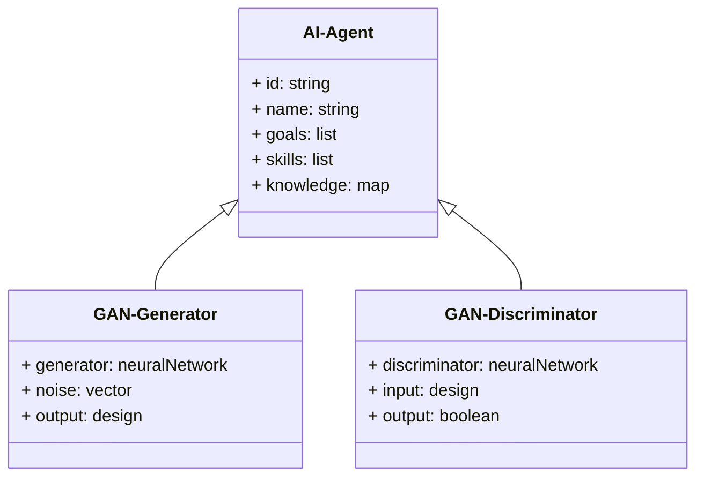
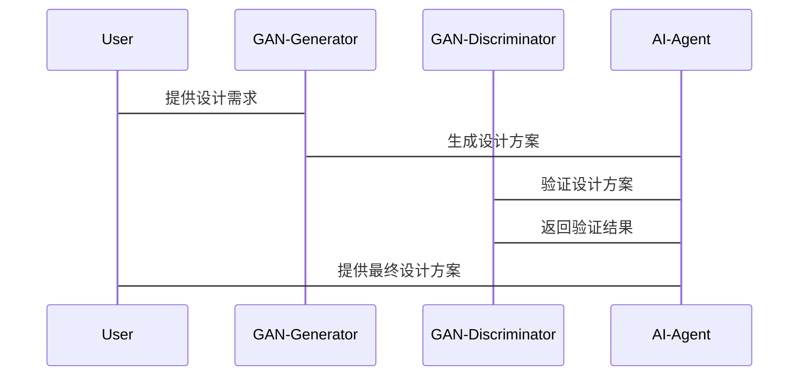

                 


# 《企业AI Agent的生成对抗网络在产品设计创新中的应用》

---

## 关键词：  
生成对抗网络（GANs）、企业AI Agent、产品设计创新、深度学习、人工智能

---

## 摘要：  
本文探讨了生成对抗网络（GANs）在企业AI Agent中的应用，特别是在产品设计创新领域的潜力。通过分析GANs的核心原理、算法实现、系统架构以及实际案例，本文揭示了GANs如何助力企业AI Agent在产品设计中的创新应用。文章从背景介绍、核心概念、算法原理、系统设计、项目实战到最佳实践，全面解析了GANs在企业AI Agent中的应用，为读者提供了一套系统化的方法论和实践指南。

---

# 第1章：企业AI Agent与生成对抗网络的背景与概述

## 1.1 生成对抗网络（GANs）的基本概念

### 1.1.1 GANs的起源与发展
生成对抗网络（GANs）是一种基于深度学习的生成模型，由Ian Goodfellow等人于2014年提出。GANs的核心思想是通过两个神经网络——生成器（Generator）和判别器（Discriminator）的对抗训练，生成逼真的数据样本。近年来，GANs在图像生成、自然语言处理、语音合成等领域取得了显著成果。

### 1.1.2 GANs的核心思想与特点
GANs的核心思想是通过生成器和判别器的对抗过程，生成器试图生成与真实数据相似的样本，而判别器则试图区分生成样本和真实样本。这种对抗过程使得生成器逐渐逼近真实数据的分布，最终生成高质量的样本。GANs的特点包括：
1. **对抗性训练**：生成器和判别器互相博弈，生成器不断优化生成样本，判别器不断优化判别能力。
2. **无监督学习**：GANs在无标签数据上进行训练，适合处理未标注数据。
3. **多样性生成**：GANs能够生成多样化的样本，适用于需要创新的应用场景。

### 1.1.3 GANs在企业中的应用现状
在企业中，GANs被广泛应用于数据增强、图像生成、语音合成等领域。特别是在产品设计创新中，GANs可以帮助企业快速生成多样化的设计方案，降低设计成本，提高设计效率。

---

## 1.2 企业AI Agent的定义与特点

### 1.2.1 企业AI Agent的定义
企业AI Agent是指在企业环境中运行的智能代理，能够感知环境、理解需求、执行任务并提供解决方案。企业AI Agent通常具备自主性、反应性、目标导向性和社交能力等特性。

### 1.2.2 企业AI Agent的独特属性
企业AI Agent的独特属性包括：
1. **目标导向性**：企业AI Agent的目标是为企业创造价值，例如提高效率、降低成本、优化决策等。
2. **自主性**：企业AI Agent能够在没有人工干预的情况下自主运行。
3. **社交能力**：企业AI Agent能够与人和其他系统进行交互，理解需求并提供服务。

### 1.2.3 企业AI Agent的应用场景
企业AI Agent的应用场景包括：
1. **客户服务**：通过自然语言处理技术为客户提供智能咨询。
2. **数据分析**：通过机器学习算法帮助企业进行数据挖掘和分析。
3. **产品设计**：通过生成对抗网络生成多样化的设计方案。

---

# 第2章：生成对抗网络的核心概念与原理

## 2.1 GANs的基本原理

### 2.1.1 生成器与判别器的对抗过程
生成器的目标是生成与真实数据相似的样本，而判别器的目标是区分生成样本和真实样本。通过交替训练生成器和判别器，生成器逐渐逼近真实数据的分布，判别器则不断提高判别能力。

### 2.1.2 GANs的损失函数与优化目标
GANs的损失函数包括生成器的损失函数和判别器的损失函数。生成器的损失函数表示生成样本被误判为真实样本的概率，而判别器的损失函数表示区分生成样本和真实样本的准确率。通过优化这两个损失函数，生成器和判别器的能力不断提高。

### 2.1.3 GANs的训练过程与收敛性分析
GANs的训练过程包括生成器和判别器的交替优化。生成器在判别器的指导下不断优化生成样本，而判别器在生成样本的挑战下不断提高判别能力。GANs的收敛性分析表明，当生成器和判别器的能力达到平衡时，GANs达到收敛状态。

---

## 2.2 GANs的数学模型

### 2.2.1 生成器的数学表达式
生成器通常由一个多层感知机（MLP）或卷积神经网络（CNN）构成，输入噪声向量，输出生成样本。生成器的输出可以表示为：
$$ G(z) = x $$
其中，$z$是噪声向量，$x$是生成样本。

### 2.2.2 判别器的数学表达式
判别器通常由一个MLP或反卷积神经网络构成，输入样本，输出判别结果。判别器的输出可以表示为：
$$ D(x) = y $$
其中，$x$是输入样本，$y$是判别结果（0表示生成样本，1表示真实样本）。

### 2.2.3 GANs的整体优化框架
GANs的整体优化框架包括生成器和判别器的交替优化。生成器的目标是最小化判别器的输出，而判别器的目标是最大化其输出。整体优化目标可以表示为：
$$ \min_G \max_D \mathbb{E}_{x \sim P_{data}}[\log D(x)] + \mathbb{E}_{z}[ \log (1 - D(G(z)))] $$

---

## 2.3 GANs的变体与对比

### 2.3.1 GANs的变体
GANs的变体包括：
1. **深度GAN（Deep GAN）**：通过增加网络深度提高生成样本的质量。
2. **条件GAN（cGAN）**：在生成过程中引入条件，生成特定类型的样本。
3. **对抗GAN（Patch GAN）**：通过分割图像为多个补丁进行判别，提高生成样本的质量。

### 2.3.2 GANs的对比分析
以下是对GANs的对比分析：

| 特性           | GANs                  | cGAN                 | Patch GAN            |
|----------------|-----------------------|----------------------|----------------------|
| 输入条件       | 无条件生成            | 带条件生成            | 无条件生成            |
| 网络结构       | 单层卷积网络           | 多层卷积网络           | 多层卷积网络           |
| 生成质量       | 较低                  | 较高                  | 较高                  |
| 应用场景       | 图像生成               | 图像修复、图像风格迁移 | 图像生成               |

---

# 第3章：生成对抗网络在企业AI Agent中的应用

## 3.1 生成对抗网络在产品设计创新中的潜力

### 3.1.1 GANs在产品设计中的应用场景
GANs在产品设计中的应用场景包括：
1. **产品形态生成**：通过GANs生成多样化的设计方案，帮助设计师快速找到灵感。
2. **设计风格迁移**：通过GANs将一种设计风格转换为另一种风格。
3. **产品优化**：通过GANs对设计方案进行优化，提高产品的市场竞争力。

### 3.1.2 GANs在产品设计中的优势
GANs在产品设计中的优势包括：
1. **快速生成**：GANs可以在短时间内生成大量设计方案，提高设计效率。
2. **多样性**：GANs能够生成多样化的设计方案，帮助设计师探索不同的设计方向。
3. **创新性**：GANs能够生成具有创新性的设计方案，突破传统设计的限制。

---

## 3.2 生成对抗网络在企业AI Agent中的系统架构

### 3.2.1 系统功能设计
以下是系统功能设计的类图：



### 3.2.2 系统架构设计
以下是系统架构设计的架构图：


---

## 3.3 GANs在企业AI Agent中的实际案例

### 3.3.1 项目背景介绍
以下是一个实际案例的项目介绍：



### 3.3.2 项目核心实现
以下是项目核心实现的代码示例：

```python
import torch
import torch.nn as nn

class Generator(nn.Module):
    def __init__(self, latent_dim, hidden_dim):
        super(Generator, self).__init__()
        self.latent_dim = latent_dim
        self.hidden_dim = hidden_dim
        self.generator = nn.Sequential(
            nn.Linear(latent_dim, hidden_dim),
            nn.ReLU(),
            nn.Linear(hidden_dim, hidden_dim),
            nn.ReLU(),
            nn.Linear(hidden_dim, output_dim)
        )

    def forward(self, x):
        return self.generator(x)

class Discriminator(nn.Module):
    def __init__(self, input_dim, hidden_dim):
        super(Discriminator, self).__init__()
        self.input_dim = input_dim
        self.hidden_dim = hidden_dim
        self.discriminator = nn.Sequential(
            nn.Linear(input_dim, hidden_dim),
            nn.ReLU(),
            nn.Linear(hidden_dim, hidden_dim),
            nn.ReLU(),
            nn.Linear(hidden_dim, 1)
        )

    def forward(self, x):
        return self.discriminator(x)
```

---

## 3.4 GANs在企业AI Agent中的优化与挑战

### 3.4.1 GANs的优化策略
GANs的优化策略包括：
1. **网络结构调整**：通过增加网络深度和宽度提高生成样本的质量。
2. **损失函数优化**：通过引入新的损失函数（如Wasserstein损失）优化生成器和判别器的性能。
3. **训练策略优化**：通过调整学习率、批量大小等参数优化训练过程。

### 3.4.2 GANs在企业AI Agent中的挑战
GANs在企业AI Agent中的挑战包括：
1. **计算资源需求**：GANs的训练需要大量的计算资源，企业需要投入大量的计算资源。
2. **模型泛化能力**：GANs的泛化能力有限，难以处理复杂的实际场景。
3. **模型解释性**：GANs的模型解释性较差，难以满足企业的实际需求。

---

# 第4章：企业AI Agent的生成对抗网络应用总结与未来展望

## 4.1 GANs在企业AI Agent中的应用总结
通过本文的分析，我们可以得出以下结论：
1. GANs在企业AI Agent中的应用具有巨大的潜力，特别是在产品设计创新领域。
2. GANs的生成能力能够帮助企业在短时间内生成大量高质量的设计方案，提高设计效率。
3. GANs的多样性生成能力能够帮助企业在复杂的设计场景中找到最优解。

## 4.2 GANs在企业AI Agent中的未来展望
随着深度学习技术的不断发展，GANs在企业AI Agent中的应用将更加广泛。未来的研究方向包括：
1. **GANs的优化与改进**：通过引入新的网络结构和损失函数，进一步提高GANs的生成能力。
2. **GANs的多模态应用**：通过结合其他模态（如文本、图像、语音）的数据，进一步扩展GANs的应用场景。
3. **GANs的解释性研究**：通过引入可解释性技术，提高GANs在企业应用中的可解释性和可信度。

---

# 作者：AI天才研究院/AI Genius Institute & 禅与计算机程序设计艺术 /Zen And The Art of Computer Programming

