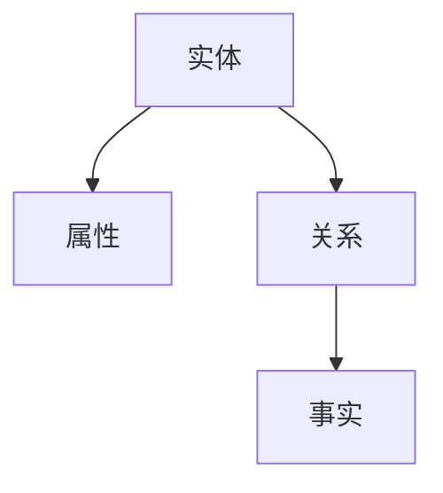
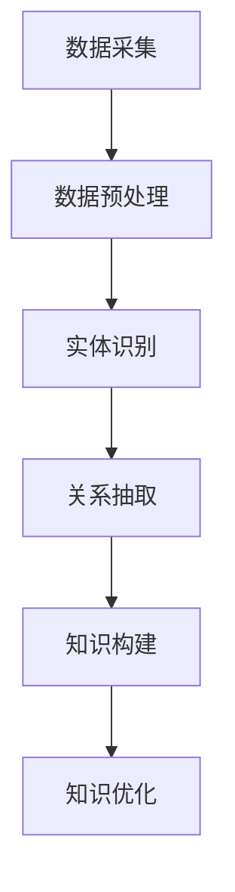
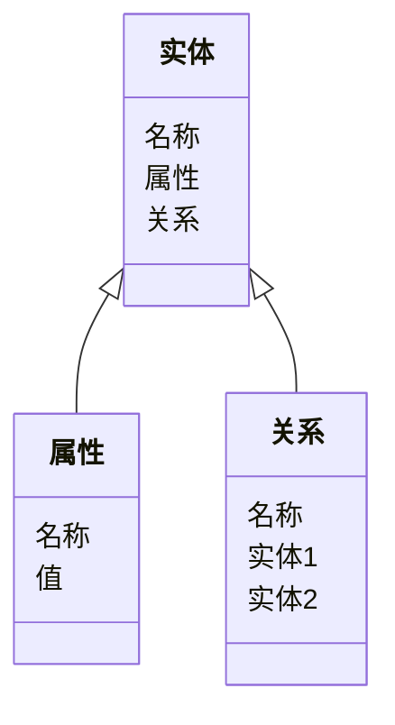
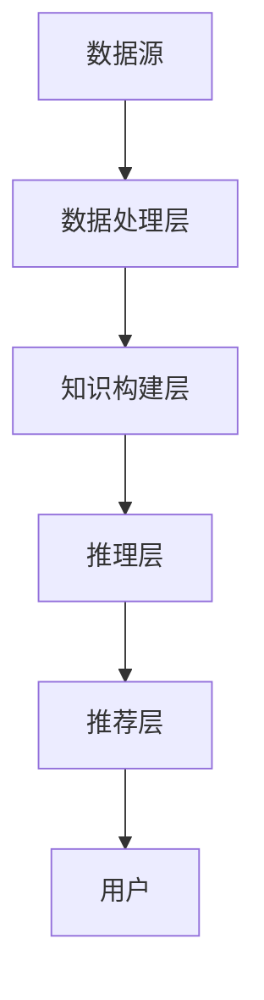
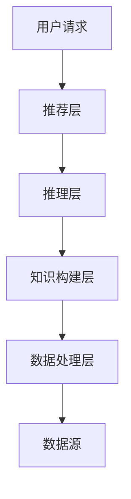

                 


# 企业AI Agent的知识图谱构建与推理系统

## 关键词：企业AI Agent，知识图谱，推理系统，企业应用，系统架构，算法原理

## 摘要

本文详细探讨了企业AI Agent的知识图谱构建与推理系统的各个方面，从基础概念到算法原理，再到系统架构和实战应用。通过分析知识图谱的核心要素、构建算法和推理系统的设计，结合实际案例，为读者提供全面的技术指导。文章旨在帮助技术从业者深入了解如何在企业环境中利用知识图谱构建高效的人工智能代理系统。

---

## 第一部分: 企业AI Agent与知识图谱概述

### 第1章: 企业AI Agent与知识图谱概述

#### 1.1 企业AI Agent的定义与特点

企业AI Agent是一种能够理解、推理和执行复杂任务的智能实体，旨在为企业提供自动化决策支持和问题解决能力。其特点包括：

- **自主性**：能够独立感知环境并做出决策。
- **反应性**：能够实时响应环境中的变化。
- **社会性**：能够与其他系统或人类交互协作。
- **知识驱动**：依赖于知识图谱进行推理和决策。

#### 1.2 知识图谱的定义与特点

知识图谱是一种以图结构形式表示知识的数据库，其特点包括：

- **结构化**：以实体、属性和关系的形式组织数据。
- **语义丰富**：能够表示复杂的语义关系。
- **动态更新**：能够实时更新以反映最新信息。

#### 1.3 企业AI Agent与知识图谱的关系

知识图谱是企业AI Agent的核心知识基础，AI Agent通过知识图谱进行推理和决策。两者的关系体现在：

- 知识图谱为AI Agent提供知识支持。
- AI Agent利用知识图谱进行推理和问题解决。

#### 1.4 本章小结

本章介绍了企业AI Agent和知识图谱的基本概念、特点及其关系，为后续内容奠定了基础。

---

## 第二部分: 知识图谱构建的核心概念与联系

### 第2章: 知识图谱构建的核心概念

#### 2.1 知识图谱构建的基本原理

知识图谱的构建包括数据采集、预处理、构建和优化四个步骤。其基本原理如下：

1. **数据采集**：从多种数据源（如数据库、文本、图像等）获取数据。
2. **数据预处理**：清洗、解析和标准化数据。
3. **知识构建**：通过模式匹配、实体识别和关系抽取等技术构建知识图谱。
4. **知识优化**：通过合并冗余信息和消除冲突信息优化知识图谱。

#### 2.2 知识图谱的核心要素

知识图谱的核心要素包括实体、属性和关系：

- **实体**：知识图谱中的基本单元，表示现实中的具体事物。
- **属性**：描述实体的特征或性质。
- **关系**：表示实体之间的关联。

**实体、属性和关系的对比表格：**

| 要素 | 定义 | 示例 |
|------|------|------|
| 实体 | 表示具体事物 | 公司、产品 |
| 属性 | 描述实体的特征 | 公司的注册资本 |
| 关系 | 表示实体之间的关联 | 公司提供产品 |

#### 2.3 ER实体关系图架构

以下是实体关系图的Mermaid流程图：



---

## 第三部分: 知识图谱构建的算法原理

### 第3章: 知识图谱构建的算法原理

#### 3.1 知识图谱构建的数学模型

知识图谱构建涉及多种数学模型，包括向量空间模型、嵌入表示模型和图结构模型。

##### 3.1.1 向量空间模型

向量空间模型用于表示实体的向量表示，公式如下：

$$ \text{相似度} = \frac{\vec{u} \cdot \vec{v}}{|\vec{u}| |\vec{v}|} $$

##### 3.1.2 嵌入表示模型

嵌入表示模型通过训练得到实体的低维表示，损失函数公式如下：

$$ \text{损失函数} = \sum_{(u,v)} \log(\text{score}(u,v)) + \log(1-\text{score}(u,v)) $$

##### 3.1.3 图结构模型

图结构模型通过图结构表示实体之间的关系，概率公式如下：

$$ P(r|e_1, e_2) = \frac{e_1^T r e_2}{\sum_{r'} e_1^T r' e_2} $$

#### 3.2 知识图谱构建的算法流程

以下是知识图谱构建的算法流程图：



---

## 第四部分: 系统分析与架构设计方案

### 第4章: 系统分析与架构设计方案

#### 4.1 问题场景介绍

以电商领域的推荐系统为例，构建知识图谱辅助推荐的系统。

#### 4.2 系统功能设计

系统功能包括数据采集、知识构建、推理和推荐。

##### 4.2.1 领域模型类图

以下是领域模型类图：



#### 4.3 系统架构设计

以下是系统架构设计图：



#### 4.4 系统接口设计

系统接口包括数据接口、推理接口和推荐接口。

#### 4.5 系统交互流程

以下是系统交互流程图：



---

## 第五部分: 项目实战

### 第5章: 项目实战

#### 5.1 环境安装

需要安装Python、知识图谱构建库（如NetworkX）和推理框架（如TensorFlow）。

#### 5.2 核心实现代码

以下是知识图谱构建的Python代码示例：

```python
import networkx as nx

# 创建图
G = nx.DiGraph()

# 添加节点
G.add_nodes_from(['公司', '产品', '用户'])

# 添加边
G.add_edges_from([('公司', '产品'), ('用户', '产品')])

# 可视化
nx.draw(G, with_labels=True, node_color='skyblue', edge_color='red')
```

#### 5.3 代码应用解读与分析

上述代码展示了如何使用NetworkX库构建知识图谱，包括节点和边的添加。

#### 5.4 实际案例分析

以电商推荐系统为例，构建用户-产品知识图谱，实现个性化推荐。

#### 5.5 项目小结

本项目展示了如何将知识图谱应用于实际场景，通过构建知识图谱实现智能推荐。

---

## 第六部分: 总结与展望

### 第6章: 总结与展望

#### 6.1 本章总结

本文详细介绍了企业AI Agent的知识图谱构建与推理系统，涵盖基本概念、构建算法、系统架构和项目实战。

#### 6.2 未来展望

未来，知识图谱与AI Agent的结合将在更多领域得到应用，如医疗、金融和教育等。

#### 6.3 最佳实践 tips

- 确保数据质量，选择合适的数据源。
- 使用高效的算法优化知识图谱构建。
- 定期更新知识图谱以保持准确性。

---

## 作者信息

作者：AI天才研究院/AI Genius Institute & 禅与计算机程序设计艺术 /Zen And The Art of Computer Programming

---

以上是《企业AI Agent的知识图谱构建与推理系统》的技术博客文章，内容涵盖从基础概念到实际应用的各个方面，适合技术从业者和研究人员阅读。

