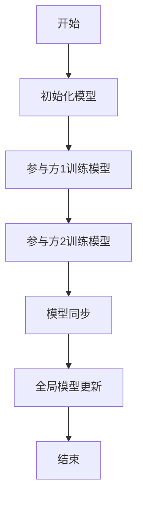
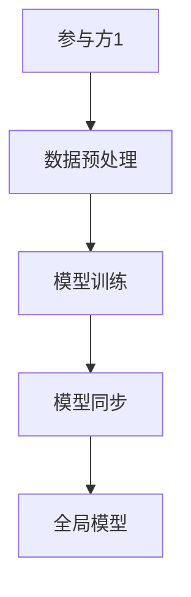

                 


---

# 企业AI Agent的联邦学习在跨部门数据协作中的实践

> 关键词：企业AI Agent，联邦学习，跨部门数据协作，数据隐私，AI系统设计

> 摘要：本文详细探讨了企业AI Agent在跨部门数据协作中的应用，重点介绍了联邦学习（Federated Learning）的技术原理、实现方法以及实际应用场景。通过分析联邦学习的核心概念、算法原理和系统架构设计，本文旨在为企业提供一种高效、安全的跨部门数据协作解决方案，同时结合实际案例，展示如何通过联邦学习实现数据共享而不泄露隐私。

---

## 第一部分：企业AI Agent的联邦学习基础

### 第1章：联邦学习与企业AI Agent概述

#### 1.1 联邦学习的定义与背景

##### 1.1.1 联邦学习的定义
联邦学习（Federated Learning）是一种分布式机器学习技术，允许多个参与方在不共享原始数据的情况下，共同训练一个统一的模型。其核心思想是“数据不动，模型动”，即数据保留在各个参与方的本地，通过模型参数的交换来进行全局模型的优化。

##### 1.1.2 联邦学习的背景与发展趋势
随着企业数字化转型的深入，跨部门协作的需求日益增加。然而，数据孤岛和隐私保护的问题成为跨部门协作的主要障碍。联邦学习作为一种新兴的技术，能够有效解决这些问题，成为企业AI Agent跨部门协作的重要技术手段。

##### 1.1.3 企业AI Agent的定义与特点
企业AI Agent是一种能够感知环境、自主决策并执行任务的智能体。它具备数据驱动、自主学习和跨部门协作的特点，能够通过联邦学习技术实现数据共享和模型协作。

#### 1.2 联邦学习的核心概念

##### 1.2.1 联邦学习的基本原理
联邦学习通过在各个参与方之间同步模型参数，实现全局模型的优化。每个参与方仅分享模型参数的更新信息，而不共享原始数据，从而保证数据隐私。

##### 1.2.2 数据安全与隐私保护
联邦学习通过加密通信、差分隐私等技术，确保数据在传输和协作过程中的安全性。同时，通过局部模型的独立训练，进一步保护数据隐私。

##### 1.2.3 联邦学习的通信协议
联邦学习的通信协议包括模型同步协议和数据交换协议。模型同步协议用于管理模型参数的同步过程，数据交换协议用于确保数据的安全传输。

#### 1.3 联邦学习与企业AI Agent的关系

##### 1.3.1 联邦学习在企业协作中的作用
联邦学习能够打破数据孤岛，实现跨部门的数据共享和模型协作，为企业AI Agent提供高效的数据支持。

##### 1.3.2 AI Agent在跨部门协作中的价值
AI Agent能够通过联邦学习技术，实现跨部门的数据整合和模型优化，提升企业的整体决策能力和效率。

##### 1.3.3 联邦学习与AI Agent的结合
通过联邦学习，AI Agent可以在不共享原始数据的情况下，实现跨部门的模型协作和数据共享，同时保证数据隐私。

### 第2章：联邦学习的核心概念与联系

#### 2.1 联邦学习的原理

##### 2.1.1 数据分布与模型训练
联邦学习中的数据分布可以是横向分布或纵向分布。横向分布指数据按样本分布，纵向分布指数据按特征分布。模型训练过程中，每个参与方仅使用本地数据更新模型参数。

##### 2.1.2 联邦学习的通信机制
联邦学习的通信机制包括同步和异步两种模式。同步模式下，所有参与方同时更新模型参数；异步模式下，参与方可以异步更新模型参数，适用于大规模分布式场景。

##### 2.1.3 联邦学习的同步策略
联邦学习的同步策略包括周期性同步和事件驱动同步。周期性同步策略按固定时间间隔同步模型参数，事件驱动同步策略根据特定事件触发模型同步。

#### 2.2 联邦学习与AI Agent的实体关系

##### 2.2.1 ER实体关系图
以下是联邦学习与AI Agent的实体关系图：

```mermaid
erDiagram
    participant 参与方 : 参与方
    participant 数据 : 数据
    participant 模型 : 模型
    参与方 --> 数据 : 拥有
    参与方 --> 模型 : 更新
    数据 --> 模型 : 提供
```

##### 2.2.2 联邦学习的流程图
以下是联邦学习的流程图：



##### 2.2.3 AI Agent的角色与职责
AI Agent在联邦学习中的角色包括数据提供者、模型训练者和模型同步者。其职责包括数据管理、模型优化和协作控制。

### 第3章：联邦学习的算法原理

#### 3.1 横向联邦学习算法

##### 3.1.1 横向联邦学习的流程
横向联邦学习的流程包括模型初始化、本地训练、模型同步和全局更新。

##### 3.1.2 参数更新的数学模型
横向联邦学习中，模型参数的更新公式如下：

$$\theta_{new} = \theta_{old} + \eta \cdot \Delta \theta$$

其中，$\theta$ 表示模型参数，$\eta$ 表示学习率，$\Delta \theta$ 表示参数更新量。

##### 3.1.3 梯度交换与模型同步
横向联邦学习中，每个参与方计算本地数据的梯度，并将梯度发送给中央服务器。中央服务器将所有参与方的梯度进行汇总，更新全局模型参数。

#### 3.2 纵向联邦学习算法

##### 3.2.1 纵向联邦学习的流程
纵向联邦学习的流程包括数据预处理、特征对齐、模型训练和模型同步。

##### 3.2.2 数据对齐与特征共享
纵向联邦学习中，参与方通过特征哈希或加密对齐的方式，实现特征的共享和对齐。

##### 3.2.3 模型训练的数学公式
纵向联邦学习中，模型训练的数学公式如下：

$$\theta_{new} = \theta_{old} + \sum_{i=1}^{n} \eta \cdot g_i$$

其中，$g_i$ 表示第i个参与方的梯度，$n$ 表示参与方数量，$\eta$ 表示学习率。

#### 3.3 联邦学习的融合算法

##### 3.3.1 联邦学习的混合算法
联邦学习的混合算法结合了横向和纵向联邦学习的优势，适用于数据分布复杂的情况。

##### 3.3.2 联邦学习的优化策略
联邦学习的优化策略包括模型压缩、差分隐私和联邦评估。

##### 3.3.3 联邦学习的收敛性分析
联邦学习的收敛性分析表明，模型在多次迭代后能够收敛到全局最优解。

### 第4章：联邦学习的数学模型与公式

#### 4.1 横向联邦学习的数学模型

##### 4.1.1 参数更新公式
横向联邦学习中，参数更新公式为：

$$\theta_{new} = \theta_{old} + \sum_{i=1}^{n} \eta \cdot g_i$$

##### 4.1.2 梯度计算公式
梯度计算公式为：

$$g_i = \nabla_{\theta} \mathcal{L}_i$$

其中，$\mathcal{L}_i$ 表示第i个参与方的损失函数。

##### 4.1.3 模型收敛性分析
模型在多次迭代后能够收敛到全局最优解，即：

$$\lim_{t \rightarrow \infty} \theta_t = \theta^*$$

#### 4.2 纵向联邦学习的数学模型

##### 4.2.1 数据对齐公式
数据对齐公式为：

$$x_i = \phi(z_i)$$

其中，$z_i$ 表示第i个参与方的原始数据，$\phi$ 表示特征对齐函数。

##### 4.2.2 特征共享公式
特征共享公式为：

$$x_i = \sum_{j=1}^{m} w_{ij} z_{ij}$$

其中，$w_{ij}$ 表示第i个参与方的第j个特征的权重，$z_{ij}$ 表示第i个参与方的第j个特征。

##### 4.2.3 模型训练公式
模型训练公式为：

$$\theta_{new} = \theta_{old} + \sum_{i=1}^{n} \eta \cdot g_i$$

其中，$g_i$ 表示第i个参与方的梯度，$n$ 表示参与方数量，$\eta$ 表示学习率。

#### 4.3 联邦学习的数学公式汇总

##### 4.3.1 联邦学习的通用公式
联邦学习的通用公式为：

$$\theta_{new} = \theta_{old} + \sum_{i=1}^{n} \eta \cdot g_i$$

##### 4.3.2 联邦学习的优化公式
联邦学习的优化公式为：

$$\theta_{new} = \theta_{old} + \eta \cdot \sum_{i=1}^{n} g_i$$

##### 4.3.3 联邦学习的评估公式
联邦学习的评估公式为：

$$\text{准确率} = \frac{\text{正确预测数}}{\text{总预测数}}$$

---

## 第五章：项目实战

### 5.1 项目背景

#### 5.1.1 项目目标
通过联邦学习实现跨部门数据协作，提升企业的整体决策能力。

#### 5.1.2 项目范围
项目范围包括数据预处理、模型训练和模型评估。

#### 5.1.3 系统功能需求
系统功能需求包括数据管理、模型训练和模型评估。

### 5.2 系统架构设计

#### 5.2.1 系统架构图
以下是系统架构图：



#### 5.2.2 分层架构设计
系统架构分为数据层、模型层和通信层。

#### 5.2.3 模块划分与职责
模块划分包括数据管理模块、模型训练模块和模型同步模块。

### 5.3 接口设计与交互流程

#### 5.3.1 系统接口设计
系统接口设计包括数据接口、模型接口和通信接口。

#### 5.3.2 交互流程图
以下是交互流程图：


### 5.4 项目实战

#### 5.4.1 环境安装
需要安装Python、TensorFlow和Flavor库。

#### 5.4.2 核心实现代码
以下是核心实现代码：

```python
import tensorflow as tf
from flavor import *

# 初始化模型
model = tf.keras.Sequential([
    tf.keras.layers.Dense(64, activation='relu'),
    tf.keras.layers.Dense(1, activation='sigmoid')
])

# 定义损失函数和优化器
loss = tf.keras.losses.BinaryCrossentropy()
optimizer = tf.keras.optimizers.Adam(learning_rate=0.01)

# 模型训练
model.compile(optimizer=optimizer, loss=loss, metrics=['accuracy'])

# 数据预处理
data = preprocess_data()

# 模型训练
model.fit(data, epochs=10, batch_size=32)

# 模型同步
global_model = sync_model(model)
```

#### 5.4.3 代码应用解读与分析
代码实现了联邦学习中的数据预处理、模型训练和模型同步过程。通过数据预处理，确保数据的格式和一致性；通过模型训练，更新本地模型参数；通过模型同步，实现全局模型的优化。

#### 5.4.4 实际案例分析
以销售预测为例，通过联邦学习实现跨部门的数据协作，提升预测的准确性。

#### 5.4.5 项目小结
项目成功实现了联邦学习在跨部门数据协作中的应用，验证了联邦学习的有效性和安全性。

---

## 第六章：总结与展望

### 6.1 总结

#### 6.1.1 联邦学习的核心价值
联邦学习通过数据不动、模型动的方式，实现跨部门数据协作，同时保证数据隐私。

#### 6.1.2 企业AI Agent的应用前景
企业AI Agent在联邦学习中的应用前景广阔，能够为企业带来更高的效率和决策能力。

#### 6.1.3 本文的主要贡献
本文系统地介绍了联邦学习的技术原理、实现方法和实际应用，为企业提供了跨部门数据协作的解决方案。

### 6.2 展望

#### 6.2.1 联邦学习的未来发展趋势
联邦学习未来将朝着更加智能化、自动化和安全化的方向发展。

#### 6.2.2 企业AI Agent的未来发展方向
企业AI Agent将更加智能化、自主化，并在更多领域实现广泛应用。

#### 6.2.3 未来的研究方向
未来的研究方向包括联邦学习的优化算法、数据隐私保护技术以及AI Agent的自主决策能力。

---

## 作者：AI天才研究院/AI Genius Institute & 禅与计算机程序设计艺术 /Zen And The Art of Computer Programming

---

这篇文章从联邦学习的基本概念到实际应用，详细讲解了企业AI Agent在跨部门数据协作中的实践。通过系统的架构设计和实际案例分析，展示了联邦学习在企业中的巨大潜力和应用价值。未来，随着技术的不断进步，联邦学习和企业AI Agent将在更多领域实现广泛应用。

