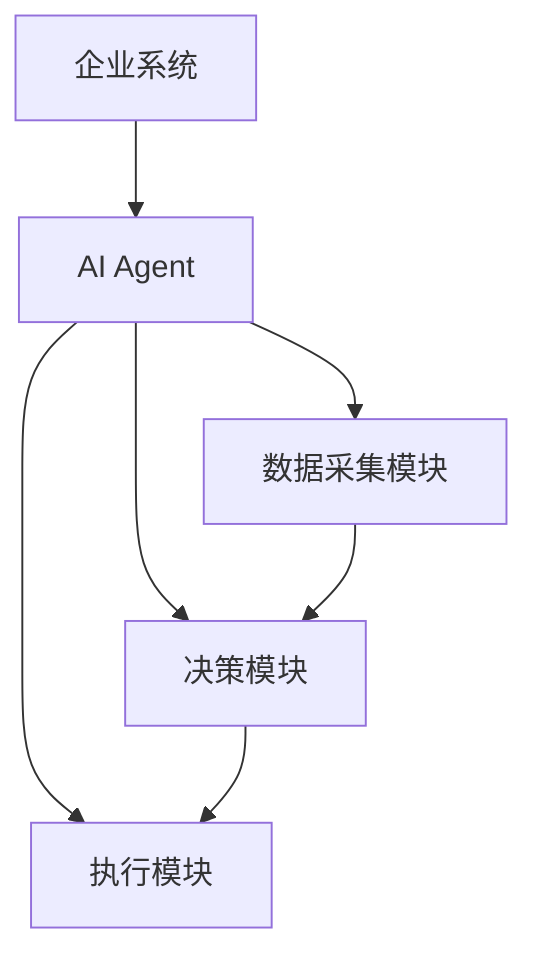

                 


# 企业AI Agent的自动化运维系统

> **关键词**: AI Agent, 自动化运维, 企业运维, 人工智能, 系统架构

> **摘要**: 本文详细探讨了企业AI Agent的自动化运维系统，从背景、概念、算法原理到系统架构设计，再到项目实战和最佳实践，全面解析了如何利用AI Agent实现企业运维的智能化与自动化。

---

## 第一部分: 企业AI Agent的背景与概念

### 第1章: 企业AI Agent的背景与概念

#### 1.1 问题背景

- **传统企业运维的挑战**
  - 运维工作复杂性高，涉及多系统和多平台。
  - 人工运维效率低下，容易出现人为错误。
  - 系统规模不断扩大，运维成本急剧上升。

- **AI技术在运维中的应用潜力**
  - 利用AI技术实现智能化监控和预测。
  - 通过机器学习优化运维流程。
  - 基于自然语言处理（NLP）实现智能故障诊断。

- **企业AI Agent的定义与目标**
  - **定义**: 企业AI Agent是一种基于人工智能技术的自动化运维工具，能够感知系统状态、做出决策并执行操作。
  - **目标**: 提高运维效率、降低运维成本、减少人为错误。

#### 1.2 问题描述

- **运维效率低下**
  - 传统运维依赖人工操作，效率难以提升。
  - 系统故障响应时间长，影响业务连续性。

- **系统复杂性增加**
  - 企业系统日益复杂，人工运维难以应对。
  - 多系统集成导致运维难度增加。

- **人工干预的局限性**
  - 人工运维容易出现疏忽和错误。
  - 无法实时处理海量数据。

#### 1.3 问题解决

- **AI Agent的核心作用**
  - 自动化监控：实时采集系统数据，发现异常。
  - 智能决策：基于数据和模型做出最优决策。
  - 自动执行：无需人工干预，自动完成运维任务。

- **自动化运维的实现路径**
  - 数据采集与分析：利用传感器、日志和API获取系统数据。
  - 智能决策：基于机器学习模型进行预测和决策。
  - 自动化执行：通过脚本或API实现任务自动化。

- **企业AI Agent的边界与外延**
  - 边界：专注于特定领域的运维任务，如服务器监控、日志分析。
  - 外延：与其他系统（如CMDB、监控平台）集成，扩大应用范围。

#### 1.4 核心概念结构

- **AI Agent的功能模块**
  - 感知模块：负责数据采集和状态感知。
  - 决策模块：基于感知数据做出决策。
  - 执行模块：根据决策执行具体操作。

- **核心要素组成**
  - 数据源：系统日志、性能指标、事件记录。
  - 模型库：机器学习模型、规则引擎。
  - 执行引擎：脚本、API调用、自动化工具。

- **系统架构特点**
  - 分布式架构：支持多系统、多平台的运维需求。
  - 高可用性：确保系统稳定运行，避免单点故障。
  - 可扩展性：支持功能模块的动态扩展。

---

## 第二部分: 企业AI Agent的核心概念与联系

### 第2章: AI Agent的核心原理

#### 2.1 核心概念原理

- **感知层原理**
  - 数据采集：通过传感器、API和日志获取系统数据。
  - 数据预处理：清洗、转换和归一化数据，为后续分析做准备。
  - 数据存储：将数据存储到数据库或数据仓库中，便于后续分析。

- **决策层原理**
  - 数据分析：利用统计分析、机器学习和深度学习技术对数据进行分析。
  - 模型选择：根据具体问题选择合适的算法和模型（如分类、回归、聚类）。
  - 决策制定：基于分析结果和业务规则生成决策建议。

- **执行层原理**
  - 任务规划：根据决策结果制定执行计划。
  - 任务执行：通过脚本、API或自动化工具完成具体任务。
  - 执行监控：实时监控任务执行状态，确保任务顺利完成。

#### 2.2 核心概念属性对比

| 属性         | 描述                                                         |
|--------------|--------------------------------------------------------------|
| 感知能力     | 数据采集与分析能力                                         |
| 决策能力     | 基于数据的决策逻辑                                         |
| 执行能力     | 自动化操作能力                                             |
| 学习能力     | 模型优化与自适应能力                                       |

#### 2.3 ER实体关系图



#### 2.4 本章小结

---

## 第三部分: 企业AI Agent的算法原理

### 第3章: AI Agent的核心算法

#### 3.1 算法原理概述

- **基于监督学习的AI Agent**
  - 数据标注：标注正反例数据，训练分类模型。
  - 模型训练：使用训练数据训练分类器（如随机森林、神经网络）。
  - 模型应用：基于训练好的模型进行预测，生成决策建议。

- **基于强化学习的AI Agent**
  - 状态空间：定义系统状态（如资源使用率、系统负载）。
  - 动作空间：定义可能的操作（如重启服务、调整配置）。
  - 奖励机制：定义奖励函数，指导AI Agent学习最优策略。

- **基于无监督学习的AI Agent**
  - 数据聚类：将相似的系统行为聚类，发现异常模式。
  - 异常检测：基于聚类结果，识别异常行为并触发警报。

#### 3.2 算法实现

- **监督学习实现**
  ```python
  from sklearn.ensemble import RandomForestClassifier
  # 假设X为特征矩阵，y为标签
  model = RandomForestClassifier()
  model.fit(X, y)
  # 预测新样本
  prediction = model.predict(X_new)
  ```

- **强化学习实现**
  ```python
  import numpy as np
  # 状态空间和动作空间
  state_space = [0, 1, 2]
  action_space = [0, 1, 2]
  # 奖励函数
  def reward_fn(state, action):
      return np.random.randn()
  ```

- **无监督学习实现**
  ```python
  from sklearn.cluster import KMeans
  # 假设X为特征矩阵
  model = KMeans(n_clusters=3)
  model.fit(X)
  # 预测聚类结果
  prediction = model.predict(X_new)
  ```

#### 3.3 数学模型与公式

- **监督学习分类模型**
  $$ P(y|x) = \prod_{i=1}^{n} P(x_i|y) P(y) $$

- **强化学习Q-learning算法**
  $$ Q(s, a) = Q(s, a) + \alpha (r + \gamma \max Q(s', a') - Q(s, a)) $$

---

## 第四部分: 企业AI Agent的系统分析与架构设计

### 第4章: 企业AI Agent的系统架构设计

#### 4.1 系统分析

- **问题场景**
  - 系统监控：实时监控服务器资源使用情况。
  - 日志分析：分析系统日志，发现异常。
  - 故障处理：自动修复常见故障。

- **项目介绍**
  - 开发目标：实现一个基于AI Agent的企业自动化运维系统。
  - 项目范围：支持服务器监控、日志分析和故障处理。
  - 项目约束：兼容现有系统架构，支持扩展。

#### 4.2 系统功能设计

- **领域模型**
  ```mermaid
  classDiagram
  class 系统状态 {
      资源使用率
      系统负载
      运行状态
  }
  class AI Agent {
      数据采集模块
      决策模块
      执行模块
  }
  class 数据源 {
      服务器
      日志文件
  }
  AI Agent --> 系统状态
  数据源 --> 系统状态
  ```

- **系统架构设计**
  ```mermaid
  architecture
  client --> API Gateway
  API Gateway --> AI Agent
  AI Agent --> 数据源
  AI Agent --> 决策模块
  AI Agent --> 执行模块
  ```

- **系统接口设计**
  - 数据采集接口：提供API接口，获取系统数据。
  - 决策接口：接受输入，返回决策结果。
  - 执行接口：接收决策指令，执行具体操作。

- **系统交互流程图**
  ```mermaid
  sequenceDiagram
  client -> AI Agent: 请求处理
  AI Agent -> 数据采集模块: 获取系统数据
  AI Agent -> 决策模块: 进行分析和决策
  AI Agent -> 执行模块: 执行具体操作
  ```

---

## 第五部分: 企业AI Agent的项目实战

### 第5章: 企业AI Agent的实现

#### 5.1 环境安装

- **安装Python环境**
  ```bash
  python --version
  pip install --upgrade pip
  ```

- **安装依赖库**
  ```bash
  pip install numpy scikit-learn matplotlib
  ```

#### 5.2 核心代码实现

- **数据采集模块**
  ```python
  import requests
  def get_system_data():
      try:
          response = requests.get('http://localhost:8080/api')
          return response.json()
      except Exception as e:
          print(f"数据采集失败: {e}")
          return None
  ```

- **决策模块**
  ```python
  from sklearn.ensemble import RandomForestClassifier
  def train_model(X, y):
      model = RandomForestClassifier()
      model.fit(X, y)
      return model
  ```

- **执行模块**
  ```python
  import subprocess
  def execute_command(command):
      try:
          result = subprocess.run(command, shell=True, capture_output=True, text=True)
          return result.stdout
      except Exception as e:
          print(f"执行命令失败: {e}")
          return None
  ```

#### 5.3 代码解读与分析

- **数据采集模块**
  - 使用`requests`库获取API接口数据。
  - 处理异常情况，确保数据采集的可靠性。

- **决策模块**
  - 使用随机森林算法训练分类模型。
  - 模型训练完成后，用于预测系统状态。

- **执行模块**
  - 使用`subprocess`库执行系统命令。
  - 捕捉异常，确保任务执行的安全性。

#### 5.4 实际案例分析

- **案例背景**
  - 企业服务器资源使用率异常升高。
  - AI Agent检测到CPU使用率超过阈值，触发警报。

- **案例分析**
  - 数据采集模块获取服务器资源数据。
  - 决策模块分析数据，发现异常。
  - 执行模块自动执行降温操作（如增加服务器资源）。

---

## 第六部分: 企业AI Agent的最佳实践

### 第6章: 最佳实践

#### 6.1 小结

- **AI Agent的核心价值**
  - 提高运维效率，降低运维成本。
  - 实现系统智能化，提升企业竞争力。

#### 6.2 注意事项

- **数据质量**
  - 确保数据的完整性和准确性。
  - 数据预处理是模型训练的关键。

- **模型优化**
  - 定期更新模型，确保模型的有效性。
  - 使用交叉验证优化模型性能。

- **系统安全**
  - 确保系统安全，防止数据泄露。
  - 权限管理，避免越权操作。

#### 6.3 拓展阅读

- **推荐书籍**
  - 《机器学习实战》
  - 《深入理解分布式系统》
  - 《人工智能: 一种现代的方法》

---

## 结语

企业AI Agent的自动化运维系统是人工智能技术在企业运维中的重要应用，通过智能化和自动化的手段，显著提升了运维效率和系统稳定性。随着AI技术的不断发展，企业AI Agent将发挥更大的作用，帮助企业实现更高效的运维管理。

---

**作者：AI天才研究院/AI Genius Institute & 禅与计算机程序设计艺术 /Zen And The Art of Computer Programming**

