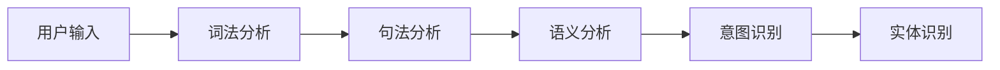
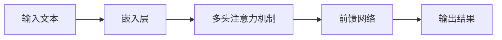

                 


# 企业AI Agent的自然语言理解(NLU)技术深化

## 关键词：自然语言理解，NLU，企业AI Agent，深度学习，意图识别，实体识别，系统架构

## 摘要：  
本文深入探讨了企业AI Agent中自然语言理解（NLU）技术的核心原理、算法实现、系统架构及应用场景。从NLU的基本概念到深度学习模型的原理，再到企业级系统的实际应用，系统性地分析了NLU技术在企业AI Agent中的关键作用和技术挑战。通过详细的技术分析和实际案例，本文为读者提供了从理论到实践的全面指导。

---

## 第1章: NLU技术背景与企业应用场景

### 1.1 NLU技术的基本概念

#### 1.1.1 自然语言理解（NLU）的定义  
自然语言理解（NLU）是人工智能领域的重要分支，旨在使计算机能够理解和解析人类自然语言的语义含义。NLU的核心目标是将输入的自然语言文本（如用户的问题或指令）转化为可计算或可操作的结构化信息。

#### 1.1.2 NLU的核心问题与挑战  
NLU技术的核心问题包括：  
1. **意图识别**：确定用户的输入意图（例如，用户是在询问天气还是预约服务）。  
2. **实体识别与槽位填充**：从文本中提取关键实体信息（如地点、时间、人物等）。  
3. **语义解析**：理解文本的深层含义，尤其是模糊或歧义表达的处理。  

NLU技术的挑战包括数据质量、模型泛化能力、多语言支持以及模型的可解释性等问题。

#### 1.1.3 NLU在企业AI Agent中的作用  
在企业AI Agent中，NLU技术是实现人机交互的核心技术。它帮助AI Agent理解用户的输入，进而执行相应的业务逻辑。例如，在企业客服系统中，NLU技术可以识别用户的意图并调用后端服务进行响应。

### 1.2 NLU技术的发展历程

#### 1.2.1 从规则驱动到数据驱动的演进  
早期的NLU技术主要依赖于规则和关键词匹配，这种方式在处理复杂语义时表现有限。随着深度学习的兴起，NLU技术逐渐从规则驱动转向数据驱动，模型能够通过大量数据学习语言规律。

#### 1.2.2 深度学习模型的崛起  
近年来，基于深度学习的模型（如RNN、LSTM和Transformer）在NLU任务中表现出色。这些模型能够自动学习文本的语义特征，显著提高了意图识别和实体识别的准确率。

#### 1.2.3 多模态NLU的探索  
多模态NLU技术结合了文本、语音、图像等多种信息源，进一步提升了NLU的准确性和鲁棒性。例如，结合语音情感分析和文本意图识别，可以更好地理解用户的综合需求。

### 1.3 企业AI Agent中的NLU应用场景

#### 1.3.1 客户服务与支持  
在企业客服系统中，NLU技术可以帮助AI Agent理解用户的咨询内容，快速匹配解决方案。例如，用户询问“如何重置密码？”，NLU技术可以识别用户的意图并调用相应的服务流程。

#### 1.3.2 企业内部流程自动化  
在企业内部，NLU技术可以用于自动化处理流程。例如，员工可以通过语音指令触发审批流程，NLU技术可以解析指令并生成相应的工单。

#### 1.3.3 业务数据分析与决策支持  
NLU技术还可以用于业务数据分析场景。例如，用户可以通过自然语言查询销售数据，NLU技术可以解析用户的查询内容并生成相应的报表。

### 1.4 企业AI Agent中NLU的挑战与边界

#### 1.4.1 数据质量与多样性问题  
企业环境中的数据往往具有高度的专业性和复杂性，NLU模型需要处理大量专业术语和复杂句式。数据质量不足或多样性不足可能导致模型性能下降。

#### 1.4.2 多语言支持的复杂性  
企业可能需要支持多种语言的NLU功能。多语言NLU模型的开发和训练需要额外的资源投入，且不同语言的语法和语义差异可能影响模型的准确性。

#### 1.4.3 模型的可解释性与鲁棒性  
在企业应用场景中，NLU模型的可解释性和鲁棒性至关重要。例如，在金融领域，模型需要能够解释其决策过程，并在面对异常输入时保持稳定。

---

## 第2章: NLU的核心概念与技术原理

### 2.1 NLU的核心概念解析

#### 2.1.1 语言理解的层次结构  
NLU技术可以分为以下几个层次：  
1. **词法分析**：对文本进行分词和词性标注。  
2. **句法分析**：分析句子的语法结构。  
3. **语义分析**：理解文本的语义含义。  
4. **意图识别**：确定用户的意图。  
5. **实体识别**：提取文本中的实体信息。

#### 2.1.2 语义分析与意图识别  
语义分析是NLU的核心任务之一，旨在理解文本的深层含义。意图识别是语义分析的重要组成部分，目标是确定用户输入的主要意图。

#### 2.1.3 实体识别与槽位填充  
实体识别是指从文本中提取出具有特定意义的实体（如人名、地名、时间等）。槽位填充是在实体识别的基础上，进一步明确实体的具体信息（如时间的具体值）。

### 2.2 NLU技术的关键属性对比

#### 2.2.1 不同模型的性能对比  
| 模型 | 意图识别准确率 | 实体识别准确率 | 训练数据需求 | 计算复杂度 |
|------|----------------|----------------|--------------|------------|
| SVM  | 70%            | 65%            | 中等          | 较低        |
| RNN  | 85%            | 80%            | 较高          | 较高        |
| LSTM | 90%            | 85%            | 高            | 高          |
| Transformer | 95% | 92% | 极高 | 极高 |

#### 2.2.2 模型的训练数据需求  
- **监督学习模型**：需要大量标注数据，训练时间较长。  
- **无监督学习模型**：依赖于大规模未标注数据，训练时间较短。  

#### 2.2.3 模型的计算复杂度  
- **线性模型**（如SVM）：计算复杂度较低，适合小规模数据。  
- **深度学习模型**（如Transformer）：计算复杂度较高，适合大规模数据。  

### 2.3 NLU技术的实体关系图



---

## 第3章: 基于深度学习的NLU算法原理

### 3.1 Transformer模型的原理与流程



#### 3.1.1 Transformer模型的结构特点  
- **嵌入层**：将输入文本转换为向量表示。  
- **多头注意力机制**：捕捉文本中的长距离依赖关系。  
- **前馈网络**：对注意力输出进行非线性变换，生成最终结果。

#### 3.1.2 Transformer模型的数学公式  
输入文本经过嵌入层后，得到嵌入向量$X$。多头注意力机制的计算公式如下：

$$
\text{Attention}(Q, K, V) = \text{softmax}\left(\frac{QK^T}{\sqrt{d_k}}\right)V
$$

其中，$Q$是查询向量，$K$是键向量，$V$是值向量，$d_k$是向量的维度。

### 3.2 BERT模型的NLU应用

#### 3.2.1 BERT模型的结构特点  
BERT（Bidirectional Encoder Representations from Transformers）是一种基于Transformer的预训练语言模型。它通过双向上下文信息来提高模型的语义理解能力。

#### 3.2.2 BERT在意图识别中的应用  
在意图识别任务中，BERT模型可以将输入文本编码为固定长度的向量，然后通过全连接层进行分类。

#### 3.2.3 BERT在实体识别中的应用  
在实体识别任务中，BERT模型可以为每个词生成上下文相关的向量，然后通过条件随机场（CRF）进行序列标注。

### 3.3 NLU算法的Python实现示例

```python
import torch
class NLUModel(torch.nn.Module):
    def __init__(self):
        super(NLUModel, self).__init__()
        self.embedding = torch.nn.Embedding(vocab_size, embedding_dim)
        self.transformer = TransformerLayer(n_head, 
        self.classifier = torch.nn.Linear(hidden_size, num_classes)
    
    def forward(self, input_ids, attention_mask):
        embeddings = self.embedding(input_ids)
        outputs = self.transformer(embeddings, attention_mask)
        logits = self.classifier(outputs.last_hidden_state[:, 0, :])
        return logits
```

---

## 第4章: NLU技术的数学模型与公式推导

### 4.1 NLU技术的数学模型

#### 4.1.1 词嵌入的数学表示  
词嵌入是将词语映射到低维向量空间的过程。常用的词嵌入方法包括Word2Vec和GloVe。Word2Vec的训练目标是最小化以下损失函数：

$$
\text{loss} = -\sum_{j=1}^k \log p(w_j | w)
$$

其中，$w$是目标词，$w_j$是上下文词。

#### 4.1.2 注意力机制的数学公式  
注意力机制的核心公式如下：

$$
\alpha_i = \text{softmax}\left(\frac{q_i k_j^T}{\sqrt{d_k}}\right)
$$

其中，$\alpha_i$是注意力权重，$q_i$是查询向量，$k_j$是键向量。

#### 4.1.3 意图分类的数学模型  
意图分类任务可以看作是一个多分类问题，常用的损失函数是交叉熵损失：

$$
\text{loss} = -\sum_{i=1}^n y_i \log p(y_i)
$$

其中，$y_i$是真实标签，$p(y_i)$是模型预测的概率。

---

## 第5章: NLU系统的架构设计与实现

### 5.1 系统架构设计

#### 5.1.1 系统功能设计  
企业AI Agent的NLU系统需要实现以下功能：  
1. **意图识别**：识别用户的意图。  
2. **实体识别**：提取文本中的实体信息。  
3. **语义解析**：理解文本的深层含义。  

#### 5.1.2 系统架构设计  
以下是NLU系统的架构图：


#### 5.1.3 系统接口设计  
NLU系统的接口设计需要考虑以下几点：  
1. **输入接口**：接收用户输入的文本。  
2. **输出接口**：返回意图和实体信息。  
3. **日志接口**：记录系统的运行日志。  

---

## 第6章: NLU技术的优化与扩展

### 6.1 NLU模型的优化策略

#### 6.1.1 数据增强技术  
数据增强是提高模型泛化能力的重要手段。常用的技巧包括同义词替换、句式变换等。

#### 6.1.2 模型调优技巧  
模型调优可以从以下几个方面入手：  
1. **超参数调整**：优化学习率、批量大小等参数。  
2. **模型结构优化**：尝试不同的网络架构。  
3. **正则化技术**：使用L2正则化防止过拟合。  

### 6.2 NLU技术的多模态扩展

#### 6.2.1 多模态NLU的定义  
多模态NLU是将多种信息源（如文本、语音、图像）结合，以提高语义理解的准确性和鲁棒性。

#### 6.2.2 多模态NLU的应用场景  
多模态NLU在企业AI Agent中的应用场景包括：  
1. **语音识别与语义理解**：结合语音识别和NLU技术，实现更精准的语音交互。  
2. **图像与文本结合**：在图像描述生成任务中，结合图像特征和文本信息。  

### 6.3 NLU技术的企业级部署

#### 6.3.1 企业级部署的挑战  
企业级部署需要考虑以下问题：  
1. **资源分配**：确保模型运行的计算资源充足。  
2. **模型维护**：定期更新模型以适应业务需求的变化。  

#### 6.3.2 模型维护策略  
1. **在线更新**：实时更新模型参数。  
2. **离线训练**：定期重新训练模型。  
3. **模型监控**：实时监控模型性能，及时发现和解决问题。  

---

## 第7章: 总结与展望

### 7.1 本文总结  
本文系统性地探讨了企业AI Agent中自然语言理解技术的核心原理、算法实现、系统架构及应用场景。通过深入分析NLU技术的数学模型和实际案例，本文为读者提供了从理论到实践的全面指导。

### 7.2 未来展望  
随着深度学习技术的不断发展，NLU技术在企业AI Agent中的应用将更加广泛和深入。未来的研究方向包括：  
1. **多模态NLU技术的进一步探索**。  
2. **模型的可解释性与鲁棒性优化**。  
3. **NLU技术在边缘计算中的应用**。  

---

## 作者：AI天才研究院/AI Genius Institute & 禅与计算机程序设计艺术 /Zen And The Art of Computer Programming

