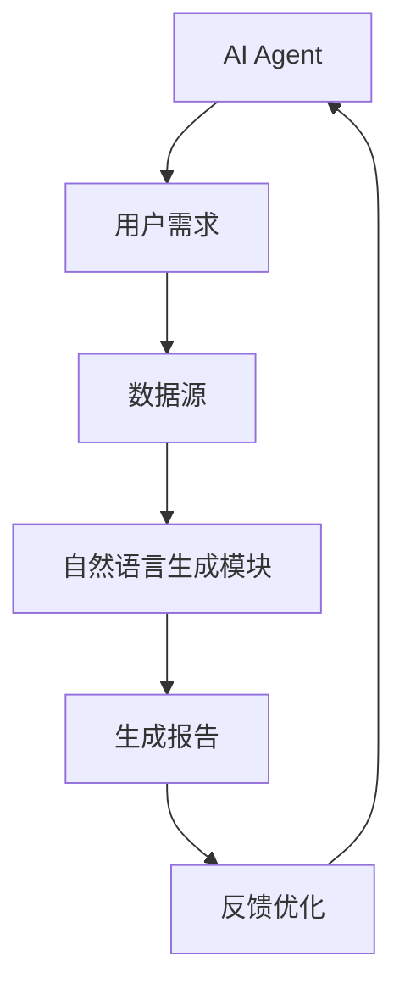
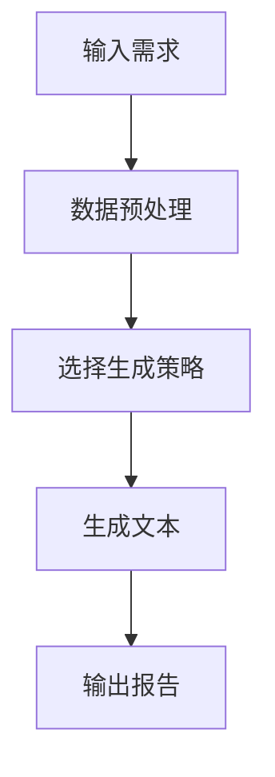
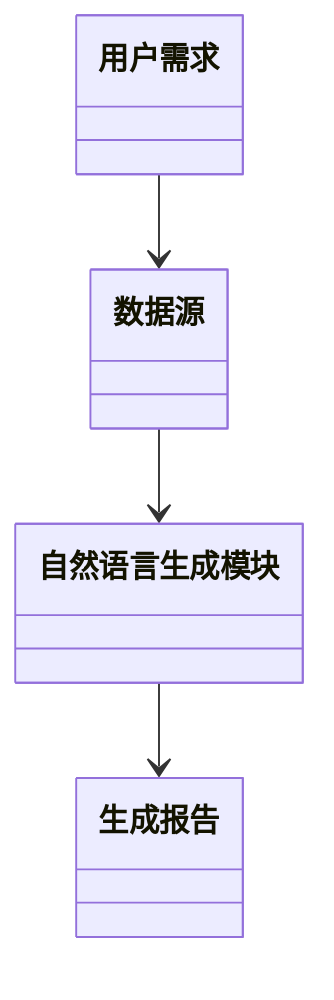
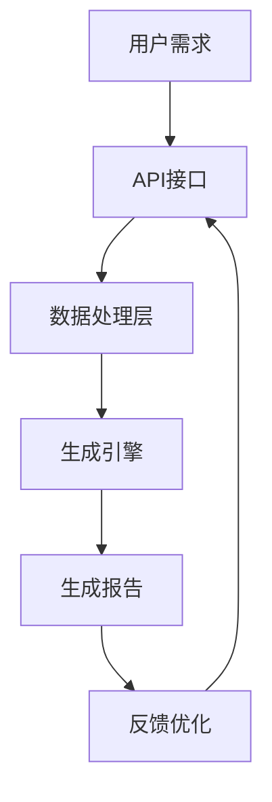
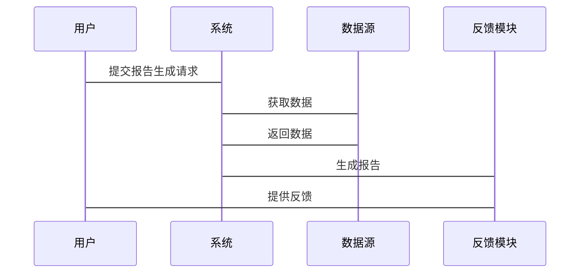

                 


# 企业AI Agent的自然语言生成(NLG)报告系统

## 关键词：AI Agent, 自然语言生成, 企业报告, 技术博客, 系统架构

## 摘要：本文深入探讨了企业AI Agent在自然语言生成（NLG）报告系统中的应用，分析了其核心概念、算法原理、系统架构设计以及实际应用案例。文章结合理论与实践，详细讲解了如何利用AI Agent与NLG技术实现高效、智能的企业报告生成。

---

# 第1章：企业AI Agent与自然语言生成(NLG)概述

## 1.1 问题背景与问题描述

### 1.1.1 企业报告生成的痛点
在企业环境中，报告生成通常是一项耗时且容易出错的任务。传统方法依赖人工操作，不仅效率低下，还可能因为人为疏忽导致信息错误。此外，不同部门和业务线的报告格式和内容要求各不相同，增加了统一性和标准化的难度。

### 1.1.2 AI Agent在企业报告生成中的作用
AI Agent（人工智能代理）通过自动化处理和智能决策，能够显著提升报告生成的效率和质量。它能够理解用户需求、整合数据、生成符合业务规范的文本，并通过反馈机制不断优化生成结果。

### 1.1.3 问题的边界与外延
本系统专注于企业内部的报告生成，边界包括数据源的整合、生成策略的选择以及输出格式的标准化。外延则涉及更高级的应用，如跨语言报告生成和实时数据驱动的动态报告。

---

## 1.2 核心概念与系统架构

### 1.2.1 AI Agent的基本概念
AI Agent是一种能够感知环境、执行任务并做出决策的智能实体。它通过接收输入、处理信息并输出结果来实现自动化操作。

### 1.2.2 自然语言生成(NLG)的定义与特点
NLG是将结构化数据转化为自然语言文本的过程。其特点包括灵活性、可定制化以及对上下文的理解能力。NLG系统通常分为基于规则和基于模型的两种类型。

### 1.2.3 企业AI Agent NLG系统的构成与核心要素
- **输入模块**：接收用户需求和数据源。
- **数据处理模块**：对数据进行清洗和预处理。
- **生成模块**：选择生成策略并输出文本。
- **反馈优化模块**：根据用户反馈调整生成模型。

---

## 1.3 本章小结
本章介绍了企业AI Agent和自然语言生成的基本概念，分析了它们在报告生成中的作用，并明确了系统的构成要素。接下来将深入探讨系统的算法原理和架构设计。

---

# 第2章：企业AI Agent NLG系统的核心概念与联系

## 2.1 核心概念原理

### 2.1.1 AI Agent的核心原理
AI Agent通过感知环境、理解用户需求并执行任务来实现自动化操作。其核心在于信息处理和决策-making能力。

### 2.1.2 NLG技术的核心原理
NLG技术利用自然语言处理算法，将结构化数据转化为自然语言文本。它依赖于数据理解、生成策略选择和文本优化三个步骤。

### 2.1.3 企业AI Agent NLG系统的整体架构
系统由输入模块、数据处理模块、生成模块和反馈优化模块组成，各模块协同工作以实现高效的报告生成。

---

## 2.2 概念属性特征对比

| **特性**       | **AI Agent**                | **NLG**                   |
|-----------------|-----------------------------|---------------------------|
| 核心功能         | 执行任务、自动化操作       | 生成自然语言文本         |
| 输入            | 用户需求、环境信息         | 结构化数据、上下文信息   |
| 输出            | 动作、决策结果             | 自然语言文本             |
| 依赖技术         | 机器学习、自然语言处理    | 生成模型、文本优化算法   |

---

## 2.3 ER实体关系图



---

## 2.4 本章小结
本章通过对比分析，明确了AI Agent和NLG的核心概念及其在企业报告生成中的联系。下一章将深入探讨系统的算法原理和数学模型。

---

# 第3章：企业AI Agent NLG系统的算法原理

## 3.1 算法原理概述

### 3.1.1 基于大语言模型的生成算法
大语言模型（如GPT）通过概率生成方式，基于上下文预测最优的文本序列。

### 3.1.2 基于规则的生成算法
基于预定义的规则和模板，生成符合特定格式和内容要求的文本。

### 3.1.3 混合生成算法
结合大语言模型和规则生成的优势，通过混合策略生成高质量文本。

---

## 3.2 算法流程图



---

## 3.3 数学模型与公式

### 3.3.1 大语言模型的概率生成公式
$$P(y|x) = \frac{1}{Z} \exp(\theta \cdot y + \theta \cdot x)$$

### 3.3.2 基于规则的生成模型
$$R = \sum_{i=1}^{n} r_i \cdot x_i$$

### 3.3.3 混合生成模型
$$H(y|x) = \alpha P(y|x) + (1-\alpha) R(y|x)$$

---

## 3.4 本章小结
本章详细讲解了企业AI Agent NLG系统的算法原理，包括基于模型和基于规则的生成方法，及其数学表达。下一章将分析系统的架构设计。

---

# 第4章：企业AI Agent NLG系统的系统分析与架构设计

## 4.1 问题场景介绍

### 4.1.1 企业报告生成的典型场景
- 财务报告生成
- 市场分析报告
- 运营数据分析报告

### 4.1.2 AI Agent在企业报告生成中的应用场景
- 自动化数据整合
- 智能化报告生成
- 实时数据监控与报告更新

---

## 4.2 系统功能设计

### 4.2.1 领域模型设计


---

## 4.3 系统架构设计



---

## 4.4 系统接口设计



---

## 4.5 本章小结
本章详细分析了系统的架构设计和接口设计，展示了各模块之间的协同工作关系。下一章将通过实际案例分析系统实现。

---

# 第5章：企业AI Agent NLG系统的项目实战

## 5.1 环境安装

### 5.1.1 安装Python
```bash
python --version
pip install --upgrade pip
```

### 5.1.2 安装依赖库
```bash
pip install numpy
pip install tensorflow
pip install spacy
```

---

## 5.2 系统核心实现源代码

### 5.2.1 数据预处理模块
```python
def preprocess_data(data):
    # 数据清洗和预处理逻辑
    return processed_data
```

### 5.2.2 生成模块实现
```python
def generate_report(data, model):
    processed_data = preprocess_data(data)
    generated_text = model.generate(processed_data)
    return generated_text
```

---

## 5.3 案例分析与详细讲解

### 5.3.1 案例分析
以财务报告生成为例，系统接收财务数据后，生成符合公司格式的财务分析报告。

### 5.3.2 代码应用解读与分析
通过对代码的解读，展示系统如何处理数据、选择生成策略并输出报告。

---

## 5.4 本章小结
本章通过实际案例和代码实现，展示了企业AI Agent NLG系统的强大功能和应用潜力。

---

# 第6章：企业AI Agent NLG系统的最佳实践与小结

## 6.1 最佳实践

### 6.1.1 数据质量的重要性
确保数据的准确性和完整性是生成高质量报告的基础。

### 6.1.2 模型的可解释性
选择可解释性强的模型有助于优化和维护系统。

### 6.1.3 系统的安全性
保护数据隐私和系统安全是企业应用中不可忽视的关键点。

---

## 6.2 小结与展望

### 6.2.1 小结
本文详细探讨了企业AI Agent NLG系统的各个方面，包括核心概念、算法原理、系统架构和实际应用。

### 6.2.2 展望
未来，随着AI技术的不断进步，企业AI Agent NLG系统将在更多领域得到应用，如实时报告生成和跨语言报告生成。

---

# 作者：AI天才研究院 & 禅与计算机程序设计艺术

---

以上是《企业AI Agent的自然语言生成(NLG)报告系统》的技术博客文章大纲。希望这篇文章能为您提供清晰的思路和详细的指导，帮助您更好地理解和应用这些技术。

