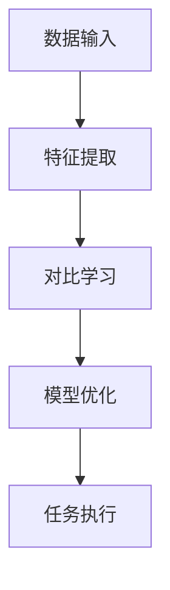
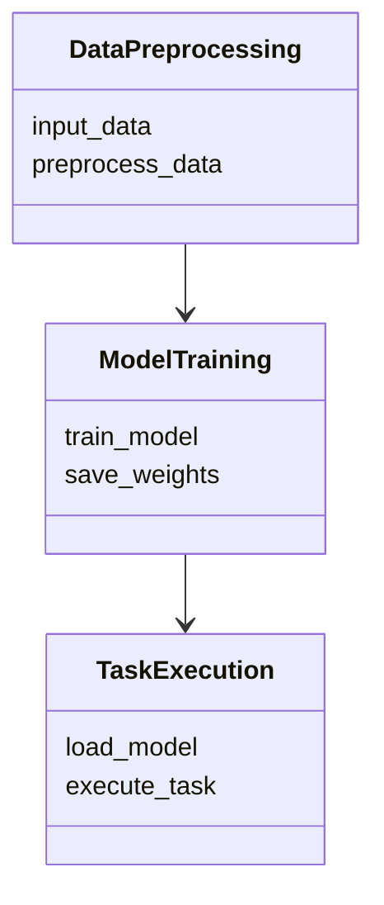
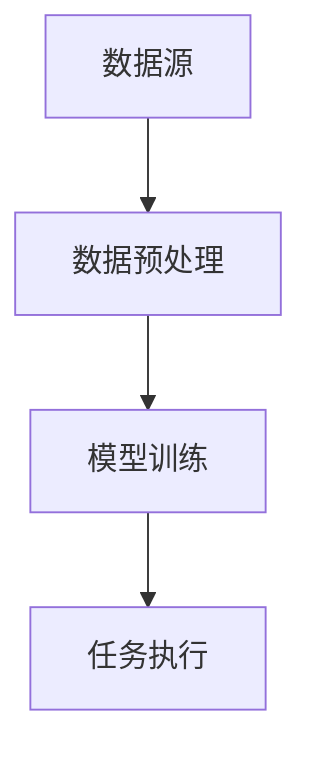
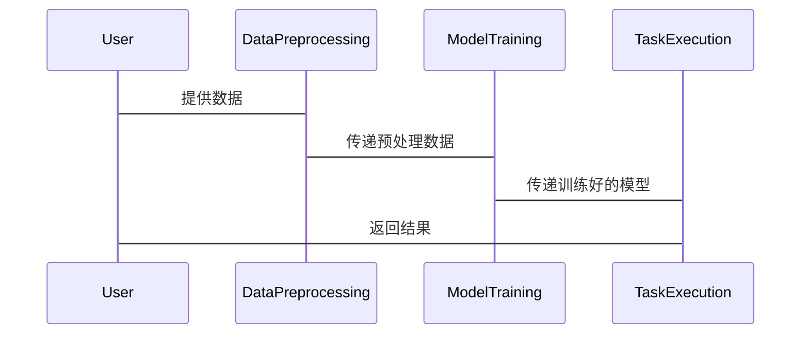

                 


# 企业AI Agent的自监督学习在非标准数据利用中的实践

## 关键词
- 企业AI Agent
- 自监督学习
- 非标准数据
- 对比学习
- 生成对抗网络
- 数据预处理
- 模型训练

## 摘要
随着企业智能化转型的推进，AI Agent（人工智能代理）在企业中的应用越来越广泛。然而，企业在实际应用中常常面临非标准数据的挑战，这些数据通常缺乏标签或结构化，难以直接用于传统的监督学习。自监督学习作为一种新兴的学习范式，能够在无标签或弱标签的非标准数据上进行有效学习，为企业AI Agent提供了新的解决方案。本文将从理论到实践，详细探讨自监督学习在企业AI Agent中的应用，包括算法原理、系统架构设计、项目实现以及最佳实践等内容，为企业技术团队提供深度的技术参考。

---

# 第一部分: 企业AI Agent的自监督学习概述

# 第1章: 问题背景与概念解析

## 1.1 问题背景
### 1.1.1 企业AI Agent的发展现状
随着深度学习技术的成熟，AI Agent在企业中的应用已从简单的规则引擎扩展到复杂的自动化决策系统。然而，企业在实际场景中往往面临数据质量参差不齐的问题，尤其是非结构化数据（如文本、图像、音频等）的处理难度较大。

### 1.1.2 非标准数据的挑战与机遇
非标准数据通常缺乏标签或标注不完整，这使得传统的监督学习方法难以直接应用。然而，这些数据往往包含丰富的语义信息，通过自监督学习可以挖掘出潜在的特征，为企业AI Agent提供更强大的感知能力。

### 1.1.3 自监督学习的必要性
自监督学习能够在无标签数据上进行学习，无需依赖大量标注数据，这在企业数据资源有限的情况下尤为重要。此外，自监督学习还能提高模型的泛化能力，使其更好地适应复杂的企业场景。

## 1.2 问题描述
### 1.2.1 非标准数据的定义与特征
非标准数据指的是未经过严格结构化处理或缺乏标签的数据，例如自然语言文本、图像、音频等。这类数据通常具有以下特征：
- 无标签或弱标签
- 数据分布不均衡
- 数据噪声大

### 1.2.2 传统监督学习的局限性
传统监督学习依赖于大量标注数据，且在面对非结构化数据时表现不佳。此外，标注数据的获取成本高，限制了其在企业中的广泛应用。

### 1.2.3 自监督学习的核心目标
自监督学习的目标是通过设计适当的 pretext tasks（预设任务），从无标签数据中提取有用的特征，从而降低对标注数据的依赖。

## 1.3 问题解决思路
### 1.3.1 自监督学习的基本原理
自监督学习通过构造 pretext tasks，利用数据本身的结构信息进行学习。例如，在图像领域，可以将图像分割为两部分，通过互信息最大化来学习图像特征。

### 1.3.2 企业AI Agent的自监督学习框架
企业AI Agent的自监督学习框架通常包括数据预处理、特征提取、对比学习或生成对抗网络等模块。

### 1.3.3 非标准数据的处理流程
非标准数据的处理流程通常包括数据清洗、数据增强、特征提取和模型训练等步骤。

## 1.4 概念结构与核心要素
### 1.4.1 自监督学习的关键要素
- 数据预处理
- 对比学习或生成对抗网络
- 损失函数设计

### 1.4.2 企业AI Agent的核心功能
- 数据感知
- 任务执行
- 智能决策

### 1.4.3 非标准数据的分类与处理
非标准数据可以分为文本、图像、音频等多种类型，每种类型需要采用不同的处理方法。

## 1.5 本章小结
本章从企业AI Agent的应用背景出发，详细分析了非标准数据的挑战与自监督学习的必要性，为后续的算法实现奠定了理论基础。

---

# 第二部分: 自监督学习的核心概念与原理

# 第2章: 自监督学习的原理与方法

## 2.1 自监督学习的核心原理
### 2.1.1 对比学习
对比学习是一种常用的自监督学习方法，通过最大化正样本之间的相似性来学习数据表示。

### 2.1.2 生成对抗网络
生成对抗网络通过生成器和判别器的博弈，从无标签数据中学习特征。

### 2.1.3 其他自监督学习方法
包括聚类、旋转预测等方法。

## 2.2 自监督学习的关键属性
### 2.2.1 数据利用率
自监督学习能够在无标签数据上进行高效利用。

### 2.2.2 模型泛化能力
自监督学习能够提高模型的泛化能力，使其在不同场景下表现更好。

### 2.2.3 训练效率
自监督学习通常需要较长的训练时间，但可以通过数据并行等方法优化。

## 2.3 核心概念对比表格
| 概念 | 监督学习 | 半监督学习 | 自监督学习 |
|------|----------|------------|------------|
| 数据需求 | 标签数据 | 少量标签数据 | 无标签数据 |
| 训练目标 | 分类/回归 | 提高模型性能 | 学习数据结构 |
| 适用场景 | 数据充足 | 数据有限 | 数据稀疏 |

## 2.4 实体关系图


## 2.5 本章小结
本章详细介绍了自监督学习的核心原理及其与其他学习方法的区别，为后续的算法实现提供了理论支持。

---

# 第三部分: 自监督学习算法原理与实现

# 第3章: 对比学习算法

## 3.1 对比学习的基本原理
### 3.1.1 对比损失函数
对比损失函数通过最大化正样本之间的相似性来优化模型。

### 3.1.2 前向网络与投影头
前向网络用于提取特征，投影头用于将特征映射到对比空间。

### 3.1.3 正样本与负样本的区分
通过数据增强生成正样本和负样本，用于对比学习。

## 3.2 对比学习的数学模型
### 3.2.1 损失函数公式
$$ L = \frac{1}{N}\sum_{i=1}^{N} \log\left(\frac{e^{sim(x_i, x_j)}}{1 + e^{sim(x_i, x_j)}}\right) $$

### 3.2.2 优化过程
使用Adam优化器进行模型训练。

### 3.2.3 示例说明
通过具体的对比学习流程示例，说明算法实现的步骤。

## 3.3 对比学习的Python实现
### 3.3.1 环境安装
安装必要的Python库，如TensorFlow、PyTorch等。

### 3.3.2 核心代码实现
```python
import tensorflow as tf
from tensorflow import keras

def contrastive_loss(y_true, y_pred):
    margin = 1.0
    loss = tf.maximum(margin - y_pred, 0)
    return tf.reduce_mean(loss)

model = keras.Sequential([
    # 前向网络和投影头的定义
])
model.compile(optimizer='adam', loss=contrastive_loss)
```

## 3.4 本章小结
本章通过对比学习的实现，详细介绍了自监督学习的算法原理与代码实现。

---

# 第四部分: 系统分析与架构设计

# 第4章: 系统分析与架构设计

## 4.1 项目背景
企业AI Agent需要处理大量的非标准数据，传统的监督学习方法难以满足需求。

## 4.2 系统功能设计
### 4.2.1 数据处理模块
负责数据预处理和数据增强。

### 4.2.2 模型训练模块
实现自监督学习算法的训练过程。

### 4.2.3 任务执行模块
将训练好的模型应用于实际任务。

## 4.3 系统架构设计
### 4.3.1 领域模型


### 4.3.2 系统架构


## 4.4 接口设计与交互
### 4.4.1 接口定义
定义数据处理模块和模型训练模块的接口。

### 4.4.2 交互流程


## 4.5 本章小结
本章从系统架构的角度，详细分析了企业AI Agent的实现过程，为后续的项目实战奠定了基础。

---

# 第五部分: 项目实战

# 第5章: 项目实战

## 5.1 环境安装
安装必要的Python库，如TensorFlow、PyTorch等。

## 5.2 核心代码实现
### 5.2.1 数据预处理
```python
def preprocess_data(data):
    # 数据预处理逻辑
    return processed_data
```

### 5.2.2 模型训练
```python
def train_model(model, data):
    # 模型训练逻辑
    return trained_model
```

### 5.2.3 任务执行
```python
def execute_task(model, input):
    # 任务执行逻辑
    return result
```

## 5.3 实际案例分析
通过具体案例，分析如何利用自监督学习处理非标准数据。

## 5.4 本章小结
本章通过实际项目的实现，详细展示了自监督学习在企业AI Agent中的应用。

---

# 第六部分: 最佳实践与总结

# 第6章: 最佳实践

## 6.1 小结
总结全文的主要内容。

## 6.2 注意事项
在实际应用中需要注意的问题。

## 6.3 拓展阅读
推荐进一步学习的资料。

## 6.4 本章小结
本章总结了全文的主要内容，并提出了进一步研究的方向。

---

# 作者

作者：AI天才研究院/AI Genius Institute & 禅与计算机程序设计艺术 /Zen And The Art of Computer Programming

---

通过以上目录大纲，读者可以系统地了解企业AI Agent的自监督学习在非标准数据利用中的实践，从理论到实践，逐步掌握相关知识和技能。

