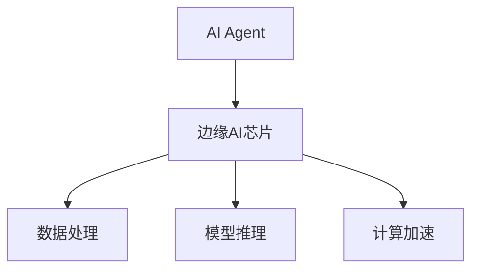

                 

# 企业AI Agent的边缘AI芯片优化策略

> **关键词**：企业AI Agent，边缘AI芯片，优化策略，计算效率，数据传输，能耗优化  
>
> **摘要**：本文探讨了企业AI Agent在边缘计算环境中的优化策略，重点分析了边缘AI芯片对AI Agent性能的提升作用。通过详细讲解AI Agent与边缘AI芯片的关系、优化算法的设计与实现、系统架构的优化方案，以及实际项目中的应用案例，本文为企业在边缘环境下优化AI Agent的性能提供了理论依据和实践指导。文章最后总结了优化策略的关键点，并提出了未来的研究方向。

---

## 第一部分: 企业AI Agent的边缘AI芯片优化背景

### 第1章: 企业AI Agent与边缘AI芯片概述

#### 1.1 企业AI Agent的基本概念

企业AI Agent是一种智能代理系统，能够在企业环境中自主决策、执行任务并与其他系统或用户交互。其核心功能包括信息收集、数据分析、决策制定和任务执行。AI Agent的应用场景广泛，例如智能客服、自动化运维、供应链优化等。

**1.1.1 AI Agent的定义与特点**  
AI Agent（人工智能代理）是一种能够感知环境、自主决策并执行任务的智能系统。其特点包括：
- **自主性**：能够在没有人工干预的情况下自主运行。
- **反应性**：能够实时感知环境并做出响应。
- **目标导向**：具备明确的目标，能够优化决策以实现目标。
- **学习能力**：通过机器学习算法不断优化自身的决策能力。

**1.1.2 企业AI Agent的应用场景**  
在企业环境中，AI Agent可以应用于多个领域：
- **智能客服**：通过自然语言处理技术为用户提供个性化的服务。
- **自动化运维**：监控系统运行状态，自动修复问题。
- **供应链优化**：通过数据分析优化供应链的效率。
- **风险管理**：实时监控企业运营中的风险并提出应对策略。

**1.1.3 企业AI Agent的核心功能**  
企业AI Agent的核心功能包括：
- **信息收集**：通过传感器、数据库等获取环境信息。
- **数据分析**：利用机器学习算法对数据进行处理和分析。
- **决策制定**：基于分析结果做出最优决策。
- **任务执行**：根据决策执行相应的操作。

#### 1.2 边缘AI芯片的基本概念

边缘AI芯片是一种专门用于边缘计算环境中的硬件设备，能够高效地处理AI相关任务。边缘计算是指将计算能力部署在数据产生的边缘位置，例如物联网设备、边缘服务器等。

**1.2.1 边缘计算的定义与特点**  
边缘计算是一种分布式计算模式，将计算能力从云端移到数据产生的边缘位置。其特点包括：
- **低延迟**：边缘计算能够快速响应本地请求，减少数据传输到云端的延迟。
- **高实时性**：适用于需要实时处理的场景，例如工业自动化、自动驾驶等。
- **数据隐私**：通过在边缘处理数据，可以减少数据传输到云端的风险，保护数据隐私。

**1.2.2 边缘AI芯片的定义与分类**  
边缘AI芯片是一种专门用于边缘计算环境的硬件设备，能够高效地执行AI相关任务。根据其功能和应用场景，边缘AI芯片可以分为以下几类：
- **推理芯片**：主要用于模型推理，例如NVIDIA Jetson系列。
- **训练芯片**：支持在边缘环境中进行模型训练，例如Google Coral。
- **专用芯片**：针对特定应用场景设计的芯片，例如寒武纪MLU系列。

**1.2.3 边缘AI芯片的优势与挑战**  
边缘AI芯片的优势包括：
- **低延迟**：能够在本地快速处理数据，减少响应时间。
- **高能效**：通过优化硬件设计，降低能耗。
- **隐私保护**：通过在边缘处理数据，保护数据隐私。

边缘AI芯片的挑战包括：
- **计算能力限制**：边缘设备的计算能力有限，难以处理复杂的AI任务。
- **散热问题**：边缘设备通常部署在高温或恶劣环境中，散热问题需要考虑。
- **维护成本**：边缘设备的维护成本较高，需要定期更新和维护。

#### 1.3 企业AI Agent与边缘AI芯片的结合

企业AI Agent与边缘AI芯片的结合能够充分发挥边缘计算的优势，提升AI Agent的性能和响应速度。边缘AI芯片为AI Agent提供了强大的计算能力，使其能够在本地快速处理数据，减少对云端的依赖。

**1.3.1 企业AI Agent对边缘AI芯片的需求**  
企业AI Agent在边缘环境中的需求包括：
- **实时性**：需要快速响应用户请求，减少延迟。
- **数据隐私**：需要保护企业数据的隐私，避免数据泄露。
- **计算能力**：需要强大的计算能力支持复杂的AI任务。

**1.3.2 边缘AI芯片对企业AI Agent的优化作用**  
边缘AI芯片通过提供高效的计算能力和低延迟的特点，能够优化企业AI Agent的性能。具体表现在：
- **提升响应速度**：通过本地计算，减少数据传输到云端的时间，提升响应速度。
- **降低能耗**：通过优化硬件设计，降低AI Agent的能耗。
- **增强隐私保护**：通过在边缘处理数据，保护数据隐私。

**1.3.3 企业AI Agent与边缘AI芯片结合的典型应用场景**  
企业AI Agent与边缘AI芯片结合的典型应用场景包括：
- **智能制造**：通过边缘AI芯片实时监控生产线状态，优化生产效率。
- **智能安防**：通过边缘AI芯片实时分析视频数据，提升安防系统的响应速度。
- **智能零售**：通过边缘AI芯片实时分析顾客行为，优化零售体验。

---

### 第2章: 企业AI Agent的边缘AI芯片优化策略背景

#### 2.1 当前企业AI Agent的性能瓶颈

当前企业AI Agent在边缘环境中的性能瓶颈主要体现在以下几个方面：
- **计算能力不足**：边缘设备的计算能力有限，难以支持复杂的AI任务。
- **数据传输延迟**：由于数据需要传输到云端处理，导致响应时间较长。
- **能耗过高**：边缘设备通常需要长时间运行，能耗问题较为突出。

#### 2.2 边缘AI芯片优化的必要性

边缘AI芯片优化的必要性主要体现在以下几个方面：
- **提高计算效率**：通过优化硬件设计，提升边缘设备的计算能力。
- **减少数据传输成本**：通过在边缘处理数据，减少数据传输到云端的流量。
- **降低整体能耗**：通过优化硬件设计，降低边缘设备的能耗。

#### 2.3 优化策略的核心目标

优化策略的核心目标包括：
- **提升AI Agent的响应速度**：通过优化边缘AI芯片的计算能力，减少响应时间。
- **降低AI Agent的运行成本**：通过优化能耗和减少数据传输成本，降低整体运行成本。
- **提高AI Agent的智能化水平**：通过优化算法和硬件设计，提升AI Agent的智能化水平。

---

### 第3章: 企业AI Agent的边缘AI芯片优化核心概念

#### 3.1 AI Agent与边缘AI芯片的关系

AI Agent与边缘AI芯片的关系可以通过以下几点进行分析：
- **依赖关系**：AI Agent依赖边缘AI芯片的计算能力进行任务处理。
- **优化作用**：边缘AI芯片通过优化计算能力，提升AI Agent的性能。
- **协同工作**：AI Agent与边缘AI芯片协同工作，实现高效的边缘计算。

#### 3.2 AI Agent与边缘AI芯片的核心要素对比

以下是AI Agent与边缘AI芯片的核心要素对比表：

| **核心要素** | **AI Agent**                     | **边缘AI芯片**                  |
|--------------|----------------------------------|----------------------------------|
| **功能**     | 数据分析、决策制定、任务执行   | 模型推理、数据处理、计算加速     |
| **计算能力** | 依赖于边缘AI芯片的计算能力     | 提供高效的计算能力                |
| **数据来源** | 多种数据源，包括传感器、数据库 | 边缘设备中的本地数据            |
| **响应时间** | 边缘计算环境下，响应时间较短   | 边缘计算环境下，响应时间更短    |
| **能耗**     | 边缘AI芯片优化后，能耗较低     | 通过优化设计，能耗进一步降低     |

---

#### 3.3 AI Agent与边缘AI芯片的关系图

以下是AI Agent与边缘AI芯片的关系图：

---

## 总结

企业AI Agent的边缘AI芯片优化策略是提升AI Agent性能和响应速度的关键。通过优化边缘AI芯片的计算能力、减少数据传输延迟、降低能耗，可以显著提升企业AI Agent的智能化水平和运行效率。本文详细分析了AI Agent与边缘AI芯片的关系、优化策略的核心目标以及实际应用中的优化方案，为企业在边缘环境下优化AI Agent的性能提供了理论依据和实践指导。

---

**作者：AI天才研究院 & 禅与计算机程序设计艺术**

