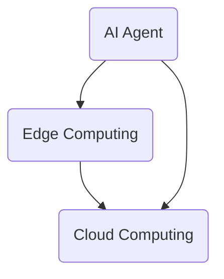
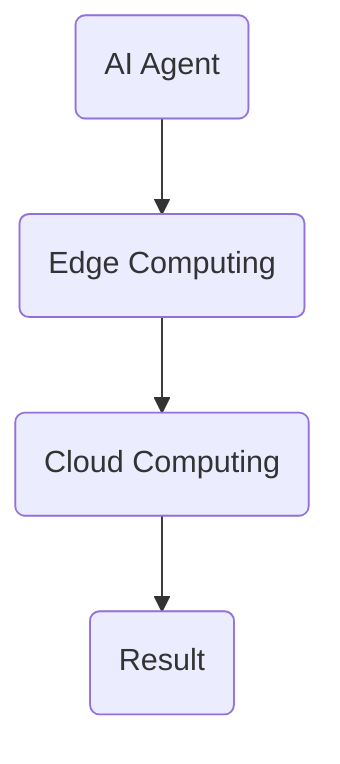
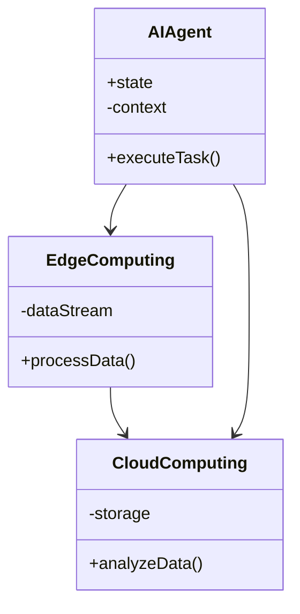

                 


# 企业AI Agent的边缘计算与云计算协同策略

> 关键词：企业AI Agent，边缘计算，云计算，协同策略，算法原理，系统架构

> 摘要：本文详细探讨了企业AI Agent在边缘计算与云计算协同环境下的策略与实现。首先介绍了企业AI Agent的概念及其应用场景，分析了边缘计算与云计算的特点与优势。接着，提出了企业AI Agent边缘计算与云计算协同的背景与问题，详细阐述了核心概念与协同机制。然后，从算法原理、系统架构、项目实战等多维度深入分析了企业AI Agent的边缘计算与云计算协同策略，并通过实际案例展示了其应用效果。最后，总结了最佳实践与未来发展方向。

---

# 第一部分: 企业AI Agent的边缘计算与云计算协同策略概述

## 第1章: 企业AI Agent的背景与概念

### 1.1 企业AI Agent的定义与特点
企业AI Agent是一种能够在企业环境中自主感知、推理和执行任务的智能实体。其特点包括：

1. **自主性**：能够在没有人工干预的情况下独立执行任务。
2. **反应性**：能够实时感知环境变化并做出响应。
3. **社交能力**：能够与其他系统、用户或AI Agent进行交互。
4. **学习能力**：能够通过经验或数据进行自我优化和改进。

### 1.2 边缘计算与云计算的基本概念
- **边缘计算**：在数据生成的边缘位置（如设备端）进行数据处理和存储，减少数据传输延迟。
- **云计算**：将数据上传到云端进行集中处理和存储，利用大规模计算资源提高处理能力。

### 1.3 企业AI Agent与边缘计算、云计算的关系
企业AI Agent需要同时利用边缘计算的实时性和云计算的大规模处理能力。边缘计算负责实时数据处理和快速响应，云计算负责复杂任务的处理和数据的长期存储。

---

## 第2章: 企业AI Agent的边缘计算与云计算协同策略的背景与问题分析

### 2.1 当前企业AI Agent发展的痛点
- **数据延迟**：传统云计算模式下，数据传输到云端处理会导致延迟，影响实时性。
- **资源限制**：边缘设备的计算资源有限，无法独立完成复杂任务。
- **数据隐私**：云端处理可能导致数据泄露风险。

### 2.2 企业AI Agent边缘计算与云计算协同的背景
随着企业数字化转型的推进，AI Agent需要在边缘和云端之间实现高效协同，以满足实时性、资源利用和数据安全的需求。

### 2.3 问题描述与解决思路
- **问题背景**：企业AI Agent需要在边缘和云端之间实现高效协同，但现有技术存在数据传输延迟、资源利用不均等问题。
- **问题解决思路**：通过边缘计算与云计算的协同，优化任务分配，提高处理效率和数据安全性。

---

## 第3章: 企业AI Agent的边缘计算与云计算协同策略的核心概念

### 3.1 核心概念与联系
- **AI Agent**：企业AI Agent通过边缘计算和云计算协同，实现任务的高效处理。
- **边缘计算**：提供实时数据处理能力，减少延迟。
- **云计算**：提供大规模计算和存储资源，支持复杂任务处理。

### 3.2 核心概念的对比分析
| 比较维度 | 边缘计算 | 云计算 |
|----------|----------|--------|
| 处理位置 | 边缘端   | 云端   |
| 延迟     | 低       | 高     |
| 资源利用 | 本地化    | 集中化 |

### 3.3 实体关系图


---

## 第4章: 企业AI Agent的边缘计算与云计算协同策略的算法原理

### 4.1 算法原理概述
协同策略算法的核心思想是根据任务的实时性和计算复杂度，动态分配计算资源。

### 4.2 算法的数学模型与公式
任务分配模型如下：
$$ f(x) = \begin{cases} 
x & \text{如果 } x < 100 \\
y & \text{如果 } x \geq 100 
\end{cases} $$
其中，$x$表示任务复杂度，$y$表示云端处理。

### 4.3 算法流程


---

## 第5章: 企业AI Agent的边缘计算与云计算协同策略的系统架构

### 5.1 系统架构设计


### 5.2 接口设计
- **边缘计算接口**：提供实时数据处理接口。
- **云计算接口**：提供复杂任务处理接口。

---

## 第6章: 企业AI Agent的边缘计算与云计算协同策略的项目实战

### 6.1 环境安装
- **边缘计算环境**：安装边缘计算框架（如Kubernetes）。
- **云计算环境**：配置云服务（如AWS、Azure）。

### 6.2 核心实现
```python
def process_task(task):
    if task.complexity < 100:
        return edge_compute(task)
    else:
        return cloud_compute(task)
```

### 6.3 案例分析
案例：企业AI Agent实时监控设备状态，边缘计算处理实时数据，云计算进行故障预测。

---

## 第7章: 企业AI Agent的边缘计算与云计算协同策略的最佳实践与总结

### 7.1 最佳实践
- **数据分区**：根据任务需求，合理分配数据处理位置。
- **资源动态分配**：根据负载情况，动态调整计算资源。
- **数据安全**：确保边缘和云端数据的安全传输和存储。

### 7.2 总结
企业AI Agent的边缘计算与云计算协同策略能够有效提升实时性和资源利用率，为企业智能化转型提供有力支持。

---

作者：AI天才研究院/AI Genius Institute & 禅与计算机程序设计艺术 /Zen And The Art of Computer Programming

