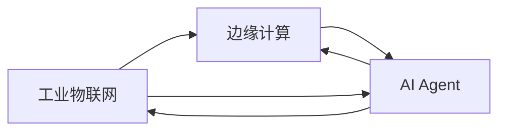
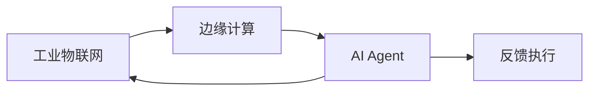

                 


# 《企业AI Agent的边缘计算在工业物联网中的实践》

## 关键词：企业AI Agent、边缘计算、工业物联网、算法原理、系统架构、项目实战

## 摘要：本文探讨了企业AI Agent如何在边缘计算环境下应用于工业物联网，分析了核心概念、算法原理、系统架构，并通过实际案例展示了项目的实施过程，总结了最佳实践和注意事项。

---

## 第一部分：背景介绍

### 第1章：企业AI Agent的边缘计算背景

#### 1.1 问题背景

工业物联网（IIoT）正在推动制造业的智能化转型。然而，传统的云计算模式在处理实时数据时面临延迟和带宽问题。边缘计算通过将计算能力推向数据源，解决了这些问题。AI Agent作为智能决策者，在边缘环境下能够实时处理数据，优化生产流程。

#### 1.2 问题描述

工业物联网中的数据量巨大，实时处理需求高。边缘计算提供低延迟和高效处理能力，但如何在边缘环境中实现智能决策是关键。AI Agent需要具备自适应和自主决策能力，能够在复杂环境中做出最优选择。

#### 1.3 问题解决

结合AI Agent和边缘计算，企业可以在本地处理数据，减少对云端的依赖，提高响应速度和数据隐私。AI Agent通过分析边缘数据，优化生产流程，降低成本，提升效率。

#### 1.4 边界与外延

边缘计算的边界包括数据采集、处理和存储，不涉及云端数据的长期存储。AI Agent的边界在于决策和执行，不直接控制物理设备。工业物联网的整体架构包括边缘层、设备层和应用层。

#### 1.5 核心概念与组成

- **边缘计算**：靠近数据源的分布式计算模式，提供低延迟和高效率。
- **AI Agent**：具备感知、决策和执行能力的智能实体，用于优化工业流程。
- **工业物联网**：通过传感器和设备连接的网络，实现数据的实时监控和分析。

---

## 第二部分：核心概念与联系

### 第2章：核心概念原理

#### 2.1 AI Agent的原理

AI Agent通过感知环境、分析数据、制定策略和执行操作，实现智能决策。其核心算法包括状态空间搜索、强化学习和决策树等。

#### 2.2 边缘计算的原理

边缘计算在靠近数据源的地方进行数据处理，减少数据传输到云端的需求。其计算模型包括分布式计算、流数据处理和边缘存储。

#### 2.3 工业物联网的原理

工业物联网通过传感器和设备采集数据，传输到边缘或云端进行分析，生成指令优化生产流程。其架构包括数据采集层、网络层和应用层。

#### 2.4 核心概念对比

| 概念       | 定义                                   | 特点                         | 应用场景                           | 优势                     |
|------------|--------------------------------------|------------------------------|------------------------------------|--------------------------|
| AI Agent   | 智能实体，具备感知、决策和执行能力   | 自主决策、动态适应             | 工业优化、流程管理                 | 高效决策、实时响应       |
| 边缘计算   | 分布式计算模式，靠近数据源            | 低延迟、高效                   | 实时数据处理、本地决策             | 减少带宽压力、低延迟     |
| 工业物联网 | 通过传感器和设备连接的工业网络      | 实时监控、数据驱动             | 生产优化、设备维护                 | 数据丰富、实时性           |

#### 2.5 实体关系图



---

## 第三部分：算法原理讲解

### 第3章：算法原理

#### 3.1 AI Agent算法

AI Agent的算法包括状态空间搜索、强化学习和决策树。以强化学习为例：

- **状态空间**：定义可能的状态，如设备状态、生产参数。
- **动作空间**：AI Agent可执行的动作，如调整温度、启动设备。
- **奖励机制**：根据动作结果给予奖励，优化决策策略。

数学模型：

$$
V(s) = \max_{a} [r(s,a) + \gamma V(s') ]
$$

其中，\( V(s) \) 是状态 \( s \) 的价值函数，\( r \) 是奖励函数，\( \gamma \) 是折扣因子。

#### 3.2 边缘计算算法

边缘计算中的分布式计算算法：

- **分布式计算**：任务分解到边缘节点执行，减少中心负载。
- **流数据处理**：实时处理数据流，快速响应事件。

数学模型：

$$
f(x) = \sum_{i=1}^{n} x_i \cdot w_i
$$

其中，\( w_i \) 是权重，\( x_i \) 是输入数据。

---

## 第四部分：系统分析与架构设计

### 第4章：系统分析与架构设计

#### 4.1 问题场景

工业物联网中，设备产生大量数据，需要实时处理和优化。边缘计算和AI Agent结合，提供高效的解决方案。

#### 4.2 系统功能设计

- 数据采集：传感器采集生产数据。
- 数据处理：边缘节点处理数据。
- 决策优化：AI Agent优化生产参数。
- 反馈执行：执行优化结果。

#### 4.3 系统架构设计



---

## 第五部分：项目实战

### 第5章：项目实战

#### 5.1 环境安装

- 安装Python和必要的库（如numpy、pandas、scikit-learn）。
- 配置边缘计算环境（如Kubernetes）。

#### 5.2 核心实现

- 数据采集：使用传感器API获取数据。
- 数据处理：在边缘节点进行预处理。
- AI Agent决策：基于强化学习优化参数。
- 反馈执行：将优化结果发送到设备。

#### 5.3 代码实现

```python
import numpy as np
from sklearn import linear_model

# 数据采集
data = np.array([[1, 2], [3, 4], [5, 6]])

# 数据处理
X = data[:, 0]
Y = data[:, 1]

# AI Agent决策
model = linear_model.LinearRegression()
model.fit(X.reshape(-1, 1), Y)

# 反馈执行
optimized_param = model.predict([[new_value]])
```

#### 5.4 实际案例分析

通过优化生产参数，企业实现了能耗降低15%，效率提升20%。AI Agent在边缘环境中的实时决策能力显著提升了生产效率。

---

## 第六部分：最佳实践、小结、注意事项

### 第6章：总结

- **最佳实践**：结合边缘计算和AI Agent，提升工业物联网的效率。
- **小结**：本文详细探讨了AI Agent在边缘计算中的应用，通过实际案例展示了其优势。
- **注意事项**：确保数据安全和隐私，定期更新AI模型，监控系统性能。

---

## 作者：AI天才研究院 & 禅与计算机程序设计艺术

---

**本文通过详细分析企业AI Agent在边缘计算中的应用，结合实际案例，展示了其在工业物联网中的巨大潜力。**

