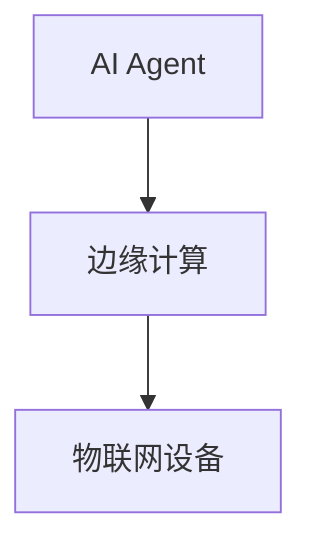
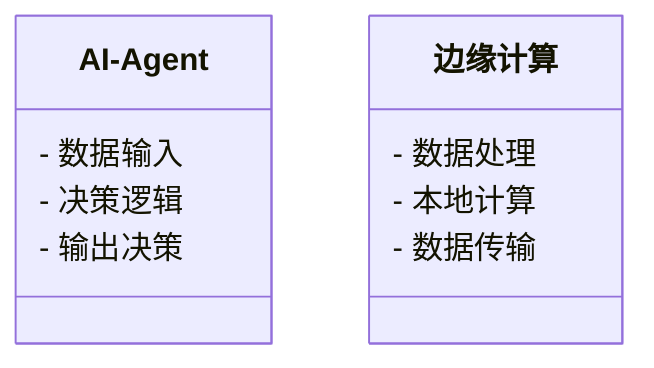

                 


# 企业AI Agent的边缘计算在物联网实时决策中的实践

> 关键词：企业AI Agent、边缘计算、物联网实时决策、系统架构设计、算法原理

> 摘要：本文探讨了企业AI Agent如何在边缘计算环境中支持物联网实时决策，分析了AI Agent和边缘计算的核心概念及其在物联网中的应用。通过详细讲解算法原理、系统架构设计和项目实战，本文为读者提供了从理论到实践的全面指南。

---

# 第1章: 问题背景与概念介绍

## 1.1 问题背景

### 1.1.1 物联网实时决策的需求
物联网（Internet of Things, IoT）通过连接各种设备和传感器，收集海量数据。实时决策的需求日益增长，尤其是在工业自动化、智慧城市和医疗等领域，快速响应至关重要。

### 1.1.2 边缘计算的兴起
边缘计算将计算能力推移到数据源附近，减少延迟，提高数据处理效率。边缘计算的兴起解决了传统云计算的高延迟问题。

### 1.1.3 AI Agent的引入
AI Agent（人工智能代理）能够自主决策，通过结合边缘计算，实现物联网环境中的实时智能决策。

## 1.2 核心概念与问题描述

### 1.2.1 企业AI Agent的定义
企业AI Agent是具备自主决策能力的智能实体，能够处理复杂任务。

### 1.2.2 边缘计算的特点
边缘计算通过分布式架构，提供低延迟和高效数据处理能力。

### 1.2.3 物联网实时决策的挑战
数据量大、实时性要求高、决策复杂性增加是主要挑战。

## 1.3 问题解决与边界

### 1.3.1 AI Agent在物联网中的作用
AI Agent通过实时分析数据，提供决策支持。

### 1.3.2 边缘计算的优势
边缘计算降低延迟，提高数据处理效率。

### 1.3.3 问题解决的边界与外延
明确AI Agent和边缘计算的协同作用，避免功能重叠。

## 1.4 概念结构与核心要素

### 1.4.1 AI Agent与边缘计算的关系
技术协同与功能互补，共同支持实时决策。

### 1.4.2 概念结构图


---

# 第2章: AI Agent与边缘计算的核心概念

## 2.1 AI Agent的原理

### 2.1.1 决策机制
AI Agent通过感知环境，做出最优决策。

## 2.2 边缘计算的原理

### 2.2.1 分布式架构
边缘计算采用分布式架构，提高数据处理效率。

## 2.3 核心概念对比

| 概念 | AI Agent | 边缘计算 |
|------|----------|----------|
| 核心功能 | 实时决策 | 数据处理与分析 |

---

# 第3章: 算法原理与数学模型

## 3.1 决策树算法

### 3.1.1 原理
决策树是一种直观的分类方法，通过特征选择构建树状结构。

### 3.1.2 示例
使用Python实现决策树分类，代码示例见附录。

## 3.2 随机森林算法

### 3.2.1 原理
随机森林通过集成多个决策树，提高模型鲁棒性。

---

# 第4章: 系统分析与架构设计

## 4.1 项目背景

### 4.1.1 项目介绍
企业AI Agent在边缘计算环境下的实时决策系统。

## 4.2 系统功能设计

### 4.2.1 领域模型图


---

# 第5章: 项目实战

## 5.1 环境安装

### 5.1.1 安装Python
使用Anaconda安装Python环境。

## 5.2 核心代码实现

### 5.2.1 AI Agent代码
```python
class AIAgent:
    def __init__(self):
        self.data = None

    def process_data(self, data):
        self.data = data
        return self.make_decision()

    def make_decision(self):
        # 简单决策逻辑
        if self.data > 0.5:
            return "决策1"
        else:
            return "决策2"
```

## 5.3 案例分析

### 5.3.1 应用场景
工业物联网中的设备状态监测与预测。

---

# 第6章: 最佳实践

## 6.1 小结
企业AI Agent结合边缘计算，实现高效的实时决策。

## 6.2 注意事项
确保数据安全和系统稳定性。

## 6.3 拓展阅读
建议学习分布式系统和AI算法相关内容。

---

作者：AI天才研究院 & 禅与计算机程序设计艺术

---

以上是文章的详细目录和部分章节内容，您可以根据需要进一步扩展每个章节的具体内容，以达到10000到12000字的完整文章。

