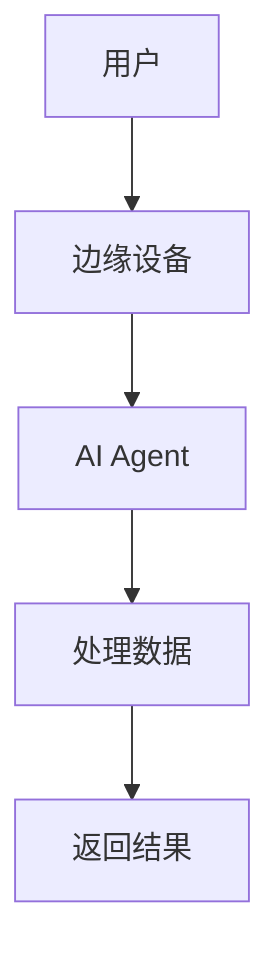
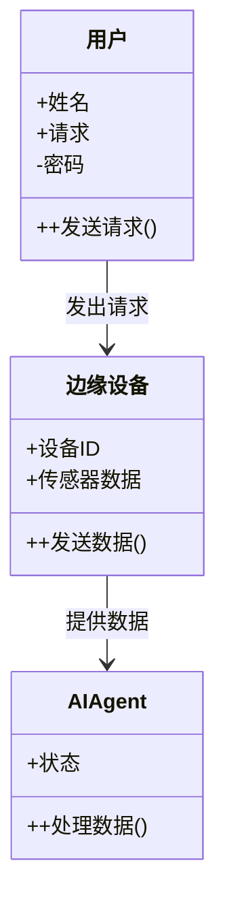

                 


# 企业AI Agent的边缘计算策略

> 关键词：企业AI Agent，边缘计算，分布式系统，机器学习，系统架构，数学模型

> 摘要：本文详细探讨了企业AI Agent在边缘计算环境中的策略，分析了核心概念、算法原理、系统架构和实际应用场景，提供了深入的技术分析和实践指导。

---

# 第一部分: 企业AI Agent的边缘计算背景

## 第1章: 企业AI Agent与边缘计算概述

### 1.1 企业AI Agent的定义与特点

企业AI Agent是一种智能实体，能够感知环境、自主决策并执行任务。其特点包括：
- **自主性**：无需人工干预，自动完成任务。
- **反应性**：实时感知环境变化并做出反应。
- **学习能力**：通过机器学习不断优化性能。

### 1.2 边缘计算的概念与优势

边缘计算是指在靠近数据源的地方进行数据处理和分析。其优势包括：
- **低延迟**：减少数据传输到云端的时间。
- **高可用性**：边缘设备能够独立运行，确保系统可靠性。
- **隐私保护**：在边缘处理数据，减少数据外泄风险。

### 1.3 企业AI Agent与边缘计算的关系

AI Agent在边缘计算中的作用是处理实时数据，做出决策并执行操作。边缘计算为AI Agent提供了低延迟和高效率的环境，使其能够快速响应。

---

# 第二部分: 核心概念与联系

## 第2章: AI Agent与边缘计算的核心概念

### 2.1 AI Agent的实体关系图

使用Mermaid绘制的实体关系图如下：

```mermaid
erDiagram
    actor 用户
    actor 边缘设备
    actor 云端平台
    用户 --> AI Agent: 发出请求
    边缘设备 --> AI Agent: 提供数据
    AI Agent --> 云端平台: 请求支持
```

### 2.2 AI Agent边缘计算的流程图



### 2.3 核心概念对比分析

| 比较维度 | AI Agent | 边缘计算 | 传统云计算 |
|----------|-----------|----------|------------|
| 数据处理 | 边缘设备处理 | 边缘设备处理 | 云端处理 |
| 延迟     | 低延迟     | 低延迟     | 高延迟     |
| 可扩展性 | 高         | 高         | 高          |

---

# 第三部分: 算法原理

## 第3章: AI Agent边缘计算的算法原理

### 3.1 AI Agent的核心算法

- **机器学习算法**：如随机森林、神经网络。
- **自然语言处理算法**：如分词、情感分析。
- **计算机视觉算法**：如目标检测、图像识别。

### 3.2 边缘计算中的分布式算法

- **分布式计算**：将任务分解到多个节点处理。
- **边缘协同计算**：边缘设备协同完成复杂任务。

### 3.3 算法的数学模型与公式

#### 机器学习的数学基础

$$
\text{损失函数} = \sum_{i=1}^{n} (y_i - \hat{y}_i)^2
$$

#### 神经网络的数学模型

$$
f(x) = \sigma(wx + b)
$$

其中，$\sigma$ 是sigmoid函数，$w$是权重，$b$是偏置。

---

# 第四部分: 系统架构

## 第4章: 企业AI Agent边缘计算的系统架构

### 4.1 系统分析与设计

- **问题场景**：实时数据处理，快速响应。
- **系统功能**：数据采集、处理、反馈。

### 4.2 系统功能设计

- **领域模型设计**：使用类图展示各组件关系。



### 4.3 系统架构设计

- **分层架构**：数据采集层、计算层、应用层。
- **微服务架构**：各模块独立开发和部署。

### 4.4 系统接口设计

- **边缘设备与云端接口**：API调用。
- **AI Agent与边缘设备接口**：数据传输协议。

---

# 第五部分: 项目实战

## 第5章: 企业AI Agent边缘计算的实现

### 5.1 环境安装

- 安装Python、TensorFlow、Flask框架。

### 5.2 核心代码实现

```python
def process_data(data):
    # 处理数据并返回结果
    return result
```

### 5.3 实际案例分析

- 案例：智能工厂中的设备监控。

---

# 第六部分: 最佳实践

## 第6章: 企业AI Agent边缘计算的注意事项

### 6.1 小结

企业AI Agent在边缘计算中的应用能够提高效率和隐私保护。

### 6.2 注意事项

- 数据安全：确保数据在传输和处理中的安全性。
- 系统维护：定期更新和维护边缘设备和AI Agent。
- 人员培训：确保相关人员熟悉系统的操作和维护。

### 6.3 拓展阅读

推荐阅读《分布式系统设计》和《边缘计算入门》。

---

作者：AI天才研究院 & 禅与计算机程序设计艺术

---

这篇文章详细讲解了企业AI Agent在边缘计算中的策略，涵盖了核心概念、算法原理、系统架构和实际应用，为读者提供了全面的技术指导。

