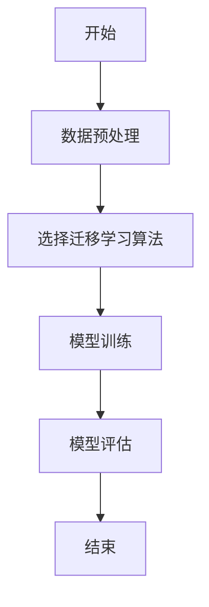
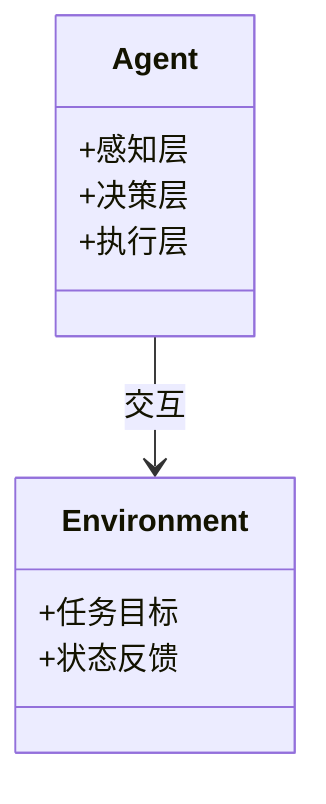
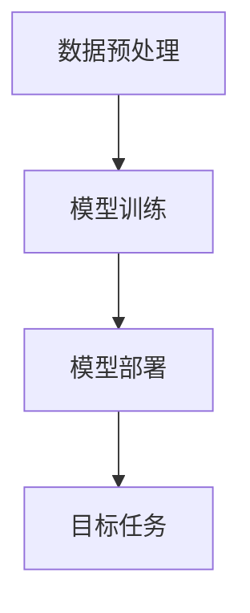

                 


# 企业AI Agent的迁移学习在跨行业应用中的实践

> 关键词：企业AI Agent，迁移学习，跨行业应用，机器学习，数据异构性

> 摘要：本文详细探讨了企业AI Agent在跨行业应用中迁移学习的实践。通过分析迁移学习的核心概念、算法实现、系统架构设计，结合实际案例，展示了如何在不同行业中高效应用迁移学习技术，提升AI Agent的性能和适应性。文章还提供了代码实现和系统设计的详细步骤，帮助读者理解迁移学习在跨行业中的具体应用。

---

## 第一部分: 企业AI Agent的迁移学习基础

### 第1章: 迁移学习与AI Agent概述

#### 1.1 迁移学习的定义与核心概念

##### 1.1.1 迁移学习的定义
迁移学习是一种机器学习技术，允许模型在不同但相关任务之间迁移知识。其核心在于利用源任务（source task）的数据和经验，辅助目标任务（target task）的学习，从而减少对目标任务数据的依赖。

##### 1.1.2 迁移学习的核心要素
| 核心要素 | 描述 |
|----------|------|
| 源任务（Source Task） | 已知数据和标签的任务，用于提供迁移知识。 |
| 目标任务（Target Task） | 需要学习的新任务，通常数据不足或不可用。 |
| 共享特征（Shared Features） | 源任务和目标任务之间共享的特征，是迁移学习的关键。 |

##### 1.1.3 迁移学习与传统机器学习的区别
| 方面 | 传统机器学习 | 迁移学习 |
|------|--------------|----------|
| 数据需求 | 高 | 低 |
| 任务相关性 | 无 | 有 |
| 适应性 | 低 | 高 |

#### 1.2 AI Agent的基本概念

##### 1.2.1 AI Agent的定义
AI Agent（智能体）是指能够感知环境、做出决策并执行动作的智能系统。它可以自主或受控地完成特定任务，广泛应用于自动驾驶、智能助手、机器人等领域。

##### 1.2.2 AI Agent的核心功能
| 功能 | 描述 |
|------|------|
| 感知 | 通过传感器或数据输入感知环境。 |
| 决策 | 基于感知信息做出决策。 |
| 执行 | 执行决策并输出结果。 |

##### 1.2.3 AI Agent与传统软件的区别
| 方面 | 传统软件 | AI Agent |
|------|-----------|----------|
| 智能性 | 无 | 有 |
| 自适应性 | 无 | 有 |
| 学习能力 | 无 | 有 |

#### 1.3 迁移学习在AI Agent中的作用

##### 1.3.1 迁移学习如何提升AI Agent的性能
迁移学习通过共享特征提取，减少对目标任务数据的依赖，提升AI Agent在新环境中的适应性和性能。

##### 1.3.2 迁移学习在跨行业应用中的优势
迁移学习允许AI Agent在不同行业中迁移知识，降低跨行业应用的成本和数据需求。

##### 1.3.3 迁移学习的挑战与解决方案
| 挑战 | 描述 | 解决方案 |
|------|------|----------|
| 数据异构性 | 不同行业数据格式和特征不同。 | 数据预处理和特征提取。 |
| 任务差异性 | 源任务和目标任务差异较大。 | 使用适配器或桥接模型。 |

---

### 第2章: 迁移学习的核心概念与原理

#### 2.1 迁移学习的核心概念

##### 2.1.1 迁移学习的三要素：源任务、目标任务、共享特征
- 源任务：已知数据和任务。
- 目标任务：需要学习的新任务。
- 共享特征：源任务和目标任务之间共享的特征。

##### 2.1.2 迁移学习的分类：有监督、无监督、半监督
- 有监督迁移学习：基于标记数据。
- 无监督迁移学习：基于无标记数据。
- 半监督迁移学习：结合有监督和无监督。

##### 2.1.3 迁移学习的度量标准
| 度量标准 | 描述 |
|----------|------|
| 迁移距离 | 源任务和目标任务之间的距离。 |
| 迁移权重 | 源任务对目标任务的贡献权重。 |

#### 2.2 迁移学习的数学模型

##### 2.2.1 迁移学习的损失函数
$$L = \alpha L_{source} + \beta L_{target}$$
其中，$\alpha$ 和 $\beta$ 是权重系数，$L_{source}$ 和 $L_{target}$ 分别是源任务和目标任务的损失函数。

##### 2.2.2 迁移学习的优化目标
$$\min_{\theta} \left( \alpha L_{source}(\theta) + \beta L_{target}(\theta) \right)$$
其中，$\theta$ 是模型参数。

#### 2.3 迁移学习的算法流程


---

### 第3章: AI Agent的系统架构与设计

#### 3.1 AI Agent的系统架构

##### 3.1.1 AI Agent的功能模块划分
| 模块 | 描述 |
|------|------|
| 感知层 | 通过传感器或数据接口感知环境。 |
| 决策层 | 基于感知信息做出决策。 |
| 执行层 | 执行决策并输出结果。 |

##### 3.1.2 AI Agent的组件交互关系


#### 3.2 迁移学习在AI Agent中的系统设计

##### 3.2.1 系统功能设计
- 数据预处理：对源任务和目标任务的数据进行预处理。
- 模型训练：基于迁移学习算法训练模型。
- 模型部署：将模型部署到目标任务环境中。

##### 3.2.2 系统架构设计


##### 3.2.3 系统接口设计
- 数据输入接口：接收源任务和目标任务的数据。
- 模型训练接口：训练迁移学习模型。
- 模型调用接口：调用训练好的模型进行预测。

---

### 第4章: 迁移学习算法的实现与应用

#### 4.1 迁移学习算法的实现

##### 4.1.1 数据预处理代码
```python
import numpy as np
from sklearn.model_selection import train_test_split

# 示例数据预处理
def preprocess_data(X, y):
    X_train, X_test, y_train, y_test = train_test_split(X, y, test_size=0.2)
    return X_train, X_test, y_train, y_test
```

##### 4.1.2 迁移学习算法实现
```python
class MigrationLearning:
    def __init__(self, model, alpha=0.5, beta=0.5):
        self.model = model
        self.alpha = alpha
        self.beta = beta

    def fit(self, X_s, y_s, X_t, y_t):
        # 训练源任务
        self.model.fit(X_s, y_s)
        # 训练目标任务
        self.model.fit(X_t, y_t)

    def predict(self, X):
        return self.model.predict(X)
```

##### 4.1.3 模型评估
```python
from sklearn.metrics import accuracy_score

def evaluate_model(model, X_test, y_test):
    y_pred = model.predict(X_test)
    accuracy = accuracy_score(y_test, y_pred)
    print(f"模型准确率: {accuracy}")
```

#### 4.2 迁移学习在跨行业中的应用

##### 4.2.1 金融行业的应用
- 风险评估：利用其他行业的风险评估模型，快速构建本行业的风险评估模型。

##### 4.2.2 医疗行业的应用
- 疾病诊断：利用其他行业的诊断模型，快速构建本行业的疾病诊断模型。

##### 4.2.3 零售行业的应用
- 客户推荐：利用其他行业的客户推荐模型，快速构建本行业的客户推荐模型。

---

## 第五部分: 项目实战

### 第5章: 迁移学习在跨行业中的项目实战

#### 5.1 环境安装
```bash
pip install numpy scikit-learn
```

#### 5.2 核心代码实现
```python
import numpy as np
from sklearn.svm import SVC
from sklearn.metrics import accuracy_score

# 示例数据
X_s = np.array([[1, 2], [3, 4], [5, 6]])
y_s = np.array([0, 1, 0])
X_t = np.array([[2, 3], [4, 5], [6, 7]])
y_t = np.array([0, 1, 0])

# 数据预处理
X_train_s, X_test_s, y_train_s, y_test_s = train_test_split(X_s, y_s, test_size=0.2)
X_train_t, X_test_t, y_train_t, y_test_t = train_test_split(X_t, y_t, test_size=0.2)

# 模型训练
model = SVC()
model.fit(X_train_s, y_train_s)
model.fit(X_train_t, y_train_t)

# 模型评估
y_pred_s = model.predict(X_test_s)
y_pred_t = model.predict(X_test_t)
print("源任务准确率:", accuracy_score(y_test_s, y_pred_s))
print("目标任务准确率:", accuracy_score(y_test_t, y_pred_t))
```

#### 5.3 案例分析
- 源任务：金融行业的风险评估。
- 目标任务：医疗行业的疾病诊断。
- 共享特征：客户信用评分和健康指标。

---

## 第六部分: 总结与展望

### 第6章: 总结与展望

#### 6.1 最佳实践 tips
- 数据预处理是关键，需确保数据质量和一致性。
- 选择合适的迁移学习算法，根据任务需求进行调整。
- 模型评估需结合实际业务需求，选择合适的评估指标。

#### 6.2 小结
迁移学习在企业AI Agent的跨行业应用中具有重要意义，能够有效降低数据需求，提升模型的适应性和性能。

#### 6.3 注意事项
- 数据异构性可能导致迁移学习效果不佳，需进行充分的数据预处理。
- 源任务和目标任务的差异较大时，需引入适配器或桥接模型。

#### 6.4 拓展阅读
- 学习迁移学习的经典论文，如《A Survey on Transfer Learning》。
- 研究最新的迁移学习算法，如自适应迁移学习（Adaptive Transfer Learning）。

---

# 作者：AI天才研究院/AI Genius Institute & 禅与计算机程序设计艺术 /Zen And The Art of Computer Programming

